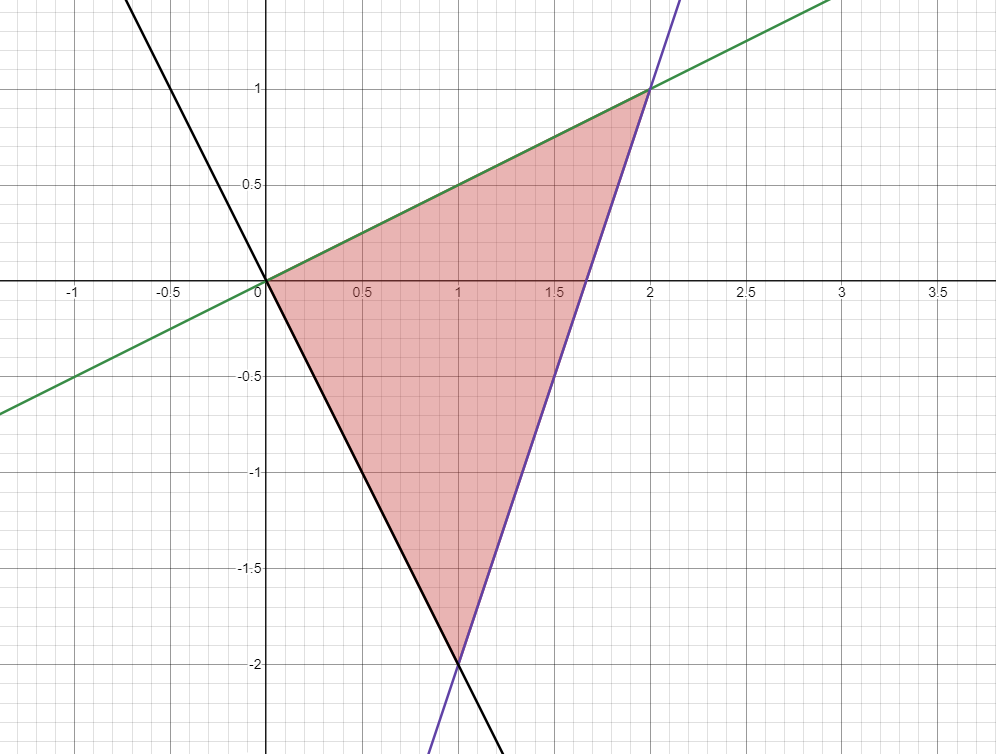

---

authors:
    - name: Artemis

---
# Calculus, Homework 1 

> Artemis Feidenheimer, EDA-243

## Problem 1

Calculate an integral considering it as a limit of an integral sum with a mesh partition of the $D=[0,2] \times [0,3]$ rectangle into square cells with sides of length $\frac{1}{n}$, choosing upper right $\bf\xi_i$ lattice points of cells.

$$\iint\limits_{\overset{\scriptstyle0 \leq x \leq 2}{0\leq y \leq 3}} xy^3 dxdy$$

---

Given that the partition is of length $\frac{1}{n}$, then the measure $\mu(I_i)$ of partition $I_i$ would be equal to $\frac{1}{n^2}$ and each lattice point would be defined by $\bf\xi_{ij}=(\frac{i}{n},\frac{j}{n})$ where $0\leq x \leq 1$ and $0 \leq y \leq 1$.

Given that we start counting from upper right corner, we start our iteration in sums from $1$ for both cases. Thus, the integral sum would be 

$$\sigma(f,\mathbb{T}, \xi)=\sum^n_{i=1}\sum^n_{j=1}\xi^x_{ij}\times(\xi^y_{ij})^3\times\mu(I_i)$$

$$\sigma(f,\mathbb{T}, \xi)=\sum^n_{i=1}\sum^n_{j=1}\frac{i}{n}\times\frac{j^3}{n^3}\times\frac{1}{n^2}$$

$$\sigma(f,\mathbb{T}, \xi)=\frac{1}{n^6}\sum^n_{i=1}i\sum^n_{j=1}j^3$$

> Using the arithmetic progression formula $\displaystyle \mathcal{S}_n=n\times\frac{a_1+a_n}{2}$ and Nicomachus's theorem that states
>
> $$1^3+2^3+3^3+\cdots+n^3=(1+2+3+\cdots+n)^2$$
> or in other terms,
> $$\sum_{i=1}^ni^3=\left(\sum_{i=1}^ni\right)^2=\left(\frac{n(n+1)}{2}\right)^2$$
>
> 
>
> or more formally, that the sum of the first $n$ cubes is the square of the $n$-th triangular number, we get

$$\sigma(f,\mathbb{T}, \xi)=\frac{1}{n^6}\left(\frac{n(n+1)}{2}\right)^2\sum^n_{i=1}i$$

$$\sigma(f,\mathbb{T}, \xi)=\frac{1}{n^6}\left(\frac{n(n+1)}{2}\right)^2\left(\frac{n(n+1)}{2}\right)$$

$$\sigma(f,\mathbb{T}, \xi)=\frac{1}{n^6}\left(\frac{n(n+1)}{2}\right)^3$$

$$\sigma(f,\mathbb{T}, \xi)=\frac{1}{8}\times\frac{(n^2 + n)^3}{n^6}$$

and since $(n^2+n)\sim O(n^2)\implies (n^2+n)^3\sim O(n^6)\implies \displaystyle \frac{(n^2 + n)^3}{n^6}\implies\lim_{n\to\infty}\frac{O(n^6)}{n^6} =1$, for $n\to\infty$, we get

$$\boxed{\sigma(f,\mathbb{T}, \xi)=\frac{1}{8}}$$

## Problem 2 

Calculate double integral

$$\int\limits_0^3\int\limits_1^2 x^2y dy dx$$

---

$$\begin{align*}
    \int\limits_0^3\int\limits_1^2 x^2y dy dx 
    &= \int\limits_0^3\frac{x^2y^2}{2}\Biggm|_1^2 dx \\
    &= \int\limits_0^3\left(\frac{4x^2}{2}-\frac{1x^2}{2}\right) dx \\
    &= \int\limits_0^3\frac{3x^2}{2} dx \\
    &=\frac{3x^3}{3\times 2}\Biggm|^3_0 \\
    &=\frac{x^3}{2}\Biggm|^3_0 \\
    &=\boxed{\frac{27}{2}}

\end{align*}$$

## Problem 3

> I'll simplify the grading process for you, this solution of mine was already checked by one of the assistants last year, and I got a max score for it (1/1).

Bring the double integral $\iint\limits_Df(x,y)dxdy$ to an iterated one in all possible orders, where

$$D=\{(x,y)|x\in[0,\tfrac{1}{2}], y\in[0,1],(x-1)^2+(y-1)^2\geq 1\}$$

---

Plot the area that we'd be calculating via integration.

---

Consider that the first way to iterate the double integral would be to slice it vertically.

X-range would be $[0, \tfrac{1}{2}]$.

Calculating Y-range, we get:

$$(x-1)^2+(y-1)^2\geq1$$

$$(y-1)^2\geq1-(x-1)^2$$

Since this is the lower half of the circle, 

$$y-1\leq-\sqrt{1-(x-1)^2}$$

$$y\leq1-\sqrt{1-(x-1)^2}$$

the expression above is the upper bound and $0$ would be the lower bound.

$$\boxed{\int_0^{\frac{1}{2}}dx\int^{1-\sqrt{1-(x-1)^2}}_0f(x,y)dy}$$

---

Now slice the integral horizontally.

The Y-range would be $[0, 1]$.

The expression for the circlular arc upper bound would be equivalent since the circle expression is symmetric over $x=y$. 

$$x\leq1-\sqrt{1-(y-1)^2}$$

However, as we may see above, there are two sectors divided by the blue dashed line. The separating point would be 

$$y=1-\sqrt{1-\left(\frac{1}{2}-1\right)^2}=1-\sqrt{\frac{3}{4}}$$

This would split our horizontal slice into two parts with two Y-ranges, those being $\left[0,1-\sqrt\frac{3}{4}\right]$ and $\left[1-\sqrt\frac{3}{4}, 1\right]$.

The first part is bounded by $x=[0, \tfrac{1}{2}]$ and the second part is bounded between zero and the arc. Thus, we get

$$\boxed{\int_0^{1-\sqrt\frac{3}{4}}dy\int_0^{\frac{1}{2}}f(x,y)dx+\int_{1-\sqrt\frac{3}{4}}^1dy\int_0^{1-\sqrt{1-(y-1)^2}}f(x,y)dx}$$

## Problem 4

Change the order of integration in the iterated integal:

$$\int\limits^1_0dy\int\limits^{\sqrt{4-y^2}}_{\sqrt{4-4y}}f(x,y)dx+\int\limits^2_1dy\int\limits^{\sqrt{4-y^2}}_0f(x,y)dx$$

> There used to have a mistake, but it should be corrected now 

---

Area that we're considering looks like this:

* The red line denotes graph $\sqrt{4-y^2}$
* The blue line denotes graph $\sqrt{4-4y}$

When changing the order of integration to the vertical case, we take the red line as the upper bound and the blue line as the lower bound. This allows us to use a single double integral over the Y-range of $[0, 2]$. The only challenge is to express $y$ through $x$.

Upper bound would be symmetric:

$$x=\sqrt{4-y^2}\implies x^2 = 4 - y^2 \implies y = \sqrt{4 - x^2}$$

> We take the positive square root because we are operating in the first quarter. 

Lower bound would be:

$$x=\sqrt{4 - 4y} \implies x^2 = 4-4y \implies y = \frac{4-x^2}{4}=1-\frac{1}{4}x^2$$

Final answer:

$$\boxed{\int\limits^2_0 dx \int\limits^{\sqrt{4-x^2}}_{1-\frac{1}{4}x^2}f(x,y) dy}$$

## Problem 5

Calculate the integral:

$$\int\limits^2_0x^2dx\int\limits^2_x\ln(1+y^2)dy$$

> Supposed to be fully correct

---

Visualizing the boundaries, we get:

To calculate the integral, transfer $x^2$ into the second integral because it is constant in relation to $y$.

$$\mathcal{I}=\int\limits^2_0dx\int\limits^2_xx^2\ln(1+y^2)dy=\int\limits^2_0\int\limits^2_xx^2\ln(1+y^2)dydx$$

> Now change the order of integration, which would be bounded between $x=0$ and $x=y$. We do this because it's easier to calculate limits in which one of the bounds is $0$ and because in this case we wouldn't have to integrate the logarithm, treating it as a constant.

$$\begin{align*}\mathcal{I}&=\int\limits^2_0\int\limits^y_0x^2\ln(1+y^2)dxdy=\int\limits^2_0\frac{x^3\ln(1+y^2)}{3}\biggr|^y_0dy\\&=\int\limits^2_0\frac{y^3\ln(1+y^2)}{3}dy=\frac{1}{3}\int\limits^2_0y^3\ln(1+y^2)dy\end{align*}
$$

> Now we could integrate by parts.

$$\int fdg=fg-\int gdf$$

$$f=\ln(1+y^2),\quad dg=y^3dy$$

$$df=\frac{2y}{1+y^2},\quad g=\frac{y^4}{4}$$

$$\frac{1}{3}\int y^3\ln(1+y^2)dy=\frac{y^4\ln(1+y^2)}{12}+\frac{1}{6}\int \frac{y^5}{1+y^2}dy$$

> Now substitute $u=y^2,\ du=2ydy\implies dy=\frac{du}{2y}$.

$$\frac{y^4\ln(1+y^2)}{12}-\frac{1}{12}\int \frac{u^2}{1+u}du$$

$$\frac{y^4\ln(1+y^2)}{12}-\frac{1}{12}\int \frac{u^2+2u+1-2u-1}{1+u}du$$

$$\frac{y^4\ln(1+y^2)}{12}-\frac{1}{12}\int \frac{(u+1)^2-2u-2+1}{u+1}du$$

$$\frac{y^4\ln(1+y^2)}{12}-\frac{1}{12}\int \frac{(u+1)^2-2(u+1)+1}{u+1}du$$

$$\frac{y^4\ln(1+y^2)}{12}-\frac{1}{12}\int \left(u+1-2+\frac{1}{u+1}\right)du$$

$$\frac{y^4\ln(1+y^2)}{12}-\frac{1}{12}\int \left(u-1+\frac{1}{u+1}\right)du$$

$$\frac{y^4\ln(1+y^2)}{12}+\frac{1}{12}\left(\frac{u^2}{2}-u+\ln(u+1)\right)$$

$$\frac{y^4\ln(1+y^2)}{12}+\frac{1}{12}\left(\frac{y^4}{2}-y^2+\ln(y^2+1)\right)$$

$$\frac{1}{12}(y^4-1)\ln(y^2+1)-\frac{1}{24}y^2(y^2-2)$$

> Finally, calculate the definite integral by plugging in $y=2$:

$$\frac{15}{12}\ln(5)-\frac{8}{24}=\boxed{\frac{5}{4}\ln(5)-\frac{1}{3}}$$

## Problem 6

Calculate integral 

$$\iint\limits_Dx^2ydxdy$$

where $D$ is a bounded triangle with vertices $(0,0),(2,1),(1,-2)$.

> Also supposed to be fully correct

---

The bounding box of the triangle would be denoted by the following three lines:

which are

$$\begin{cases}
    2y=x & \text{green}\\
    \frac{y}{3}+\frac{5}{3}=x & \text{purple}\\
    -\frac{y}{2}=x & \text{black}
\end{cases}$$

The figure we need to calculate is 

which I will split into two parts horizontally over $y=0$.

Thus we'd have

$$\underbrace{\int^{0}_{-2}dy\int^{\frac{y}{3}+\frac{5}{3}}_{2y}x^2ydx}_{\mathcal{I_A}} + \underbrace{\int^1_0dy\int^{\frac{y}{3}+\frac{5}{3}}_{-\frac{y}{2}}x^2ydx}_{\mathcal{I_B}}$$

$$\begin{align*}\mathcal{I_A}&=\int^1_0dy\int^{\frac{y}{3}+\frac{5}{3}}_{2y}x^2ydx\\
&=\int^1_0\left(\frac{x^3y}{3}\right)\biggm|^{\frac{y}{3}+\frac{5}{3}}_{2y}dy\\
&=\int^1_0\left(\frac{(\frac{y}{3}+\frac{5}{3})^3y}{3}-\frac{(2y)^3y}{3}\right)dy\\
&=\int^1_0\left(-\frac{215y^4}{81}+\frac{5y^3}{27}+\frac{25y^2}{27}+\frac{125y}{81}\right)dy\\
&=-\frac{215y^5}{405}+\frac{5y^4}{108}+\frac{25y^3}{81}+\frac{125y^2}{162}\biggm|^1_0\\
&=\frac{193}{324}
\end{align*}$$

$$\begin{align*}
\mathcal{I_B}&=\int^{0}_{-2}dy\int^{\frac{y}{3}+\frac{5}{3}}_{-\frac{y}{2}}x^2ydx\\
&=\int^{0}_{-2}\left(\frac{x^3y}{3}\right)\biggm|^{\frac{y}{3}+\frac{5}{3}}_{-\frac{y}{2}}dy\\
&=\int^{0}_{-2}\left(\frac{(\frac{y}{3}+\frac{5}{3})^3y}{3}-\frac{(-\frac{y}{2})^3y}{3}\right)dy\\
&=\int^{0}_{-2}\left(\frac{35y^4}{648}+\frac{5y^3}{27}+\frac{25y^2}{27}+\frac{125y}{81}\right)dy\\
&=\frac{35y^5}{3240}+\frac{5y^4}{108}+\frac{25y^3}{81}+\frac{125y^2}{162}\biggm|^{0}_{-2}\\
&=-\frac{82}{81}
\end{align*}$$

$$\mathcal{I_A}+\mathcal{I_B}=\frac{193}{324}-\frac{82}{81}=\boxed{-\frac{5}{12}}$$

## Problem 7

Let $f(x)=\hat k$, where $\hat k=\operatorname{max}\{m\in\mathbb{Z}\ |\ m\leq x\}$. Calculate the integral

$$\iint\limits_{\overset{\scriptstyle 1\leq x\leq 3}{2\leq y\leq 5}}f(x+y)dx dy$$

---

Effectively, the function floors the sum of values of $x$ and $y$. Thus, each constant block would be offcut by a $x + y = \mathcal{C}$, where $\mathcal{C}$ is a constant and $\mathcal{C}\in\mathbb{Z}$ plane. The approach to calculate this integral would be to sum the prism volumes bounded by the following upper bases:

Heights of the prisms would represent the values of function $f(x + y)$ and be equal to an ascending sequence of $3\to4\to5\to6\to7$, respectively, for each of the $5$ separate shapes.

Looking at the graph from above, we get a series of equilateral right triangles:

Thus, the value of the integral would be

$$\iint\limits_{\overset{\scriptstyle 1\leq x\leq 3}{2\leq y\leq 5}}f(x+y)dx dy=3\times1\cdot\mathcal{S_\triangle}+4\times3\cdot\mathcal{S_\triangle}+5\times4\cdot\mathcal{S_\triangle}+6\times3\cdot\mathcal{S_\triangle}+7\times1\cdot\mathcal{S_\triangle}$$

where $\mathcal{S}_\triangle=\displaystyle\frac{1}{2}$ since it's half of a unit cell.

In total, we get

$$\iint\limits_{\overset{\scriptstyle 1\leq x\leq 3}{2\leq y\leq 5}}f(x+y)dx dy=\frac{1}{2}(3+12+20+18+7) = \boxed{30}$$
