# Calculus, Homework 2

## Problem 1.4

Calculate integral 

$$\iint\limits_Dx^2ydxdy$$

where $D$ is a closed triangle with vertices $(0,0),(2,1),(1,-2)$.

---

The bounding box of the triangle would be denoted by the following three lines:

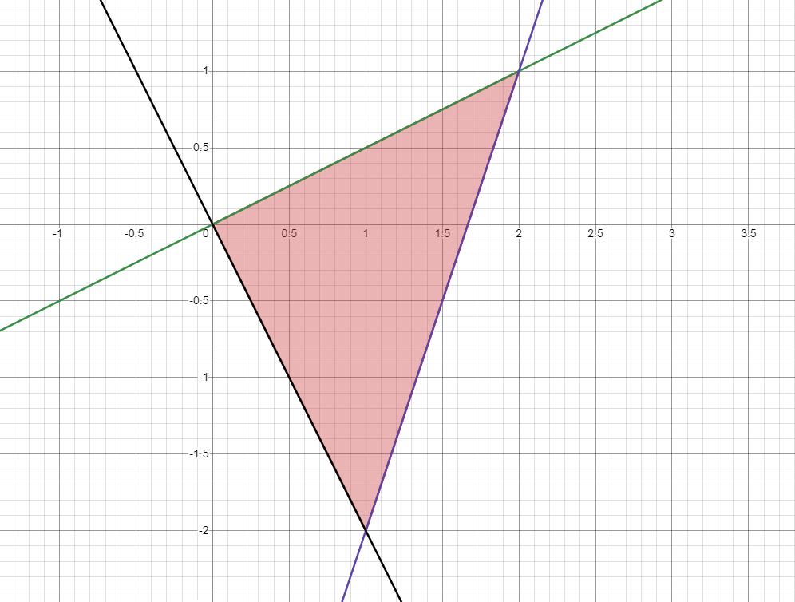

which are

$$\begin{cases}
    2y=x & \text{green}\\
    \frac{y}{3}+\frac{5}{3}=x & \text{purple}\\
    -\frac{y}{2}=x & \text{black}
\end{cases}$$

The figure we need to calculate is 

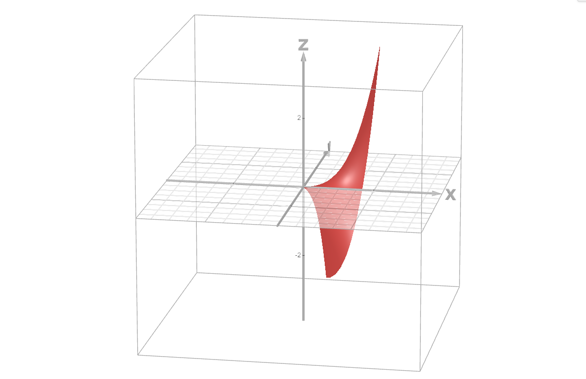

which I will split into two parts horizontally over $y=0$.

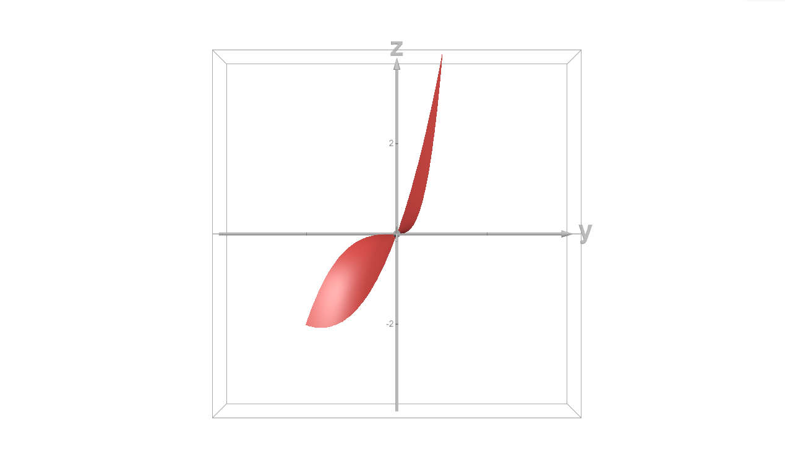

Thus we'd have

$$\underbrace{\int^{0}_{-2}dy\int^{\frac{y}{3}+\frac{5}{3}}_{2y}x^2ydx}_{\mathcal{I_A}} + \underbrace{\int^1_0dy\int^{\frac{y}{3}+\frac{5}{3}}_{-\frac{y}{2}}x^2ydx}_{\mathcal{I_B}}$$

$$\begin{align*}\mathcal{I_A}&=\int^1_0dy\int^{\frac{y}{3}+\frac{5}{3}}_{2y}x^2ydx\\
&=\int^1_0\left(\frac{x^3y}{3}\right)\biggm|^{\frac{y}{3}+\frac{5}{3}}_{2y}dy\\
&=\int^1_0\left(\frac{(\frac{y}{3}+\frac{5}{3})^3y}{3}-\frac{(2y)^3y}{3}\right)dy\\
&=\int^1_0\left(-\frac{215y^4}{81}+\frac{5y^3}{27}+\frac{25y^2}{27}+\frac{125y}{81}\right)dy\\
&=-\frac{215y^5}{405}+\frac{5y^4}{108}+\frac{25y^3}{81}+\frac{125y^2}{162}\biggm|^1_0\\
&=\frac{193}{324}
\end{align*}$$

$$\begin{align*}
\mathcal{I_B}&=\int^{0}_{-2}dy\int^{\frac{y}{3}+\frac{5}{3}}_{-\frac{y}{2}}x^2ydx\\
&=\int^{0}_{-2}\left(\frac{x^3y}{3}\right)\biggm|^{\frac{y}{3}+\frac{5}{3}}_{-\frac{y}{2}}dy\\
&=\int^{0}_{-2}\left(\frac{(\frac{y}{3}+\frac{5}{3})^3y}{3}-\frac{(-\frac{y}{2})^3y}{3}\right)dy\\
&=\int^{0}_{-2}\left(\frac{35y^4}{648}+\frac{5y^3}{27}+\frac{25y^2}{27}+\frac{125y}{81}\right)dy\\
&=\frac{35y^5}{3240}+\frac{5y^4}{108}+\frac{25y^3}{81}+\frac{125y^2}{162}\biggm|^{0}_{-2}\\
&=-\frac{82}{81}
\end{align*}$$

$$\mathcal{I_A}+\mathcal{I_B}=\frac{193}{324}-\frac{82}{81}=-\frac{5}{12}$$

## Problem 1

Bring triple integral $\iiint\limits_{D}f(x,y,z)dxdydz$ to one of iterated ones, where $D=\{(x,y,z)|y^2\leq z\leq 4, x^2+y^2\leq 16\}$.

---

First way I suggest we bound the integral between $yz$ surfaces, differentiating by $x$. 

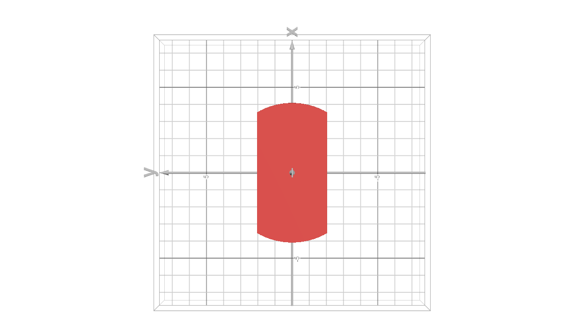

We would have to define the bounding arcs of the circle, which would be 

$$x^2\leq 16-y^2$$

$$\begin{cases}x\leq-\sqrt{16-y^2}\\
x\geq \sqrt{16-y^2}\end{cases}$$

Thus our integral would be 

$$\iiint^{\sqrt{16-y^2}}_{-\sqrt{16-y^2}}f(x,y,z)dx\dots$$

Now to bound the area between $xy$-surfaces, differentiating by $z$.

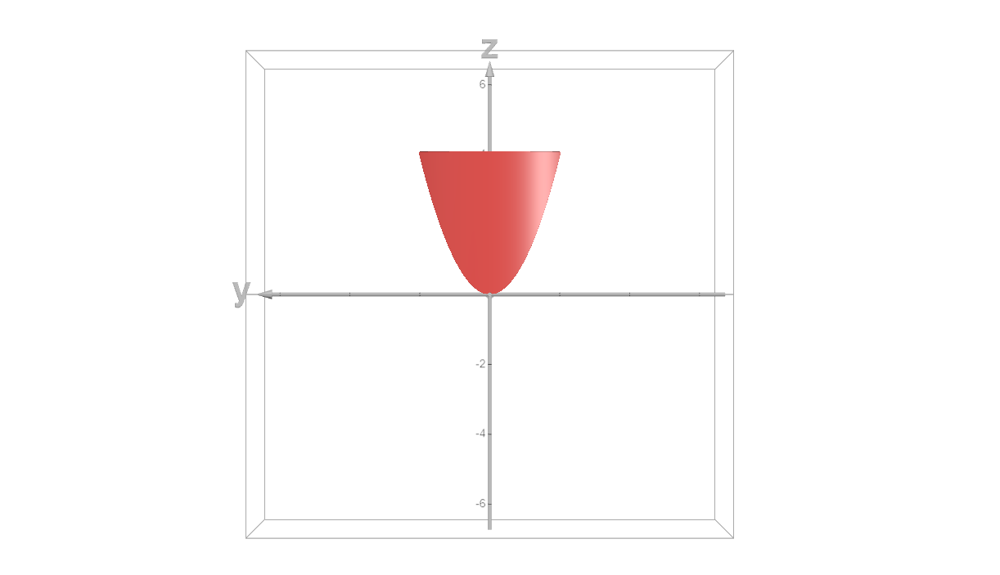

This would be simply

$$y^2\leq z\leq 4$$

We would get

$$\iint^{4}_{y^2}\int^{\sqrt{16-y^2}}_{-\sqrt{16-y^2}}f(x,y,z)dxdz\dots$$

Then bound the area parallel between $xz$-plane, differentiating by $y$. the integral between the following lines:

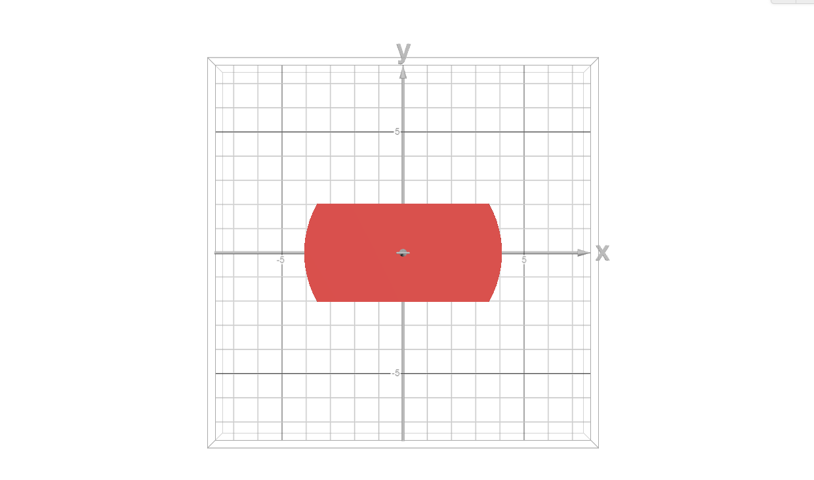

If we were to analytically compute it, we would have to take 

$$y^2\leq 4\implies -2\leq y\leq 2$$

Thus we may add the last set of boundaries to our integral.

$$\int^{2}_{-2}\int^{4}_{y^2}\int^{\sqrt{16-y^2}}_{-\sqrt{16-y^2}}f(x,y,z)dxdzdy$$
## Problem 2

Change the order of integration all possible ways:

$$\int^1_0dx\int^{\sqrt{1-x^2}}_0dy\int^{x^2+y}_0f(x,y,z)dz$$

---

Firstly, let's list all $6\  (3!=6)$ possible ways determining the order in which we bound the area between surfaces (here any variables from $xyz$ denote the arguments of a function that defines the plane that we use, whereas the missing variable out of three denotes the dimension we differentiate by).

$$\begin{align*}
\underset{dz}{xy}\mapsto \underset{dx}{yz}\mapsto \underset{dy}{xz}\\
\underset{dz}{xy}\mapsto \underset{dy}{xz}\mapsto \underset{dx}{yz}\\
\underset{dx}{yz}\mapsto \underset{dz}{xy}\mapsto \underset{dy}{xz}\\
\underset{dx}{yz}\mapsto \underset{dy}{xz}\mapsto \underset{dz}{xy}\\
\underset{dy}{xz}\mapsto \underset{dz}{xy}\mapsto \underset{dx}{yz}\\
\underset{dy}{xz}\mapsto \underset{dx}{yz}\mapsto \underset{dz}{xy}\\
\end{align*}
$$$

and consider them sequentially.

---

$$\underset{dz}{xy}\mapsto \underset{dx}{yz}\mapsto \underset{dy}{xz}$$

First operation remains, second operation is symmetrical to the original integral bounds, third operation is also symmetrical, thus we get:

$$\int^1_0dy\int^{\sqrt{1-y^2}}_0dx\int^{x^2+y}_0f(x,y,z)dz$$

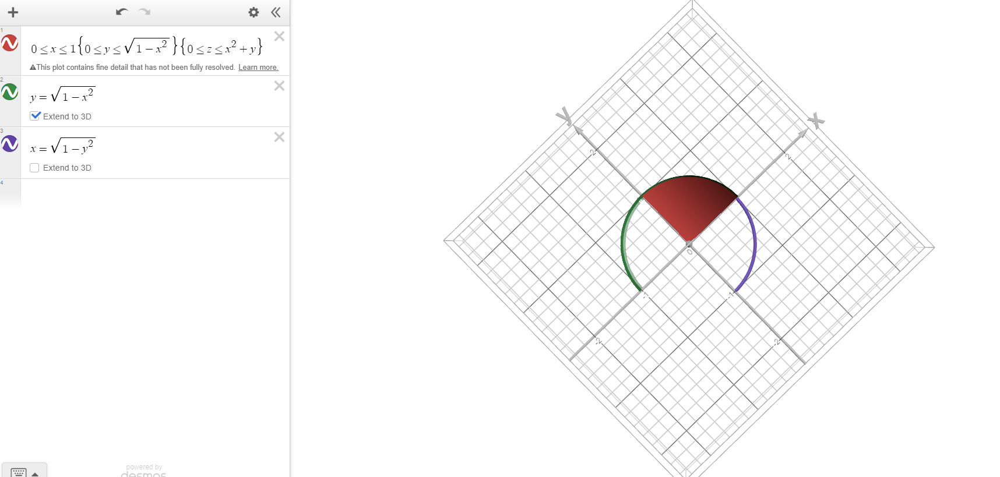

---

$$\underset{dz}{xy}\mapsto \underset{dy}{xz}\mapsto \underset{dx}{yz}$$

This is the original integral.

$$\int^1_0dx\int^{\sqrt{1-x^2}}_0dy\int^{x^2+y}_0f(x,y,z)dz$$

---

$$\underset{dx}{yz}\mapsto \underset{dz}{xy}\mapsto \underset{dy}{xz}$$

Bounding the integral between $yz$-argument planes, we get one above-mentioned plane $x=\sqrt{1-y^2}$ and one plane we derive from $z=x^2+y\implies x=\sqrt{z-y}$, for which we take the positive root since we operate in a non-negative eighth part of the cartesian space.

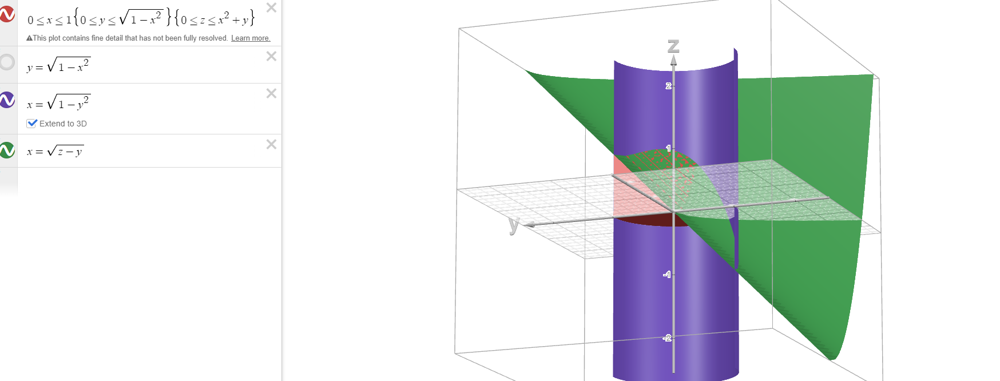

For the bounds from $xy$ arguments, we should take $z=0$ as the lower bound and find the upper bound as follows, which could be seen below:

$$\begin{cases}
    z=x^2+y\\
    x=\sqrt{1-y^2}\\
\end{cases}\implies z=1-y^2+y$$

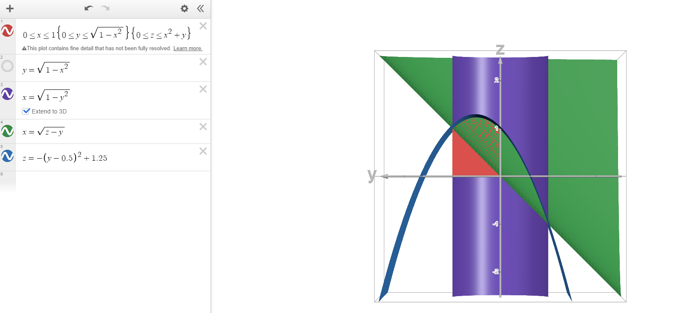

which leaves us with the necessity to bound $y$ with $x=0$ and $x=1$

$$\int^1_0dy\int^{1-y^2+y}_0dz\int^{\sqrt{1-y^2}}_{\sqrt{z-y}}f(x,y,z)dx$$

However, since $\sqrt{z-y}$ doesn't evaluate in real numbers when $0\leq z\leq y$, then we also need to add another integral for this case when $z$ is bounded in $[0, y]$ and $x$ goes down to zero

$$\begin{align*}&\int^1_0dy\int^{1-y^2+y}_0dz\int^{\sqrt{1-y^2}}_{\sqrt{z-y}}f(x,y,z)dx\\+&\int^1_0dy\int^{y}_0dz\int^{\sqrt{1-y^2}}_{0}f(x,y,z)dx\end{align*}$$.

---

$$\underset{dx}{yz}\mapsto \underset{dy}{xz}\mapsto \underset{dz}{xy}$$

The first step would be the same, the next boundary for the function of $z$ with argument $x$ we could get as follows:

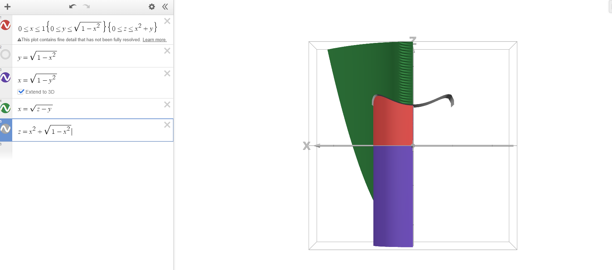

$$\begin{cases}
    z=x^2+y\\
    y=\sqrt{1-x^2}
\end{cases}\implies z=x^2+\sqrt{1-x^2}$$

with $0$ being the lower bound.

Finally, with the upper boundary being the vertex of the aforementioned parabola $-y^2+y+1$, we may get that its $y$ coordinate is 

$$(-y^2+y+1)'_y=-2y+1=0\implies y=\frac{1}{2}$$

implying that

$$z=-\left(\frac{1}{2}\right)^2+\frac{1}{2}+1=\frac{5}{4}$$

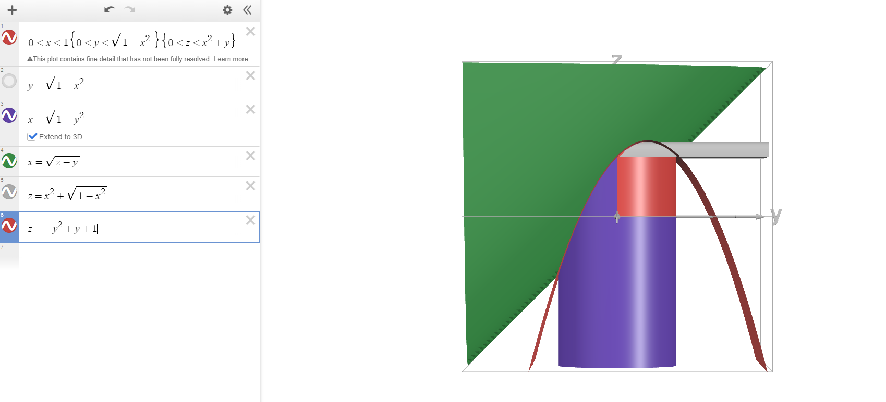

Thus we get 

$$\int^{\frac{5}{4}}_0dz\int^{x^2+\sqrt{1-x^2}}_0dy\int^{\sqrt{1-y^2}}_{\sqrt{z-y}}f(x,y,z)dx$$

Similarly as above, we're missing a piece for when $z\leq y\leq 1$, which we should include, bounding $x$ below with $0$.

$$\begin{align*}&\int^{\frac{5}{4}}_0dz\int^{x^2+\sqrt{1-x^2}}_0dy\int^{\sqrt{1-y^2}}_{\sqrt{z-y}}f(x,y,z)dx\\+&\int^1_0dz\int^{z}_1dy\int^{\sqrt{1-y^2}}_{0}f(x,y,z)dx\end{align*}$$

---

$$\underset{dy}{xz}\mapsto \underset{dz}{xy}\mapsto \underset{dx}{yz}$$

Firstly, bound using upper bound that we already have calculated above, which is 

$$y=\sqrt{1-x^2}$$

and lower bound 

$$z=x^2+y\implies y=z-x^2$$

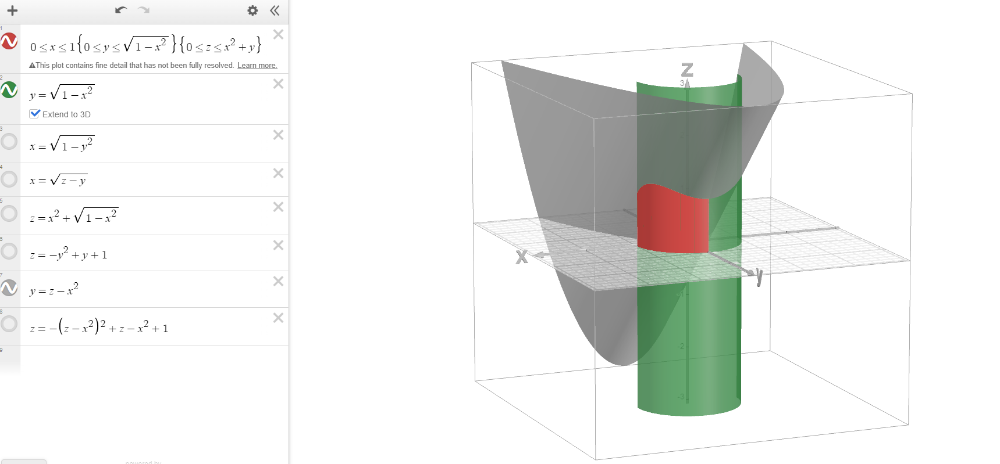

Secondly, we bound with $0$ below and a re-rendering of the well-known parabola from above.

$$z=-\sqrt{1-x^2}^2+\sqrt{1-x^2}+1=-1+x^2+\sqrt{1-x^2}+1=x^2+\sqrt{1-x^2}$$

Also, a heart easter egg:

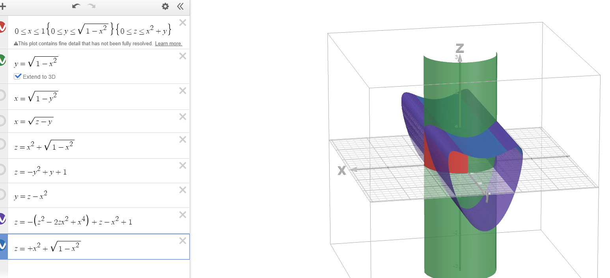

The last boundary would simply be $[0,1]$.

$$\int^1_0dx\int^{x^2+\sqrt{1-x^2}}_0dz\int^{\sqrt{1-x^2}}_{z-x^2}f(x,y,z)dy$$

However in this case we will have included an extra piece because $z-x^2$ may take negative values of $y$, which could be mediated simply by subtracting this piece bounded above by $0$ for $y$ off of the integral:

$$\begin{align*}&\int^1_0dx\int^{x^2+\sqrt{1-x^2}}_0dz\int^{\sqrt{1-x^2}}_{z-x^2}f(x,y,z)dy\\-&\int^1_0dx\int^{x^2+\sqrt{1-x^2}}_0dz\int^0_{z-x^2}f(x,y,z)dy\end{align*}$$

---

$$\underset{dy}{xz}\mapsto \underset{dx}{yz}\mapsto \underset{dz}{xy}$$

The first boundary would be the same as the previous point, the second one would be bounded below by $0$, whereas the upper bound would be a rendition of  the following:

$$\begin{cases}
y=\sqrt{1-x^2}\\
z=1-y^2+y
\end{cases}\implies z=x^2+\sqrt{1-x^2}$$

Solving the above for $z$ would yield us positive

$$x=\sqrt{z+\frac{1}{2}\sqrt{5-4z}-\frac{1}{2}}$$

$$x=\sqrt{z-\frac{1}{2}\sqrt{5-4z}-\frac{1}{2}}$$

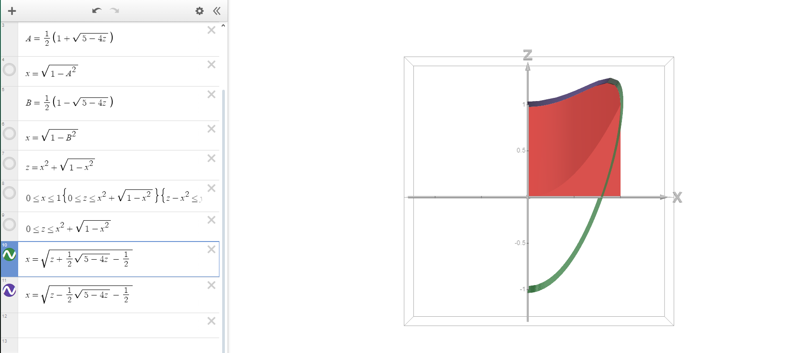

which are upper and lower bounds respectively for $1\leq z\leq \frac{5}{4}$, whereas for $0\leq z\leq 1$ we would simply be bound in $[0, 1]$. Thus, we get

> Remembering to subtract the last extra for when $y\leq 0$

$$\begin{align*}&\int^{\frac{5}{4}}_1dz\int^{\sqrt{z+\frac{1}{2}\sqrt{5-4z}-\frac{1}{2}}}_{\sqrt{z-\frac{1}{2}\sqrt{5-4z}-\frac{1}{2}}}dx\int^{\sqrt{1-x^2}}_{z-x^2}f(x,y,z)dy\\+&\int^{1}_0dz\int^{1}_{0}dx\int^{\sqrt{1-x^2}}_{z-x^2}f(x,y,z)dy\\+&\int^{1}_0dz\int^{1}_{0}dx\int^{0}_{z-x^2}f(x,y,z)dy\end{align*}$$

Visualization:

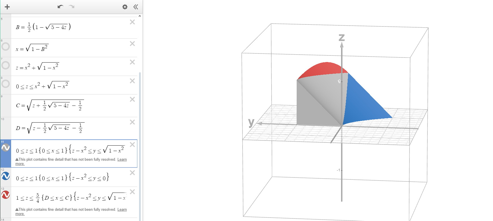