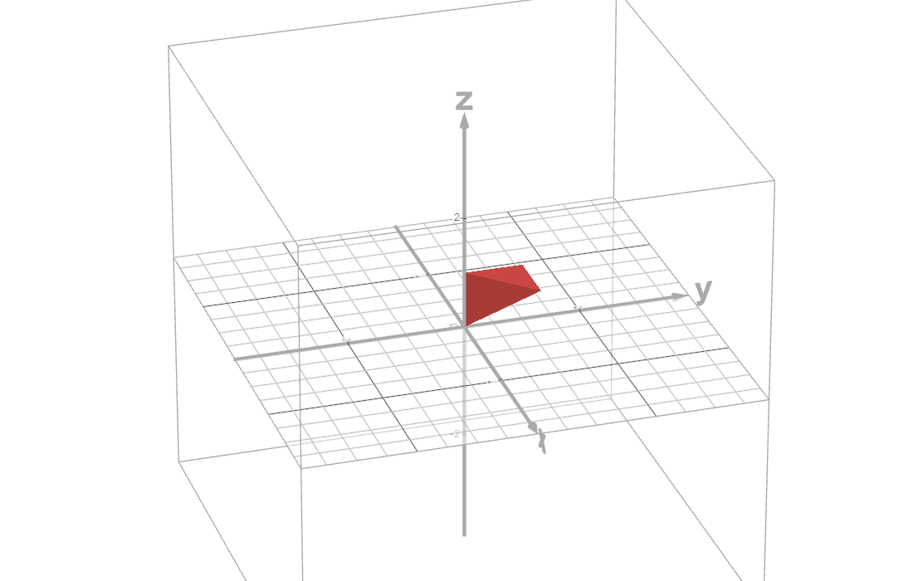
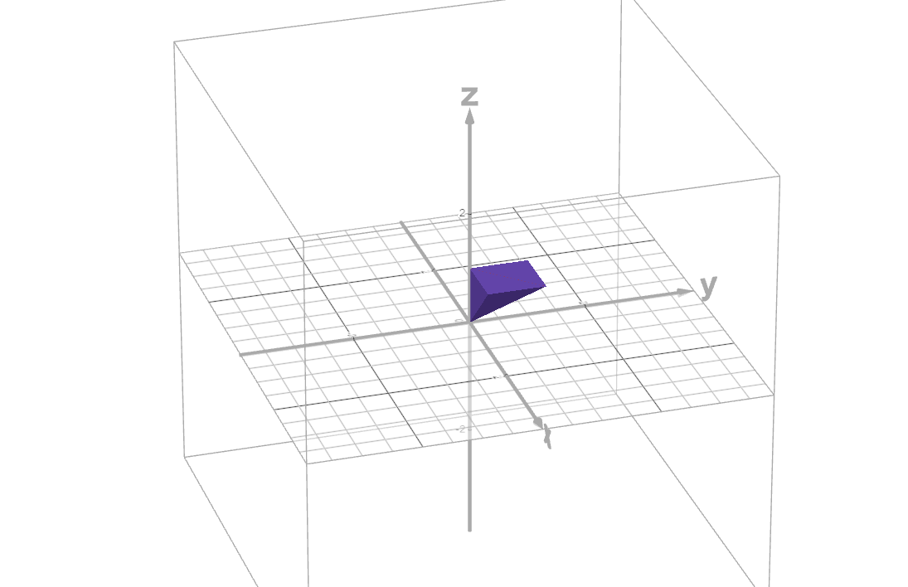
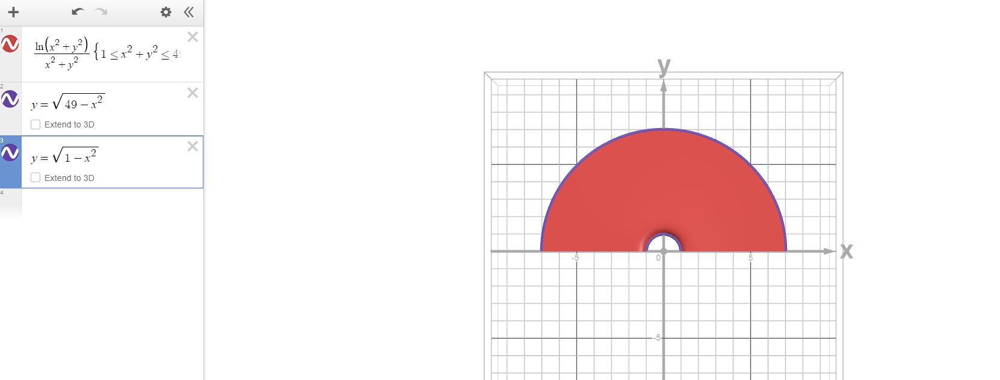

# Calculus, Homework 3

## Problem 2.3

$$\begin{align*}\int\limits_0^4dz\int\limits^z_{-z}dx\int\limits^{\sqrt{z^2-x^2}}_0z^2xy^2dy&=\int\limits_0^4dz\int\limits^z_{-z}dx\left(z^2x\frac{y^3}{3}\biggm|_0^{\sqrt{z^2-x^2}}\right)\\
&=\int\limits^4_0dz\int\limits^z_{-z}z^2x(z^2-x^2)\sqrt{z^2-x^2}dx\\
&=\int\limits^4_0dz\int\limits^z_{-z}(z^4x-z^2x^3)\sqrt{z^2-x^2}dx\\
&\boxed{x=z\sin u,\quad dx=z\cos udu, \quad u=\arcsin(\tfrac{x}{z})}\\
&=\int\limits^4_0dz\int\limits^z_{-z}(z^5\sin u-z^5\sin^3 u)\sqrt{z^2-z^2\sin^2 u}z\cos udu\\
&=\int\limits^4_0dz\int\limits^z_{-z}(z^5\sin u-z^5\sin^3 u)z^2\cos^2 udu\\
&=\int\limits^4_0dz\int\limits^z_{-z}(z^7\sin u-z^7\sin^3 u)(1-\sin^2u)^2du\\
&=\int\limits^4_0dz\int\limits^z_{-z}(z^7\sin u-2z^7\sin^3 u+z^7\sin^5 u)du\\
&\boxed{w=\cos u, \quad dw=-\sin wdu}\\
&=\int\limits^4_0dz\left((-z^7\cos \arcsin(\tfrac{x}{z}))\biggm|^z_{-z}-2z^7\int\limits^z_{-z}\sin^3 udu+z^7\int\limits_{-z}^z\sin^5 udu\right)\\
&\boxed{\begin{align*}&\text{at this point I realized that all the following integrals will eval to zero}\\&\text{since cosarcsin(x/z) evals to zero with boundaries -z and z}\end{align*}} \\
&=\int\limits^4_0dz\left(\cancel{(-z^7\sqrt{1-\tfrac{x^2}{z^2}})\biggm|^z_{-z}}\cancel{-2z^7\int\limits^z_{-z}(1-\cos^2 u)\sin udu}+\cancel{z^7\int\limits_{-z}^z(1-\cos^4 u)\sin udu}\right)\\
&=\int\limits^4_00dx=0
\end{align*}$$

## Problem 2.4

These are the given boundaries:

$$\begin{cases}
    0\leq x\leq 1\\
    x\leq y\leq 1\\
    y\leq z\leq 1
\end{cases}$$

These are the boundaries that I have changed the integral to be 

$$\begin{cases}
    0\leq z\leq 1\\
    0\leq y\leq z\\
    0\leq x\leq z
\end{cases}$$

The shape below has twice the volume of the shape above. 

$$\begin{align*}\int\limits_0^1dx\int\limits_x^1dy\int\limits^1_ye^{z^3}dz&=\frac{1}{2}\int\limits_0^1dz\int\limits^z_0dy\int\limits_0^ze^{z^3}dx\\
&=\frac{1}{2}\int\limits_0^1dz\int\limits^z_0dy(xe^{z^3})\biggm|_0^z\\
&=\frac{1}{2}\int\limits_0^1dz\int\limits^z_0ze^{z^3}dy\\
&=\frac{1}{2}\int\limits_0^1dz(yze^{z^3})\biggm|_0^z\\
&=\int\limits_0^1 \frac{1}{2}z^2e^{z^3}dz\\
&\boxed{z^3=u,\quad du=3z^2dz\implies dz=\frac{du}{3z^2}}\\
&=\frac{1}{6}\int\limits^1_0e^udu=\frac{e^u}{6}\biggm|^1_0=\frac{e^{z^3}}{6}\biggm|^1_0=\frac{1}{6}(e-1)
\end{align*}$$

## Problem 3.3a

$$\iint\limits_{\underset{\scriptstyle y\geq 0}{1\leq x^2+y^2\leq 49}}\frac{\ln(x^2+y^2)}{x^2+y^2}dxdy$$

Firstly, visualize the graph since this is actually really easy to do in this case.

The most optimal way to calculate it would be to take a polar coordinate replacement. We need to differentiate through radii $r\in[1, 7]$ and through angles $\theta\in[0,\pi]$.

Thus, we replace

$$x=r\cos\theta, y=r\sin\theta$$

$$\begin{align*}\iint\limits_{\underset{\scriptstyle y\geq 0}{1\leq x^2+y^2\leq 49}}\frac{\ln(x^2+y^2)}{x^2+y^2}dxdy&=\int\limits_{0}^\pi \int\limits^{7}_{1}\frac{\ln(r^2\cos^2\theta+r^2\sin^2\theta)}{r^2\cos^2\theta+r^2\sin^2\theta}rdrd\theta\\
&=\int\limits_{0}^\pi \int\limits^{7}_{1}\frac{\ln(r^2)}{r}drd\theta\\
&\boxed{u=\ln(r^2),\quad du=\frac{2r}{r^2}dr=\frac{2}{r}dr\implies dr=\frac{1}{2}rdu}\\
&=\frac{1}{2}\int\limits^\pi_0\int\limits^7_1udud\theta=\frac{1}{4}\int\limits^\pi_0(\ln(r^2)^2)\biggm|^7_1d\theta\\
&=\frac{1}{4}\int\limits^\pi_0(2\ln(7))^2-\cancel{2\ln(1)^2}d\theta\\
&=\ln^2(7)\theta\biggm|_0^\pi=\ln^2(7)\pi
\end{align*}$$