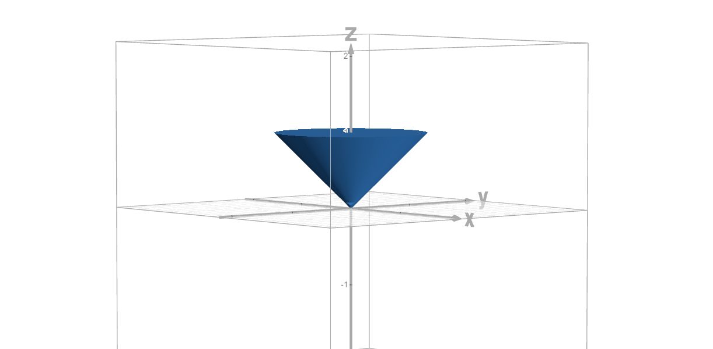
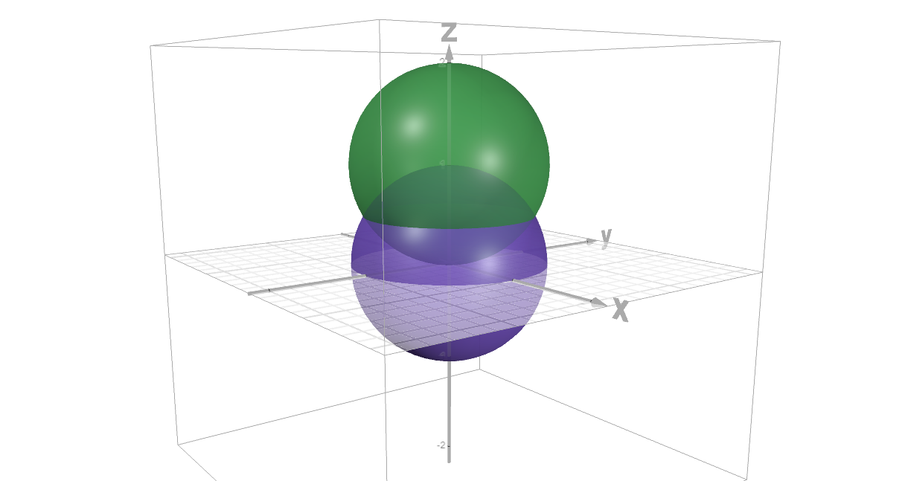
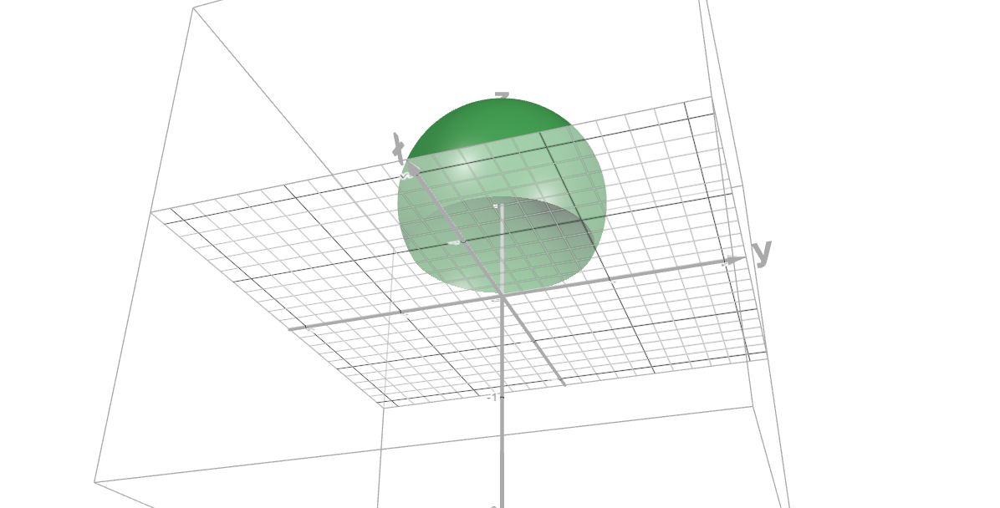

# Calculus, Homework 4

> Cyllindrical replacement:
> $$\begin{cases}
    x=\rho\cos\varphi\\
    y=\rho\sin\varphi\\
    z=z
\end{cases}$$
> $$dV=dxdydz=\rho d\rho d\varphi dz$$

> Spherical replacement:
> $$\begin{cases}
    x=r\sin\theta\cos\varphi\\
    y=r\sin\theta\sin\varphi\\
    z=r\cos\theta
\end{cases}$$
> $$\begin{alignat*}{2}
J & =\frac{\partial(x,y,z)}{\partial (r,\theta,\varphi)}=\begin{vmatrix}
\sin \theta \cos \varphi & r \cos \theta \cos \varphi & -r\sin\theta\sin\varphi \\
\sin \theta \sin \varphi & r \cos \theta \sin \varphi & r \sin \theta \cos \varphi \\
\cos \theta & - r\sin\theta & 0
\end{vmatrix}
= \\ & =\cos \theta (r^2 \cos \varphi^2 \cos \theta \sin \theta + r^2\sin^2\varphi \cos\theta\sin\theta) + r\sin\theta(r\sin^2\theta\cos^2\varphi + r\sin^2\theta\sin^2\varphi) = \\ & = r^2 \cos^2\theta \sin \theta + r^2 \sin^2 \theta \sin\theta =\\ &= 
r^2\sin\theta.
\end{alignat*}$$
> $$dV=dxdydz=r^2\sin\theta dr d\theta d\varphi$$

## Problem 1

Firstly, deal with all the limits:

$$\begin{cases}z=9-x^2-y^2=9-(\rho^2\cos^2\phi+\rho^2\sin^2\varphi)=9-\rho^2\\
\rho\sin\varphi=\sqrt{9-x^2}=\sqrt{9-\rho^2\cos^2\varphi}\implies\rho^2\sin^2\varphi=9-\rho^2\cos^2\varphi\implies\rho=\plusmn3\implies\rho\in[0,3]\\
\rho\cos\varphi=3\implies\cos\varphi=1\implies\varphi\in\{0, \pi\}
\end{cases}$$

$$\begin{align*}
\int\limits^3_{-3}\int\limits_0^{\sqrt{9-x^2}}\int\limits_0^{9-x^2-y^2}\sqrt{x^2+y^2}dzdydx&=
\int\limits^3_{0}\int\limits_0^{\pi}\int\limits_0^{9-\rho^2}\sqrt{\rho^2\cos^2\varphi+\rho^2\sin^2\varphi}\rho dzd\varphi d\rho\\&=
\int\limits^3_{0}\int\limits_0^{\pi}\int\limits_0^{9-\rho^2}\rho^2 dzd\varphi d\rho\\&=
\int\limits^3_{0}\int\limits_0^{\pi}\rho^2(9-\rho^2) d\varphi d\rho\\&=
\int\limits^3_{0}\pi\rho^2(9-\rho^2)d\rho\\&=
3\pi\rho^3-\frac{\pi\rho^5}{5}\biggm|_0^3=\frac{81\times5-243}{5}\pi=\boxed{\frac{162\pi}{5}}
\end{align*}$$

## Problem 2

Firstly all the replacements:

$$\begin{cases}
    x=r\sin\theta\cos\varphi=\sqrt{4-r^2\sin^2\theta\sin^2\varphi}\implies r^2\sin^2\theta(\cos^2\varphi+\sin^2\varphi)=4\implies\sin^2\theta=1\implies\theta\in[-\tfrac{\pi}{2},\tfrac{\pi}{2}]\\
    y=r\sin\theta\sin\varphi=2\implies\sin\varphi=1\implies\varphi\in[\tfrac{\pi}{2},\frac{5\pi}{2}]\\
    z=r\cos\theta=\plusmn\sqrt{4-(r^2\sin^2\theta\cos^2\varphi+r^2\sin^2\theta\sin^2\varphi)}=\plusmn\sqrt{4-r^2\sin^2\theta}\implies r=\plusmn2\implies r\in[-2, 2]
\end{cases}$$

> $$dV=dxdydz=r^2\sin\theta dr d\theta d\varphi$$

$$\begin{align*}\int\limits_{-2}^{2}\int\limits^{\sqrt{4-y^2}}_{-\sqrt{4-y^2}}\int\limits^{\sqrt{4-x^2-y^2}}_{-\sqrt{4-x^2-y^2}}z(x^2+y^2+z^2)dzdxdy&=
\int\limits_{\textstyle\frac{\pi}{2}}^{\textstyle\frac{5\pi}{2}}\int\limits^{\textstyle\frac{\pi}{2}}_{-\textstyle\frac{\pi}{2}}\int\limits^{2}_{-2}r^3\cos\theta(\sin^2\theta\cos^2\varphi+\sin^2\theta\sin^2\varphi+\cos^2\theta)r^2\sin\theta drd\theta d\varphi\\&=
\int\limits^{2}_{-2}\int\limits_{\textstyle\frac{\pi}{2}}^{\textstyle\frac{5\pi}{2}}\int\limits^{\textstyle\frac{\pi}{2}}_{-\textstyle\frac{\pi}{2}}r^5\cos\theta\sin\theta d\theta d\varphi dr=0
\end{align*}$$

since $\cos(\tfrac{\pi}{2})=0$, which itself should've been obvious given that the function is odd in relation to $z$ and even in relation to all other values given symmetric boundaries.

## Problem 3b

Firstly, we are delimited by a circle of radius $1$ shifted by a single unit to the right:

$$x^2-2x+1+y^2\leq1\implies(x-1)^2+y^2\leq 1$$

> From this it also follows that $\theta\in[0,2\pi]$ and $r\in[0, 1]$ since we are delimited by a full circle.

Thus I want to introduce a replacement

$$x-1=z\implies x=z+1,\quad dz=dx$$

$$\iint\limits_{x^2+y^2\leq 2x}\frac{xdxdy}{\sqrt{4-x^2-y^2}}=\iint\limits_{z^2+y^2\leq 1}\frac{(z+1)dzdy}{\sqrt{4-(z+1)^2-y^2}}=$$

Polar replacements go brr.

$$\begin{cases}z=r\cos\theta,\\
               y=r\sin\theta\end{cases}$$

$$dV=dxdy=rdrd\varphi$$

$$\begin{align*}
&=\int\limits_{0}^{1}\int\limits_{0}^{2\pi}\frac{(z+1)rd\theta dr}{\sqrt{4-(z+1)^2-y^2}}=\int\limits_{0}^{1}\int\limits_{0}^{2\pi}\frac{(r\cos\theta+1)rd\theta dr}{\sqrt{4-(r\cos\theta+1)^2-r^2\sin^2\theta}}
\\&=\int\limits_{0}^{1}\int\limits_{0}^{2\pi}\frac{(r\cos\theta+1)rd\theta dr}{\sqrt{3-r^2\cos^2\theta-2r\cos\theta-r^2\sin^2\theta}}=\int\limits_{0}^{1}\int\limits_{0}^{2\pi}\frac{(r\cos\theta+1)rd\theta dr}{\sqrt{3-r^2-2r\cos\theta}}
\end{align*}$$

> This monstrosity above turns out to be a failed attempt, so let's try another approach without prior replacements by strictly defining coordinates.

$$\int\limits_{0}^2\int\limits_{-\sqrt{1-(x-1)^2}}^{\sqrt{1-(x-1)^2}}\frac{xdydx}{\sqrt{4-x^2-y^2}}$$

Polar replacements go brr, again.

$$\begin{cases}x=r\cos\theta=2\implies \cos^2\theta=1\implies\theta\in[0,\pi]\\
y=r\sin\theta=\plusmn\sqrt{1-(x-1)^2}\implies r^2\sin^2\theta=1-r^2\cos^2\theta+2r\cos\theta-1\implies r=2\cos\theta
  \end{cases}$$

which implies that we may calculate an integral bounded in $r\in[0,2\cos\theta]$ and multiply it by two since we would be calculating two parts of the semi-circle. At last, we may do the following:

$$\begin{align*}2\int\limits_{0}^\pi\int\limits_{0}^{2\cos\theta}\frac{xdydx}{\sqrt{4-x^2-y^2}}&=
2\int\limits_{0}^\pi\int\limits_{0}^{2\cos\theta}\frac{r^2\cos\theta d rd\theta}{\sqrt{4-r^2\cos^2\theta-r^2\sin^2\theta}}\\&=
2\int\limits_{0}^\pi\int\limits_{0}^{2\cos\theta}\frac{r^2\cos\theta d rd\theta}{\sqrt{4-r^2}}\\
&\boxed{r=2\sin\varphi, dr=2\cos\varphi d\varphi,d\varphi=\frac{dr}{\sqrt{4-r^2}},\varphi=\arcsin(\tfrac{r}{2})}\\&=
2\int\limits_{0}^\pi\int\limits_{0}^{2\cos\theta}\frac{8\sin^2\varphi\cos\theta\cos\varphi d\varphi d\theta}{2\cos\varphi}\\&=
2\int\limits_{0}^\pi\int\limits_{0}^{2\cos\theta}4\sin^2\varphi\cos\theta d\varphi d\theta\\&=
8\int\limits_{0}^\pi\cos\theta\int\limits_{0}^{2\cos\theta}\sin^2\varphi d\varphi d\theta\\&=
8\int\limits_{0}^\pi\cos\theta\left(\frac{\varphi}{2}-\frac{1}{4}\sin(2\varphi)\right)\biggm|_{0}^{2\cos\theta}d\theta\\&=
8\int\limits_{0}^\pi\cos\theta\left(\frac{\arcsin(\frac{r}{2})}{2}-\frac{1}{4}r\sqrt{1-\frac{r^2}{4}}\right)\biggm|_{0}^{2\cos\theta}d\theta
\end{align*}$$

At this point we have achieved some kind of mess once again. Realistically, I don't think that this integral is calculable since it bounds a point $(2, 0)$ within the restriction $2^2+0^2\leq 2\times2\implies 4\leq 4$, which itself is an asymptote of the function since $\frac{x}{\sqrt{4-2^2-0}}=\frac{x}{0}$ which is undefined, thus the integral is equal to $+\infty$ aka it diverges (this is warranted because there is an infinite discountinuity at the aforementioned point).

## Problem 3c

$$\iiint\limits_{\underset{\scriptstyle 0\leq z\leq 1}{x^2+y^2\leq z^2}}(z-xy)dxdydz$$

We (at last) have a very simple conic shape defined.

It's evident that $\rho\in[0, 1]$ as it linearly grows from $0$ to $1$. It's further evident that $\varphi\in[0,2\pi]$ since we cover a full circle. Finally, it's further-er evident that $z\in[0, 1]$ from the given conditions.

Rewrite the integral after cyllindrical replacements:

$$\begin{align*}
\int\limits^{2\pi}_0\int\limits^1_0\int\limits_0^1(z-\rho^2\cos\varphi\sin\varphi)\rho\ dz d\rho d\varphi&=\int\limits^{2\pi}_0\int\limits^1_0\left(\frac{\rho}{2}-\rho^3\cos\varphi\sin\varphi\right) d\rho d\varphi
\\&=\int\limits^{2\pi}_0\left(\frac{1}{4}-\frac{1}{4}\cos\varphi\sin\varphi\right) d\varphi
\\&=\frac{1}{4}\int\limits^{2\pi}_0\left(1-\cos\varphi\sin\varphi\right) d\varphi
\\&=\frac{1}{4}\int\limits^{2\pi}_0\left(1-\frac{1}{2}\sin2\varphi\right) d\varphi
\\&=\frac{1}{4}\left(\varphi+\frac{\cos^2\varphi}{2}\right)\biggm|^{2\pi}_0
\\&=\frac{1}{4}\left(2\pi+\frac{1}{2}-\frac{1}{2}\right)=\frac{\pi}{2}
\end{align*}$$

## Problem 3d

$$\iiint\limits_{\underset{\scriptstyle x^2+y^2+z^2\leq 2z}{x^2+y^2+z^2\geq 1}}z^2dxdydz$$

---

In this problem, we need to calculate the area of the green sphere minus its intersection with the blue sphere.

This leaves us with the following green shape the integral of which we need to calculate:

I shall first calculate area of the green sphere and then calculate the intersection area using cyllindrical coordinates.

### Green Sphere

Replacing $z-1=u$, alongside with boundaries of $r\in[0, 1]$, $\varphi\in[0,2\pi]$, $\theta\in[0, \pi]$, we get

$$\begin{align*}
\iiint\limits_{x^2+y^2+u^2\leq 1}(u+1)^2dxdydu&=\int\limits_0^\pi\int\limits^{2\pi}_0\int\limits_0^1(r\cos\theta+1)^2r^2\sin\theta dr d\varphi d\theta 
\\&=\int\limits_0^\pi\int\limits^{2\pi}_0\int\limits_0^1\left(r^2\cos^2\theta+2r\cos\theta+1\right)r^2\sin\theta dr d\varphi d\theta 
\\&=\int\limits_0^\pi\int\limits^{2\pi}_0\int\limits_0^1\left(r^4\cos^2\theta \sin\theta+2r^3\cos\theta\sin\theta+r^2\sin\theta\right) dr d\varphi d\theta 
\\&=\int\limits_0^\pi\int\limits^{2\pi}_0\left(\frac{1}{5}\cos^2\theta \sin\theta+\frac{1}{2}\cos\theta\sin\theta+\frac{1}{3}\sin\theta\right) d\varphi d\theta 
\\&=\int\limits^{\pi}_0\left(\frac{2\pi}{5}\cos^2\theta \sin\theta+\cancel{\pi\cos\theta\sin\theta}+\frac{2\pi}{3}\sin\theta\right) d\theta
\\&=\left(-\frac{2\pi}{15}\cos^3(\theta)-\frac{2\pi}{3}\cos\theta\right)\biggm|^{\pi}_0
\\&=\frac{2\pi}{3}\left(-\frac{1}{5}\cos^3(\theta)-\cos\theta\right)\biggm|^{\pi}_0
\\&=\frac{2\pi}{3}\left(\frac{2}{5}+2\right)=\frac{2\pi}{3}\frac{12}{5}=\frac{8\pi}{5}
\end{align*}$$

### Intersection

For this, I shall use cyllindrical coordinates.

Firstly, find the intersection points. We have spheres $x^2+y^2+(z-1)^2=1$ and $x^2+y^2+z^2=1$. It's pretty obvious they would intersect in the middle at $z=\frac{1}{2}$. Thus we get the intersection circle with max radius of $r_0=\frac{3}{4}$. We will be shifting our radius within bounds $[0, \frac{3}{4}]$.

Then, we take $\theta\in[0,2\pi]$ as we'd be making a full circle, and finally we need to bound $z$ between two planes, which we may get from simply taking

$$\sqrt{1-x^2-y^2}=\sqrt{1-r^2}$$

and for the shifted sphere

$$1-\sqrt{1-r^2}$$

finally, set up all the boundaries properly:

$$\begin{align*}
\int\limits^{2\pi}_0\int\limits^{\sqrt{\frac{3}{4}}}_0\int\limits^{\sqrt{1-r^2}}_{1-\sqrt{1-r^2}} z^2rdzdrd\theta&=
\int\limits^{2\pi}_0\int\limits^{\sqrt{\frac{3}{4}}}_0r\frac{z^3}{3}\biggm|^{\sqrt{1-r^2}}_{1-\sqrt{1-r^2}}drd\theta\\&=
\int\limits^{2\pi}_0\int\limits^{\sqrt{\frac{3}{4}}}_0r\frac{(\sqrt{1-r^2})^3-(1-\sqrt{1-r^2})^3}{3}drd\theta\\
&\boxed{r=\sin\varphi, dr=\cos\varphi d\varphi}\\
&=\int\limits^{2\pi}_0\int\limits^{\sqrt{\frac{3}{4}}}_0\frac{\cos^3\varphi-(1-\cos\varphi)^3}{3}\sin\varphi\cos\varphi d\varphi d\theta\\
&=\int\limits^{2\pi}_0\int\limits^{\sqrt{\frac{3}{4}}}_0\frac{(2\cos\varphi-1)(\cos^2\varphi+\cos^2\varphi-\cos\varphi+\cos^2\varphi-2\cos\varphi+1)}{3}\sin\varphi\cos\varphi d\varphi d\theta\\
\end{align*}$$

> Which is some piece of garbage once again, so I may try another simpler approach using some magic, now using spherical coordinates (sorry I'm literally running out of time to properly write everything out here), here we're tracking the point on the sphere and how it depends on our radius and trying to simplify radius calculations as well as theta calculations.

$$\begin{align*}
\int\limits_0^{2\pi}\int\limits_0^1\int\limits_0^{\arccos(\frac{r}{2})}r^4\cos^2\theta\sin\varphi d\varphi d r d\theta&=\int\limits_0^{2\pi}\int\limits_0^1-r^4\cos^2\theta\cos\varphi \biggm|_0^{\arccos(\frac{r}{2})} d r d\theta\\&=
\int\limits_0^{2\pi}\int\limits_0^1-\frac{r^5}{2}\cos^2\theta +r^4\cos^2\theta d r d\theta\\&=
\int\limits_0^{2\pi}\cos^2\theta\int\limits_0^1(r^4-\tfrac{r^5}{2}) d r d\theta\\&=
\int\limits_0^{2\pi}\cos^2\theta\left(\frac{1}{5}-\frac{1}{12}\right)d\theta\\&=
\frac{7}{60}\int\limits_0^{2\pi}\cos^2\theta d\theta=\frac{7}{120}(\theta+\cancel{\sin\theta\cos\theta})\biggm|_0^{2\pi}=\frac{7\pi}{60}
\end{align*}$$

Finally, we get

$$\frac{8\pi}{5}-\frac{7\pi}{60}=\boxed{\frac{89\pi}{60}}$$

which should be the final answer I hope please I have suffered so much ._.

