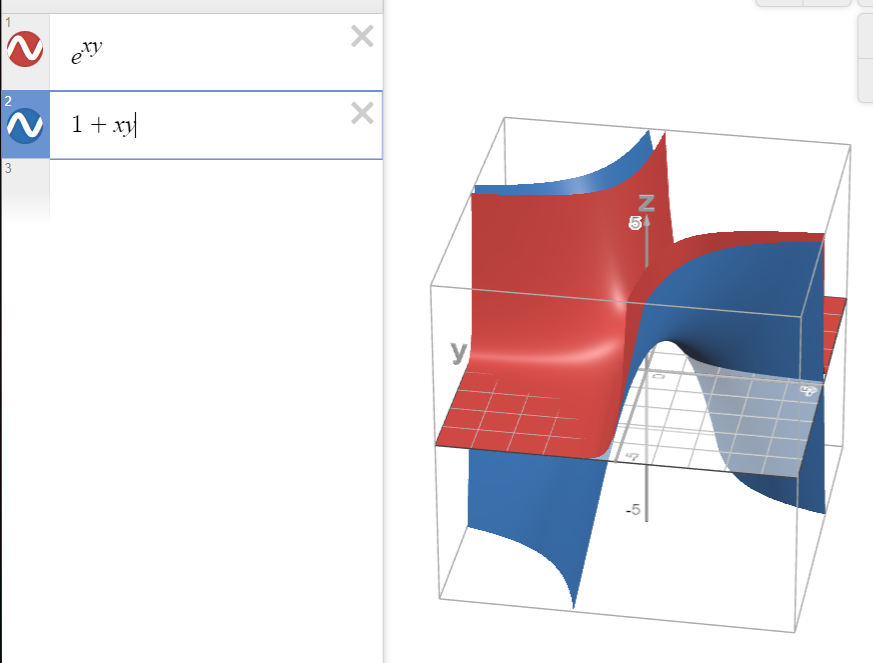

# Calculus, Homework 10

## Problem 1

> Are the following functions differentiable at $(0,0)$?

### Subproblem A

$$f(x,y)=\begin{cases}
    \displaystyle\frac{2xy^2}{x^2+y^2}, \ \ \ (x, y) \neq(0,0)\\
    0, \ \ \ (x,y)=(0,0)
\end{cases}$$

---

First, let's check whether the function is continuous. For this, limits from all sides (for all paths) have to exist.

Assume $x=p\cos \phi, y=p\sin \phi$, then 

$$\lim_{(x,y)\to(0,0)}\frac{2xy^2}{x^2+y^2}=\lim_{p\to0}\frac{2p^3\cos \phi\sin^2 \phi}{p^2(\cos^2\phi+\sin^2\phi)}=\lim_{p\to0}2p\cos \phi\sin^2\phi=0$$

Thus, the function is continuous.

Now, check whether it's differentiable. Per the definition:

$$\lim_{(t,k)\to(0,0)}\frac{f(t, k) - f(0, 0)+t-k}{\sqrt{t^2+k^2}}=\lim_{(t,k)\to(0,0)}\frac{\frac{2tk^2}{t^2+k^2}+t-k}{\sqrt{t^2+k^2}}=$$

$$\lim_{(t,k)\to(0,0)}\frac{\frac{2tk^2+t^3+t^2k-tk^2-k^3}{t^2+k^2}}{\sqrt{t^2+k^2}}=\lim_{(t,k)\to(0,0)}\frac{t^3+t^2k+tk^2-k^3}{(t^2+k^2)^{\frac{3}{2}}}$$

Collapse to polar coordinates once again:

$$\lim_{p\to0}\frac{p^3\cos^3\alpha+p^3\cos^2\alpha\sin^3\alpha+p^3\cos\alpha\sin^2\alpha-p^3\sin\alpha}{(p^2\cos^2\alpha+p^2\sin^2\alpha)^{\frac{3}{2}}}=\lim_{p\to0}\frac{p^3\Alpha}{p^3}=\Alpha,$$

where $\Alpha=\cos^3\alpha+\cos^2\alpha\sin\alpha+\cos\alpha\sin^2\alpha-\sin^3\alpha$. $\Alpha$ depends on $\alpha$, therefore there is no defined limit since it depends on the path one takes. Thus, the function is not differentiable at $(0,0)$.

### Subproblem B

$$f(x,y)=\begin{cases}
    \displaystyle\frac{x|y|}{\sqrt{x^2 + y^2}}, \ \ \ (x, y) \neq(0,0)\\
    0, \ \ \ (x,y)=(0,0)
\end{cases}$$

---

> The existence of $|x|$ already implies the function wouldn't be differentiable, but let's check it.

Firstly, make sure that the function is continuous:

Assume $x=p\cos \phi, y=p\sin \phi$, then 

$$\lim_{(x,y)\to(0,0)}\frac{x|y|}{\sqrt{x^2+y^2}}=\lim_{p\to0}\frac{p|p|\cos\phi|\sin\phi|}{\sqrt{p^2(\cos^2\phi+\sin^2\phi)}}=\lim_{p\to0}\frac{p|p|\cos\phi|\sin\phi|}{|p|}=$$

$$=\lim_{p\to0}p\cos\phi|\sin\phi|=0$$

Now, per the derivative definition, check whether the function is differentiable $(h=\sqrt{t^2+k^2})$:

$$\lim_{(t,k)\to(0,0)}\frac{f(t, k) - f(0, 0)+t-k}{\sqrt{t^2+k^2}}=\lim_{(t,k)\to(0,0)}\frac{\frac{t|k|}{\sqrt{t^2+k^2}}+t-k}{\sqrt{t^2+k^2}}=$$

$$=\lim_{(t,k)\to(0,0)}\frac{t|k|+th-kh}{h^2}$$

Transitioning to polar coordinates:

$$\lim_{p\to0}\frac{p\cos\alpha|p\sin\alpha|+p\cos\alpha|p|-p\sin\alpha|p|}{p^2}=\lim_{p\to0}\frac{|p|}{p}(\cos\alpha\sin\alpha+\cos\alpha-\sin\alpha)=$$

$$=\lim_{p\to0}\text{sgn}(p)\Alpha(\alpha)$$

The limit of function $\text{sgn}(p)$ takes different values depending on what side you approach it from. More specifically, $\lim_{p\to0^+}\text{sgn}(p)=1$ and $\lim_{p\to0^-}\text{sgn}(p)=-1$ 

### Subproblem C

$$f(x,y)=\frac{1}{1+x-y}$$

---

Once again, determine whether the function is continuous: the function is continuous because the limit is easily calculated and constant for all paths: $\lim_{(x,y)\to(0,0)}\frac{1}{1+x-y}=\frac{1}{1+0-0}=1$.

Now, is the function continuous at $(0,0)$? We need to check whether all partial derivatives exist.

$$\frac{\partial}{\partial x}f(x,y)=\lim_{h\to0}\frac{f(0+h, 0)-f(0,0)}{h}=\lim_{h\to0}\frac{\frac{1}{1+h-0}-1}{h}=\lim_{h\to0}\frac{1-1-h}{h(1+h)}=-1$$

$$\frac{\partial}{\partial y}f(x,y)=\lim_{h\to0}\frac{f(0, 0+h)-f(0,0)}{h}=\lim_{h\to0}\frac{\frac{1}{1+0-h}-1}{h}=\lim_{h\to0}\frac{1-1+h}{h(1+h)}=1$$

Partial derivatives can be easily calculated $\implies$ they exist and the function is differentiable at $(0,0)$.

## Problem 2

Let functions $u, v, w$ be differentiable everywhere, given that $u\colon\mathbb{R}^n\to\mathbb{R}, v\colon\mathbb{R}^m\to\mathbb{R}$ and $\mathbb{R}^k\to\mathbb{R}$ if 

### Subproblem A

$$f=uvw^2$$

---

$$(df)_\textbf{p}=\begin{pmatrix}
    f'_u & f'_v & f'_w
\end{pmatrix}\begin{pmatrix}
    du \\
    dv \\
    dw
\end{pmatrix}=\begin{pmatrix}
    f'_udu & f'_vdv & f'_wdw
\end{pmatrix}=$$

$$=\begin{pmatrix}
    vw^2du & uw^2dv & 2uvwdw
\end{pmatrix}$$

### Subproblem B

$$f=\ln(\sqrt{u^2+v^2})$$

---

First, let's find $f'_u$ (the derivatives would be symmetric to each other, so we may only find one).

$$f'_u=\frac{(\sqrt{u^2+v^2})'_u}{\sqrt{u^2+v^2}}=\frac{(u^2+v^2)'_u}{2(u^2+v^2)}=\frac{2u}{2(u^2+v^2)}=\frac{u}{u^2+v^2}$$

Similarly,

$$f'_v=\frac{v}{u^2+v^2}$$

$$(df)_\textbf{p}=\begin{pmatrix}
    f'_u & f'_v
\end{pmatrix}\begin{pmatrix}
    du \\
    dv 
\end{pmatrix}=\begin{pmatrix}
    f'_udu & f'_vdv
\end{pmatrix}=$$

$$=\begin{pmatrix}
    \displaystyle\frac{udu}{u^2+v^2} & \displaystyle\frac{vdv}{u^2+v^2} 
\end{pmatrix}=\frac{1}{u^2+v^2}\begin{pmatrix}
    udu & vdu
\end{pmatrix}$$

## Problem 3

> Using l'Hopital's rule, find limits:

### Subproblem A

$$\lim_{x\to0}\frac{x(e^x+1)-2(e^x-1)}{x^3}\xRightarrow{[\frac{0}{0}]}$$

$$\lim_{x\to0}\frac{x'(e^x+1)+x(e^x+1)'-2(e^x-1)'}{(x^3)'}=$$

$$\lim_{x\to0}\frac{e^x+1+xe^x-2e^x}{3x^2}=\lim_{x\to0}\frac{(x-1)e^x+1}{3x^2}\xRightarrow{[\frac{0}{0}]}$$

$$\lim_{x\to0}\frac{(x-1)'e^x+(x-1)(e^x)'}{(3x^2)'}=$$

$$\lim_{x\to0}\frac{e^x+(x-1)e^x}{6x}=\lim_{x\to0}\frac{xe^x}{6x}=\frac{e^0}{6}=\frac{1}{6}$$

### Subproblem B

$$\lim_{x\to0^+}x^a\ln(x), \ \ \ a>0$$

$$\lim_{x\to0^+}\frac{\ln(x)}{x^{-a}}=\lim_{x\to0^+}\frac{1}{x}\frac{1}{-ax^{-a-1}}=\lim_{x\to0^+}\frac{1}{-ax^{-a}}=\lim_{x\to0^+}\frac{x^{a}}{-a}=\frac{0}{-a}=0$$

### Subproblem C

$$\lim_{x\to1}\left(\frac{x}{x-1}-\frac{1}{\ln(x)}\right)\xRightarrow{x=y+1}$$

$$\lim_{y\to0}\left(\frac{y+1}{y}-\frac{1}{\ln(y+1)}\right)=$$

$$\lim_{y\to0}\left(\frac{(y+1)\ln(y+1)-y}{y\ln(y+1)}\right)\xRightarrow{[\frac{0}{0}]}$$

$$\lim_{y\to0}\frac{(y+1)'\ln(y+1)+(y+1)\ln(y+1)'-y'}{y'\ln(y+1)+y\ln(y+1)'}=$$

$$\lim_{y\to0}\frac{\ln(y+1)+1-1}{\ln(y+1)+\frac{y}{y+1}}\xRightarrow{[\frac{0}{0}]}$$

$$\lim_{y\to0}\frac{\ln(y+1)'}{\ln(y+1)'+\frac{y'(y+1)-y(y+1)'}{(y+1)^2}}=$$

$$\lim_{y\to0}\frac{\frac{1}{y+1}}{\frac{1}{y+1}+\frac{y+1-y}{(y+1)^2}}=\lim_{y\to0}\frac{\frac{1}{y+1}}{\frac{1}{y+1}+\frac{1}{(y+1)^2}}=\lim_{y\to0}\frac{\frac{1}{y+1}}{\frac{y+1+1}{(y+1)^2}}=\lim_{y\to0}\frac{y+1}{y+2}=\frac{1}{2}$$

## Problem 4

Tailorize the following functions up to degree $n$ in point $P$:

### Subproblem A

$$f(x)=e^{\sin(x)}$$

---

$$T^3_0=f(0)+\frac{f'(0)}{1!}x+\frac{f''(0)}{2!}x^2+\frac{f'''(0)}{3!}+O(x^4)$$

$$T^3_0=1+\cos(0)e^{\sin(0)}x+\frac{-\sin(0)e^{\sin(0)}+\cos^2(0)e^{\sin(0)}}{2}x^2+$$

$$+\frac{\overbrace{\overbrace{-3e^{\sin(x)}\sin(x)\cos(x)}^0+\overbrace{e^{\sin(x)}\cos^3(x)}^1\overbrace{-e^{\sin(x)}\cos(x)}^{-1}}^{0}}{6}+O(x^4)$$

$$T^3_0=1+x+\frac{1}{2}x^2+O(x^4)$$

Visual proof:

### Subproblem B

$$f(x,y)=e^{xy}$$

---

$$T^2_{(0,0)}=f(0,0)+f'_x(0,0)x+f'_y(0,0)y+$$

$$+\frac{1}{2!}(f_{xx}''(0,0)x^2+2f_{xy}'(0,0)'xy+f''_{yy}(0,0)y^2)$$

Find the Jacobian matrix (all partial derivatives of first order):

$$\begin{pmatrix}
    f'_x & f'_y
\end{pmatrix}=\begin{pmatrix}
    e^{xy}y & e^{xy}x
\end{pmatrix}=\begin{pmatrix}
    0 & 0
\end{pmatrix}$$

Find the Hessian matrix (all partial derivatives of second order):

$$\begin{pmatrix}
    f''_{xx} & f''_{xy}\\
    f''_{yx} & f''_{yy}
\end{pmatrix}=\begin{pmatrix}
    y^2e^{xy} & xye^{xy}+e^{xy}\\
    xye^{xy}+e^{xy} & x^2e^{xy}
\end{pmatrix}=\begin{pmatrix}
    0 & 1 \\
    1 & 0
\end{pmatrix}$$

$$T^2_{(0,0)}=1+0x+0y+\frac{1}{2}(0x^2+2xy+0y^2)=1+xy+O(x^2)$$

Visual proof:

