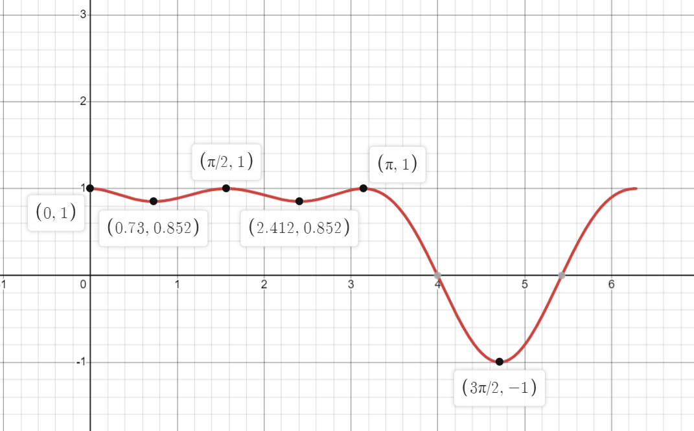

# Calculus, Homework 11

## Problem 1

Construct a closed bounded subset of the metric space that is not compact.

---

Take the infinite set of natural numbers $\mathbb{N}$ and define the following metric:

$$d(x,y)=\begin{cases}
    0, \text{if} \ x = y \\
    1, \text{if} \ x \neq y
\end{cases}$$

In this set, all different elements have the same distance between them, so taking any $n\in \mathbb{N}\colon B(n, r), r\geqslant1$, the ball would include all elements of $\mathbb{N}$, thus making the set bounded and closed (all limit points would be included in the set).

Now, check whether the set is compact by constructing the following cover that would effectively consist of single points:

$$\mathbb{\hat{N}}=\bigcup_{\overset{\scriptstyle n\in A}{0<r<1}}(n-r, n+r)=\bigcup_{n\in A}\{n\}$$

Since $n\to\infty$, we can't physically create a subcover that would include all points in $\mathbb{N}\implies$ the set is not compact.

## Problem 2

Prove that the $\mathbb{R}$ with a euclidean metric is not a compact space.

---

For $\mathbb{R}$ to be compact, we require there to be a finite subcover for any open cover. 

Take the following infinite subcover:

$$\mathbb{R}=\bigcup_{r>0}^{\infty}(-r, r)$$

To prove that $\mathbb{R}$ is not compact, we need to show that no finite subset of that subcover covers entire $\mathbb{R}$.

Take some finite number $n$ of intervals $(-r_i, r_i)$:

$$\mathbb{\hat{R}}=\bigcup_{i=1}^{n}(-r_i, r_i)$$

Since there is a finite number of intervals, there is some $\sup\mathbb{\hat{R}}=r_j$ and $\inf\mathbb{\hat{R}}=-r_j$ for any $n$.

Take some $\varepsilon>0$. We can add/subtract this epsilon to both supremum and infimum, arriving at some values $x_1, x_2=r_i+\varepsilon,-r_i-\varepsilon \in\mathbb{R}$, but which are $\not\in\mathbb{\hat{R}}$, which means it's impossible to choose a finite subset of an open cover for all case $\implies \mathbb{R}$ is not a compact space.

## Problem 3

Let $GL_n(\mathbb{R})$ be $\{M\in\text{Mat}_{n\times n}(\mathbb{R})\colon\det(M)\neq0 \}$. Show that $GL_n(\mathbb{R})$ is open in $\text{Mat}_{n\times n}(\mathbb{R})$ and for any matrix $X \in \text{Mat}_{n\times n}(\mathbb{R})$ find $(dF)_A(X)$, where $F(A)$ is $A^{-1}$. Consider a euclidean metric.

## Problem 4

Prove that if $(n+1)$th derivative of function $f\colon\mathbb{R}\to\mathbb{R}$ is equivalent to $0$, then $f$ is a polynomial of a degree not higher than $n$.

## Problem 5

How to calculate first $10$ digits of $e$?

---

We need to calculate the Taylor series of the function $e^x$ until the next monomial would be less than $10^{-10}$.

Taylor series formula for $e^x$:

$$e^x=1+x+\frac{x^2}{2!}+\frac{x^3}{3!}+\dots$$

To calculate $e$, we simply substitute $x=1$ in the equation above. Let's estimate when the required accuracy would be achieved:

$$\frac{x^n}{n!}=\frac{1}{n!}<10^{-10}\implies n!>10^{10}\implies n<14$$

Therefore, we need to calculate the sum of monomials until degree $n=13$

    from math import factorial

    total = 0
    for n in range(0, 14):
        total += 1 / factorial(n)
    print(round(total, 10))

$$e=\sum_{n=0}^{13}\frac{1}{n!}=2.7182818284$$

    

## Problem 6

Study the following functions for extermities using higher derivatives and schematically plot the graphs.

### Subproblem A

$$f(x)=\sin^3x+\cos^2x$$

---

$$f'(x)=3\sin^2x\cos x-2\cos x\sin x=\sin2x\left(\frac{3}{2}\sin x-1\right)$$

Since the function is periodic, only consider the extremities on a semi-interval $[0, 2\pi)$:

$$\begin{align*}
\left[
\begin{array}{ll}
    \sin2x = 0 \\
    \sin x = \frac{2}{3}
\end{array}
\right .
\end{align*}\implies\begin{align*}
\left[
\begin{array}{ll}
    x = \frac{1}{2}\pi k_1 \\
    x = \arcsin\frac{2}{3} + 2\pi k_2 \\
    x = \pi -\arcsin\frac{2}{3} + 2\pi k_3
\end{array}
\right .
\end{align*}\implies\begin{align*}
\left[
\begin{array}{ll}
    x = 0\\
    x = \arcsin\frac{2}{3} \\
    x = \frac{1}{2}\pi \\
    x = \pi - \arcsin\frac{2}{3} \\
    x = \pi \\ 
    x = \frac{3}{2}\pi \\
\end{array}
\right .
\end{align*}$$

Since the function is an oscillating wave, the maximums/minimums would be alternating starting from the maximum $\sup_1f=f(0)=0+1=1$ and minimum $\inf_1f=f(\frac{1}{2}\pi)=\sin^3x+1-\sin^2x=1+\frac{8}{27}-\frac{4}{9}=\frac{23}{27}$ and so on: $\sup_2f=1, \sup_3f=1, \inf_2f=\frac{23}{27}, \inf_3f=-1$.

I will not torture myself with plotting the graph, so here we go:

### Subproblem B

$$f(x)=x^{\frac{2}{3}}-(x^2-1)^\frac{1}{3}$$

### Subproblem C

$$f(x)=\frac{x^2-5x+6}{x^2+1}$$