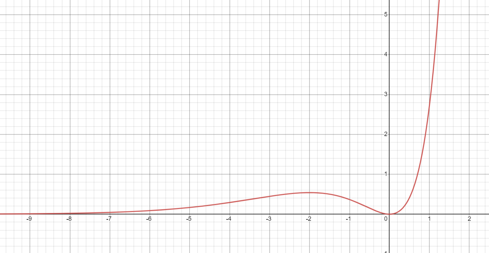
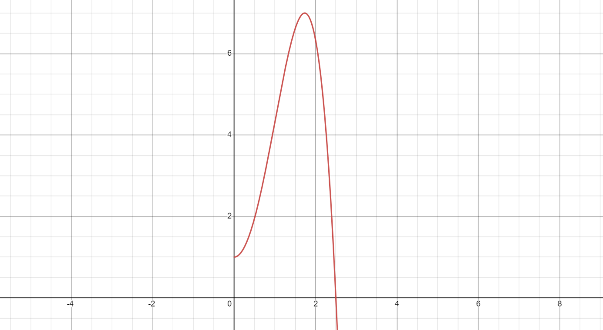

# Calculus, Homework 12

## Problem 1

Is it true that for a continuous mapping

### Subproblem A

image of a closed set is closed?

---

> The portmanteau "clopen" looks so cursed honestly, but it's fun to use so don't mind if I do.

We know that $\mathbb{R}$ is clopen per definition. Let's map $\mathbb{R}\mapsto\mathbb{R}$ using a continuous function like $e^x$. $f(\mathbb{R})=\mathbb{R_{>0}}$ is not closed since $\exists x=0,\forall\varepsilon>0$, the following is true: $0=x\notin\mathbb{R_{>0}}, x-\varepsilon\notin\mathbb{R_{>0}}$ but $x+\varepsilon\in\mathbb{R_{>0}}\implies$ the image of a closed set is not always closed.

**Answer:** no.

### Subproblem B

image of a bounded set is bounded?

---

Take two spaces. 

The first one $E_1$ being $\mathbb{N}$ with a discrete metric (distance is equal to $1$ if the values are the same, and $0$ otherwise). In this space, all numbers are contained within any ball with $r>0\implies$ the set is bounded.

The second one $E_2$ being a classic metric space with a euclidean distance metric on $\mathbb{N}$.

Now consider an obviously continuous mapping $g(x)\mapsto x$ on $E_1\mapsto E_2$. The function would map values from the first space to the entirety of the second space, which means that $\forall x_i\in E_1, \exists x_j$ such that $f(x_i)<f(x_j)\implies\sup(E_2)$ does not exist $\implies$ the set is unbounded $\implies$ the answer is false.

**Answer:** no.

## Problem 2

Let $(E,d)$ be a metric space, $A, B\subseteq E$ are bounded sets. Prove that $A\cup B$ is bounded.

---

If a set is bounded, then it is certainly included in some kinda ball with a radius. Thus, for some points $x_1, x_2$, $A\subseteq \mathcal{U}(a_1, r_1), B\subseteq \mathcal{U}(a_2, r_2)$ with radii $r_1, r_2$ around points $a_1, a_2$. 

Now, take a point $a$ that would be precisely between points $a_1, a_2$. There would be some kinda radius defined by the distance $r=d(a_1, a)=d(a_2, a)$. We could construct a new ball centered on the point $a$ with a radius of $r + \max\{r_1,r_2\}$. This ball would guaranteeably contain both balls that surround sets $A, B\implies$ their union would also be contained in some kinda ball and thus would be bounded, q. e. d.

## Problem 3

Prove the Jensen inequality. Let $f(x)$ be convex, $\alpha_1, \dots,\alpha_n$ be positive numbers, $\alpha_1+\dots+\alpha_n=1$.

---

On the seminar it was proven that if $f(x)$ is convex, for $p,q$ positive numbers, $p+q=1$,

1. if $p, q \in \mathbb{Q}\implies f(px_1+qx_2)\leq pf(x_1)+qf(x_2)$
2. if $f$ is continuous, then $f(px_1+qx_2)\leq pf(x_1)+qf(x_2)$

Therefore, if we somehow extend the statement

$f(px_1+qx_2)\leq pf(x_1)+qf(x_2)$

to the general case for an arbitrary $n, \alpha_1\dots\alpha_n, \alpha_1+\dots+\alpha_n=1$, both subproblems would be automatically solved.

---

The case for two $\alpha_1, \alpha_2$ is already proven, so we can use this as a base for our future endeavours.

$$\alpha_1f(x_1)+\alpha_2f(x_2)\geq f(\alpha_1x_1+\alpha_2x_2)$$

Let's try to extend this inequation, doubling up the number of $\alpha_i$ variables (here we use the equation above, normalizing the variables):

$$\frac{\alpha_1f(x_1)+\alpha_2f(x_2)+\alpha_3f(x_3)+\alpha_4f(x_4)}{\alpha_1+\alpha_2+\alpha_3+\alpha_4}\geq$$

$$\geq\frac{(\alpha_1+\alpha_2)f(\frac{\alpha_1}{\alpha_1+\alpha_2}x_1+\frac{\alpha_2}{\alpha_1+\alpha_2}x_2)+(\alpha_3+\alpha_4)f(\frac{\alpha_3}{\alpha_3+\alpha_4}x_3+\frac{\alpha_3}{\alpha_3+\alpha_4}x_4)}{\alpha_1+\alpha_2+\alpha_3+\alpha_4}\geq$$

use the very same equation once again (and $\alpha_1+\alpha_2+\alpha_3+\alpha_4=1$):

$$\geq f(\alpha_1x_1+\alpha_2x_2+\alpha_3x_3+\alpha_4x_4)$$

Therefore, for $n=2^n$, we have proven that 

$$\alpha_1f(x_1)+\alpha_2f(x_2)+\alpha_3f(x_3)+\alpha_4f(x_4) \geq f(\alpha_1x_1+\alpha_2x_2+\alpha_3x_3+\alpha_4x_4)$$

this means we can climb infinitely large up to powers of $2$. But how do we climb down?

---

Let's try to prove that given some $n$ the very same equation for $n-1$ would also be true.

Assume that $x_n$ is equal to the mean of all other values in relation to weights:

$$x_n=\frac{\alpha_1x_1+\dots+\alpha_{n-1}x_{n-1}}{\alpha_1+\dots+\alpha_{n-1}}$$

We also know that if we take an weighted average of some number of values except for one and then say that the weighted value of the last element is equal to the aforemenioned weighted value, then the entire weighted average is equal to the last element:

$$x_n=\frac{\alpha_1x_1+\dots+\alpha_{n-1}x_{n-1}+\alpha_nx_n}{\alpha_1+\dots+\alpha_n}$$

$$x_n=\alpha_1x_1+\dots+\alpha_{n-1}x_{n-1}+\alpha_nx_n$$

plug it in

$$\alpha_1 f(x_1)+\dots+\alpha_n f(x_n)\geq f(\alpha_1 x_1 + \dots + \alpha_n x_n)$$

to get

$$\alpha_1 f(x_1)+\dots+\alpha_n f(x_n)\geq f(x_n)$$

$$\alpha_1 f(x_1)+\dots\alpha_{n-1}f(x_{n-1})\geq f(x_n)-\alpha_n f(x_n)$$

$$\alpha_1 f(x_1)+\dots\alpha_{n-1}f(x_{n-1})\geq f(x_n)(1-\alpha_n)$$

plug more stuff back in:

$$\alpha_1 f(x_1)+\dots\alpha_{n-1}f(x_{n-1})\geq f\left(\frac{\alpha_1x_1+\dots+\alpha_{n-1}x_{n-1}}{\alpha_1+\dots+\alpha_{n-1}}\right)(1-\alpha_n)$$

considering that $1-\alpha_n=\alpha_1+\alpha_2+\dots+\alpha_{n-1}$,

$$\frac{\alpha_1 f(x_1)+\dots+\alpha_{n-1}f(x_{n-1})}{\alpha_1+\alpha_2+\dots+\alpha_{n-1}}\geq f\left(\frac{\alpha_1x_1+\dots+\alpha_{n-1}x_{n-1}}{\alpha_1+\dots+\alpha_{n-1}}\right)$$

and if the given condition of $\alpha_1+\alpha_2+\dots+\alpha_{n-1}=1$ holds for $n-1$, then we get the wanted equation! amazing

$$\alpha_1 f(x_1)+\dots+\alpha_{n-1}f(x_{n-1})\geq f\left(\alpha_1x_1+\dots+\alpha_{n-1}x_{n-1}\right)$$

## Problem 4

Using knowledge about convex functions from the seminars, prove the inequalities:

### Subproblem A

$$\frac{x_1+\dots+x_n}{n}\geq\sqrt[n]{x_1\dotsm x_n} \quad x_1,\dots,x_n\geq 0$$

---

Per  Jensen's inequality, a function is **concave** $\iff$

$$f(\alpha_1 x_1 + \dots + \alpha_n x_n)\geq \alpha_1 f(x_1)+\dots+\alpha_n f(x_n)$$

Let's take all $\alpha_i=\frac{1}{n}$:

$$f\left(\frac{1}{n} x_1 + \dots + \frac{1}{n} x_n\right)\geq \frac{1}{n} f(x_1)+\dots+\frac{1}{n} f(x_n)$$

We know from godforbidden *microeconomics* that $\log(x)$ is **concave**; therefore, we may substitute $f=\log$:

$$\log\left(\frac{1}{n} x_1 + \dots + \frac{1}{n} x_n\right)\geq \frac{1}{n} \log(x_1)+\dots+\frac{1}{n} \log(x_n)$$

$$\log\left(\frac{x_1+\dots+x_n}{n}\right)\geq  \log(x_1^\frac{1}{n})+\dots+\log(x_n^\frac{1}{n})$$

$$\log\left(\frac{x_1+\dots+x_n}{n}\right)\geq  \log(x_1^\frac{1}{n}\dotsm x_n^\frac{1}{n})$$

$$\frac{x_1+\dots+x_n}{n}\geq  \sqrt[n]{x_1\dotsm x_n}$$

which is the required identity.

### Subproblem B

Let $A, B, p, q > 0$ given that $\frac{1}{p} + \frac{1}{q}=1$, then

$$\sqrt[p]{A}\sqrt[q]{B}\leq\frac{A}{p}+\frac{B}{q}$$

---

Per  Jensen's inequality, a function is **concave** $\iff$

$$f(\alpha_1 x_1 + \dots + \alpha_n x_n)\geq \alpha_1 f(x_1)+\dots+\alpha_n f(x_n)$$

Take $n=2,x_1=A, x_2=B,\alpha_1=\frac{1}{p},\alpha_2=\frac{1}{q}$:

$$f\left(\frac{A}{p}+ \frac{B}{q}\right)\geq \frac{1}{p} f(A)+\frac{1}{q} f(B)$$

Substitute $f=log$, similarly to the previous subproblem:

$$\log\left(\frac{A}{p}+ \frac{B}{q}\right)\geq \frac{1}{p}\log(A)+\frac{1}{q}\log(B)$$

$$\log\left(\frac{A}{p}+ \frac{B}{q}\right)\geq \log(A^\frac{1}{p})+\log(B^\frac{1}{q})$$

$$\log\left(\frac{A}{p}+ \frac{B}{q}\right)\geq \log(\sqrt[q]{A}\sqrt[q]{B})$$

$$\frac{A}{p}+ \frac{B}{q}\geq \sqrt[q]{A}\sqrt[q]{B}$$

which is the required idenitity, q. e. d:

$$\sqrt[q]{A}\sqrt[q]{B}\leq\frac{A}{p}+ \frac{B}{q}$$

## Problem 5

Prove that a continuous function $f(x)$ is convex if and only if $\forall a, b, c\colon a < b < c$ the inequation

$$\det\begin{pmatrix}
    a & f(a) & 1\\
    b & f(b) & 1\\
    c & f(c) & 1
\end{pmatrix}\geqslant 0$$

---

Do some permutations of the determinant:

$$\det\begin{pmatrix}
    a & f(a) & 1\\
    b & f(b) & 1\\
    c & f(c) & 1
\end{pmatrix}=af(b)+cf(a)+bf(c)-cf(b)-bf(a)-af(c)=$$

$$=(c-b)f(a)+(a-c)f(b)+(b-a)f(c)\geqslant0$$

$$(b-c)f(a)+(c-a)f(b)+(a-b)f(c)\leqslant0$$

Drag $f(b)$ out of this forsaken identity:

$$f(b)\leqslant\frac{(c-b)f(a)+(b-a)f(c)}{c-a}$$

Since $b$ is in-between $a$ and $c$, we could form it using a weighted linear combination of $a$ and $c$, for some $\lambda\in(0,1)$:

$$b=\lambda a+(1-\lambda)c$$

Now plug in this equation into the equation above:

$$f(b)\leqslant\frac{(c-\lambda a - (1-\lambda)c)f(a)+(\lambda a+(1-\lambda)c-a)f(c)}{c-a}$$

$$f(b)\leqslant\frac{(\lambda c-\lambda a)f(a)+(\lambda a+c-\lambda c-a)f(c)}{c-a}$$

$$f(b)\leqslant\frac{\lambda(c-a)f(a)+(1-\lambda)(c-a)f(c)}{c-a}$$

$$f(b)\leqslant\lambda f(a)+(1-\lambda)f(c)$$

Plug the definition of $b$ back into the equation above:

$$f(\lambda a+(1-\lambda)c)\leqslant\lambda f(a)+(1-\lambda)f(c)$$

$$f(pa+qc)\leqslant pf(a)+qf(c)$$

which is precisely the definition of a convex function. All the transformations were equivalent; therefore, the "if and only if" statement is also proven, q. e. d.

## Problem 6

Find intervals on which the function is convex and concave and inflection points and plot the graph of

### Subproblem A

$$f(x)=x^2e^x$$

---

$$f'(x)=2xe^x+e^xx^2=(2x+x^2)e^x$$

Since $e^x>0$, then the first derivative is only equal to $0$ if

$$x(x+2)=0\implies x_1=0, x_2=-2$$

$$f''(x)=(2+2x)e^x+(2x+x^2)e^x=(2+4x+x^2)e^x$$

Since $e^x>0$, then the second derivative is only equal to $0$ if

$$x^2+4x+2=0$$

$$x=-2\plusmn\sqrt{2}$$

which are the inflection points.

Thus, the function would be:

* ascending on $[0,+\infty)$
* descending on $[-2, 0]$
* ascending on $(-\infty, -2]$
* convex on $[-2+\sqrt{2}, +\infty)$
* concave on $[-2-\sqrt{2},-2+\sqrt{2}]$
* convex on $(-\infty, -2-\sqrt{2}]$

Corresponding plot

## Subproblem B

$$f(x)=1+4x^2-\frac{2x^4}{3}$$

---

The function is even $\implies$ I will only consider it on $\mathbb{R^+}$.

$$f'(x)=8x-\frac{8x^3}{3}$$

Find the zeros in $\mathbb{R^+}$:

$$x\left(1+\frac{x}{\sqrt{3}}\right)\left(1-\frac{x}{\sqrt{3}}\right)=0\implies x_1=0, x_2=\sqrt{3}$$

$$f''(x)=8-8x^2$$

Find the zeros in $\mathbb{R^+}$:

$$1-x^2=0\implies(x-1)(x+1)=0\implies x=1$$

Since coefficients next to $x^2$ and $x^3$ are negative, we start from a concave and a descending intervals respectively.

The function would be (likewise for $\mathbb{R^-}$ but mirrored):

* descending on $[\sqrt{3},+\infty)$
* ascending on $[0, \sqrt{3}]$
* concave on $[1, +\infty)$
* convex on $[0, 1]$

Corresponding plot:

