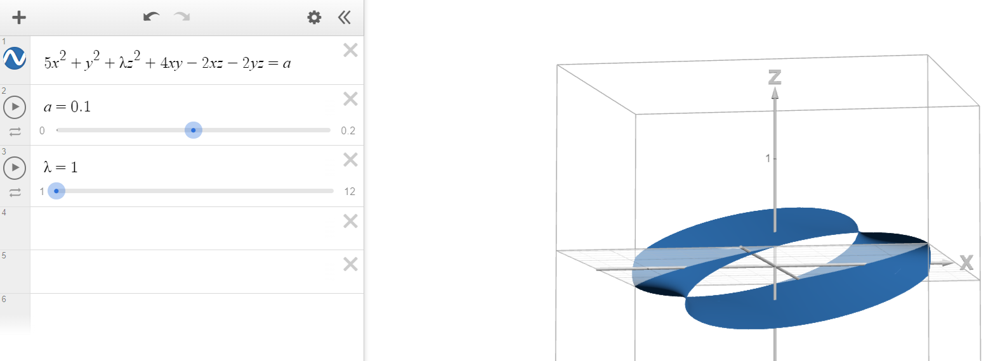

# Calculus, Homework 13

## Problem 1

Is it possible to study the point $(0,0)$ for extremities for function $\displaystyle f(x,y)=\frac{xy(x^2-y^2)}{x^2+y^2}$ using the studied methods?

---

In order to use our method for point $(0,0)$, we would need to calculate the Hessian matrix $\mathbb{H}_{(0,0)}$ for this point. 

Hessian matrix consists of second-order derivatives and since our function $\displaystyle f(x,y)=\frac{xy(x^2-y^2)}{x^2+y^2}$ contains $(x^2+y^2)$ in the denominator, all its derivatives would have a denominator that is a power of $(x^2+y^2)$.

Since the function is undefined if the denominator is equal to $0$, we can't use our method since plugging in $(x,y)=(0,0)$ yields a division by zero: $(0^2+0^2)=0\implies$ the Hesse matrix would be undefined, rendering us unable to use this method of extremum-searching.

## Problem 2

Study functions for local extremums:

### Subproblem A

$$f(x,y)=x^3+3xy^2-15x-12y$$

---

Find stationary points:

$$\begin{cases}
    \frac{\partial f}{\partial x}=3x^2+3y^2-15=0\\
    \frac{\partial f}{\partial y}=6xy-12=0
\end{cases}\implies\begin{cases}
    (x+y)^2=9\\
    xy=2
\end{cases}\implies\begin{cases}
    \begin{align*}
    \left[
    \begin{array}{ll}
        x+y = 3 \\
        x+y = -3 \\
    \end{array}
    \right .
    \end{align*}\\
    xy=2
\end{cases}$$

We get two points, $a=(1,2), b=(-1,-2)$.

Find second-order derivatives:

$$\frac{\partial^2 f}{\partial x^2}=6x, \quad \frac{\partial^2 f}{\partial x\partial y}=6y,\quad\frac{\partial^2 f}{\partial y^2}=6x$$

Hessian matrices:

$$\mathbb{H}_a=\begin{pmatrix}
    6 & 12\\
    12 & 6
\end{pmatrix}\sim\begin{pmatrix}
    6 & 0\\
    0 & -18
\end{pmatrix},\quad\mathbb{H}_b=\begin{pmatrix}
    -6 & -12\\
    -12 & -6
\end{pmatrix}\sim\begin{pmatrix}
    -6 & 0\\
    0 & 18
\end{pmatrix}$$

The elements on the diagonals of both matrices have different signs, so there are no extremums, as it could also be seen below.

### Subproblem B

$$f(x,y)=x^2+xy+y^2-2x-y$$

---

Find stationary points:

$$\begin{cases}
    \frac{\partial f}{\partial x}=2x+y-2=0\\
    \frac{\partial f}{\partial y}=2y+x-1=0
\end{cases}\implies\begin{cases}
    x+y=1\\
    x+2y=1
\end{cases}\implies\begin{cases}
    x=1\\
    y=0
\end{cases}$$

We get one point, $a=(1,0)$.

Find second-order derivatives:

$$\frac{\partial^2 f}{\partial x^2}=2, \quad \frac{\partial^2 f}{\partial x\partial y}=1,\quad\frac{\partial^2 f}{\partial y^2}=2$$

Hessian matrix:

$$\mathbb{H}_a=\begin{pmatrix}
    2 & 1\\
    1 & 2
\end{pmatrix}\sim\begin{pmatrix}
    2 & 0\\
    0 & \frac{3}{2}
\end{pmatrix}$$

The elements on the diagonals of the matrix are positive, so there is a single minimum at $a=(1,0)$, as it could be seen below:

### Subproblem C

$$f(x,y)=3xy-x^2-y^2-10x+5y$$

---

Find stationary points:

$$\begin{cases}
    \frac{\partial f}{\partial x}=3y-2x-10=0\\
    \frac{\partial f}{\partial y}=3x-2y+5=0
\end{cases}\implies\begin{cases}
    x+y=5\\
    3y-2x=10
\end{cases}\implies\begin{cases}
    x=1\\
    y=4
\end{cases}$$

We get one point, $a=(1,4)$.

Find second-order derivatives:

$$\frac{\partial^2 f}{\partial x^2}=-2, \quad \frac{\partial^2 f}{\partial x\partial y}=3,\quad\frac{\partial^2 f}{\partial y^2}=-2$$

Hessian matrix:

$$\mathbb{H}_a=\begin{pmatrix}
    -2 & 3\\
    3 & -2
\end{pmatrix}\sim\begin{pmatrix}
    -2 & 0\\
    0 & \frac{5}{2}
\end{pmatrix}$$

The elements on the diagonals of the matrix are different signs, so there are no extremums, as it could be seen below:

## Problem 3

Depending on $\lambda\in\mathbb{R}$, study the point $(0,0,0)$ for extremums for function

$$f(x,y,z)=5x^2+y^2+\lambda z^2+4xy-2xz-2yz$$

---

Find all first-order derivatives: 

$$\frac{\partial f}{\partial x}=10x+4y-2z,\quad \frac{\partial f}{\partial y}=2y+4x-2z,\quad\frac{\partial f}{\partial z}=2\lambda z-2x-2y
$$

Find all second-order derivatives to build a Hessian matrix:

$$\frac{\partial^2 f}{\partial x^2}=10,\quad
\frac{\partial^2 f}{\partial x\partial y}=4,\quad
\frac{\partial^2 f}{\partial x\partial z}=-2$$

$$\frac{\partial^2 f}{\partial y\partial x}=4,\quad
\frac{\partial^2 f}{\partial y^2}=2,\quad
\frac{\partial^2 f}{\partial y\partial z}=-2$$

$$\frac{\partial^2 f}{\partial z\partial x}=-2,\quad
\frac{\partial^2 f}{\partial z\partial y}=-2,\quad
\frac{\partial^2 f}{\partial z^2}=2\lambda$$

$$\mathbb{H}_{(0,0,0)}=\begin{pmatrix}
    10 & 4 & -2\\
    4 & 2 & -2\\
    -2 & -2 & 2\lambda
\end{pmatrix}\sim\begin{pmatrix}
    10 & 0 & -2\\
    0 & 0.4 & -1.2\\
    -2 & -1.2 & 2\lambda
\end{pmatrix}$$

$$\sim\begin{pmatrix}
    10 & 0 & 0\\
    0 & 0.4 & -1.2\\
    0 & -1.2 & 2\lambda-0.4
\end{pmatrix}\sim\begin{pmatrix}
    10 & 0 & 0\\
    0 & \frac{2}{5} & 0\\
    0 & 0 & 2\lambda-4
\end{pmatrix}$$

For an extremum (minimum, specifically) to exist, we need $\text{sgn}\,10=\text{sgn}\,0.4=\text{sgn}\,(2\lambda-4)\implies2\lambda>4\implies\lambda>2$

If you think this is unvisualizeable, it isn't:

If we ever so slightly deviate from the point $(0,0,0)$, which is achieved when $a=0$ (which is the fourth dimension), at $\lambda=2$, we get a tube, implying point $(0,0,0)$ isn't an extremum.

If we lower $\lambda$, this tube becomes more and more flared out at towards its openings:

If we raise $\lambda$ above $2$, this tube becomes a closed ellipsoid, implying that as $a\to0$, our shape approaches a single point, which is the extremum in of this three-dimensional function.

