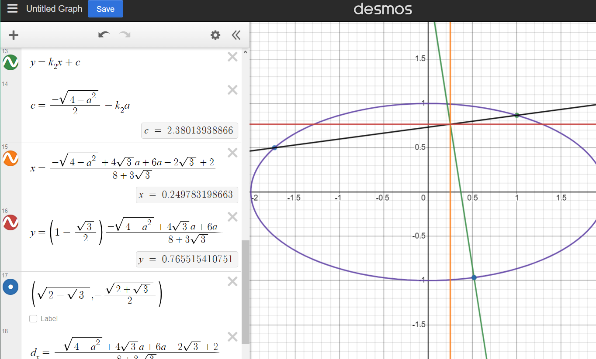

# Calculus, Homework 14

## Problem 1

Find extremums of function $z=x+2y$ given that $x^2+y^2=5$.

---

If $x^2+y^2=5$, then $x=\plusmn\sqrt{5-y^2}$.

$$z^+=\sqrt{5-y^2}+2y,\quad z^-=-\sqrt{5-y^2}+2y$$

$$z'^+_y=-\frac{y}{\sqrt{5-y^2}}+2=0,\quad z'^-_y=\frac{y}{\sqrt{5-y^2}}+2=0$$

$$2\sqrt{5-y^2}=y,\quad 2\sqrt{5-y^2}=-y$$

$$4(5-y^2)=y^2$$

$$20-4y^2=y^2$$

$$y^2=4\implies y_1=2, y_2=-2$$

Find corresponding pairs: $(x_1,y_1)=(2,1), (x_1,y_2)=(-2,-1)$.

Obviously, $z(x_1,y_1)=2+2\times1=5$ and $z(x_2,y_2)=-2+2\times(-1)=-5$ and the maximum and the minimum respectively.

**Answer:** $\min z$ is at $(-2, -1)$ and $\max z$ is at $(2, 1)$.

## Problem 2

Find the minimum and maximum values of function $z=x^2-2y^2+4xy-6x+5$ in area bounded by lines $x=0,y=0,x+y=3$.

---

Find stationary points:

$$\begin{cases}
    \displaystyle\frac{\partial z}{\partial x}=2x+4y-6=0\\\\
    \displaystyle\frac{\partial z}{\partial y}=-4y+4x=0
\end{cases}\implies\begin{cases}
    x=3-2y\\
    x=y\\
\end{cases}\implies\begin{cases}
    x=1\\
    y=1\\
\end{cases}$$

Hesse matrix:

$$\mathbb{H}_{(1,1)}=\begin{pmatrix}
    \frac{\partial z}{\partial^2 x} & \frac{\partial z}{\partial x\partial y}\\
    \frac{\partial z}{\partial x\partial y} & \frac{\partial z}{\partial^2 y}
\end{pmatrix}=\begin{pmatrix}
    2 & 4\\
    4 & -4
\end{pmatrix}\sim\begin{pmatrix}
    2 & 0\\
    0 & -12
\end{pmatrix}$$

Thus, this is not an extremum.

Consider extremum on each of the lines. 

First, along $x=0$, find the extremum along $z=-2y^2+5$. For $y>0$, this function is descending, which means that the maximum here is $z(0, 0)_1=5$, and the minimum is $z(0, 3)_2=-13$

Second, along $y=0$, find the extremum along $z=x^2-6x+5$. This is a parabola facing up with its vertex being at $x=3$, thus the function is descending within our limitations until $x=3$. Thus, the maximum here is also $z(0,0)_1=5$ and the minimum is $z(3,0)_3=-4$.

Third, for $x=3-y$ find the extremum along $z=(3-y)^2-2y^2+4(3-y)y-6(3-y)+5=9-6y+y^2-2y^2+12y-4y^2-18+6y+5=-5y^2+12y-4$. The maximum is at $z'_y=0\colon$ $-10y+12=0\implies y=\frac{6}{5}$. The corresponding maximum is $z(\frac{9}{5},\frac{6}{5})_4=\frac{16}{5}$.

Therefore, the minimum is $-13$ and it is at $(0,3)$ and the maximum is $5$ and it is at $(0,0)$.

**Answer:** $\min z$ is $-13$ at $(0, 3)$ and $\max z$ is $5$ at $(0, 0)$.

## Problem 3

Find the maximum and minimum values of function $z=x^2y(4-x-y)$ in area bounded by lines $x=0,y=0,x+y=6$.

---

Seek stationary points:

$$\begin{cases}
    \displaystyle\frac{\partial z}{\partial x}=2xy(4-x-y)-x^2y \\\\
    \displaystyle\frac{\partial z}{\partial y}=x^2(4-x-y)-x^2y
\end{cases}\implies\begin{cases}
    2xy(4-x-y)-x^2y=0 \\
    x^2(4-x-y)-x^2y=0
\end{cases}\implies$$

Since $x,y>0$:

$$\begin{cases}
    2(4-x-y)-x=0 \\
    (4-x-y)-y=0
\end{cases}\implies\begin{cases}
    8-3x-2y=0 \\
    4-x-2y=0
\end{cases}\implies$$

$$\begin{cases}
    4y=4 \\
    x=4-2y
\end{cases}\implies\begin{cases}
    x=2\\
    y=1
\end{cases}$$

Hesse matrix to find whether this is the maximum or the minimum:

$$\mathbb{H}_{(2,1)}=\begin{pmatrix}
    \frac{\partial z}{\partial^2x} & \frac{\partial z}{\partial x\partial y}\\
    \frac{\partial z}{\partial x\partial y} & \frac{\partial z}{\partial^2 y}
\end{pmatrix}=\begin{pmatrix}
    8y-6xy-2y^2 & 8x-3x^2-4xy\\
    8x-3x^2-4xy & -2x^2
\end{pmatrix}=$$

$$=\begin{pmatrix}
    8-12-2 & 16 - 12-4\\
    16-12-8 & -8
\end{pmatrix}=\begin{pmatrix}
    -6 & 0\\
    0 & -8
\end{pmatrix}$$

Thus, this is the maximum equal to $2^2(4-2-1)=4$. Check other key points along the lines in the given conditions to find the minumum. Values $z$ for $x=0,y=0$ are all equal to $0$, so check the values along $y=6-x$:

$$z=x^2(6-x)(4-x-6+x)=-2x^2(6-x)$$

$$z'_x=0\implies -4x+x^2=0$$

Divide by $x$ since we already have $x=0$ accounted for and $x>0$:

$$x=4\implies y=2$$

since it's a parabola with its branches down, then it's the minimum and the value at this point is $z=4^2\times2(4-4-2)=-64$, which is our sought-for minimum at point $(4,2)$

**Answer:** $\max z$ is $4$ at $(2, 1)$ and $\min z$ is $-64$ at $(4, 2)$.

## Problem 4

Find the dimensions of a right parallelepiped of given volume $V$ such that its surface area is minimal.

---

We have

$$S(a,b,c)=2(ab+bc+ac)$$

and

$$V=abc\implies c=\frac{V}{ab}$$

$$S(a,b,c)=2\left(ab+b\frac{V}{ab}+a\frac{V}{ab}\right)=2\left(ab+\frac{V}{a}+\frac{V}{b}\right)$$

Simply find the minimum of this function (we know that this function has a minimum since all $a,b,c$ are positive):

$$\begin{cases}
    \displaystyle\frac{\partial S}{\partial a}=2b-\frac{2V}{a^2}=0\\\\
    \displaystyle\frac{\partial S}{\partial b}=2a-\frac{2V}{b^2}=0
\end{cases}\implies\begin{cases}
    a^2b=V\\
    ab^2=V
\end{cases}\implies$$

$$\begin{cases}
    \displaystyle b=\frac{V}{a^2}\\\\
    \displaystyle a\frac{V^2}{a^4}=V
\end{cases}\implies\begin{cases}
    \displaystyle b=\frac{V}{2a^2}\\
    \displaystyle \frac{V}{a^3}=1
\end{cases}\implies\begin{cases}
    a=\sqrt[3]{V}\\
    b=\sqrt[3]{V}
\end{cases}$$

Thus, $\displaystyle c=\frac{V}{\sqrt[3]{V^2}}=\sqrt[3]{V}$ and $a=b=c=\sqrt[3]{V}$.

## Problem 5

Find the local extremums of function $u=x+y+z$ given that $xyz=8,\frac{xy}{z}=8$. 

---

$$xyz=8,\frac{xy}{z}=8\implies xy=8, z=1\ \text{or} \ xy=-8, z=-1$$

Therefore, we need to find local extremums of functions $u^+=x+y+1$ and $u^-=x+y-1$ given that $xy=8\implies y=\displaystyle\frac{8}{x}$ and $xy=-8\implies y=-\displaystyle\frac{8}{x}$:

$$u^+=x+\frac{8}{x}+1,\quad u^-=x-\frac{8}{x}-1$$

Find stationary points of these two:

$$\frac{\partial u^+}{\partial x}=1-\frac{8}{x^2},\quad\frac{\partial u^-}{\partial x}=1+\frac{8}{x^2}$$

$$1-\frac{8}{x^2}=0,\quad\varnothing$$

$$x^2=8\implies x_1=\sqrt{8}, \quad x_2=-\sqrt{8}$$

only when $z=1$.

Therefore, the extremums of the function are $(\sqrt{8},\sqrt{8},1)$ and $(-\sqrt{8}, -\sqrt{8}, 1)$, and since $\displaystyle\frac{\partial u^+}{\partial^2 x}=\frac{8}{x^3}$, then Hasse matrices are:

$$\mathbb{H}_{(\sqrt{8},\sqrt{8},1)}=\begin{pmatrix}
    \frac{1}{\sqrt{8}} & 0 & 0\\
    0 & 0 & 0\\
    0 & 0 & 0
\end{pmatrix},\quad\mathbb{H}_{(-\sqrt{8}, -\sqrt{8}, 1)}=\begin{pmatrix}
    -\frac{1}{\sqrt{8}} & 0 & 0\\
    0 & 0 & 0\\
    0 & 0 & 0
\end{pmatrix}
$$

thus, the first point is a local minimum and the second point is the local maximum.

## Problem 6

On an ellipse $x^2+4y^2=4$ there are two points, $A(-\sqrt{3}, \frac{1}{2})$ and $B(1,\frac{\sqrt{3}}{2})$. Find a third point on this ellipse such that the triangle $ABC$ will have the largest area.

---

We need maximize the function $S(a,h)$, where $a$ is the base of the triangle and $h$ is its height formed by a perpendicular line to it passing through point $C$.

Write the linear equation of the that passes through points $A,B$, $y=kx+b$:

$$\begin{cases}
    \frac{1}{2}=-\sqrt{3}k+b\\
    \frac{\sqrt{3}}{2}=k+b
\end{cases}\implies\begin{cases}
    k=1-\frac{\sqrt{3}}{2}\\
    b=\sqrt{3}-1
\end{cases}$$

$$y=\left(1-\frac{\sqrt{3}}{2}\right)x+\sqrt{3}-1$$

The linear equation of the line perpendicular to it depending on point $a$ over $x$ taking into account that the optimal point is certainly in the half of the ellipse that is below $oX$ (see figure below):

$$\begin{cases}
    k_2=1-\frac{1}{k}=-3-2\sqrt{3}\\
    b_2=\frac{-\sqrt{4-a^{2}}}{2}-k_{2}a, \quad a\in[-2,2]
\end{cases}\implies\begin{cases}
    k_2=-3-2\sqrt{3}\\
    b_2=\frac{-\sqrt{4-a^{2}}}{2}+3a+2\sqrt{3}a
\end{cases}$$

$$y=(-3-2\sqrt{3})x+\frac{-\sqrt{4-a^{2}}}{2}+3a+2\sqrt{3}a$$

Find coordinates of the intersection of those lines to find the distance between that intersection and point $\displaystyle\left(a,\frac{-\sqrt{4-a^{2}}}{2}\right)$. Then, we would just have to maximize over this distance since it would be the height of the triangle and its maximum height would give us maximum distance since its base has a constant length.

$$(-3-2\sqrt{3})x+\frac{-\sqrt{4-a^{2}}}{2}+3a+2\sqrt{3}a=\left(1-\frac{\sqrt{3}}{2}\right)x+\sqrt{3}-1$$

Coordinates 

$$x = \frac{-\sqrt{4 - a^2} + 4 \sqrt{3} a + 6 a - 2 \sqrt{3} + 2}{8 + 3\sqrt{3}}$$

$$y=\left(1-\frac{\sqrt{3}}{2}\right)\frac{-\sqrt{4 - a^2} + 4 \sqrt{3} a + 6 a - 2 \sqrt{3} + 2}{8 + 3\sqrt{3}}+\sqrt{3}-1$$

Now, calculating the distance between that intersection point and point $C$, we get:

$$d_x=\frac{-\sqrt{4 - a^2} + 4 \sqrt{3} a + 6 a - 2 \sqrt{3} + 2}{8 + 3\sqrt{3}}-a$$

$$d_y=\left(1-\frac{\sqrt{3}}{2}\right)\frac{-\sqrt{4 - a^2} + 4 \sqrt{3} a + 6 a - 2 \sqrt{3} + 2}{8 + 3\sqrt{3}}+\sqrt{3}-1-\frac{-\sqrt{4-a^{2}}}{2}$$

$$h=\sqrt{d_x^2+d_y^2}$$

Maximizing this value (through wolfram because there's no way in hell I'm doing this by hand correctly first time), we magically get $a=\sqrt{2-\sqrt{3}}$, which means that the optimal point is

$$(x,y)=\left(\sqrt{2-\sqrt{3}},-\frac{\sqrt{2+\sqrt{3}}}{2}\right)$$

Some visual proofs that everything is calculated correctly:

