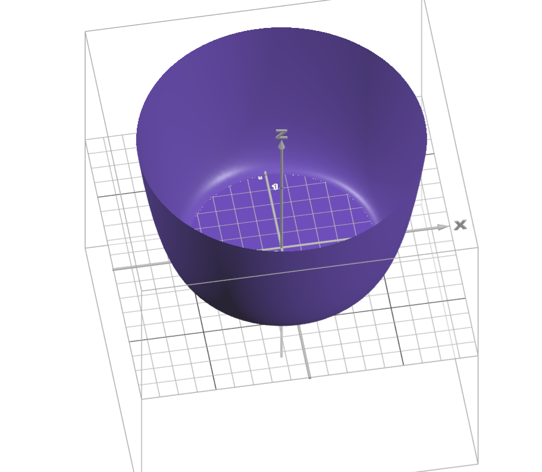
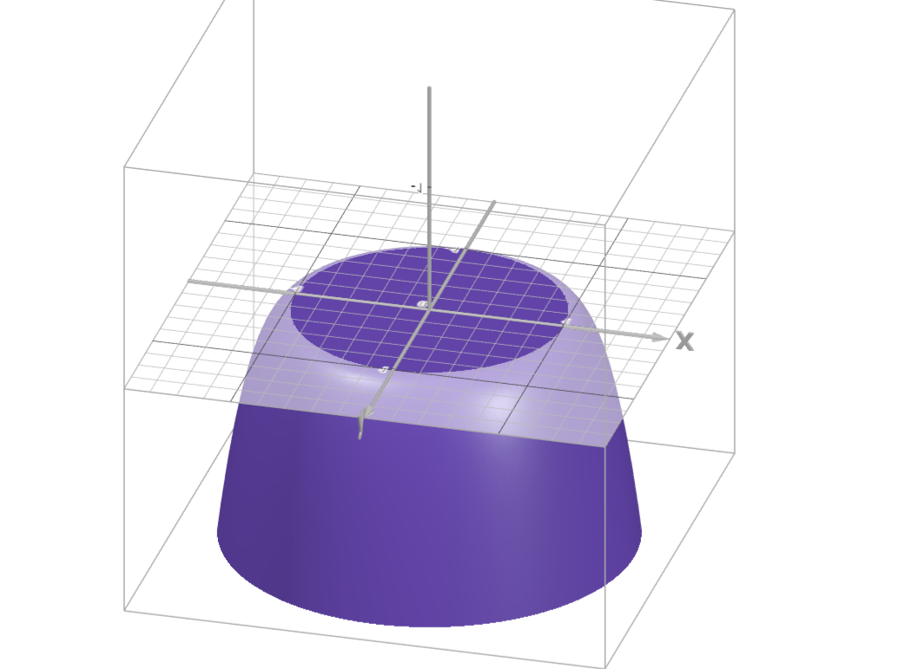

# Calculus, Homework 15

## Problem 1

Construct such a differentiable function $f\colon\mathbb{R}^2\mapsto\mathbb{R}$ that the solution of the equation $f(x,y)=0$ would be an oval.

---

The example in the seminar notes appears to not be a smooth function, so I attempted to correct it by taking a different function. For simplicity's sake I will take a circle since any circle is also an oval. 

Define a circle using the following equation:

$$f(x,y)=0,\quad x^2+y^2\leq1$$

I would want to place all the extrema of the function on this circle for it to be smooth. For example, take this function (I come up with it messing around in desmos so I can't really justify what exactly my thought process was. After all, we were specifically encouraged to mess around in desmos and stuff):

$$f(x,y)=\begin{cases}
    0, \quad x^2+y^2\leq1\\
    (x^2+y^2)(x^2+y^2-2) + 1, \quad x^2+y^2>1
\end{cases}$$

Showcase:

## Problem 2

Let $(k_n)$ be a strictly ascending sequence of positive integers. Prove that if series $(x_n)$ converges to $s$ and if 

$$y_n:=\sum^{k_{n+1}-1}_{p=k_n}x_p$$

then the series $(y_n)$ also converges to $s$.

---

Assume that $(k_n)$ looks like this (some integers may be skipped):

$$1,\cancel{2},3,\cancel{4},\cancel{5},6,7,\dots$$

Convergent $(x_n)$ looks like this:

$$x_1+x_2+x_3+\dots=s$$

We need to prove that, for instance, this series $(y_n)$ (for examplified $(k_i)$) converges to $s$:

$$\begin{align*}
    &y_1=x_1+x_2\\
    &y_2=x_3+x_4+x_5\\
    &y_3=x_6\\
    &y_4=x_7\\
    &\quad\ \ \vdots
\end{align*}$$

As we may see, convergent $(y_n)$ basically defines the very same sum. Example below:

$$y_1+y_2+y_3+y_4+\dots=(x_1+x_2)+(x_3+x_4+x_5)+(x_6)+(x_7)+\dots=s$$

This is equal to $s$ per definition since $(x_n)$ converges to $s$. More formalized, general example:

$$\sum^\infty_{n=1}y_n=\sum^\infty_{n=1}\sum^{k_{n+1}-1}_{p=k_n}x_p=(x_1+x_2+x_{k_1 - 1})+(x_{k_1}+x_{k_1+1}+\dots+x_{k_2-1})+\dots$$

This form and the form from the given conditions are the same thing simply by definition, so they definitely converge to the same value, q. e. d.

## Problem 3

Prove that a positive series $(x_n)$ with monotonously descending elements converges if and only if series $(2^nx_{2^n})$ converges.

---

Since the series $(x_n)$ is descending, then the sum of first $n$ elements starting from $m$th element can be estimated as 

$$x_{m+1}+x_{m+2}+\dots+x_{m+n}\leq nx_m$$

Thus, we may write our sequence out as

$$x_1+x_2+x_3+x_4+x_5+x_6+x_7+\dots\\\leq x_1+x^2+x^2+x^4+x^4+x^4+x^4+\dots=\\1x^1+2x^2+4x^4+8x^8+\dots=(2^nx_{2^n})$$

Then, if $(2^nx_{2^n})$ converges, then $(x_n)$ also converges per the direct comparison test. 

The transformations can be done both ways (can easily be reversed), so the iff statement is proven.

## Problem 4

Using the Cauchy's criterion, determine whether the following series diverge or converge.

--- 

Cauchy's criterion for $(x_n)$: $\forall \varepsilon>0,\exists N$ such that $\forall n\geq N, \forall p\geq 1$ the following is true:

$$|x_{n+1}+\dots+x_{n+p}|<\varepsilon$$

### Subproblem A

$$\left(\frac{\sin(n^2)}{2^n}\right)$$

---

$$\left|\frac{\sin((n+1)^2)}{2^{(n+1)}}+\dots+\frac{\sin((n+p)^2)}{2^{(n+p)}}\right|<\left|\frac{1}{2^{(n+1)}}+\dots+\frac{1}{2^{(n+p)}}\right|=$$

$$=\frac{1}{2^{(n+1)}}\left|1+\frac{1}{2}+\frac{1}{4}+\dots+\frac{1}{2^{(p-1)}}\right|<2\times\frac{1}{2^{(n+1)}}=\frac{1}{2^n}<\varepsilon$$

Then, given some $\varepsilon$, we can always find the corresponding $n$ when the condition holds true like the following:

$$\frac{1}{2^n}<\varepsilon\implies\log_2 2^{-n}<\log_2\varepsilon\implies-n<\log_2\varepsilon\implies n>\log_2\varepsilon$$

Thus, this series converges.

### Subproblem B

$$\left(\frac{\cos(\sqrt{n})}{\sqrt{n}}\right)$$

---

> I seriously do not understand how in the world we were supposed to solve this task, so this is compiled through mutual efforts and a huge massive chunk of googling and mathstackoverflow specifically:
> Considering that this task is absolutely unfair since no covered convergence/divergence tests work, I think it's a justified measure.

Let $M\in\mathbb{N}$. Let's take some interval and check how many $n\in\mathbb{N}$ are in $2\pi M - \frac{\pi}{4} \le \sqrt{n} \le 2\pi M + \frac{\pi}{4}$.

Upper and lower bounds of this interval for satisfactory $n \in [N_1,N_2]$ are 

$$ N_1 = \left\lceil 4\pi^2 M^2 - \pi^2M - \frac{\pi^2}{16}\right\rceil $$

$$ N_2 = \left\lfloor 4\pi^2 M^2 + \pi^2M - \frac{\pi^2}{16} \right\rfloor $$

Thus 
$$ N_1 \le 4\pi^2 M^2 - \pi^2M - \frac{\pi^2}{16} + 1 $$

$$ N_2 \ge 4\pi^2 M^2 + \pi^2M - \frac{\pi^2}{16} - 1 $$

and 

$$ N_2-N_1 \ge 2\pi^2M -2 $$

Now take the root $\sqrt{n}$, for which we have

$$ 2\pi M - \frac{\pi}{4} \le \sqrt{n} \le 2\pi M + \frac{\pi}{4}$$

this magically collapses to a cosine

$$ \cos \sqrt{n} \ge \frac{1}{\sqrt{2}}$$

$$ \frac{\cos \sqrt{n}}{\sqrt{n}} \ge \frac{1}{\sqrt{2}(2\pi M + \frac{\pi}{4})}$$

Finally, for a part of the series on $[N_1,N_2]$:

$$\left(\frac{\cos \sqrt{n}}{\sqrt{n}}\right) \ge \frac{N_2-N_1+1}{\sqrt{2}(2\pi M + \frac{\pi}{4})} \ge \frac{2\pi^2M -1}{\sqrt{2}(2\pi M + \frac{\pi}{4})} $$

Check whether this value is a constant as $M\to\infty$:

$$\lim_{M\to\infty}\frac{2\pi^2M -1}{\sqrt{2}(2\pi M + \frac{\pi}{4})} = \frac{\pi}{\sqrt{2}}$$

> This is a constant, so the sequence is not Cauchy, but holy jesus of fucking christ, what the hell is this level of "notice that".

### Subproblem C

$$\left(\frac{1}{n\log_2(n)}\right)$$

---

Since we know that 

$$\frac{x-1}{x}\leq\log_2(x)\leq x-1$$

we may say $x-1=\frac{1}{n}$ and 

$$\frac{1}{n}+1:=x\implies x:=\frac{n+1}{n}$$

thus per identity above we get 

$$\log_2\left(\frac{n+1}{n}\right)\leq\frac{1}{n}$$

We may estimate the original series as:

$$\left(\frac{1}{n\log_2(n)}\right)\geq\left(\frac{\log_2{\frac{n+1}{n}}}{\log_2(n)}\right)\geq\left(\frac{\log_2{(n+1)}-\log_2{(n)}}{\log_2(n)}\right)\geq$$

$$\geq\left(\frac{\log_2{(n+1)}}{\log_2(n)}-1\right)\geq\left(\frac{\log_2{(n+1)}}{\log_2(n)}\right)\geq(\log_2(n+1)-\log_2(n))$$

which is, amazingly enough, a telescopic sum.

and thus per Cauchy's criterion:

$$\begin{align*}|&(\log_2(n+2)-\log_2(n+1))+(\log_2(n+3)-\log_2(n+2))+\dots+\\+\ &(\log_2(n+p)-\log_2(n + p - 1))+(\log_2(n+p+1)-\log_2(n+p))|\leq\\&\leq\left|\frac{1}{(n+1)\log_2(n + 1)}+\dots+\frac{1}{(n + p)\log_2(n + p)}\right|\end{align*}$$

$$|\log_2(n+p+1)-\log_2(n+1)|\leq\left|\frac{1}{(n+1)\log_2(n + 1)}+\dots+\frac{1}{(n + p)\log_2(n + p)}\right|$$

$$\log_2\left(\frac{n+p+1}{n+1}\right)\leq\left|\frac{1}{(n+1)\log_2(n + 1)}+\dots+\frac{1}{(n + p)\log_2(n + p)}\right|$$

$$\log_2\left(1+\frac{p}{n+1}\right)\leq\left|\frac{1}{(n+1)\log_2(n + 1)}+\dots+\frac{1}{(n + p)\log_2(n + p)}\right|$$

which means that the sum is always larger than a certain fixed value for some $n, p$. If we were to take some $\epsilon$ that would be less than this fixed value, we would arrive at a contradiction, thus the sum diverges.

## Problem 5

Determine whether series diverge or converge:

### Subproblem A

$$\left(\frac{\sin^2(n)}{\sqrt[3]{n^2+n}}\right)$$

---

$$\left(\frac{\sin^2(n)}{\sqrt[3]{n^2+n}}\right)\geq\left(\frac{\sin^2(n)}{\sqrt[3]{8n^3}}\right)\geq\left(\frac{\sin^2(n)}{2n}\right)$$

We could probably somehow show that there is no upper bound on

$$\sum_{n=1}^{\infty}\frac{\sin^2(n)}{2n}=\frac{1}{2}\sum_{n=1}^{\infty} \frac{\sin^{2}{(n)}}{n}$$

Rewrite 

$$\sin^2(n)=\frac{1-\cos(2n)}{2}$$

We also know that 

$$\cos(2n)=\mathfrak{R}(e^{2in})$$

Then we have

$$\frac{1}{2}\sum_{n=1}^{\infty} \frac{\sin^{2}{(n)}}{n}=\frac{1}{4}\sum_{n=1}^{\infty} \frac{1-\mathfrak{R}(e^{2in})}{n}=\frac{1}{4}\sum_{n=1}^{\infty} \frac{1}{n}-\frac{1}{4}\mathfrak{R}\left(\sum_{n=1}^{\infty}\frac{e^{2in}}{n}\right)$$

We know that 

$$\sum_{n=1}^{\infty} \frac{1}{n}$$

diverges

and we could use Dirichet's test to determine whether the second sum diverges:

$$\lim_{n\to\infty}a_n=\lim_{n\to\infty}\frac{1}{n}=0$$

$$(b_n)=(e^{2in})$$ 

is bounded as it approaches infinity because it's merely a sum of real parts of complex numbers equally spread out on a unit circle.

Therefore, this series converges.

This all means that the Dirichet's test means that 

$$\sum_{n=1}^{\infty}\frac{e^{2in}}{n}$$

converges.

And finally, the sum of a convergent and a divergent series means that the entire sum DIVERGES and

$$\left(\frac{\sin^2(n)}{\sqrt[3]{n^2+n}}\right)$$

also diverges.

### Subproblem B

$$\left(\frac{2n^3+15n^2-10n+100}{13n^3-1000n^2+12n-100}\right)$$

---

Firstly, check for the necessary criteria in case the series diverges:

$$\lim_{n\to\infty}\frac{2n^3+15n^2-10n+100}{13n^3-1000n^2+12n-100}=\lim_{n\to\infty}\frac{2+o(1)}{13+o(1)}=\frac{2}{13}$$

Uh-oh, the series diverges since its limit does not equal $0$ (necessary condition for the series to converge).

### Subproblem C

$$\left(\frac{n}{\sqrt[3]{n^6+n^3+n+1}}\right)$$

---

Compare the series to a harmonic series:

$$\left(\frac{n}{\sqrt[3]{n^6+n^3+n+1}}\right)<\left(\frac{n}{\sqrt[3]{n^6}}\right)=\left(\frac{n}{n^2}\right)=\left(\frac{1}{n}\right)$$

$$\left(\frac{n}{\sqrt[3]{n^6+n^3+n+1}}\right)<\left(\frac{1}{n}\right)$$

We didn't really get anything, so try another test. Try the limit test. Compare 

$$x'_n=\frac{1}{n}, \quad x_n=\frac{n}{\sqrt[3]{n^6+n^3+n+1}}$$

$$\lim_{n\to\infty}\frac{n^2}{\sqrt[3]{n^6+n^3+n+1}}=\lim_{n\to\infty}\frac{1}{\sqrt[3]{1+o(1)}}=1$$

Therefore, since $\left(\frac{1}{n}\right)$ diverges, then $\left(\frac{n}{\sqrt[3]{n^6+n^3+n+1}}\right)$ also diverges.

## Problem 6

Determine whether series converge or diverge, and calculate their sums if they do converge:

### Subproblem A

$$(\sqrt{n+2}-2\sqrt{n+1}+\sqrt{n})$$

---

$$\sum^\infty_{n=1}(\sqrt{n+2}-2\sqrt{n+1}+\sqrt{n})=\begin{align*}&\sqrt{3}-2\sqrt{2}+\sqrt{1}\ +\\+\ \sqrt{4}-2&\sqrt{3}+\sqrt{2}\ +\\\dots+\sqrt{5}-2\sqrt{4}\ +\ &\sqrt{3}\end{align*}$$

This is a telescopic sum:

$$\sum^\infty_{n=1}(\sqrt{n+2}-2\sqrt{n+1}+\sqrt{n})=\sqrt{n+2}-\sqrt{n+1}-\sqrt{2}+1$$

Since

$$\lim_{n\to\infty}(\sqrt{n+2}-\sqrt{n+1})=0$$

we get

$$\lim_{n\to\infty}\sum^\infty_{n=1}(\sqrt{n+2}-2\sqrt{n+1}+\sqrt{n})=-\sqrt{2}+1$$

### Subproblem B

$$\left(\frac{1}{n(n+1)(n+2)}\right)$$

---

Comparing this series to Dirichet's, we get  

$$\left(\frac{1}{n(n+1)(n+2)}\right)=\left(\frac{1}{n^3+3n^2+2}\right)<\left(\frac{1}{n^3}\right)$$

$$\left(\frac{1}{n^2}\right)<\left(\frac{1}{n^3+3n^2+2}\right)<\left(\frac{1}{n^3}\right)$$

Therefore, this series converges (since we know that $\left(\frac{1}{n^3}\right)$ converges).

Let's use partial fraction decomposition to possibly split this series into a telescoping sum:

$$\frac{1}{n(n+1)(n+2)}=\frac{A}{n}+\frac{B}{n+1}+\frac{C}{n+2}$$

$$A(n+1)(n+2)+Bn(n+2)+Cn(n+1)=1$$

$$An^2+3An+2A+Bn^2+2Bn+Cn^2+Cn=1$$

$$\begin{cases}
    A+B+C=0\\
    3A+2B+C=0\\
    2A=1
\end{cases}\implies\begin{cases}
    A=\frac{1}{2}\\
    B+C=-\frac{1}{2}\\
    2B+C=-\frac{3}{2}
\end{cases}\implies\begin{cases}
    A=\frac{1}{2}\\
    B=-1\\
    C=\frac{1}{2}
\end{cases}$$

Thus we get a series

$$\left(\frac{1}{2n}-\frac{1}{n+1}+\frac{1}{2(n+2)}\right)=\left(\frac{1}{2n}-\frac{1}{2(n+1)}-\frac{1}{2(n+1)}+\frac{1}{2(n+2)}\right)=$$

$$=\left(\frac{1}{2}\left(\frac{1}{n}-\frac{1}{n+1}\right)-\frac{1}{2}\left(\frac{1}{n+1}-\frac{1}{n+2}\right)\right)$$

which is represented by two telescopic sums, thus we get 

$$\lim_{n\to\infty}\left(\frac{1}{2}\sum_{n=1}^\infty\left(\frac{1}{n}-\frac{1}{n+1}\right)-\frac{1}{2}\sum_{n=1}^\infty\left(\frac{1}{n+1}-\frac{1}{n+2}\right)\right)=$$

$$=\frac{1}{2}\left(1-\lim_{n\to\infty}\frac{1}{n+1}\right)-\frac{1}{2}\left(\frac{1}{2}-\lim_{n\to\infty}\frac{1}{n+2}\right)=\frac{1}{2}-\frac{1}{4}=\frac{1}{4}$$