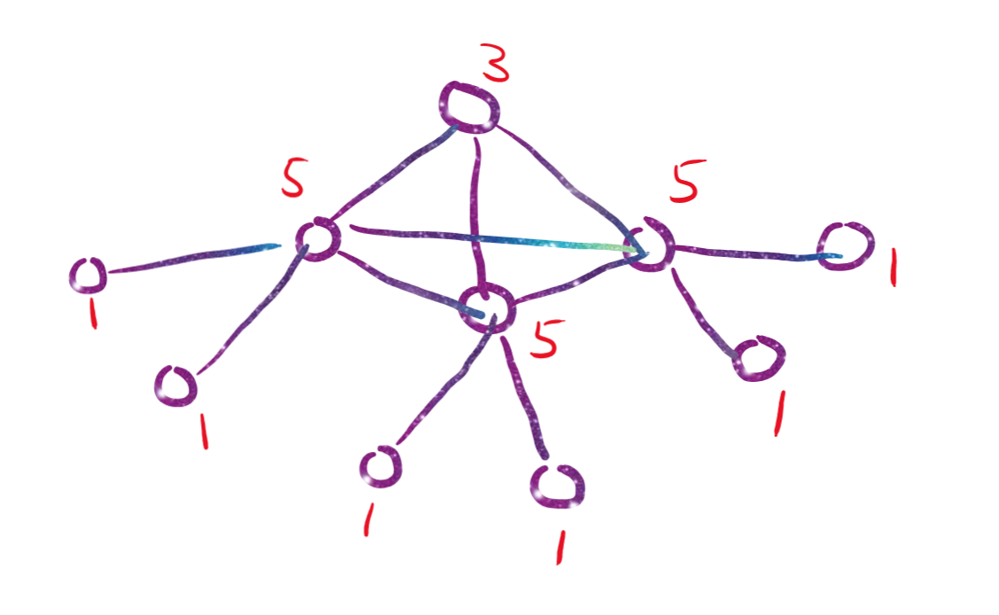
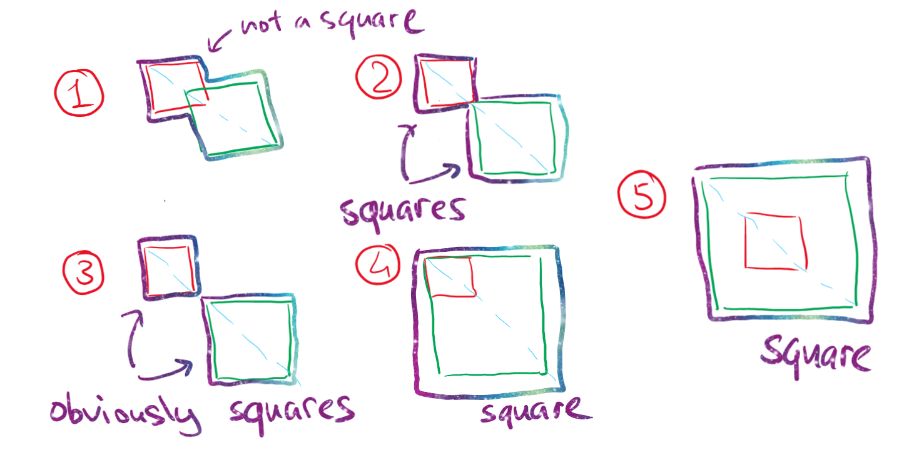

# Discrete Maths, Homework #11

## Problem 1

Does a graph on $10$ vertices with degrees $1,1,1,1,1,1,3,5,5,5$ exist?

---

Yes, here it is (proof by example):

## Problem 2

Find the minimum number of vertices in a graph, the sum of vertex degrees of which is equal to $26$.

---

Maximum degree of a vertex in a graph that consists of $N$ vertices is $N-1$. Therefore, the graph at max may have $\frac{26}{2}=13$ edges: $13 \leq \frac{N(N-1)}{2}$ for the minimum of at least $N=6$ vertices. A full graph for $6$ vertices would have the sum of degrees equal to $6\times5=30$. If we remove a single edge twice (descreasing degrees of two vertices by $1$ twice), we get $30-2\times2=26$. Thus, the answer is $N=6$.

**Answer:** $6$

## Problem 3

Vertices of a graph $G$ are words of length $2$ in the alphabet of $A =\{0,1,2,3,4,5,6,7,8,9\}$, i. e. decimal number sequences of length $2$. Two vertices (two words of length $2$) are connected by an edge in $G$ if in each position each of the numbers are different by exactly $1$. Find the number of components in the graph.

---

Possible moves for all words $n \in A, k \in A$ (unless the move sends $n$ or $k$ to non-digits):

$$(n, k) \rightarrow (n + 1, k + 1)$$

$$(n, k) \rightarrow (n + 1, k - 1)$$

$$(n, k) \rightarrow (n - 1, k + 1)$$

$$(n, k) \rightarrow (n - 1, k - 1)$$

**Invariant condition**: parity of the sum of digits of the word remains constant. 

> *Some of the possible graph edges below are omitted.*

Build the first component (where parity is even):

$$\begin{matrix}
    00 & \to & 02 & \to &\dots& \to &08 \\
    \downarrow & & \downarrow & & & & \downarrow \\
    11 & \to & 13 &\to &\dots &\to &19 \\
    \downarrow & & \downarrow & & & & \downarrow \\
    20 & \to & 22 &\to &\dots &\to &28 \\
    \downarrow & & \downarrow & & & & \downarrow \\
    \vdots & & \vdots & & & & \vdots \\
    \downarrow & & \downarrow & & & & \downarrow \\
    91 & \to & 93 & \to &\dots& \to &99 \\
\end{matrix}$$

Build the second component (where parity is odd):

$$\begin{matrix}
    01 & \to & 03 & \to &\dots& \to &09 \\
    \downarrow & & \downarrow & & & & \downarrow \\
    10 & \to & 12 &\to &\dots &\to &18 \\
    \downarrow & & \downarrow & & & & \downarrow \\
    21 & \to & 23 &\to &\dots &\to &29 \\
    \downarrow & & \downarrow & & & & \downarrow \\
    \vdots & & \vdots & & & & \vdots \\
    \downarrow & & \downarrow & & & & \downarrow \\
    90 & \to & 92 & \to &\dots& \to &98 \\
\end{matrix}$$

Every single word from $\{00, 01, \dots, 98, 99\}$ is a part of one of two components above. Thus, there are no other disconnected components and the answer is $2$.

**Answer:** $2$

## Problem 4

Let $A$ be a non-empty set, $E_1$ and $E_2$ are such equivalence relations on $A$ that $E_1 \cup E_2$ is also an equivalence relation, $C_1$ is an equivalence class of relation $E_1$, $C_2$ is an equivalence class of relation $E_2$. Prove either that $C_1 \cap C_2 = \varnothing$, or $C_1 \subseteq C_2$, or $C_2 \subseteq C_1$.

---

Define the building blocks (basis) of each of the equivalence relations. Each class of the equivalence relations is effectively a square matrix with such elements $a_i$ that they only lie in $C_k$ and nowhere else for any size $n$ less than the alphabet of the equivalence relation. 

$$\begin{align*}
    C_k=\{&(a_1, a_1), (a_1, a_2), \dots (a_1, a_n)\\
    &(a_2, a_1), (a_2, a_2),\dots (a_2, a_n)\\
    &\ \ \ \ \ \vdots\ \ \ \ \ \vdots\ \ \ \ \ \vdots\ \ \ \ \ \vdots\ \ \ \ \ \vdots\ \ \ \ \ \vdots\ \ \ \ \ \vdots \\
    &(a_n, a_1), (a_n, a_2), \dots (a_n, a_n)\}
\end{align*}$$

Thus, any equivalence relation is effectively a union of some assortment of these subclasses:

$$E_i=\bigcup^{n}_{k=1}C_k$$

Now, given that both equivalence relations are defined on $A$, their union could be an equivalence only if it is also a union of some assortment of its subclasses (see above). This means that the number of elements in each such subclass-binary relation in the resulting equivalence as well as any intersection of these classes should be **an integer square**, given that each of the subclasses is represented by a square matrix.

An example to understand what happens when we try to get an equivalence class (square matrix with all $1$-s) of two equivalence classes:

First one:

| | a | b | c |
|:-:|:-:|:-:|:-:|
| a | 1 | 1 | 0 |
| b | 1 | 1 | 0 |
| c | 0 | 0 | 0 |

Second one:

| | a | b | c |
|:-:|:-:|:-:|:-:|
| a | 1 | 0 | 1 |
| b | 0 | 0 | 0 |
| c | 1 | 0 | 1 |

Their union:

| | a | b | c |
|:-:|:-:|:-:|:-:|
| a | 1 | 1 | 1 |
| b | 1 | 1 | 0 |
| c | 1 | 0 | 1 |

Rearranged:

| | b | a | c |
|:-:|:-:|:-:|:-:|
| b | 1 | 1 | 0 |
| a | 1 | 1 | 1 |
| c | 0 | 1 | 1 |

Per induction, we could always rearrange lines in our matrix so that the problem collapses to answering the question of 

### When is it possible to overlap two squares along their common diagonal so that all figures created by their outlines would also be squares?

Accounting to rotational symmetry and identical cases when $C_1$ is interchanged with $C_2$, there are 5 total cases:

* 1: If two squares overlap, the outline of the resulting figure is not a square.
* 2-3: If two squares have a common vertex or no common vertexes, the resulting figure is two separate squares.
  * $C_1 \cap C_2 = \varnothing$
* 4-5: If one square completely lies within the second one, the resulting figure is a single square.
  * $C_1 \subseteq C_2$
  * Or per symmetry, $C_2 \subseteq C_1$,

which is identical to three cases asked in the problem statement, q. e. d.