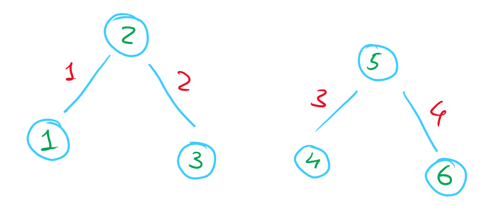
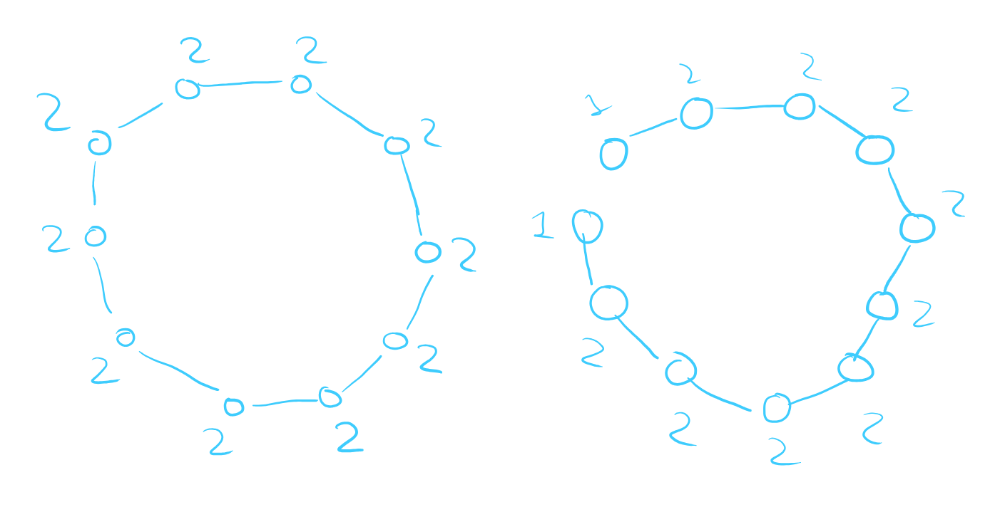
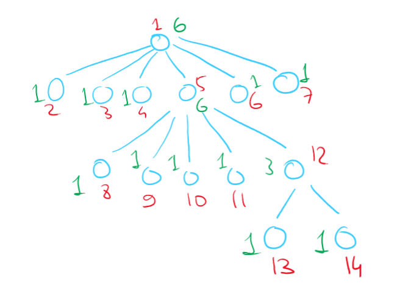
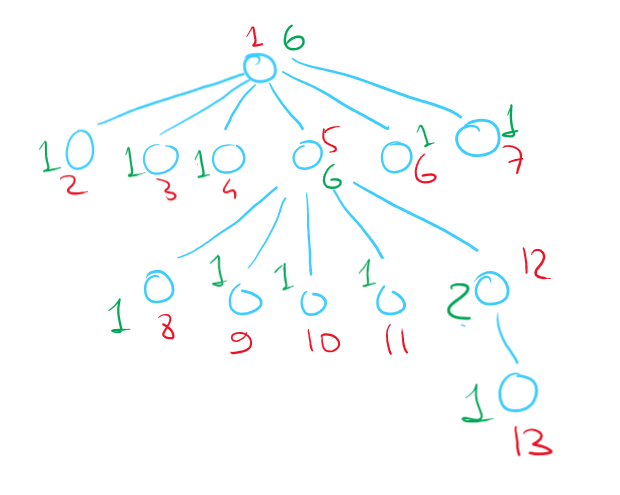

# Discrete Maths, Homework 12

## Problem 12.1

How many components are there is a forest with 6 vertices and 4 edges? Give an example of such forest.

---

Cyclomatric number of a forest is 0. Therefore,

$$r(G) = m - n + c$$

$$0 = 4 - 6 + c\Rightarrow c=2$$

**Answer:** $2$

**Example:**

## Problem 12.2

How many simple paths could there be in a tree on $n$ vertices?

---

Take any vertex $x_n$ out of $n$ options and then take any vertex $y_{n-1}$ out of $n-1$ options. Since any two vertices in a tree are connected by a single path, the total number of paths is the number of all vertex pairs, aka $n(n-1)$.

**Answer:** $n(n-1)$

## Problem 12.3

Find the maximum number of vertices in a connected graph, the sum of vertex degrees of which is equal to $20$.

---

For the number of vertices to be maximum, we need to minimize connections between vertices while still maintaining connectiveness (the number of components is equal to $1$). For this reason, the cyclomatic number should be equal to $0$. There are $\displaystyle \frac{20}{2}=10$ vertices in total.

$$r(G)=m - n + c$$

$$0=10-n+1$$

$$n=11$$

Take a graph that would be a cycle on $10$ vertices: $C_{10}$. Take one vertex, and duplicate it, creating a break in the cycle to get our required example $(P_{11})$:

**Answer:** $11$

## Problem 12.4

### Subproblem A

Give an example of a tree on $14$ vertices, which has exactly $2$ vertices of degree $6$ and has no vertices of degree $2$.

### Subproblem B

In a tree on $13$ vertices there are exactly $2$ vertices of degree $6$. Does it follow that there is a vertex of degree $2$ in this tree?

---

In a tree, the number of edges is one less than the number of vertices. Sum of degrees of all n vertices is equal to $(n - 1)\times2=(13-1)\times2=24$

Two vertices should have their sum of degrees equal to $6$, which leaves $24-6\times2=12$ for $11$ vertices.

Each vertex has its degree equal to at least $1$ (otherwise the vertex is isolated, which is impossible). After assigning degree of $1$ to each vertex, per **Dirichlet** principle, the degree of at least one of the vertices (which are not equal to $6$) should be at least $2$, which implies that there is a vertex of degree $2$ in the tree.

