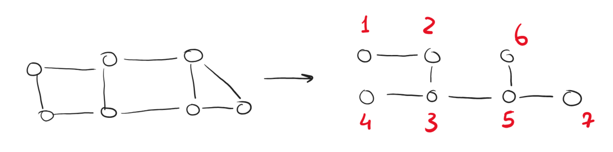
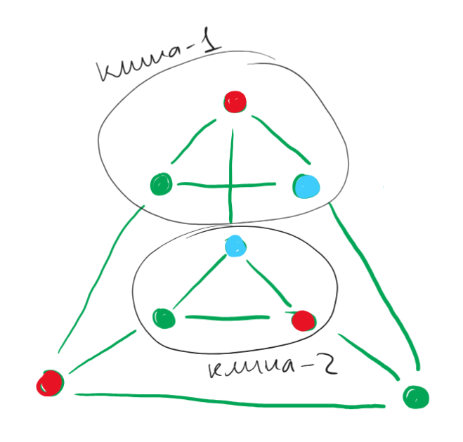
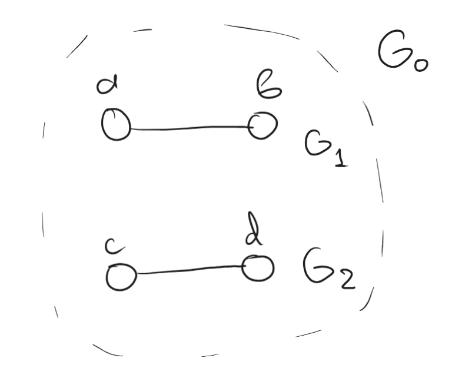

# Discrete Maths, Homework 13

## Problem 1

Prove that it is possible to enumerate vertices of a connected non-oriented graph on $n$ vertices in with numbers from $1$ to $n$ in such a way that for any $1\leqslant k\leqslant n$ the subgraph induced by the set of vertices from $1$ to $k$ is connected.

---

First, build a spanning tree of a graph. Since the graph is connected, it would always exist.

Next, take some leaf (hanging vertex) of the tree and assign the number $1$ to it.

Then, move to any adjacent vertex and assign it the number $i$ (which would be connected to the tree formed by $1,2,\dots, i-1$ vertices).

> A vertex is **adjacent** if there is a bridge between such vertex and the current tree.

Repeat the process until there are no more vertices.

Illustration of the above process: 

$1 \to (1, 2) \to (1, 2, 3) \to \dots \to (1, 2, 3, 4, 5, 6, 7)$. All graphs induced by those vertices and edges that exist between them in the spanning tree would be connected since we always add a new vertex that would be connected to the already-existing tree.

**Final step:** restore all edges in the original graph (which does not affect the connectivity of the graph), thus all subgraphs induced by $(1,\dots,k)$ vertices would be connected, q. e. d.

## Problem 2

Find such a graph on $8$ vertices that the degree of each vertex is equal to $3$ and there are no independent sets of size $4$ in the graph.

---

Consider the following graph: 

There are two cliques of size $3$ in the graph, which means that the graph is at least $3$-colorable. To try and find an independent set in the graph, we would have to take one vertex from each of the cliques. Other $4$ vertices in the cliques couldn't be chosen since they are dependent on other vertices in the clique, thus excluding $4+2=6$ vertices from the graph.

The remaining bottom (see picture) vertices form a clique of size $2$, thus making them dependent. Since there are three independent cliques, the maximal independent set consists of $3$ vertices. (There are no more than $3$ vertices of each color!), q. e. d.

## Problem 3

It is known that in a simple non-oriented graph there is an odd number of independent sets. Does it follow that the graph is connected?

---

Consider connected graph $G_1$ that has $n$ independent sets. Consider another connected graph $G_2$ that has $k$ connected sets. 

If we merge these graphs into a single one $G_0$ (not adding any new edges), then to get the number of independent sets in the new graph, we do the following:

    independent_sets = 0
    for every independent_set in G_2: # total k iterations
        # we add each independent set from G_2 to 
        # each set from G_2, thus getting n new
        # independent sets each iteration
        independent_sets += n 

Therefore, the total number of independent sets after merging two disconnected graphs is $n\times k$. Try to find such an example so that $n\times k$ is not even $\implies$ neither $n$, nor $k$ can be even $\implies$ they both are odd.

Consider two graphs and their independent sets as a counterexample:

* $G_1\colon\{\varnothing\}, \{a\}, \{b\}$
* $G_2\colon\{\varnothing\}, \{c\}, \{d\}$

Per our reasoning, the resulting graph $G_0$ would have $3\times3=9$ independent sets. We could list them all:

$$\begin{align*}
    G_0\colon &\{\varnothing\}, \{a\}, \{b\}\\
              &\{c\}, \{a, c\}, \{b, c\}\\
              &\{d\}, \{a, d\}, \{b, d\}
\end{align*}$$

This graph is not connected $\implies$ no, it does not follow, q. e. d.

## Problem 4

For which $n$ is there a spanning tree in a boolean cube $Q_n$, in which all vertices except for $2$ have a degree of $2$?

---

For a spanning tree to have all vertices except for $2$ have a degree of $2$, we need to just find a path that would go through all vertices of the cube (every vertex except for the beginning and the end would have degrees of $2$).

Denote each vertex of the cube as follows:

$$\underbrace{010101110001\dots0101}_{n}$$

Where each $n$-th $1$ in each of bits denotes that the vertex has gone into the $n$-th dimension and each $0$, respectively, denotes that we have not shifted into the according dimension.

Now, go through all words as follows, starting from the $0$-th vertex (that has all zeros). Consider an example for $4$ dimensions. It could be expanded iteratively to higher dimensions:

$$\begin{align*}&0000 \to 0001 \to 0011 \to 0010 \to \\
                &0110 \to 0111 \to 0101 \to 0100 \to \\
                &1100 \to 1101 \to 1111 \to 1110 \to \\
                &1010 \to 1011 \to 1001 \to 1000\end{align*}$$

This algorithm can be described as follows:

* start in the $0$-th dimension at the only vertex $\underbrace{0\dots0}_n$
* clone this dimension, create a bridge between the last visited vertex in the original dimension and the respective vertex to the last visited in the new dimension
* visit all vertexes in the cloned dimension in the reverse order
* repeat until you run out of dimensions to go into

The first boolean cube with at least $2$ vertices is a $1$-dimensional cube $(2^1=2)$. All vertices except for two (so, zero in total) have a degree of $2$, thus this statement is valid for such a cube and for all cubes of higher dimensions $(n\geqslant1)$

**Answer:** $n\geqslant1$.