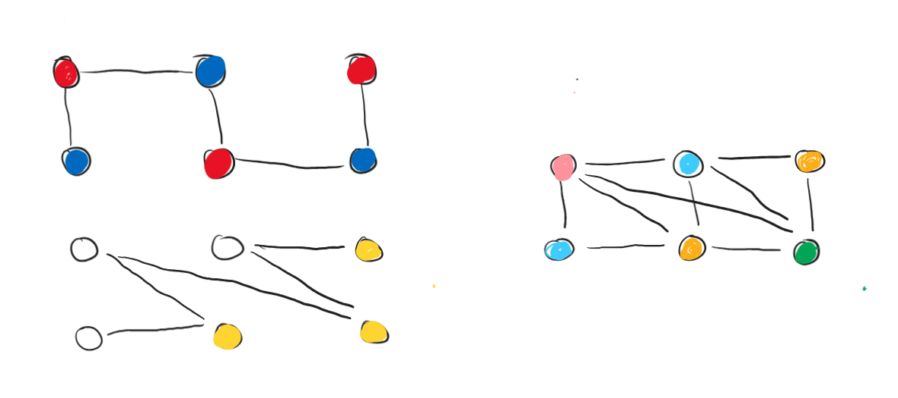

# Discrete Maths, Homework 14

## Problem 14.1

Graph $G$ has be 2-colored at least three different ways. Prove that $G$ is disconnected.

---

Let's consider a **connected** graph which is 2-colorable and find out how many different ways it's possible to 2-color this graph. 

**Algorithm:** 

* Take a node, color it red, then color it black, then repeat until you run out of nodes. This is the first coloring.
* For the second coloring, do the same thing, but starting with black. 

We get $2$ possible colorings of graph $G$, which are symmetrical to each other. There are no other possible colorings of a connected graph.

Therefore, it's impossible that a connected graph has $3$ 2-colorings, q. e. d.

> Furthermore, any graph that has $3$ or more 2-colorings has to consist of multiple connected subgraphs, and the number of such possible colorings is equal to $2$ raised to the power of the connectivity number $k\colon 2^k$.

## Problem 14.2

Consider a non-2-colorable graph minimal if after removing any edge it becomes 2-colorable. Prove that in a minimal non-2-colorable graph on $1000$ vertices there is at least one isolated vertex (aka a vertex of degree $0$).

---

Per definition of a 2-colorable graph, there should be no odd cycles in such graph. Thus, alternatively, if a graph is non-2-colorable, then there is certainly a cycle of odd length.

For the graph to be minimal within these constraints, removing any edge should break the odd cycle $\implies$ **all edges of the graph are a part of this odd cycle.**

Since the cycle is odd and the total number of vertices in the graph is even, there is certainly at least a single vertex that is not a part of our cycle and since all edges of the graph are a part of this cycle, the remaining vertex(es) are isolated, q. e. d.

## Problem 14.3

The number of vertices in a graph $G$ is $2301$. It is known that there is no clique of size $4$ in graph $G$. Prove that there is an independent set of size $23$.

---

We know that there exists an upper bound for Ramsey's numbers as follows:

$$R(k,n)\leqslant{k+n-2\choose k-1}$$

Therefore, 

$$R(4, 23)={23+4-2\choose 4-1}={25\choose3}=\frac{25!}{22!\times3!}=\frac{23\times24\times25}{2\times3}=2300$$

This means that in a graph on at least $2300$ vertices there always is EITHER a clique of $4$ OR an independent set of size $23$. Thus, for a graph on $\geqslant2300$ aka $2301$ vertices, this condition holds. Therefore, within these constraints, per Ramsey's Theorem, if there isn't a clique of size $4$, then there is certainly an independent set of size $23$ for the given graph.

## Problem 14.4

In graph $D$ there are two such spanning trees $T_1$ and $T_2$ that the union of edges of these trees overlaps with the set of edges of graph $D$. Prove that it is possible to correctly 4-color vertices of graph $D$.

---

Effectively, we need to somehow color two spanning trees (which are always 2-colorable per definition) and then prove that their union would always be 4-colorable. 

Color each tree in $2$ colors. For the first tree, choose red and blue. For the second tree, choose, say, white and yellow. See an example below.

Now, after we merge two spanning trees together, we could always simply color each vertex the color that we would get after we mix two respective colors. This way, all shades of blue would be adjacent to shades of red and vice versa, as in the first graph. Also this way, all shades of white would be adjacent to all shades of yellow and vice versa, as in the second graph. Therefore, combining two 2-colorations of the spanning trees would always result in a correct 4-coloration for the initial graph per basic color mixing logic.

A more specific guide to how the colors are formed (first color comes from the first spanning tree, the second from the second spanning tree, respectively):

| | red | blue |
|:-:|:-:|:-:|
| white | pink | light blue |
| yellow | orange | green |