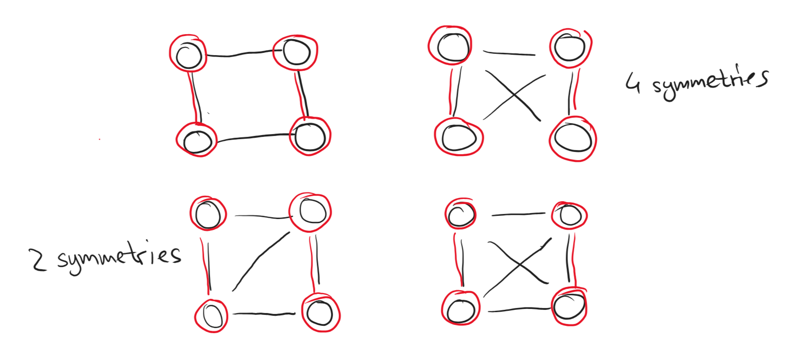
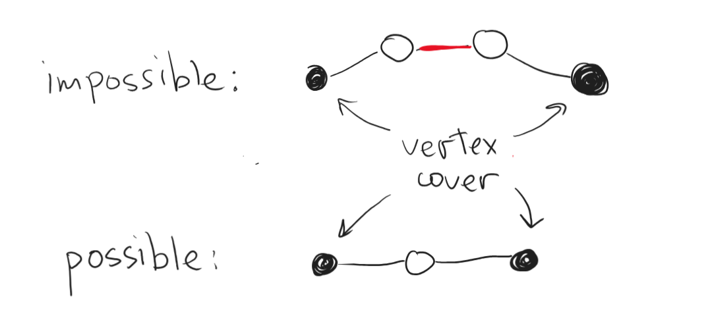
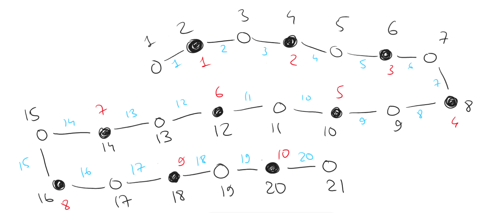

# Discrete Maths, Homework 15

## Problem 1

In the left part of the bipartite graph there are $300$ vertices, and in the right one there are $400$ vertices. Degress of all vertices in the left part are equal to $4$, and degress of all vertices in the right part are equal to $3$. Prove that in such a graph there is a matching of size $300$.

---

Per Hall's marriage theorem, there is a matching of size $|L|=300$ only and only if $\forall S\subseteq L$ the set of neighbours $G(S)\subseteq R$ has at least the same number of vertices as $S$. In other words, $(|G(S)|\geqslant |S|)$.

Now, let induction go brrr. We need to check whether $|G(S)|\geqslant |S|$ holds for all $S$. 

The base is obviously true: 

$$S_0=\{v_{left_1}\}, |S_0|=1, G(S_0)=\{v_{right_1}, v_{right_2}, v_{right_3}, v_{right_4}\}, |G(S_0)|=4,$$

thus $|G(S_0)|>|S|$ is true.

Now, attempt to add some vertex $v_{left_i}$ from the left part of the graph to our $S$. What can possibly happen?

Consider that there are $\nu$ vertices in our graph, thus at the very least certainly have $4\nu$ edges and $\displaystyle\left\lceil\frac{4\nu}{3}\right\rceil$ neighbours to our subgraph per the pigeonhole principle. Now, say that we have $\nu+1$ vertices in our set $S$. Accordingly, we would have at least $\displaystyle\left\lceil\frac{4\nu}{3}+\frac{1}{3}\right\rceil$ neighbours to our subgraph $S$.

Therefore, $|G(S)|\geqslant|S|$ for all $S$ and per Hall's marriage theorem, there is always a matching of size $|L|=300$, q. e. d.

## Problem 2

In a graph on $2024$ vertices there are at least two edges between each three vertices. Prove that there is a perfect matching (of $1012$ edges).

---

Split the massive group of $2024$ vertices into groups of $4$ vertices, stripping all edges between those $4$ vertices in each group and all other vertices. Within given restrictions, there are only $8$ (including symmetries) possible arrangements of edges between $4$ vertices such that there are at least two edges between each three vertices. I list all of them in the figure below (reader may easily check that no other arrangements are valid, so the search is exhaustive):

As seen in the figure, it's always possible to choose two matching for each of the subgroups of $4$ vertices. Since $2024 \ \text{mod} \ 4$ is $0$, there would be no remaining groups after we split all vertices into $506$ groups of $4$, and all of them would yield $2$ matchings regardless of the edge combination, thus yielding $506\times2=1012$ matchings, which is indeed a perfect one, q. e. d.

## Problem 3

In a graph on $101$ vertices there is an independent set of size $52$. Prove that there is no matching of size $50$ in this graph.

---

### Kinda informal proof through logic

Since there is an independent set of size $52$, then each of these vertices is a part of a potential independent match.

This leaves $101-52=49$ vertices to form those matches with, which simply does not allow one to choose a matching of size $50$.

### Formal-esque proof

We know that $\alpha(G)$ is the maximum size of an independent set in a graph, $\tau(G)$ is the minumum size of a vertex cover, and $\mu(G)$ is the maximum size of a matching, all for graph $G$.

The following identity from the lectures is true:

$$n-\alpha(G)=\tau(G),$$

where $n$ is the total number of vertices. $\alpha(G)$ is obviously at least $52$ per given conditions $\implies \tau(G)=101-52=49$.

The following identity is also true:

$$\tau(G)\geq\mu(G)$$

Thus,

$$\mu(G)\leq49,$$

which means that the maximum size of a matching is $49$ and physically cannot be $50$, q. e. d.

## Problem 4

In a graph on $n$ vertices there is a vertex cover of size $10$. Prove that in such a graph there is no simple path of length $21$. (In a simple path all vertices are different, and the length of the path is the number of edges in it.)

---

Since there is a vertex cover of size $10$, then there is an independent set of at least size $n-10$. Thus, we require at least $21-10=11$ vertices in the independent set. Is this possible?

For a simple path to exist, we need an edge between each two consecutive vertices along the path. Two vertices that are not a part of the vertex cover cannot be consecutive in the path, since there can't be an edge between them (see figure below for a visualization).

Therefore, the longest possible simple path through the graph would look similar to the graph in the figure below (there can be any number of edges between any two black nodes [vertex cover] or between any of the black-white pairings but not between white-white nodes, since that goes against the given conditions).

Per the pigeonhole principle, let's build a best-case scenario graph, placing a vertex between each two vertices that are a part of a cover and starting and ending our path with vertices from the independent set. For the simple path of length $21$ to exist, we need at least $22$ vertices in the graph, which is simply impossible, because there are no two adjacent black vertices we can place a white vertice between, nor can we add any vertices to the beginning or to the end of the graph, thus only resulting in a simple path of length $20$ at the very max, q. e. d.