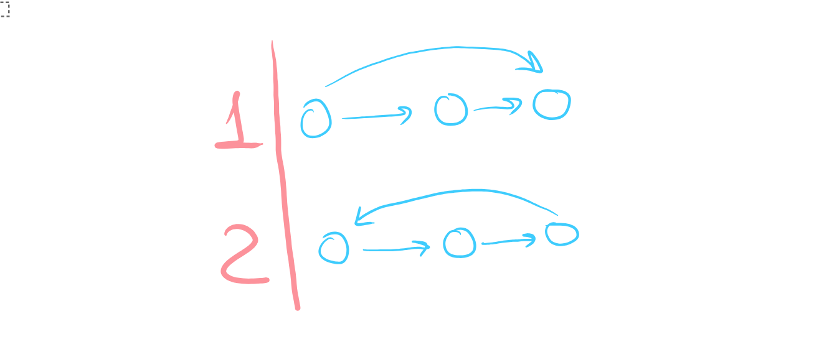

# Discrete Maths, Homework 16

## Problem 1

Does an oriented graph on $10$ vertices with $100$ edges exist? If yes, then is it necessarily Euler's?

---

Let's count the maximum number of vertices in an oriented graph. Since an incidence matrix for such a graph is a simple $10\times10$ matrix with no restictions or symmetries, there are $10\times10=100$ possible edges, which is precisely what we're being asked about.

This graph is certainly Euler's because all paths of length $10$ are cycles as follows, regardless of order (since the graph is perfectly symmetric and automorphic):

$$1\to2\to3\to4\to5\to6\to7\to8\to9\to9\to10\to1$$

**Answer:** yes, it exists, and yes, it is Euler's.

## Problem 2

Vertices of an oriented graph are whole numbers from $0$ to $2023$. An edge goes from vertex $x$ to vertex $y$ if $y-x=2$ or if $x-y=3$. Find the number of strongly connected components.

---

Action $A_1(x)$ is $y-x=2\implies y=x+2$, which simply adds $2$ to a number. Action $A_2(x)$ is $x-y=3\implies y=x-3$, which simply subtracts $3$ from a number. 

If we combine these two actions, then $A_3(x)=(A_2\circ A_1)(x)=(A_1\circ A_2)(x)\implies y=x-1$, which means that every vertex $n$ is reachable from its successor $n+1$. Now, we combine $A_4(x)=(A_3\circ A_1)(x)=(A_1\circ A_3)(x)\implies y=x+1$, this action means every vertex $n$ is reachable from its predecessor $n-1$.

Therefore, combining these two conditions, every vertex is reachable from every vertex $\implies$ there is a single strongly connected component.

**Answer:** 1

## Problem 3

Function $C\colon V\mapsto P(V)$ maps a vertex $V$ of an oriented graph to a set of vertices reachable from the said vertex. Is it true that for any acyclic oriented graph on $2024$ vertices function $C$ is injective?

---

Proof by counter-example (on the image only the first three vertices of the graph are shown, the rest are irrelevant, although assume that the rest of graph is also acyclic. I specifically assume that **all other vertices are isolated**):

$$C(v_1)=\{2\}\quad C(v_2)=\{\varnothing\} \quad C(v_3)=\{2\}$$ 

As seen in the figure above, $C(v_1)=C(v_3)=\{2\}$, which means that the function is not injective (there are two different vertices that map to the same set).

**Answer:** no, the function is not injective.

## Problem 4

Prove that any tournament is either acyclic or contains a cycle of length $3$.

---

If we prove that tournament is acyclic $\Longleftrightarrow$ tournament has no cycle of length $3$, the given conditions would be mutually exclusive $\implies$ the task would be solved.

$\Rightarrow:$ If a tournament is acyclic, then it obviously does not have any cycles of length $3$

$\Leftarrow:$ Let there be a cycle of length $n\neq3$. It physically cannot be a cycle of length $1$ or $2$ as any tournament is antireflexive and anti-symmetric.

**Small lemma or something.** If a tournament is transitive, then it does not contain cycles of length $3$.

Since there are edges between all vertices in a tournament, then there are only two edge permutations down to the isomorphism.

Consider all groups of $3$ vertices in the tournament. Case one in the figure above for all such groups implies that the tournament is transitive and that there are no cycles of length three since we have checked all such groups. 

If there exists any cycle of length $3$ (case two), then the tournament is non-transitive since a cycle of length three with no other edges between the cycle vertices is not transitive $\implies$ the lemma is proven.

Now, say that there is a cycle $v_1,v_2,v_3,\dots, v_n, n\geqslant 4$. As we have proven above, we say that there are no cycles of length $3\implies$ the graph is transitive.

If a cycle of length $n\geqslant4$ is transitive, then it contains a cycle of length $3$ inside it $\implies$ our supposition is incorrect, and there always is a cycle of length $3$ in any non-acyclic tournament.

Therefore, the graph is either acyclic or it contains a cycle of length $3$, q. e. d.

