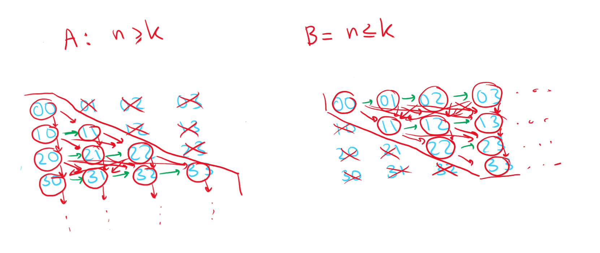

# Discrete Maths

## Problem 1

Give an example of a partial order, in which there are two antichains of size $10$, those antichains do not intersect, and in which there are exactly $100$ chains of size $3$.

---

Let's take a bipartite graph with $10$ elements in each part. Each of those parts will be our antichains (since vertices in a part of a bipartite graph are obviously antichains since they form an independent set).

Add one singular MEGA POINT between those parts of a graph and connect ALL other points to it. We would get let $20$ edges, which form $10\times10=100$ triple-chains (we may end up in any of the $10$ red vertices from any of the $10$ blue vertices, thus giving us the required number of chains).

Hasse diagram below:

## Problem 2

### Subproblem A

Prove that an intersection of two partial orders on a single set is a partial order.

---

Firstly, define both a strict partial order and a non-strict partial order:

> Strict partial order is a binary relation which is **transitive and anti-reflexive**.

> Non-strict partial order is a binary relation which is **transitive, anti-symmetric, and reflexive**.

Now, we need to just check whether all the properties hold for all combinations of strict partial ($S$) and non-strict partial ($N$) orders.

1. $S_1\cap S_2$: 
   1. transitivity: if $(x,y),(y,z)\in S_1, S_2\implies(x,z)\in S_1, S_2$. Well, similarly, if some pair of $(x,y), (y,z)$ in in both relations at once, then all $(x,y),(y,z),(x,z)\in S_1\cap S_2$, which implies transitivity.
   2. anti-reflexivity: $(x,x)\notin S_1, S_2\implies(x,x)\notin S_1\cap S_2$ since there is no way $(x,x)$ suddenly appear in the intersection, which implies anti-reflexivity.
2. $N_1\cap S_2$, $S_1\cap N_2$
   * Since a strict order is anti-reflexive, then $N_1\cap S_2$ is also a strict order (it's physically impossible that any of the reflexive elements would end up in the intersection since there are no reflexive elements to intersect with in the strict order relation). Therefore, this case collapses to the next one (we can easily remove reflexive pairs from $N_i$ to get $S_i$) 
3. $N_1\cap N_2$
   1. transitivity (same as above): if $(x,y),(y,z)\in S_1, S_2\implies(x,z)\in N_1, N_2$. Well, similarly, if some pair of $(x,y), (y,z)$ in in both relations at once, then all $(x,y),(y,z),(x,z)\in N_1\cap S_2$, which implies transitivity.
   2. reflexivity: $\forall x\colon(x,x)\in N_1, N_2\implies\forall x\colon(x,x)\in N_1\cap N_2$, and the only for an $(x,x)$ to disappear is for one of the partial orders simply not to have that element, which implies the intersection would always be reflexive. 
   3. anti-symmetry: if $x\neq y, (x,y)\in N_1, N_2\implies(y,x)\notin N_1,N_2$. Similarly, if $(x, y)\in N_1\cap N_2$, then $(y,x) \notin N_1\cap N_2$, so this property also holds, q. e. d.

### Subproblem B

Let $(P,\leqslant_1),(P,\leqslant_2)$ be such partial orders in the same non-empty set that the site of the maximum antichain in the first is $k_1$ and in the second, $k_2$. It is true that the size of the maximum antichain in an intersection of these orders does not exceed $(k_1+1)(k_2+1)$.

---

Proof by counter-example.

> I do hope that it's correct this time.

Take two partial orders. First one:

| $\leqslant_1$ | $a$ | $b$ | $c$ |
|:-:|:-:|:-:|:-:|
| $a$ | $1$ | $1$ | $1$ |
| $b$ | $0$ | $1$ | $1$ |
| $c$ | $0$ | $0$ | $1$ |

To get the second one, simply reflect the table along the main diagonal:

| $\leqslant_2$ | $a$ | $b$ | $c$ |
|:-:|:-:|:-:|:-:|
| $a$ | $1$ | $0$ | $0$ |
| $b$ | $1$ | $1$ | $0$ |
| $c$ | $1$ | $1$ | $1$ |

Both of these orders are linear; therefore, the maximum size of an anti-chain for each is $k_1=k_2=1$.

Let's intersect these two orders. We are left with only reflexive pairs in the binary relation:

| $\leqslant_1\cap\leqslant_2$ | $a$ | $b$ | $c$ |
|:-:|:-:|:-:|:-:|
| $a$ | $1$ | $0$ | $0$ |
| $b$ | $0$ | $1$ | $0$ |
| $c$ | $0$ | $0$ | $1$ |

This means that none of the elements are comparable to each other and they are all independent. Therefore, the maximum length of an antichain for this case is equal to the number of elements in the binary relation.

My counter-example obviously doesn't work since $(k_1+1)(k_2+1)=2\times2=4$, which is not exceeded by $3$.

However, the value of the maximum antichain in a linear order is always $1$. Therefore, we can easily construct two linear orders (as above), but with more elements. To be specific, we need to exceed $4\implies$ the minimum number of elements when it's possble is $5$.

Overall, the intersection of these orders may exceed $(k_1+1)(k_2+1)$ when there are $\geq5$ elements 

## Problem 3

Let $A=\{(n,k)\in\mathbb{N}\times\mathbb{N}\colon n\geq k\}$ и $B=\{(n,k)\in\mathbb{N}\times\mathbb{N}\colon n\leq k\}$. Consider a limitation of a lexicographic order $\mathbb{N}\times_{\text{lex}}\mathbb{N}$ on these sets: pair $(n_1,k_1)$ is lesser than pair $(n_2,k_2)$ if $n_1<n_2$ or $n_1=n_2$ and $k_1<k_2$. Are these orders isomorphic on sets $A$ and $B$?

---

Graph some improvised diagrams of the sets for the sake of visualization (they are not really Hasse diagrams, since there are two conditions and it's just too difficult to draw them properly for graphs with infinitely many elements), I just visualize the first comparative condition with red and the second, with green.

Write down the lexicographical order of elements in each set

$$A\colon 00\prec10\prec11\prec20\prec21\prec22\prec30\prec31\prec32\prec34\prec\dotsm$$

$$B\colon00\prec01\prec02\prec03\prec\dots\prec11\prec12\prec13\prec\dots\prec22\prec23\prec\dots\prec33\prec\dotsm$$

As we may see, the lexicographical order in set $A$ is countably infinite (every row begins with a word of the $0n$ kind and ends on the diagonal, the row itself being finite), whereas the lexicographical order in set $B$ is uncountable infinite (first we have all elements with $0$, then with $1$, then $2$, and so on). These properties should be maintained by an isomoprhic mapping, but they are different in each of the sets. Thus, no, these orders are not isomorphic.

## Problem 4

Define an element as "far" if it is greater than an infinite number of limit elements and smaller than an infinite number of limit elements.

### Subproblem A

Prove that an isomorphism maps far elements to far elements.

---

It was proven on the lecture that an isomorphic transformation maintains limit element invariants.

Relative position of far elements in the order to the limit elements is invariantic since it only depends on limit elements, which further means that far elements are mapped to far elements isomorphically.

### Subproblem B

Give an example of an order in which exists a far element that is not a limit element.

---

Per definition, an element is a limit element if it doesn't have a predecessor. An element $a$ is a predecessor of $b$ if $a<b$ and $\nexists c$ such that $a<c<b$.

Take some kinda element $x$. Take two closed intervals of the $\mathbb{R}$ line (which is a dense space), for instance, $[a,b], [c,d]$ for $a<b,c<d$.

Establish a partial order as follows, where each two elements $n,k$ of an interval have an order defined by $n<k$ for infinitely many such closed intervals denoted by indexes $z\in\mathbb{Z}$: 

$$[a,b]_z\prec x\prec[c,d]_z$$

We need $x$ not to be a limit element, thus it has to have a predecessor. $x$ clearly has a predecessor of $b_i$ as can be seen above. Moreover, $x$ has infinitely many preceding limit elements $a_i$, which also clearly don't have a predecessor since they are interval edges.

Now, look at the intervals $[c,d]_i$ closer. Take any $y\in(c,d)_i$. Could we find such $y$ that it would have a predecessor? Since the intervals are dense per Dedekind's cut, we could always find some separator $s$ before any $m$ which we proclaim the preceding element. This means that there is an infinite number of limit elements that are greater than $x$ as well, q. e. d.

