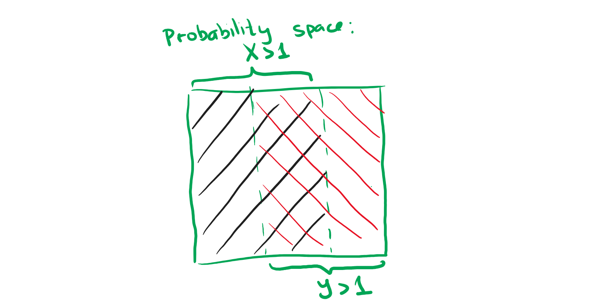

# Discrete Maths, Homework 22

## Problem 1

About non-negative random values $X,Y$ it is known that $P[X>1]\geq \frac{2}{3}, P[Y>1]\geq \frac{2}{3}$.

### Subproblem A

Prove that $E[XY]\geq\frac{1}{3}$.

---

Fill in the probability space with event $X>1$. We occupy at max $\frac{2}{3}$ of the space. Then, per Dirichet's principle (which we can use since we want to find the worst-case scenario), we first fill the part of the probability space that is unoccupied, now occupying the entire space $(1)$ with some event, and then $\frac{1}{3}$ of the space would be filled with both events in the worst-case scenario.

Since $XY=X\land Y$, then this portion (intersection) of the probability space that we will occupy regardless of how we define the values $X,Y$ will precisely be $P[XY > 1]=\frac{1}{3}$, which further holds because 

$$X>1\land Y>1\land XY>1$$

Now use the Markov's inequality:

$$P[f\geq\alpha]\leq\frac{E[f]}{\alpha}$$

$$P[XY\geq 1]\leq\frac{E[XY]}{1}$$

$$E[XY]\geq\frac{1}{3}$$

q. e. d.

### Subproblem B

Can random values $X, Y$ be independent?

---

Yes, they can. Construct an example for this:

The probability space shall be single items from the following set $\{1, 2, 3\}$. The supply of items is limitless.

Both $X,Y$ shall return fairly random value from this set, which means that it returns $X>1$ or $Y>1$ two thirds of the time, which matches the given conditions.

Both random values take values independently from each other.

We may check that the values are truly independent by simply first multiplying the chances independently and then multiplying the probabilities or calculating the values for all sequences at once. It would match the following identity

$$P[A\cap B]=P[B]\cdot P[A]$$

thus, the events are independent by definition.

## Problem 2

The probability space is the set of binary words of length $42$. All outcomes are equally probable. Random value $L$ is equal to the number of ones in the first $28$ elements of sequence, and random value $R$ is equal to the number of ones in the last $14$ elements of the sequence. Find $E[LR]$.

---

We know that $L$ and $R$ are independent from each other. Thus, we may conclude that 

$$E[LR]=E[L]\times E[R]$$

A single element is represented by a metric of whether the element is a one or not. Thus, we may create a total of $42$ such independent events.

The expected value of such each $\xi_i$ is $\frac{1}{2}$ since it can be a one or a zero with equal likelihood $(\frac{1}{2}\times 1+\frac{1}{2}\times0=\frac{1}{2})$.

Then, 

$$E[L]=E[\xi_1] + E[\xi_2] + \dots + E[\xi_{28}]=\frac{28}{2}=14$$

$$E[R]=E[\xi_{29}] + E[\xi_{30}] + \dots + E[\xi_{42}]=\frac{14}{2}=7$$

Therefore,

$$E[LR]=E[L]\times E[R]=14\times7=98$$

## Problem 3

The probability space is all permutations of $(x_1,\dots,x_n)$ elements from $1$ to $n$. All outcomes are equally probable. Find the dispersion of the number of numbers that have not changed their position. Formally, the random value is the number of elements in set $\{i|x_i=i\}$.

---

From the last homework, we know that 

$$E[\forall i|x_i=i]= 1$$

What remains is to calculate 

$$D[F]=E[F^2]-E[F]^2$$

or more specifically we only need to find $E[F^2]$ since we already know the other value:

$$D[F]=E[F^2]-1$$

Let's split the mathematical expectation per positions and assign $\xi_i=1$ if the position remained on place and $\xi_i=0$ if it didn't. Then, 

$$F=\xi_1+\xi_2+\dots+\xi_n$$

Thus, we may calculate

$$\begin{align*}E[F^2]=\ &E[(\xi_1+\xi_2+\dots+\xi_n)^2]\\=\ &E[\xi_1^2+\xi_2^2+\dots+\xi_n^2+2(\xi_1\xi_2+\xi_1\xi_3+\dots+\xi_1\xi_n+\xi_2\xi_1+\dots)]\\=\ & \sum^n_{i=1}E[\xi_i^2]+2\sum^n_{i=1}\sum^n_{j=i+1}E[\xi_i \xi_j]\end{align*}$$

We already know

$$\sum^n_{i=1}E[\xi_i^2]=1$$

whereas the chance that we get two elements on their own places is

$$\frac{1}{n}\frac{1}{n-1}=\frac{1}{n(n-1)}$$

Thus,

$$E[\xi_i \xi_j]=1\times\frac{1}{n(n-1)}+0+0+\dots=\frac{1}{n(n-1)}$$

Finally,

$$E[F^2]=\sum^n_{i=1}E[\xi_i^2]+2\sum^n_{i=1}\sum^n_{j=i+1}E[\xi_i \xi_j]$$

$$E[F^2]=1+2\frac{n(n-1)}{2}\frac{1}{n(n-1)}=1+1=2$$

Even more finally,

$$D[F]=E[F^2]-E[F]^2=2-1^2=1$$

## Problem 4

The probability space consists of binary words of length $n$. All outcomes are equally probable. Prove that the chance of the event "the number of ones in the word differs from $\frac{n}{2}$ by not more than $2\sqrt{n}$" does not exceed $\frac{1}{1000}$.

---

Hoeffding's inequality states that 

$$P\left[\left|X_n-\frac{n}{2}\right|>\varepsilon n\right]=P\left[\left|\xi_n-\frac{1}{2}\right|>\varepsilon\right]<2e^{-2\varepsilon^2n}$$

Let our random variable be $X_n$ in the given probability space. We also need: 

$$\varepsilon n=2\sqrt{n}\implies\varepsilon=\frac{2}{\sqrt{n}}$$

Thus we get

$$P\left[\left|X_n-\frac{n}{2}\right|>2\sqrt{n}\right]=P\left[\left|\xi_n-\frac{1}{2}\right|>\frac{2}{\sqrt{n}}\right]<2e^{-2\frac{2}{\sqrt{n}}^2n}$$

$$P\left[\left|X_n-\frac{n}{2}\right|>2\sqrt{n}\right]<2e^{-8}\approx0.00067092525$$

which does not exceed $0.001$