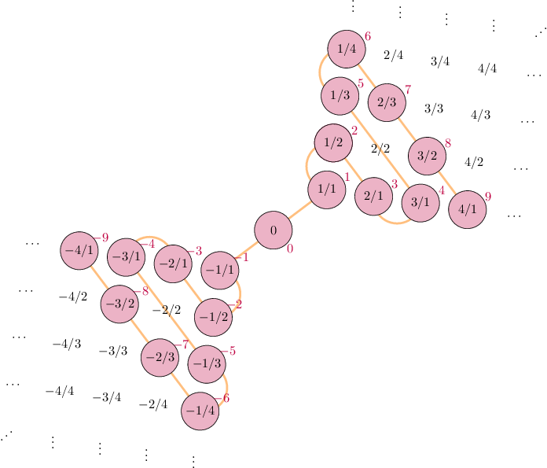

# Discrete Maths, Homework 8

## Problem 1

### Subproblem A

Is it true that if $|A \setminus B | = |B \setminus A|$, then $|A|=|B|$?

---

Since $A = A \setminus B \cup (A \cap B)$ and $B = B \setminus A \cup (B \cap A)$, then

$$|A| = |A \setminus B| + |A \cap B|$$

$$|B| = |B \setminus A| + |B \cap A|$$

Since the intersection operation is commutative and it is given that $|A \setminus B | = |B \setminus A|$, then

$$|A| = |A \setminus B| + |A \cap B| = |B \setminus A| + |B \cap A| = |B|$$

q. e. d.

**Answer: yes, it is true.**

### Subproblem B

Is it true that if $|A| = |C|, |B| = |D|, B \subseteq A, D \subseteq C$, then $|A\setminus B| = |C \setminus D|$?

---

$$|A| = |C|$$

$$|A| - |B| = |C| - |B|$$

Since $|B| = |D|$,

$$|A| - |B| = |C| - |D|$$

$$|A| - |A \cap B| - |B \setminus A| = |C| - |C \cap D| - |D \setminus C|$$

Since $B \subseteq A, D \subseteq C$, then $|B \setminus A| = |D \setminus C|=|\{\varnothing\}|=0$ and $A \cap B = B, C \cap D = D$.

$$|A| - |A \cap B| - 0 = |C| - |C \cap D| - 0$$

$$|A \setminus A \cap B| = |C \setminus C \cap D|$$

$$|A \setminus B| = |C \setminus D|$$

q. e. d.

**Answer: yes, it is true.**

## Problem 2

Prove that the set of finite subsets of rational numbers $(\mathbb{R})$ is countable.

---

We have proven that $\mathbb{R}$ is bijective with $\mathbb{Z, N}$ on the lecture. Here is a cool visulalization for $\mathbb{R \mapsto Z}$:

Therefore, we could bijectively replace each of the rational numbers in any given subset with its respective value in $\mathbb{N}$:

Example:

$$\{1, \frac{1}{2}, -1, 2, -\frac{1}{2}, \frac{1}{3}, -2, -\frac{1}{4}\} \mapsto \{1,2,3,4,5,6, 9, 11\}$$

Now, we need to somehow biject the set of all finite subsets like this to $\mathbb{N}$. We could encode this sequence of characters in each set in base $13$ $(A_{13}=10_{10}, B_{13}=11_{10}, C_{13}=12_{10})$ if we assume that all single digits in base $10$ biject to themselves and that

$$\{ \ \mapsto A_{13} \ \ \ \ \}  \mapsto B_{13} \ \ \ \ , \mapsto C_{13}$$

Therefore, the sequence above could be encoded by some $13$-base number, as follows:

$$10 \times 13^{17} + 1\times 13^{16} + 12\times 13^{15} + 2\times 13^{14} + 12\times 13^{13} + 3\times 13^{12} + 12\times 13^{11} + 4\times 13^{10} + 12\times 13^9 + 5\times 13^8 + $$

$$+ \ 12\times 13^7 + 6\times 13^6 + 12\times 13^5 + 9\times 13^4 + 12\times 13^3 + 1\times 13^2 + 1 \times 13^1 + 11 \times 13^0= 87795407856949545413$$

$$\{1, \frac{1}{2}, -1, 2, -\frac{1}{2}, \frac{1}{3}, -2, -\frac{1}{4}\} \mapsto \{1,2,3,4,5,6, 9, 11\}\mapsto A1C2C3C4C5C6C9C11B_{13} \mapsto 87795407856949545413_{10}$$

This could be repeated for any set of natural numbers and would always give a unique value from $\mathbb{N}$ for each set since the set of all numbers base $10$ is bijective to the set of all numbers base $13$. Therefore, the set of all finite subsets of $\mathbb{R}$ is countable (we have found such a bijection to a countable set (this set being some subset of $\mathbb{N}$)), q. e. d.

## Problem 3

Function is periodic if for some number $T$ and any $x$ the following is true: $f(x+T)=f(x)$. Prove that the set of periodic functions $f: \mathbb{Z} \mapsto \mathbb{Z}$ is countable.

---

Since we need to consider only periodic functions, each of them could be entirely defined by taking a section from the functions's domain and then duplicating it all over $\mathbb{Z}$. Thus, the rest of the function could only be defined a single way so we shall consider only the following domain: $x \in [1, T]$. Therefore, let's creating a mapping from a vector of length T to a vector of length T, which would precisely be our function:

$$(x_1, x_2, \dots x_T) \mapsto (t_1, t_2, \dots t_T)$$

In case $T > 0$, $f(x) = f(x - T) \Rightarrow f(x + T) = f(x)$. Therefore, if $T \in \mathbb{Z}_{<0}$, then this case would be symmetric to $T \in \mathbb{Z}^+$ case.

Additionally, map $\mathbb{Z} \mapsto \mathbb{N}$ as follows:

$$\{0, 1, -1, 2, -2, 3, -3, \dots \} \mapsto \{0, 1, 2, 3, 4, 5, 6, \dots \}$$

Now, $\forall T, \forall x$ we can write any $(t_1, t_2, \dots t_T)$ if we were to introduce a certain symbol that denotes the end of the periodic sequence $(X)$(after which the function would infinitely repeat) and a separator $(|)$ between all the numbers that are represented through digits 0-9.

Now, all words that correspond to all functions like this could be mapped to a unique values in some subset of $\mathbb{N}$ using base-12 arithmetic $(0, 1, 2, 3, 4, 5, 6, 7, 8, 9, |, X) \mapsto (0, 1, 2, 3, 4, 5, 6, 7, 8, 9, A_{12}, B_{12})$ (see a more in-depth example above).

Final mapping example, where $d_i$ is a digit-representation of the value from the image (ex. value at position $i$ is $t_i=1234 \mapsto \{1, 2, 3, 4\} = \{d_{i,1}, d_{i,2}, d_{i,3}, d_{i,4}\} = d_{i}$): 

$$(x_1, x_2, \dots x_T) \mapsto (t_1, t_2, \dots t_T) \mapsto d_1 \ | \ d_2 \ | \ \dots \ d_{T-1} \ | \ d_T \ X \mapsto$$

$$\mapsto (d_{1,1}d_{1,2}\dots Ad_{2,1}d_{2,2}\dots A\dots Ad_{T-1,1}d_{T-1,2}Ad_{T,1}d_{T,2}B)\texttt{[::-1]}_{12}$$

$\texttt{[::-1]}$ denotes that this sequence is reversed and only then is transformed to a number of base 12. This terrifying sequence of a base-12 number would always correspond to some unique number in $\mathbb{N}$, thus the set of periodic functions $f: \mathbb{Z} \mapsto \mathbb{Z}$ is countable, q. e. d.

> ***Nota bene:** in case the original functions were not total, it is possible to just add another representative symbol $\varnothing$ to denote that a certain value from the range maps to nowhere and extend base-12 to base-13. Other than this, everything remains the same.*

## Problem 4

Let's call a total function from $\mathbb{N} \mapsto \mathbb{N}$ representative if it's strictly ascending and its range is all natural numbers minus some finite set. Prove that the set of all representative functions is countable.

---

Let's try to map each representative function to a sequence that consists only out of digits, separators and start/end delimiters (then, we would be able to count all these sequences, as proven in **problems #2** and **#3**).

Cover an example, first of all:

$$\begin{split}&(0, 1, 2, 3, 4, 5, 6, 7, 8, 9, 10, 11, 12, 13\dots) \xrightarrow{f}\\ &(0,0,1,1,1,2,3,3,5,5, \ \ 8, \ \  8, \ \  8,13,\dots)\end{split}$$

We could describe such function using a following sequence, denoting at what indexes there is a $\xrightarrow{+1}$ rise:

$$(2,5,6,8,8,10,10,10,13,13,13,13,13)$$

$$\overset{0}a_0\xrightarrow{+0}\overset{0}a_1\xrightarrow{+1}\overset{1}{\boxed{a_2}}\xrightarrow{+0}\overset{1}a_3\xrightarrow{+0}\overset{1}a_4\xrightarrow{+1}\overset{2}{\boxed{a_5}}\xrightarrow{+1}\overset{3}{\boxed{a_6}}\xrightarrow{+0}\overset{3}a_7\ \overset{+1}{\xrightarrow{+1}}\ \overset{5}{\boxed{a_8}}\xrightarrow{+0}\overset{5}a_9$$

$$\overset{+1}{\overset{+1}{\xrightarrow{+1}}}\ \overset{8}{\boxed{a_{10}}}\xrightarrow{+0}\overset{8}a_{11}\xrightarrow{+0}\overset{8}a_{12}\overset{+1}{\overset{+1}{\overset{+1}{\overset{+1}{\xrightarrow{+1}}}}}\ \overset{13}{\boxed{a_{13}}}$$

It is always possible to create this kinda finite vector-sequence which would denote every unique function, and the set of such finite vectors is countable (see problems above). Thus, the set of all representative functions is countable, q. e. d.

> *This precise proof of a similar problem was accepted on the seminar, and it works here (the rest of the proof would be identitcal to the one in problems 2/3, so I'm not going to write it out for the 3rd time)*

## Problem 5

Set $A$ consists of infinite sequences of digits, in which the digit $5$ only occurs on the second place and nowhere else. Would this set be countable? 

---

Let's see how does the sequence of sequences map out $(a_{ij}\in\{\mathbb{0,1,2,\dots9}\})$:

$$\begin{equation}
    \begin{split}
        1\colon &a_{11} \ 5 \ a_{13}a_{14}a_{15}a_{16}\dots\\
        2\colon &a_{21} \ 5 \ a_{23}a_{24}a_{25}a_{26}\dots\\
        3\colon &a_{31} \ 5 \ a_{33}a_{34}a_{35}a_{36}\dots\\
        & \ \ \ \ \ \vdots \ \ \ \ \ \ \ \ \ \vdots \ \ \ \ \ \ \ \ \ \vdots  \ \ \ \ \ddots
    \end{split}
\end{equation}$$

Now, according to the diagonal reasoning, we may consider a diagonal shifted two units to the right. If we take an element from this diagonal and then add $1$ to it, we would get an element $b_{i,i+2}=a_{i, i+2} + 1$ that would be different in column $i + 2$ for every row $i$. The element in the first column in the derived row $x$ could be whatever (say, $0$) and the second element is always $5$ per the given condition.

$$\begin{equation}
    \begin{split}
        1\colon &a_{11} \ 5 \bigm| \boxed{a_{13}} \ a_{14} \ a_{15}a_{16}\dots\\
        2\colon &a_{21} \ 5 \bigm| a_{23} \ \boxed{a_{24}} \ a_{25}a_{26}\dots\\
        3\colon &a_{31} \ 5 \bigm| a_{33}a_{34} \ \boxed{a_{35}} \ a_{36}\dots\\
        & \ \ \ \ \ \vdots \ \ \ \ \ \ \ \ \ \vdots \ \ \ \ \ \ \ \ \ \vdots  \ \ \ \ \ddots\\
        x\colon & \ 0 \ \  \ 5 \bigm| \ \scriptscriptstyle (a_{13} + 1) \ (a_{24} + 1) \ (a_{35} + 1)\displaystyle \ \ \dots\\
        x\colon & \ 0 \ \  \ 5 \bigm| b_{13} \ b_{24} \ b_{35} \ b_{46} \ \ \ \dots\\
    \end{split}
\end{equation}$$

Therefore, we have derived a row that would always differ at least in one column from every other row, which means that this set is uncountable per the diagonal reasoning, q. e. d.