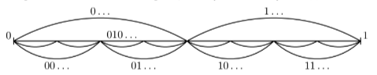

# Discrete Maths, Homework 9

## Problem 1

Consider infinite sequences out of $0$, $1$, and $2$, in which no digit appears two times in a row. It is true that the cardinality of the set of such sequences is the continuum?

---

Firstly, the sequence may start with either $0$, $1$, or $2$. In each option here there would be only two choices to continue building the sequence:

$${\Large 0}\ 
\begin{gathered}
    \nearrow\\\\\searrow
\end{gathered} \ 
\begin{gathered}1\ 
    \begin{gathered}
        \nearrow\\\searrow
    \end{gathered} 
    \ 
    \begin{gathered}
        0\\
        \\
        2
    \end{gathered}
    \\
    2\ 
    \begin{gathered}
        \nearrow\\\searrow
    \end{gathered} 
    \ 
    \begin{gathered}
        0\\
        \\
        1
    \end{gathered}
\end{gathered} \ \ \ \ \ \ \ \ \ \ \ \ 
{\Large 1}\ 
\begin{gathered}
    \nearrow\\\\\searrow
\end{gathered} \ 
\begin{gathered}0\ 
    \begin{gathered}
        \nearrow\\\searrow
    \end{gathered} 
    \ 
    \begin{gathered}
        1\\
        \\
        2
    \end{gathered}
    \\
    2\ 
    \begin{gathered}
        \nearrow\\\searrow
    \end{gathered} 
    \ 
    \begin{gathered}
        0\\
        \\
        1
    \end{gathered}
\end{gathered} \ \ \ \ \ \ \ \ \ \ \ \ 
{\Large 2}\ 
\begin{gathered}
    \nearrow\\\\\searrow
\end{gathered} \ 
\begin{gathered}1\ 
    \begin{gathered}
        \nearrow\\\searrow
    \end{gathered} 
    \ 
    \begin{gathered}
        0\\
        \\
        2
    \end{gathered}
    \\
    2\ 
    \begin{gathered}
        \nearrow\\\searrow
    \end{gathered} 
    \ 
    \begin{gathered}
        0\\
        \\
        1
    \end{gathered}
\end{gathered}$$

Therefore, we may decode the choice of the first digit with one of the following binary words: $\{0, 1, 2\}\mapsto \{00, 01, 10\}$. Then, since we can't place two of the same digits in a row, we either choose the minimum remaining option (let's denote this action with $0$) or the maximum remaining option (similarly, with $1$):

$$\delta_{ij}=\begin{cases}
    0, \text{max is chosen}\\
    1, \text{min is chosen}
\end{cases}$$

Now, list all the sequences as follows: 

$$\begin{split}
        &00\bigm|\delta_{11}\delta_{12}\delta_{13}\dots\\
        &01\bigm|\delta_{11}\delta_{12}\delta_{13}\dots\\
        &10\bigm|\delta_{11}\delta_{12}\delta_{13}\dots\\
        &01\bigm|\delta_{21}\delta_{22}\delta_{23}\dots\\
        &00\bigm|\delta_{21}\delta_{22}\delta_{23}\dots\\
        &10\bigm|\delta_{21}\delta_{22}\delta_{23}\dots\\
        &\ \ \vdots\ \ \ \ \ \ \vdots\ \ \ \ \ \ \vdots\ \ \ \ \ \ \vdots\ \ \ \ \ \ \\
        &01\bigm|\delta_{n1}\delta_{n2}\delta_{n3}\dots\\
        &00\bigm|\delta_{n1}\delta_{n2}\delta_{n3}\dots\\
        &10\bigm|\delta_{n1}\delta_{n2}\delta_{n3}\dots\\
        &\ \ \vdots\ \ \ \ \ \ \vdots\ \ \ \ \ \ \vdots\ \ \ \ \ \ \vdots\ \ \ \ \ \ \\
    \end{split}$$

This sequence is equipotent to $\{0,1\}^\mathbb{N} \Rightarrow$ the cardinarily of the given set is the continuum, q. e. d. 

**Answer:** yes

## Problem 2

Is the cardinality of the set of all straight lines on a plane the continuum? 

---

> Assume that *the plane* in this context is $\mathbb{R^2}$

How do we represent a straight line? A straight line can be defined by two points on a plane: $A_1 =(x_1, y_1)$ and $A_2=(x_2, y_2)$. Therefore, each line is defined by $4$ numbers, each of them $\in \mathbb{R}$. Thus, each line is defined by a vector $\vec{a}=(x_1, y_1, x_2, y_2) \in \mathbb{R}^4$. 

The set of all these vectors has the same cardinality as $\mathbb{R}$ as $|\mathbb{R}^4|=|\mathbb{R}|$. $|\mathbb{R}|$ has the cardinality of the continuum $\Rightarrow$ the given set has the cardinality of the continuum, q. e. d. 

**Answer:** yes

## Problem 3

Is the cardinarity of the set of all total functions from $\mathbb{R \mapsto R}$ the continuum?

---

Per definition, the set of all real functions from a real variable is $\mathbb{R}^\mathbb{R}$.

The set of all total functions from $\mathbb{R \mapsto R}$ is a part of the set of all subsequences from $\mathbb{R}^2$: $\mathcal{P}(\mathbb{R}^2) \Rightarrow \{f \ | \ f\colon \mathbb{R \mapsto R}\}\subseteq\mathcal{P}(\mathbb{R^2})$ .

The cardinalities of $\mathbb{R}$ and $\mathbb{R}^2$ are the same. Therefore, $|\mathcal{P}(\mathbb{R}^2)|=|\mathcal{P}(\mathbb{R})|$. The set of all functions from $\mathbb{R}$ to itself $(\mathbb{R^R})$ would have such a cardinality that

$$|\mathbb{R^R}|\leq |\mathcal{P}(\mathbb{R^2})|=|\mathcal{P}(\mathbb{R})|$$

We can create a bijection from $\mathcal{P}(\mathbb{R})$ to $\{0,1\}^\mathbb{R}$ per the following logic described in the lecture for each value in the function:

Therefore, $|\mathcal{P}(\mathbb{R})|=|\{0,1\}^\mathbb{R}|$. Considering that $|\{0,1\}^\mathbb{R}|\leq|\mathbb{R^R}|$ and the inequation above, we get:

$$|\mathcal{P}(\mathbb{R})|=|\{0,1\}^\mathbb{R}|\leq|\mathbb{R^R}|\leq|\mathcal{P}(\mathbb{R})|$$

$$|\mathcal{P}(\mathbb{R})|\leq|\mathbb{R^R}|\leq|\mathcal{P}(\mathbb{R})|$$

Awesome, therefore,
 
$$|\mathcal{P}(\mathbb{R})|\leq|\mathbb{R^R}|\leq|\mathcal{P}(\mathbb{R})|\Rightarrow|\mathcal{P}(\mathbb{R})|=|\{f \ | \ f\colon \mathbb{R \mapsto R}\}|$$

Since $|\{0,1\}^\mathbb{N}| < |\{0,1\}^\mathbb{R}| = |\mathcal{P}(\mathbb{R})|$, it has the cardinality more that the one of the continuum, thus the required set also has the cardinality **more than the one of the continuum**, q. e. d.

**Answer:** no

## Problem 4

Is the set of all periodic functions $f\colon \mathbb{Q \mapsto Q}$ with period $T\in \mathbb{Q}$ such that $f(x+T)=f(x)$ countable?

---

> Make a parallel with a next-to-identical task from the previous homework. Previously (for natural numbers and a natural period), the cardinality of that set was $|\mathcal{P}(\mathbb{N}^T)|$, where $T\in\mathbb{N}$ was a single natural number. Thus, the set was countable.

Now, we need to consider $T\in \mathbb{Q}$, which doesn't really make sense when we try to take a Cartesian product a non-natural number of times. Previously, the cardinality of the sequence $\{0, 1,\dots, T-1\}$ was always finite. Now, since $[0, T)$ is such that $T\in\mathbb{Q}$, each such set would have an infinite and countable number of elements.

Thus, for each out of **countably infinitely many** elements $T\in Q$, we need to consider some mapping for a **countably infinite** number of values out of $\mathbb{Q}$. Therefore, 

$$\begin{split}
    |\{f \ | \ f\colon \mathbb{Q \mapsto Q}, f(x+T)=f(x), T\in\mathbb{Q}\}|=\ & |\mathbb{Q^Q}|=\\
    &|\{0,1\}^\mathbb{Q}|=\\
    &|\{0,1\}^\mathbb{N}|
\end{split}$$

Since the required set is equipotent to $|\{0,1\}^\mathbb{N}|$, it is uncountable.

**Answer:** no