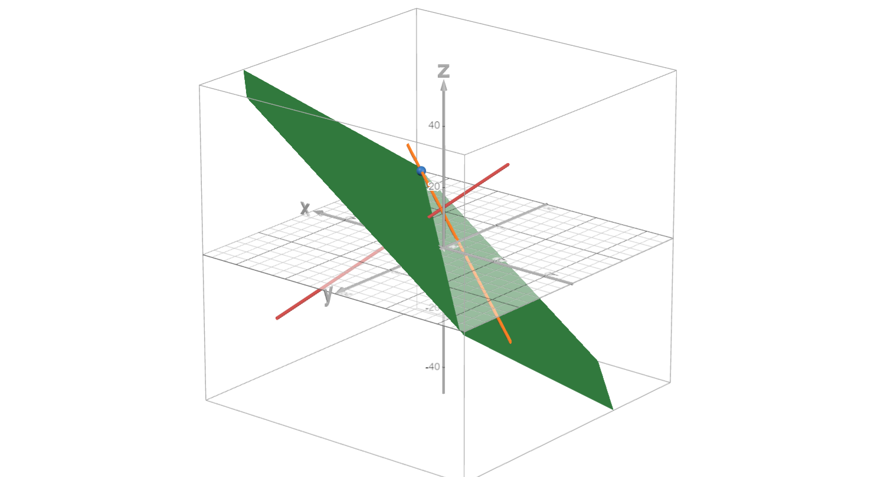
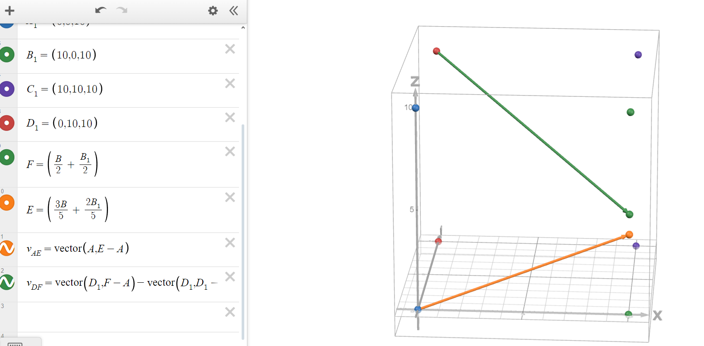
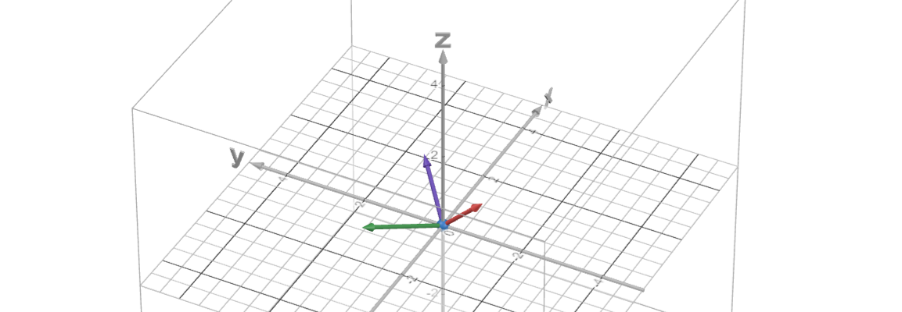
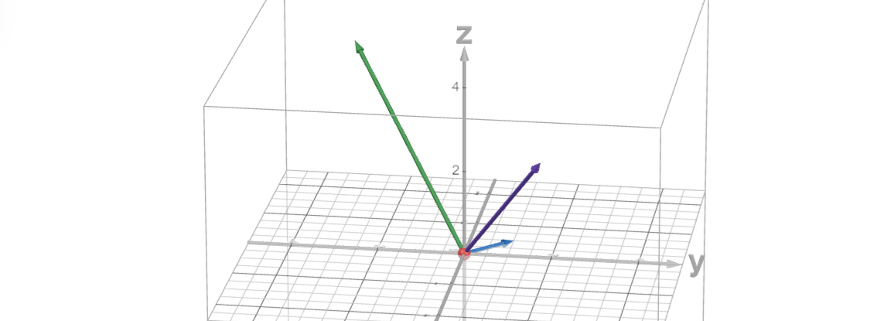

# Individual Homework 9, Variant-19

## Problem 1

Present a line equation in $\mathbb{R}^3$ parallel to plane $-2x-5y+3z=-3$ through point $(39, -14, 7)$ and intersecting the line $x=-t+16,y=-5t-18, z=3t+9$.

---

The required line lies in some plane parallel to the existing one, so it has the same normal but is shifted by some other constant:

$$-2x-5y+3z=d$$

For the line in the plane to intersect some point, our plane definitely should contain the given point:

$$d=-2\times39-5\times-14+3\times7=-78+70+21=13$$

Now we may find the intersection of our plane 

$$-2x-5y+3z=13$$

with the second line:

$$\begin{cases}
    -2x-5y+3z=13\\
    x=-t+16\\
    y=-5t-18\\
    z=3t+9
\end{cases}\implies\begin{cases}
    t=-2\\
    x_0=18\\
    y_0=-8\\
    z_0=3
\end{cases}$$

Thus we may now present the canonical line equation 

$$\frac{x-x_0}{x_1-x_0}=\frac{y-y_0}{y_1-y_0}=\frac{z-z_0}{z_1-z_0}$$

$$\frac{x-18}{39-18}=\frac{y+8}{-14+8}=\frac{z-3}{7-3}$$

$$\frac{x-18}{21}=\frac{y+8}{-6}=\frac{z-3}{4}$$

Proof that everything should be okay:

## Problem 2

Given a cube $ABCDA'B'C'D'$ with side length $10$. Point $F$ is the middle of edge BB', and point $E$ lies on edge $BB'$ given that $BE:EB'=3:2$. Find the angle and the distance between lines $AE$ and $D'F$.

---

Visualization first and foremost:

In this coordinate system we have 

$$A=(0,0,0),\quad E=(10, 0, 4),\quad D'=(0, 10, 10),\quad F=(10, 0, 5)$$

And the lines themselves:

$$AE=\begin{pmatrix}
    10\\
    0\\
    4
\end{pmatrix}t$$

$$D'F=\begin{pmatrix}
    0\\
    10\\
    10
\end{pmatrix}+\begin{pmatrix}
    10-0\\
    0-10\\
    5-10
\end{pmatrix}t=\begin{pmatrix}
    0\\
    10\\
    10
\end{pmatrix}+\begin{pmatrix}
    10\\
    -10\\
    -5
\end{pmatrix}t$$

Now the distance between those lines would be 

$$\rho(AE, D'F)=\frac{|\vec n \cdot \vec r_2|}{||\vec n||}$$

where 

$$\vec r_2=\begin{pmatrix}
    0\\
    10\\
    10
\end{pmatrix},\quad \vec n=\begin{pmatrix}
    10\\
    0\\
    4
\end{pmatrix}\times \begin{pmatrix}
    10\\
    -10\\
    -5
\end{pmatrix}=\begin{vmatrix}
    \vec i & \vec j & \vec k\\
    10 & 0 & 4\\
    10 & -10 & -5
\end{vmatrix}=\begin{pmatrix}
    40\\
    90\\
    -100
\end{pmatrix}$$

$$\vec n \cdot \vec r_2=0\times40+10\times90+10\times-100=900-1000=-100$$

$$||\vec n||=\sqrt{40^2+90^2+100^2}=\sqrt{1600+8100+10000}=10\sqrt{197}$$

$$\rho(AE, D'F)=\frac{10}{\sqrt{197}}$$

Now to find the angle between guiding vectors:

$$\cos(AE,D'F)=\frac{\overrightarrow{AE}\cdot\overrightarrow{D'F}}{|\overrightarrow{AE}||\overrightarrow{D'F}|}=\frac{10\times10+0\times-10+ 4\times-5}{\sqrt{10^2+0^2+4^2}\sqrt{10^2+10^2+5^2}}=\frac{80}{30\sqrt{29}}=\frac{8}{3\sqrt{29}}$$

which implies the degree between AE and D'F would be 

$$\arccos\frac{8}{3\sqrt{29}}$$

## Problem 3

### Subproblem A

Linear operator $\varphi\colon\mathbb{R}^3\to\mathbb{R}^3$ has in a standard basis matrix

$$A=\begin{pmatrix}
    -3 & -8 & -5\\
    -5 & -6 & -5\\
    12 & 18 & 14
\end{pmatrix}$$

Find all eigenvalues of operator $\varphi$ and bases of all its eigensubspaces. Determine whether $\varphi$ is diagonalizable. If it is, then present a basis in which its matrix is diagonalizable and the matrix itself.

---

To find the eigenvalues, solve the characteristic equation:

$$|A-\lambda E|=0$$

$$\begin{vmatrix}
    -3-\lambda & -8 & -5\\
    -5 & -6-\lambda & -5\\
    12 & 18 & 14-\lambda
\end{vmatrix}=\begin{align*}&(-3-\lambda)(-6-\lambda)(14-\lambda)+12\times-8\times-5-5\times-5\times18\\&-12\times-5(-6-\lambda)-18\times-5(-3-\lambda)-(14-\lambda)\times-5\times-8\\&-\lambda^3+5\lambda^2-2\lambda-8=-(\lambda+1)(\lambda-2)(\lambda-4)\end{align*}$$

Thus we get 

$$\lambda\in\{-1,2,4\}$$

and all the algebraic multiplicities would be equal to $1$.

Now, find the corresponding bases:

$$\lambda_1\colon\begin{pmatrix}
    -2 & -8 & -5\\
    -5 & -5 & -5\\
    12 & 18 & 15
\end{pmatrix}\leadsto\begin{pmatrix}
    1 & 0 & \frac{1}{2}\\
    0 & 1 & \frac{1}{2}\\
    0 & 0 & 0
\end{pmatrix}$$

which leads to a basis of 

$$e_{\lambda_1}=\left\langle\begin{pmatrix}
    -1\\
    -1\\
    2
\end{pmatrix}\right\rangle$$

$$\lambda_2\colon\begin{pmatrix}
    -5 & -8 & -5\\
    -5 & -8 & -5\\
    12 & 18 & 12
\end{pmatrix}\leadsto\begin{pmatrix}
    1 & 0 & 1\\
    0 & 1 & 0\\
    0 & 0 & 0
\end{pmatrix}$$

which leads to a basis of 

$$e_{\lambda_2}=\left\langle\begin{pmatrix}
    -1\\
    0\\
    1
\end{pmatrix}\right\rangle$$

$$\lambda_3\colon\begin{pmatrix}
    -7 & -8 & -5\\
    -5 & -10 & -5\\
    12 & 18 & 10
\end{pmatrix}\leadsto\begin{pmatrix}
    1 & 0 & \frac{1}{3}\\
    0 & 1 & \frac{1}{3}\\
    0 & 0 & 0
\end{pmatrix}$$

which leads to a basis of 

$$e_{\lambda_3}=\left\langle\begin{pmatrix}
    -1\\
    -1\\
    3
\end{pmatrix}\right\rangle$$

all the aforementioned bases have the same geometric multiplicity equal to 1. Considering the fact that the characteristic polynomial can be factorized into linear multipliers and the fact that the algebraic and the geometric multiplicities are equal, this linear operator is diagonalizable.

If we would combine all the vectors from the bases above into a matrix, we would get the following basis conversion matrix:

$$\begin{pmatrix}
    -1 & -1 & -1\\
    -1 & 0 & -1\\
    2 & 1 & 3
\end{pmatrix}$$

We may check that this yields us the required eigenvalues:

$$\begin{pmatrix}
    -1 & -1 & -1\\
    -1 & 0 & -1\\
    2 & 1 & 3
\end{pmatrix}^{-1}\begin{pmatrix}
    -3 & -8 & -5\\
    -5 & -6 & -5\\
    12 & 18 & 14
\end{pmatrix}\begin{pmatrix}
    -1 & -1 & -1\\
    -1 & 0 & -1\\
    2 & 1 & 3
\end{pmatrix}=\begin{pmatrix}
    -1 & 0 & 0\\
    0 & 2 & 0\\
    0 & 0 & 4
\end{pmatrix}$$

### Subproblem B

Same for 

$$A=\begin{pmatrix}
    4 & 1 & -2\\
    4 & 6 & -4\\
    4 & 3 & -2
\end{pmatrix}$$

Solving for the characteristic polynomial, we get

$$-\lambda^3+8\lambda^2-20\lambda+16=-(\lambda-4)(\lambda-2)^2$$

and the eigenvalues would be $\lambda\in\{2,4\}$

We understand that the algebraic multiplicity for $\lambda=2$ is $2$. Let's check whether it's the same for the geometric multiplicity:

$$\lambda_1=2\colon\begin{pmatrix}
    2 & 1 & -2\\
    4 & 4 & -4\\
    4 & 3 & -4
\end{pmatrix}\leadsto\begin{pmatrix}
    1 & 0 & -1\\
    0 & 1 & 0\\
    0 & 0 & 0
\end{pmatrix}$$

which leads to a basis of 

$$e_{\lambda_1}=\left\langle\begin{pmatrix}
    1\\
    0\\
    1
\end{pmatrix}\right\rangle$$

which implies that the geometric multiplicity is equal to $1$. Since the algebraic and geometric multiplicities for a single eigenvalue are not the same, the linear operator is not diagonalizable.

The other eigenvalue:

$$\lambda_2=4\colon\begin{pmatrix}
    0 & 1 & -2\\
    4 & 2 & -4\\
    4 & 3 & -6
\end{pmatrix}\leadsto\begin{pmatrix}
    1 & 0 & 0\\
    0 & 1 & -2\\
    0 & 0 & 0
\end{pmatrix}$$

which leads to a basis of 

$$e_{\lambda_2}=\left\langle\begin{pmatrix}
    0\\
    2\\
    1
\end{pmatrix}\right\rangle$$

## Problem 4

Determine the canoncial form to which the form $Q(x_1, x_2, x_3) = 14x_1^2+11x_2^2+11x_3^2+4x_1x_2+4x_1x_3+10x_2x_3$ can be transformed using an orthogonal transformation and this orthogonal transformation. 

---

The quadratic form matrix is

$$\begin{pmatrix}
    14 & 2 & 2 \\
    2 & 11 & 5 \\
    2 & 5 & 11
\end{pmatrix}$$

Now find the characteristic polynomial:

$$-\lambda^3+36\lambda^2-396\lambda+1296=-(\lambda-6)(\lambda-12)(\lambda-18)$$

which means that the eigenvalues are $\lambda\in\{6,12,18\}$

Thus the matrix after diagonalization in a certain basis would be 

$$\begin{pmatrix}
    6 & 0 & 0\\
    0 & 12 & 0\\
    0 & 0 & 18
\end{pmatrix}$$

and the canonical quadratic form would be 

$$6x_1^2+12x_2^2+18x_3^2$$

Find the eigenvectors that generate this new basis:

$$\lambda_1=6\colon\begin{pmatrix}
    8 & 2 & 2 \\
    2 & 5 & 5 \\
    2 & 5 & 5
\end{pmatrix}\leadsto\begin{pmatrix}
    1 & 0 & 0\\
    0 & 1 & 1\\
    0 & 0 & 0
\end{pmatrix}$$

which leads to a basis of 

$$e_{\lambda_1}=\left\langle\begin{pmatrix}
    0\\
    -1\\
    1
\end{pmatrix}\right\rangle$$

$$\lambda_2=12\colon\begin{pmatrix}
    2 & 2 & 2 \\
    2 & -1 & 5 \\
    2 & 5 & -1
\end{pmatrix}\leadsto\begin{pmatrix}
    1 & 0 & 2\\
    0 & 1 & -1\\
    0 & 0 & 0
\end{pmatrix}$$

which leads to a basis of 

$$e_{\lambda_2}=\left\langle\begin{pmatrix}
    -2\\
    1\\
    1
\end{pmatrix}\right\rangle$$

$$\lambda_3=18\colon\begin{pmatrix}
    -4 & 2 & 2 \\
    2 & -7 & 5 \\
    2 & 5 & -7
\end{pmatrix}\leadsto\begin{pmatrix}
    1 & 0 & -1\\
    0 & 1 & -1\\
    0 & 0 & 0
\end{pmatrix}$$

which leads to a basis of 

$$e_{\lambda_3}=\left\langle\begin{pmatrix}
    1\\
    1\\
    1
\end{pmatrix}\right\rangle$$

In turn, we get the final basis which is actually obviously orthogonal, but we will check it by constructing a Gram's matrix:

$$\begin{pmatrix}
    v_1\cdot v_1 & v_1 \cdot v_2 & v_1 \cdot v_3\\
    v_2\cdot v_1 & v_2 \cdot v_2 & v_2 \cdot v_3\\
    v_3\cdot v_1 & v_3 \cdot v_2 & v_3 \cdot v_3\\
\end{pmatrix}=\begin{pmatrix}
    2 & 0 & 0\\
    0 & 6 & 0\\
    0 & 0 & 3
\end{pmatrix}$$

which implies that the vector system is orthogonal.

We may first write out the vectors above into a transformation matrix

$$\begin{pmatrix}
    0 & -2 & 1\\
    -1 & 1 & 1\\
    1 & 1 & 1
\end{pmatrix}$$

now normalize them in the matrix (yeah why not)

$$\begin{pmatrix}
    0 & -\frac{2}{\sqrt{6}} & \frac{1}{\sqrt{3}}\\
    -\frac{1}{\sqrt{2}} & \frac{1}{\sqrt{6}} & \frac{1}{\sqrt{3}}\\
    \frac{1}{\sqrt{2}} & \frac{1}{\sqrt{6}} & \frac{1}{\sqrt{3}}
\end{pmatrix}$$

and the required transformation matrix from the needed pair of bases would be its inverse aka its transposition in this orthonormal case:

$$\begin{pmatrix}
    0 & -\frac{1}{\sqrt{2}} & \frac{1}{\sqrt{2}}\\
    -\frac{2}{\sqrt{6}} & \frac{1}{\sqrt{6}} & \frac{1}{\sqrt{6}}\\
    \frac{1}{\sqrt{3}} & \frac{1}{\sqrt{3}} & \frac{1}{\sqrt{3}}
\end{pmatrix}$$

## Problem 5

Orthogonal linear operator $\varphi:\mathbb{R}^3\to\mathbb{R}^3$ in a standard basis has matrix

$$A=\begin{pmatrix}
    \frac{4}{9} & -\frac{7}{9} & -\frac{4}{9} \\
    -\frac{1}{9} & \frac{4}{9} & -\frac{8}{9} \\
    -\frac{8}{9} & -\frac{4}{9} & -\frac{1}{9}
\end{pmatrix}$$

Find the orthonormal basis in which matrix of the operator $\varphi$ has a canonical form and present this matrix. Present the axis and the rotation angle determined by operator $\varphi$. 

---

The characteristic polynomial would be 

$$-\lambda^3+\frac{7}{9}\lambda^2+\frac{7}{9}\lambda-1=-(\lambda+1)(\lambda^2-\frac{16}{9}\lambda+1)$$

and finding the basis for the only non-complex eigenvalue aka $\lambda=-1$ we get

$$\begin{pmatrix}
    \frac{13}{9} & -\frac{7}{9} & -\frac{4}{9} \\
    -\frac{1}{9} & \frac{13}{9} & -\frac{8}{9} \\
    -\frac{8}{9} & -\frac{4}{9} & \frac{8}{9}
\end{pmatrix}\leadsto\begin{pmatrix}
    1 & 0 & -\frac{2}{3}\\
    0 & 1 & -\frac{2}{3}\\
    0 & 0 & 0
\end{pmatrix}$$

which leads to a basis of the following, which we normalize:

$$e_{\lambda_1}=\left\langle\begin{pmatrix}
    2\\
    2\\
    3
\end{pmatrix}\right\rangle\leadsto\left\langle\begin{pmatrix}
    \frac{2}{\sqrt{17}}\\
    \frac{2}{\sqrt{17}}\\
    \frac{3}{\sqrt{17}}
\end{pmatrix}\right\rangle$$

Now we shall find the basis of the orthogal to our vector subspace, we find the fundamental system of solutions of the following matrix:

$$\begin{pmatrix}
    2 & 2 & 3\\
    0 & 0 & 0\\
    0 & 0 & 0
\end{pmatrix}\leadsto\begin{pmatrix}
    1 & 1 & \frac{3}{2}\\
    0 & 0 & 0\\
    0 & 0 & 0
\end{pmatrix}$$

which leads to the following basis:

$$\bar e=\left\langle\begin{pmatrix}
    -1\\
    1\\
    0
\end{pmatrix},\begin{pmatrix}
    -3\\
    0\\
    2
\end{pmatrix}\right\rangle$$

which we should orthogonalize using the Gram-Schmidt approach, thus giving us

$$\begin{pmatrix}
    -3\\
    0\\
    2
\end{pmatrix}\leadsto\begin{pmatrix}
    -3\\
    0\\
    2
\end{pmatrix}-\frac{3}{2}\begin{pmatrix}
    -1\\
    1\\
    0
\end{pmatrix}\leadsto\begin{pmatrix}
    -\frac{3}{2}\\
    -\frac{3}{2}\\
    2
\end{pmatrix}$$

Sanity check that three vectors are orthogonal:

Thus the non-normalized and normalized bases would be as follows:

$$\left\langle\begin{pmatrix}
    2\\
    2\\
    3
\end{pmatrix},\begin{pmatrix}
    -1\\
    1\\
    0
\end{pmatrix},\begin{pmatrix}
    -3\\
    -3\\
    4
\end{pmatrix}\right\rangle\leadsto\left\langle\begin{pmatrix}
    \frac{2}{\sqrt{17}}\\
    \frac{2}{\sqrt{17}}\\
    \frac{3}{\sqrt{17}}
\end{pmatrix},\begin{pmatrix}
    -\frac{1}{\sqrt{2}}\\
    \frac{1}{\sqrt{2}}\\
    0
\end{pmatrix},\begin{pmatrix}
    -\frac{3}{\sqrt{34}}\\
    -\frac{3}{\sqrt{34}}\\
    \frac{4}{\sqrt{34}}
\end{pmatrix}\right\rangle$$

We may apply our transformation matrix to the linear operator matrix to get:

$$\begin{pmatrix}
    \frac{2}{\sqrt{17}} & -\frac{1}{\sqrt{2}} & -\frac{3}{\sqrt{34}}\\
    \frac{2}{\sqrt{17}} & \frac{1}{\sqrt{2}} & -\frac{3}{\sqrt{34}}\\
    \frac{3}{\sqrt{17}} & 0 & \frac{4}{\sqrt{34}}
\end{pmatrix}^{-1}\begin{pmatrix}
    \frac{4}{9} & -\frac{7}{9} & -\frac{4}{9} \\
    -\frac{1}{9} & \frac{4}{9} & -\frac{8}{9} \\
    -\frac{8}{9} & -\frac{4}{9} & -\frac{1}{9}
\end{pmatrix}\begin{pmatrix}
    \frac{2}{\sqrt{17}} & -\frac{1}{\sqrt{2}} & -\frac{3}{\sqrt{34}}\\
    \frac{2}{\sqrt{17}} & \frac{1}{\sqrt{2}} & -\frac{3}{\sqrt{34}}\\
    \frac{3}{\sqrt{17}} & 0 & \frac{4}{\sqrt{34}}
\end{pmatrix}=\\\begin{pmatrix}
    1 & 0 & 0\\
    0 & -\frac{8}{9} & \frac{\sqrt{17}}{9}\\
    0 & -\frac{\sqrt{17}}{9} & -\frac{8}{9}
\end{pmatrix}=\begin{pmatrix}
    1 & 0 & 0\\
    0 & \cos\arccos(-\frac{8}{9}) & -\sin\arccos(-\frac{8}{9})\\
    0 & \sin\arccos(-\frac{8}{9}) & \cos\arccos(-\frac{8}{9})
\end{pmatrix}=\begin{pmatrix}
    1 & 0\\
    0 & \Pi(\arccos(-\frac{8}{9}))
\end{pmatrix}$$

Thus we get the rotation axis being $\begin{pmatrix}
    \frac{2}{\sqrt{17}}\\
    \frac{2}{\sqrt{17}}\\
    \frac{3}{\sqrt{17}}
\end{pmatrix}$ and the rotation angle being $\arccos(-\frac{8}{9})$.