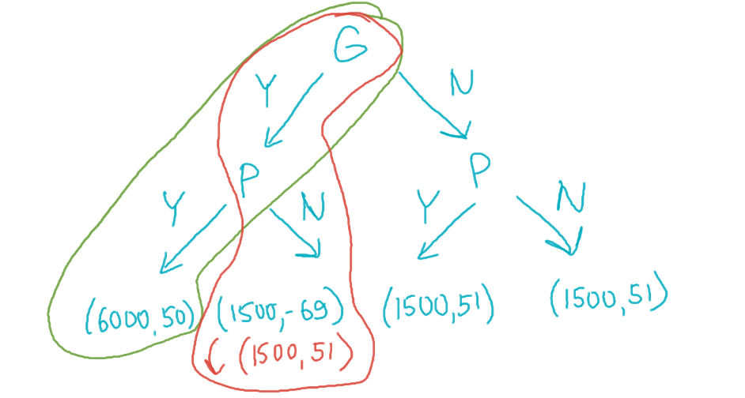

# Microeconomics, Homework 2

## Problem 1

Give a real-life example of the two players dynamic game with a non-credible threat (or commitment). Note that you should describe players, actions, and their payoffs for all outcomes. Solve the game. Provide a way how player/players can make this commitment credible.

---

> Okay, if someone else also thinks of this, it would be ridiculous, but I solemnly swear that I didn't copy this off anyone — this is just a very funny real-life story that happened to us at the end of micro-1 that I couldn't not include.

**Preamble:** Dasha decided to employ a smart strategy to minimize her workload and made a pact with us. If the entirety of the micro-1 course unanimously agrees to give everyone max points for the essay in our last homework on externalities by voting "yes", then everyone would get max points. However, if just a single person votes "no", then this promise would be void, and all essays would be checked fairly.

I shall introduce two agents: $G$ — aggregated group that consists of $120$ people that functions as a hive mind and would always vote the same, and $P$ — the only person who has spent an unreasonable amount of time on the essay and would personally benefit from just, extensive feedback on it.

The metric I'll use in numerical form in this task would be welfare units. The choice table shall be as follows where in $(G, P)$, $G$ denotes the amount of welfare units $G$ group gets from a certain decision, and $P$ denotes the same for person $P$. $Y_i, N_i$ denote amounts of units for each pair of decisions.

The group always goes first and the person reacts to its decisions.

|   | $Y_P$ | $N_P$ |
|:-:|:-:|:-:|
| $Y_G$ | $(6000, 50)$ | $(1500, -69)$ |
| $N_G$ | $(1500, 51)$ | $(1500, 51)$ |

Lore of the table above:

* If the group votes NO, then the person marginally benefits from the joint outcome and always gets a bit more utility than the case when they automatically get max points but no feedback, thus warranting $51$ for all outcomes that lead to the works being checked.
* However, if the person goes against the group, since they care about their reputation, they would drastically lose one welfare point for each person they have disappointed, thus warranting $51-120=-69$ welfare points for themselves.
* If the person votes YES, then they don't get feedback, they marginally lose in terms of welfare and get $50$ points whereas the group would benefit drastically if they vote YES since the difference between max points multiplied by $120$ and the average points, as well as lost welfare points (people were given false hopes that something was going to happen), amount to just $1500$ points.
* If both the group and the person vote NO, then the person gets no penalty since they didn't go against the group and all's well between them.

> **Non-credible threat**: However, the person REALLY wants their essay checked and would try to discourage the group from voting YES by publicly acknowledging that if they decide to vote YES, it wouldn't matter for them because the person would still vote no regardless. The person tries to stand their ground and tells everyone they don't care about everyone's opinions (but secretly, they do care), thus all attempts to vote are futile and they may as well vote no as a group as not to get disappointed further.

The game tree in this case would look like follows:

**Text solution**:

0. The person threatens to vote NO if the group votes YES.
1. Since the group goes first, we would always want to choose the option where everyone gets max points. Therefore, we always vote YES on our turn since we may have a chance to reach $6000$ and would be able to reach $1500$ regardless. Thus, the group is never interested in voting NO.
2. The person, going second, is a bit disappointed at heart that their plan didn't work and since they actually care about others' opinions and don't want to undermine their reputation, they still vote yes. 
3. Thus, the optimal case would be $(G_Y, P_Y)$ at $(6000, 50)$ and the group is happiest as it could ever be, whereas the person is only marginally unhappy about the outcome (albeit a bit salty about it).
4. ???
5. Profit! Game solved!

**How to make this threat credible?**

Let's say that the person doesn't actually care about their reputation long-term in the moment and maximizes their welfare based on this fact, not taking it into account. Then, the option $(G_Y, P_N)$ would be the optimal choice since after the group chooses to vote YES, the person ruins their expectations and hopes for good marks and get their optimal $(1500, 51)$ set, getting $+1$ point over their less-optimal choice of $(6000, 50)$. 

Optimal case visualized as well as the optimal scenario when this threat is actually credible:

## Problem 2

Imagine a watermelon market. There are two firms on the market that have the following cost functions:

$$TC_1(q_1)=\begin{cases}
    0, & q_1=0\\
    c + bq_1, & q_1 > 0
\end{cases},\quad TC_2(q_2)=\begin{cases}
    0, & q_2 = 0\\
    c, & q_2 > 0
\end{cases}$$

$q_i$ — the output of the $i$-th firm, $TC_i(q_i)$ — the cost function of the $i$-th firm. 

Demand is given by function $Q=a-P$, where $Q=q_1+q_2$. Assume that $a, b, c,\geq 0$ and $a>b+2\sqrt{c}$.

### Subproblem A

Firms choose the output simultaneously and independently. Find all the equilibria depending on $a$ and $c$, assuming that $b$ is zero. Explain how your answer depends on parameter $c$.

---

Firstly, let's write down the profit function for both firms. In this case since $b=0$, they will be symmetric so we may apply the same profit function indexed by $i$ to each firm.

$$\pi_i=q_iP-TC_i(q_i)$$

We only have fixed costs for each of the firms. Plug in the equation for $P$, $P=a-q_1-q_2$:

$$\pi_1=q_1(a-q_1-q_2)-c\to\max_{q_1}$$

$$\pi_2=q_2(a-q_1-q_2)-c\to\max_{q_2}$$

Now maximize them,

$$a-2q_1-q_2=0\implies q_1=\frac{a-q_2}{2}$$

$$a-2q_2-q_1=0\implies q_2=\frac{a-q_1}{2}$$

---

Assuming that the players know each other's functions, we may maximize accordingly for $i\neq j$

$$q_i=\frac{a-\frac{a-q_i}{2}}{2}=\frac{\frac{a}{2}+\frac{q_i}{2}}{2}$$

$$\frac{3}{4}q_i=\frac{a}{4}$$

Thus optimal responses would be

$$q_i=\frac{a}{3}$$

However, we also need to ensure that our profit would not be negative.

$$\pi_i=\frac{a}{3}\left(a-\frac{a}{3}-\frac{a}{3}\right)-c=\frac{a^2}{9}-c\geq 0$$

Thus if the costs exceed profit, then we would get the following optimal choices:

$$(q_1, q_2)=\begin{cases}
    (\frac{a}{3}, \frac{a}{3}), & c < \frac{a^2}{9}\\
    (0, 0), & c \ge \frac{a^2}{9}
\end{cases}$$

In $(0, 0)$ case, we end up at a stalemate where each person would technically want to produce something that would cover the costs, but considering that both players think the same and they both would try to take a share of the market for themselves, it's never profitable for them to produce anything when costs exceed $\frac{a^2}{9}$.

The paragraph above implies that $(0, 0)$ would not be a Nash equilibrium. Let's try to find the optimal choice given that we know that the other player is going to not produce anything while costs are still positive (we know that $a>b+2\sqrt{c}>2\sqrt{c}$ so (0,0) would not be an equilibrium)

$$\pi_1=q_1(a-q_1)-c\to\max_{q_1}$$

$$a-2q_1=0\implies q_1=\frac{a}{2}$$

> $a>2\sqrt{c}\implies\frac{a^2}{2}>c$, whereas $\frac{a^2}{2}$ is literally revenue in this case $(\frac{a}{2}(a-\frac{a}{2})=\frac{a^2}{4})$

Symmetrically, we would get two new equilibria, where no other player would want to enter the market since they would not be able to physically profit from it given a fixed output from the other player.

$$NE\colon\left\{\left(\frac{a}{3},\frac{a}{3}\right),\left(0,\frac{a}{2}\right),\left(\frac{a}{2}, 0\right)\right\}$$

Last two $NE$ will be $NE$ only in the case when the other firm can not profit by entering with any output amount.

### Subproblem B

Firms still choose the output simultaneously and independently, but now $b$ is strictly greater than zero. Find all the equilibria. Explain how your answers depends on parameter $c$.

---

Now solve the same kinda task but add parameter $b>0$ into the equation.

$$\pi_1=q_1(a-q_1-q_2)-c-bq_1\to\max_{q_1}$$

$$\pi_2=q_2(a-q_1-q_2)-c\to\max_{q_2}$$

Now maximize them,

$$a-2q_1-q_2-b=0\implies q_1=\frac{a-q_2-b}{2}$$

$$a-2q_2-q_1=0\implies q_2=\frac{a-q_1}{2}$$

and plug one into another

$$q_1=\frac{a-\frac{a-q_1}{2}-b}{2}=\frac{\frac{a}{2}+\frac{q_1}{2}-b}{2}$$

$$\frac{3}{4}q_1=\frac{a}{4}-\frac{b}{2}$$

$$q_1=\frac{a-2b}{3}$$

$$q_2=\frac{a-\frac{a-2b}{3}}{2}=\frac{\frac{2}{3}a+\frac{2b}{3}}{2}=\frac{a}{3}+\frac{b}{3}$$

Now let's ensure that our costs are not higher than profit:

$$\frac{a-2b}{3}\left(a-\frac{a-2b}{3}-\frac{a}{3}+\frac{b}{3}\right)-c-b\frac{a-2b}{3}>0$$

$$c<\frac{a(a-2b)}{9}$$

$$\left(\frac{a}{3}+\frac{b}{3}\right)\left(a-\frac{a-2b}{3}-\frac{a}{3}-\frac{b}{3}\right)-c>0$$

$$c<\frac{(a+b)^2}{9}$$

We also want to consider the case when costs are between

$$\frac{a(a-2b)}{9}<c<\frac{(a+b)^2}{9}$$

when the first firm would cease production.

Let's maximize taking into account $q_1=0$:

$$q_2=\frac{a-q_1}{2}\implies q_2=\frac{a}{2}$$

Therefore the optimal choice would be 

$$(q_1,q_2)=\begin{cases}
    (0, 0), &  c\geq \frac{(a+b)^2}{9}\\
    (0, \frac{a}{2}), & \frac{a(a-2b)}{9}<c<\frac{(a+b)^2}{9}\\
    \left(\frac{a-2b}{3},\frac{a+b}{3}\right), & c\leq \frac{a(a-2b)}{9}
\end{cases}$$

And the Nash equilibria would be 

1. for the first case above $(0, 0)$ would be NE because no firm can exceed the associated costs with production even if it would enter alone
2. for the second case above, $(0, \frac{a}{2})$ would be NE since it's never beneficial for the first firm to enter the market and the second one just takes everything
3. for the third case, just $\left(\frac{a-2b}{3},\frac{a+b}{3}\right)$, would be NE
4. $(\frac{a-b}{2}, 0)$ and $(0,\frac{a}{2})$ would also be NE for the last case whenever the other firm cannot profit when entering the market at any output amount, because in this case they would be maximizing independently from each other and blocking the other firm from entering the market.

### Subproblem C

Now firms compete sequentially: the first firm chooses the output, after which the second firm observes the first firm output and chooses its own output. Consider that the cost function of the first firm is equal to $TC_1(q_1)=0$ and the cost function of the second firm has not changed. Find all the equilibria. Explain how your answer depends on parameter $c$.

---

Solve this game from the end, first let's maximize everything for the second player from any given $q_1$. We also remove the costs entirety from the profit calculations for the first player.

First maximize this:

$$\pi_2=q_2(a-q_1-q_2)-c\to\max_{q_2}$$

$$a-q_1-2q_2=0\implies q_2=\frac{a-q_1}{2}$$

now given this value, we get

$$\pi_1=q_1(a-q_1-q_2)\to\max_{q_1}$$

$$\pi_1=q_1\left(a-q_1-\frac{a-q_1}{2}\right)\to\max_{q_1}$$

$$a-2q_1-\frac{a}{2}+q_1=0\implies q_1=\frac{a}{2}$$

From which follows that 

$$q_2=\frac{a-\frac{a}{2}}{2}=\frac{a}{4}$$

and since costs are $0$ for the first firm, it would always set its output to found $q_1$. 

Whereas for the second firm, it would not want to enter the market if its costs would be too high

let's calculate its costs 

$$\pi_2=\frac{a}{4}\frac{a}{4}-c>0\implies c<\frac{a^2}{16}$$

In the case above, the first firm would still stay at point $\frac{a}{2}$ because it would be the most optimal.

Thus the optimal choices (and Nash equilibria as well in this case) would be 

$$(q_1, q_2)=\begin{cases}
    (\frac{a}{2},\frac{a}{4}), & c\leq \frac{a^2}{16}\\
    (\frac{a}{2},0), & c>\frac{a^2}{16}
\end{cases}$$