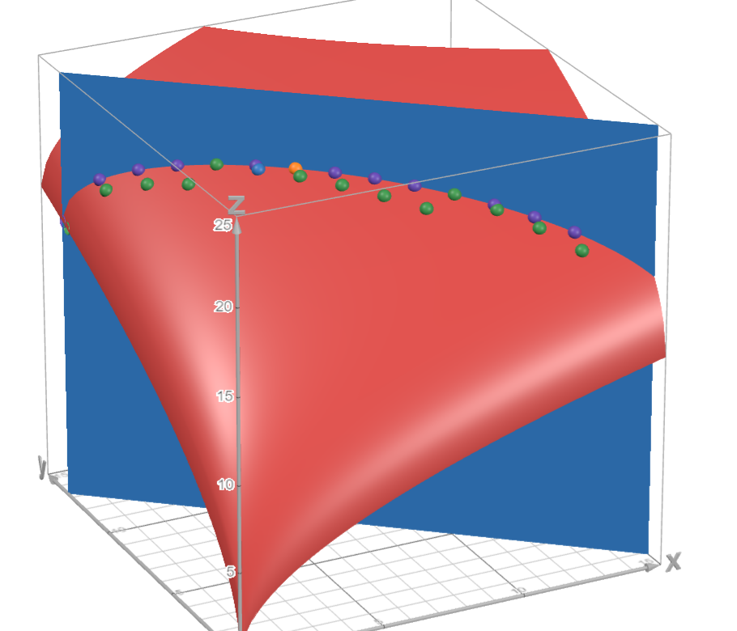

# Тренировочное (нулевое) домашнее задание

*Работа сдается строго в формате markdown (.md).*

## Задания

Все баллы за эту работу — бонусные. Считайте, что следующие домашние задания будут оцениваться по 100-бальной шкале, то есть полный балл за это задание будет соответствовать 10% от оценки за типичное домашнее задание. 

### Задача 1 (2 балла)

В Лабораторию Экспериментальной Экономики пришел человек с рациональными предпочтениями $\succcurlyeq$ на множестве альтернатив $X = \{x, y, z, w\}$. Вам требуется полностью откалибровать его предпочтения.

Работавший до вас ассистент начал заполнять матрицу бинарных отношений, но оставил много пропусков. Вы должны заполнить её до конца.

$$ 
\begin{array}{c|ccc}
 \succcurlyeq & x & y & z & w\\
\hline
x  & * & * & * & * \\
y  & 0 & * & * & * \\
z  & * & 0 & * & * \\
w  & 0 & 0 & 0 & * \\
\end{array}
$$

Вам разрешено задавать человеку только вопросы вида «верно ли, что вы слабо предпочитаете альтернативу А альтернативе Б?». 

> Какое минимальное число вопросов нужно задать, чтобы полностью откалибровать (заполнить матрицу) предпочтения? Аргументируйте.

---

Since the preferences are rational, then one alternative is always either preferable to the other or the person is indifferent to them. This implies that the table cannot have two zeros symmetric over the main diagonal of the matrix. 

Futhermore, the main diagonal may only have ones due to the reflexive properly of rational preferences. Therefore, we may fill almost all missing preferences as follows:

$$ 
\begin{array}{c|ccc}
 \succcurlyeq & x & y & z & w\\
\hline
x  & 1 & 1 & * & 1 \\
y  & 0 & 1 & 1 & 1 \\
z  & * & 0 & 1 & 1 \\
w  & 0 & 0 & 0 & 1 \\
\end{array}
$$

We require to fill two remaining unknown preferences, which can be ascertained through just two questions:

* Is it true that you have a weak preference of $z$ over $x$?
* Is it true that you have a weak preference of $x$ over $z$?

Once again, since preferences are rational, the person cannot physically answer *no* to both options. This leaves a total of three possible options:

#### Answers are yes & yes

> The person is indifferent to both alternatives. However, this contradicts the transitivity axiom, $(y, z), (z, x)\in\ \succcurlyeq$ but $(y, x)\not\in\ \succcurlyeq$, so this is not possible.

$$\begin{array}{c|ccc}
 \succcurlyeq & x & y & z & w\\
\hline
x  & 1 & 1 & 1 & 1 \\
y  & 0 & 1 & 1 & 1 \\
z  & 1 & 0 & 1 & 1 \\
w  & 0 & 0 & 0 & 1 \\
\end{array}$$

#### Answers are yes & no

> The person strongly prefers $z$ to $x$. However, similarly to above, this contradicts the transitivity axiom, $(y, z), (z, x)\in\ \succcurlyeq$ but $(y, x)\not\in\ \succcurlyeq$, so this is not possible.

$$\begin{array}{c|ccc}
 \succcurlyeq & x & y & z & w\\
\hline
x  & 1 & 1 & 0 & 1 \\
y  & 0 & 1 & 1 & 1 \\
z  & 1 & 0 & 1 & 1 \\
w  & 0 & 0 & 0 & 1 \\
\end{array}$$

#### Answers are no & yes

> The person strongly prefers $x$ to $z$.

$$\begin{array}{c|ccc}
 \succcurlyeq & x & y & z & w\\
\hline
x  & 1 & 1 & 1 & 1 \\
y  & 0 & 1 & 1 & 1 \\
z  & 0 & 0 & 1 & 1 \\
w  & 0 & 0 & 0 & 1 \\
\end{array}$$

Squaring the matrix yields 

$$\begin{array}{c|ccc}
 \succcurlyeq^2 & x & y & z & w\\
\hline
x  & 1 & 2 & 3 & 4 \\
y  & 0 & 1 & 2 & 3 \\
z  & 0 & 0 & 1 & 2 \\
w  & 0 & 0 & 0 & 1 \\
\end{array}$$

which implies the binary relation is transitive $\implies$ this is only possible answer.

Since regardless of what questions we ask, there is a deterministic answer, we can certainly say that the matrix is simply an upper diagonal one with all ones over the main diagonal, and we don't even need to ask any questions.

**Answer:** 0 questions.

### Задача 2 (2 балла)

Дозаполните определения выпуклого множества, полезности и предпочтения, постарайтесь не запутаться:

- множество $X$ выпукло если для любых $x,y \in X$: 

$$\forall \alpha \in (0,1): \quad \alpha x + (1-\alpha)y\in X$$

- полезность $U$ выпуклa если для любых $x,y \in X$: 

$$\forall \alpha \in (0,1): U(\alpha x+(1-\alpha)y))\leqslant \alpha U(x)+(1-\alpha)U(y)$$

- предпочтения $\succcurlyeq$ выпуклы если для любых $z \in X$ и $x, y \in L_{+}(z)$: 

$$ \forall \alpha \in (0,1): \quad \alpha x + (1-\alpha)y\in L_+(z)$$

### Задача 3 (5 балла)

> Придумайте задачу для этого курса, основанную на любом материале первых 4 лекций и/или первых 2 семинаров (первых двух недель). Вы можете ориентироваться на задачи семинаров или первые две задачи в этом домашнем задании. Однако, задачи не могут быть скопированы из текущих материалов курса или материалов курса прошлых лет, также не допускается копирование задач из учебников. Задачи должны быть оригинальными, нельзя изменять цифры в существующих задачах и присылать их в качестве решения данного задания. 
> Приведите решение вашей задачи. Решение (или условие задачи) должно содержать график и/или таблицу. 

---

One globule lives in its happy little house in a forest of starfruit and blobfruit trees. Each day, it has $80$ time units to go out and forage resources to keep itself fed. As any self-sufficient globule, it tries to maximize the amount of fruit it collects every day.

The time it takes to collect a single starfruit is $5$ time units and the time it takes to collect a single blobfruit is $6$ time units.

The utility function for starfruit $s$ and blobfruit $b$ is as follows: 

$$U(s, b) = \sqrt{10s}+\sqrt{20b}$$

What is the optimal foraging strategy for a globule considering that

1. it's possible to collect fractional fruit;
2. it's impossible to collect fractional fruit?

---

#### Solution

The budget line for $p=5$, $q=6$, and $W=80$ is $B(s, b)=5s+6b-80$.

The Lagrangian is $\mathcal{L}(s, b | \lambda)=\sqrt{10s}+\sqrt{20b}-\lambda(5s+6b-80)$

$$\begin{cases}\mathcal{L}'_s=\frac{10}{2\sqrt{10s}}-5\lambda=0\\\mathcal{L}'_b=\frac{20}{2\sqrt{20b}}-6\lambda=0\\\mathcal{L}'_\lambda=-(5s+6b-80)=0\end{cases}$$

$$\begin{cases}
    \frac{1}{\sqrt{160-12b}}=\frac{5}{3\sqrt{20b}}\\
    \lambda=\frac{5}{3\sqrt{20b}}\\
    s=16-\frac{6}{5}b
\end{cases}\implies\begin{cases}
    \frac{1}{160-12b}=\frac{5}{36b}\\
    \lambda=\frac{5}{3\sqrt{20b}}\\
    s=16-\frac{6}{5}b
\end{cases}\implies\begin{cases}
    b=\frac{25}{3}\\
    \lambda=\frac{1}{2\sqrt{15}}\\
    s=6
\end{cases}$$

The optimal strategy to subproblem 1 is to get $b=\frac{25}{3}$ blobfruit and $s=6$ starfruit.

To find the optimal solution in discrete amounts of fruit, check utility values for $(s, b)=(6,\lfloor\frac{25}{3}\rfloor)=(6,8)$ and $(s, b)=(6-1,\lceil\frac{25}{3}\rceil)=(5,9)$

$$U(6,8)=\sqrt{10\times6}+\sqrt{20\times8}\approx20.395$$

$$U(5,9)=\sqrt{10\times5}+\sqrt{20\times9}\approx20.487$$

Therefore, the optimal strategy to subproblem 2 is to get $s=5$ starfruit and $b=9$ blobfruit.

Visualization (purple dots denote solutions in subproblem 1, with the orange dot being the optimum, whereas green dots denote solutions in subproblem 2, with the blue dot being the optimum):

### Задача 4 (1 балл)

> В решении прикрепите свою фотографию, а также напишите, разрешаете ли вы публиковать свою задачу в учебнике (если да, укажите, нужно ли указывать авторство). 

> **Notice!** I will NOT use in-line HTML to embed pictures as it is done in the guide because it is a style violatation MD033 and generally not recommended to do. 
> 
> Attributing the pictures themselves with a relative path to futher render a PDF is the preferred option that takes way fewer actions that I will not stop doing since I very frequently use pictures as a visual cue to my solutions and uploading them to a server like this every single time is too cumbersome to my liking.

> Yes, you can publish it
> 
> Yes, you should attribute my authorship