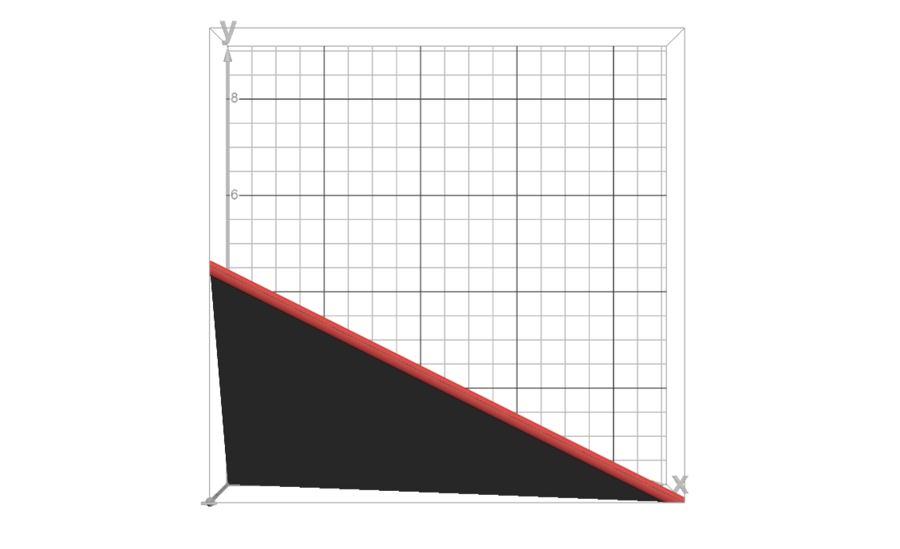
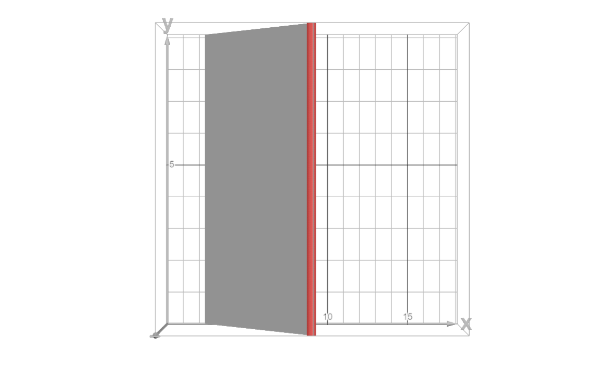
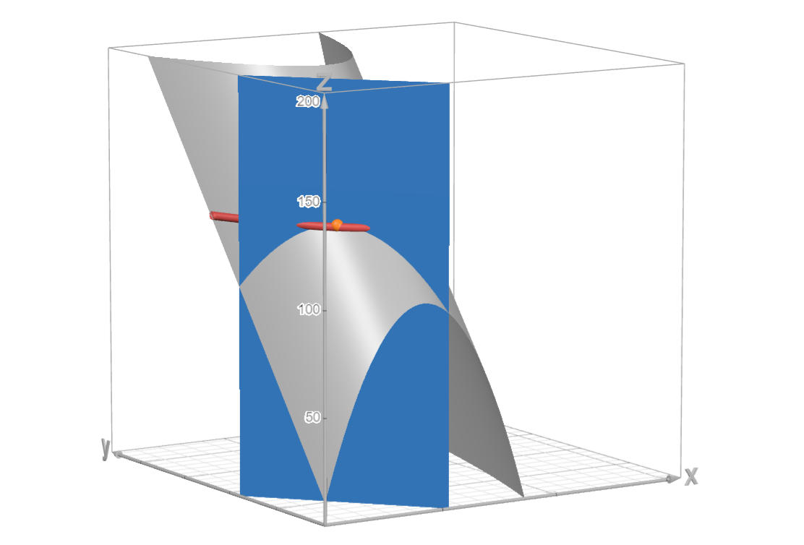
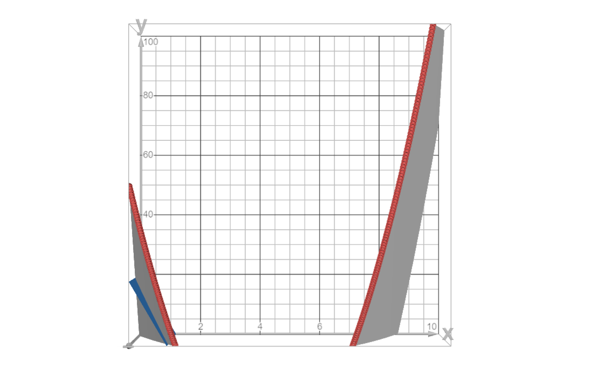

# Первое домашнее задание

### 1. Генератор случайных полезностей (15 баллов)

Василий нашёл некоторую таинственную машину, которая для любых двух заданных Василием благ генерировала функцию полезности, описывающую его предпочтения таким образом, будто других благ не существует в мире. Для некоторых товаров он получил следующие функции полезности:

* $U(x,y) = 42 + x^2 + y$;
* $U(x,y) = \min\{x+2y; x^2\}$;
* $U(x,y) = (3x-7)/4$.
  
Для всех пар товаров скажите, являются ли предпочтения выпуклыми. Проиллюстрируйте графически. 

---

Let's interpret how the first function looks. It looks like an $x^2$ parabola mounted on an $z=y$ graph in the three-dimensional plane shifted by $42$ utility units up. 

Since as $y$ increases, the same level of utility is reached by utilizing less and less $x$, it is pretty obvious that contour lines would slowly arc inwards toward the $y$-axis, compared to the perpendicular to $x$-axis lines (since the function does not depend on $y$) when the utility function is $U(x,y)=x^2+\text{const}$.

> Onwards, upper contour sets are shown as graph paper, and lower contour sets are shown as grey. Contour lines are red.  

Contour lines for $U(x,y)=x^2+42$:

Contour lines for $U(x,y)=x^2+y+42$:

As we may see from the figure above, $L^+$ is not convex, which implies **preferences are not convex.**

Three-dimensional plot for the sake of visualization:

---

We have already seen in the previous task how $U(x,y)=x^2+\text{const}$ looks, so let's graph $U(x,y)x+2y$:

> In the figure it's not black; it's just a very shadow-y grey.

and take the minimum of them to get $U(x,y) = \min\{x+2y; x^2\}$.

Joining two straight contour linessi (which have convex upper contour sets) using a $\min$ function maintains convexities of upper contour sets. This is further backed by the figure above, where the set is clearly convex since all chords between any two points from the contour line would lie within the upper contour set. Therefore, **these preferences are convex.**

Three-dimensional plot for the sake of visualization:

---

This function is perhaps the simplest of all: $U(x,y) = (3x-7)/4$. We just have a linear function that only depends on $x$, which obviously means that **the preferences are convex** since it's linear and it depends on a single variable and as it could be seen below, $L^+(x,y)$ is convex.

Three-dimensional plot once again:

###  2. Что если? (15 баллов)

Что если полезность агента имеет вид $U(x,y) = 10-5x^2 + 42x + y$, цена товара $x$ равна 17, цена товара $y$ равна 1, как тогда зависит потребляемое количества $x$ от дохода $W > 0$? А потребляемое количество $y$?

---

The budget limitation for prices $p=17,q=1$ would be $B(x,y)=17x+y-W\leq0$.

> On the graph, the budget limitation is denoted by blue.

Firstly, find the optimum of the function to figure out the point we have to consider. For this, find the Largangian of the function:

$$\mathcal{L}(x,y|\lambda)=U(x,y)-\lambda B(x,y)$$

$$\mathcal{L}(x,y|\lambda)=10-5x^2 + 42x + y-\lambda(17x+y-W)$$

Write out the first order conditions:

$$\begin{cases}
    \mathcal{L}_x'=0\\
    \mathcal{L}_y'=0\\
    \mathcal{L}_\lambda'=0
\end{cases}\implies\begin{cases}
    -10x+42-17\lambda=0\\
    1-\lambda=0\\
    17x+y-W=0
\end{cases}\implies$$

$$\begin{cases}
    x=\frac{5}{2}\\
    \lambda=1\\
    y=W-17x
\end{cases}\implies\begin{cases}
    x=\frac{5}{2}\\
    \lambda=1\\
    y=W-\frac{85}{2}
\end{cases}$$

Visualizations:

All the optimum points (orange color) for some $W$ happen to lie on a straight line since $x=\text{const}=\frac{5}{2}$

We have already arrived at the solution by writing out $\mathcal{L}$, so the intake of $x$ is constant at $x=\displaystyle\frac{5}{2}$ and the intake of $y$ depends on the budget and is equal to $y=W-\displaystyle\frac{85}{2}$.

However, what would happen if our budget $W$ would not allow us to buy $\displaystyle\frac{5}{2}$ units of good $x$? Then, we would just buy a bit less than that, as shown by the graph below:

Therefore, the final correlation between $W, x, y$ would be:

$$\begin{cases}
    x=\min\left\{\displaystyle\frac{W}{17},\frac{5}{2}\right\}\\
    y=W-x
\end{cases}$$

###  3. Какие-то мармышки (20 баллов)

Известно, что Паша потребляет только два товара мармеладных мишек ($x$) и рыбу ($y$), на которые ежемесячно Паша тратит 10 000 рублей. Он может покупать их возле дома по ценам 100 и 400 за единицу или на оптовой базе по ценам 100 и 150 рублей. Но ему нужно потратить 4000 рублей для того, чтобы добраться до оптовой базы и вернуться домой. Зато на оптовой базе он может получить 5 единиц мармеладных мишек бесплатно для дегустации. 

1. Изобразите бюджетное ограничение Паши. Запишите уравнение бюджетной линии. 
2. Пусть предпочтения Паши описываются функцией полезности $U(x,y) = x^{\alpha} y^{\beta}$, $\alpha, \beta \in (0;1)$. Найдите оптимальный набор для Паши. 
3. Пусть предпочтения Паши описываются функцией полезности $U(x,y) = x^2 +  y^2$. Найдите оптимальный набор для Паши в этом случае. 

---

#### First limitation for $U(x,y) = x^{\alpha} y^{\beta}$

Budget limitation **at home** based on budget $W=10\,000$, prices $p=100$ and $q=400$ is $B(x,y)=100x+400y-10\,000\leq0$.

Corresponding graph:

Let's logarithmically transform the Cobb-Douglas utility function to get $U(x,y)=x^{\alpha} y^{\beta}\sim \overset{\sim}{U}(x,y) = \alpha\log x + \beta\log y$.

Write out the Lagrangian and the first order conditions to find the optimal point:

$$\mathcal{L}(x,y|\lambda)=\alpha\log x + \beta\log y-\lambda(100x+400y-10\,000)$$

$$\begin{cases}
    \mathcal{L}_x'=0\\
    \mathcal{L}_y'=0\\
    \mathcal{L}_\lambda'=0
\end{cases}\implies\begin{cases}
    \frac{\alpha}{x}-100\lambda=0\\
    \frac{\beta}{y}-400\lambda=0\\
    100x+400y-10\,000=0
\end{cases}\implies$$

$$\begin{cases}
    \alpha = 100\lambda x\\
    \beta = 400\lambda y\\
    x + 4y=100
\end{cases}\implies\begin{cases}
    \alpha + \beta=10000\lambda\\
    \beta = 400\lambda y\\
    x=100-4y
\end{cases}\implies\begin{cases}
    \lambda=\frac{\alpha + \beta}{10000}\\
    y=\frac{25\beta}{\alpha + \beta}\\
    x=\frac{100\alpha}{\alpha + \beta}
\end{cases}$$

The visualization is very typical and Cobb-Douglasesque.

Optimal set of goods is $\displaystyle x=\frac{100\alpha}{\alpha + \beta}, y=\frac{25\beta}{\alpha + \beta}$.

#### Second limitation for $U(x,y) = x^{\alpha} y^{\beta}$

Budget limitation **at the wholesale base** based on budget $W_1=10\,000-4\,000=6\,000$, prices $p_1=100$ and $q_1=150$ is $B_1(x,y)=100x+150y-6000\leq0$. 

Same-scale comparison as above:

Since we get $5$ bonus gummy bears, we get bonus free utility and need to modify our utility function as follows: $U(x,y)=(x+5)^{\alpha} y^{\beta}\sim \overset{\sim}{U}(x,y) = \alpha\log(x+5) + \beta\log y$.

Write out the Lagrangian and the first order conditions to find the optimal point:

$$\mathcal{L}(x,y|\lambda)=\alpha\log (x+5) + \beta\log y-\lambda(100x+150y-6\,000)$$

$$\begin{cases}
    \mathcal{L}_x'=0\\
    \mathcal{L}_y'=0\\
    \mathcal{L}_\lambda'=0
\end{cases}\implies\begin{cases}
    \frac{\alpha}{x+5}-100\lambda=0\\
    \frac{\beta}{y}-150\lambda=0\\
    100x+150y-6\,000=0
\end{cases}\implies$$

$$\begin{cases}
    \alpha = 100\lambda x + 500\lambda\\
    \beta = 150\lambda y\\
    2x + 3y=120
\end{cases}\implies\begin{cases}
    \alpha + \beta=6500\lambda\\
    \beta = 150\lambda y\\
    2x + 3y=120
\end{cases}\implies\begin{cases}
    \lambda=\frac{\alpha + \beta}{6500}\\
    y=\frac{130}{3}\frac{\beta}{\alpha + \beta}\\
    x=\frac{60\alpha}{\alpha + \beta}
\end{cases}$$

Cobb-Douglasesque visualization similar to above:

Optimal set of goods for this scenario is $\displaystyle x=\frac{60\alpha}{\alpha + \beta},y=\frac{130}{3}\frac{\beta}{\alpha + \beta}$.

#### Optimum for $U(x,y) = x^{\alpha} y^{\beta}$

Finally, calculate the utility values for each of the cases. Compare the first one to the second one and first when the first option is preferable (first un-normalize everything by multiplying the entire equation by $\displaystyle\frac{1}{(\alpha+\beta)^\alpha(\alpha+\beta)^\beta}$):

$$U_1(x_1,y_2)>U_2(x_1,y_2)$$

$$\left(100\alpha\right)^{\alpha}\left(25\beta\right)^{\beta}-\left(65\alpha+5\beta\right)^{\alpha}\left(\frac{130}{3}\cdot \beta\right)^{\beta}>0$$

$$\left(20\alpha\right)^{\alpha}\left(5\beta\right)^{\beta}-\left(13\alpha+\beta\right)^{\alpha}\left(\frac{26}{3}\cdot \beta\right)^{\beta}>0$$

At this point I have plotted it in desmos and it turned out to linear, therefore assume $\alpha=\gamma\beta$ and substitute it into the equation above.

$$\left(20\gamma\beta\right)^{\gamma\beta}\left(5\beta\right)^{\beta}>\left(13\gamma\beta+\beta\right)^{\gamma\beta}\left(\frac{26}{3}\cdot \beta\right)^{\beta}$$

$$\left(5\beta^{\gamma+1}(20\gamma)^{\gamma}\right)^\beta>\left(\frac{26}{3}\beta^{\gamma+1}\left(13\gamma+1\right)^{\gamma}\right)^{\beta}$$

$$\frac{\left(5\beta^{\gamma+1}(20\gamma)^{\gamma}\right)^\beta}{\left(\displaystyle\frac{26}{3}\beta^{\gamma+1}\left(13\gamma+1\right)^{\gamma}\right)^{\beta}}>1$$

$$\frac{15(20\gamma)^{\gamma}}{26\left(13\gamma+1\right)^{\gamma}}>1$$

Since we know that $\alpha$ and $\beta$ are positive real numbers, then a transcendent solution for the inequation above certainly exists. Using the magic of python, I can estimate that

$$\gamma=0.6892531817663474656295857666\dots$$

Therefore, we get the ratio of $\displaystyle\frac{\beta}{\alpha}=\gamma$ when both utility functions are equal, which implies that we take the first optimal set when $\beta\leq\gamma\alpha$ and the second optimal set when $\beta\geq\gamma\alpha$:

$$\begin{cases}
    (x,y)=\displaystyle\left(\frac{100\alpha}{\alpha + \beta}, \frac{25\beta}{\alpha + \beta}\right), \quad \beta\leq\gamma\alpha\\
    (x,y)=\displaystyle\left(\frac{60\alpha}{\alpha + \beta},\frac{130}{3}\frac{\beta}{\alpha + \beta}\right), \quad \beta\geq\gamma\alpha\\
    \gamma=0.6892531817663474656295857666\dots
\end{cases}$$

---

#### First limitation for $U(x,y) = x^2 + y^2$

Utility function and budget limitation for this case, similarly as above:

$$U(x,y) = x^2 + y^2$$

$$B(x,y)=100x+400y-10\,000\leq0$$

Since $U(x,y)=x^2+y^2$ is a convex utility function, the sought out optimal option would be to simply buy as much of the cheapest good as possible:

We are able to afford $x=\frac{10000}{100}=100$ gummy bear units, which is our optimal choice, and which gives us $x^2=100^2=10000$ utility units:

$$(x,y)=(100,0)$$

#### Second limitation for $U(x,y) = x^2 + y^2$

Utility function and budget limitation for this case, similarly as above:

$$U(x,y) = (x+5)^2 + y^2$$

$$B_1(x,y)=100x+150y-6000\leq0$$

For the same reasons as above, we strive to buy as much of the cheapest good as possible:

We are able to afford $x=\frac{6000}{100}=60$ gummy bear units, which is our optimal choice, and which gives us $(60+5)^2=65^2=4225$ utility units:

$$(x,y)=(60, 0)$$

#### Optimum for $U(x,y) = x^2 + y^2$

The first option gives us more utility, so **the preffered variant is to stay at home and stuff thyself up with gummy bears until you get diabetes: $(x,y)=(100,0)$**

###  4. Вот такие пироги (20 баллов)

Оксана закупает пироги для одного научного мероприятия. Её функция полезности $U(x,y) = 100 - (x-5)^2 - (y-3)^2$, где $x$ — пироги с яйцом,  $y$ — пироги с луком. Запишите функции спроса Оксаны на пироги. Как эти функции зависят от дохода и цен? Являются ли товары субститутами или комплементами? Посчитайте ценовую эластичность спроса на пироги с яйцом. 

###  5. Снеки для Ани (20 баллов)

Ниже приведены покупки снеков Аней в прошлом году с разбивкой по месяцам и с указанием цен в онлайн магазине Киоск. Считайте, что в других магазинах Аня не покупает снеки. Другие снеки она не потребляет. Считайте, что Аня рациональна и её предпочтения не меняются в течение года. 

| клиент | месяц | количество пачек сыра | количество пачек чипсов | цена пачки сыра | цена пачки чипсов |
|----------|----------|----------|----------|----------|----------|
| Аня | Январь | 30 | 0 | 40 | 60 |
| Аня | Февраль | 24 | 0 | 50 | 60 |
| Аня | Март | 12 | 8 | 60 | 60 |
| Аня | Апрель | 3| 17 | 60 | 60 |
| Аня | Май | 5 | 15 | 60 | 60 |
| Аня | Июнь | 13 | 7 | 60 | 60 |
| Аня | Июль | 4 | 16 | 60 | 60 |
| Аня | Август | 0 | 20 | 70 | 60 |
| Аня | Сентябрь | 0 | 20 | 75 | 60 |
| Аня | Октябрь | 16 | 0 | 75 | 80 |
| Аня | Ноябрь | 10 | 5 | 80 | 80 |
| Аня | Декабрь | 3 | 12 | 80 | 80 |

1. Запишите расходы Ани в каждом месяце. 
2. Используя здравый смысл, аргументируйте, являются ли данные снеки субститутами или комплементами? Можете ли вы найти этому подтверждение в данных для Ани? Объясните.
3. Какую из четырех полезностей (полезность Кобба-Дугласа, линейная, квазилинейная, леонтьевская) вы бы выбрали для описания предпочтений Ани? Объясните свой выбор и придумайте способ откалибровать её.
4. Для откалиброванной полезности найдите спрос Ани на сыр и чипсы. 

###  6.  Кривые Энгеля (10 баллов)

Известно, что оптимальный выбор потребителя описывается соотношением $\frac{\sqrt{y}}{\sqrt{x}}$ = $\frac{p}{q}$. Угловых решений нет. 
1. Пусть цены $(p,q)$ = $(1,1)$, изобразите кривую Энгеля в координатах $(x,y)$. 
2. Можете ли вы сказать, являются ли товары нормальными? Аргуметируйте свой ответ.
3. Пусть цена на товар $x$ выросла на 100%, изобразите новую кривую Энгеля на графике со старой. 