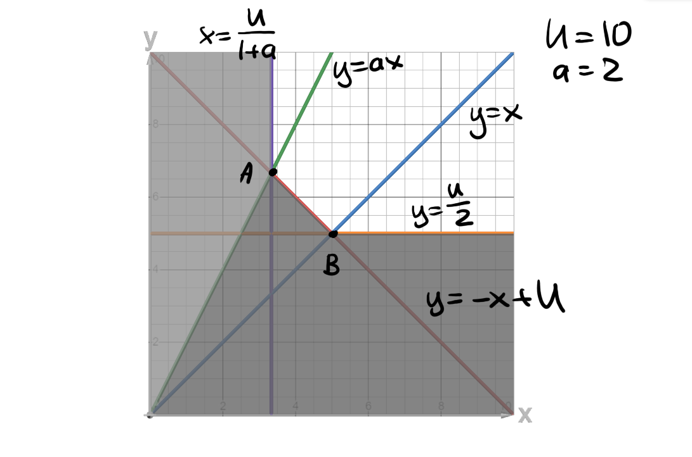

# Второе домашнее задание

*Домашняя работа сдается строго в формате markdown (.md).*

###  1.  Mix (20 баллов)

Для функций полезности ниже сформулируйте задачу минимизации расходов, решите её, найдя функция Хиксианского спроса, и запишите функцию расходов.

1. $U(x,y)=(0.5x^{0.5}+0.5y^{0.5})^{2}$;
2. $U(x,y)= 0.4 \ln (x) + 0.6\ln (y)$;
3. $U(x,y)= \min \{x, y\} + \min \{ax, y\}, a>0$;
4. $U(x,y)= \min \{x, y\} + \max \{x, y\}$.

Также для пункта 3 изобразите решение на графике в координатах $(x;y)$.

---

#### General Logic

Define some fixed $\overline{U}_0$. We need to minimize the expenses $E(p,q,\overline{U})$ depending on prices $p, q$ and fixed utility $\overline{U}_0$:

$$E(p, q, \overline{U})=px+qy,\quad E(p,q,\overline{U})-W\to\min\quad\text{such that}\quad \overline{U}-U(x,y)\leq 0$$

We need to find

$$\begin{cases}
    h_x(p,q,\overline{U})= \diamond\\
    h_y(p,q,\overline{U})= \diamond\\
    E(p,q,\overline{U})=ph_x(p,q,\overline{U})+qh_y(p,q,\overline{U})
\end{cases}
$$

Take the Lagrangian:

$$\mathcal{L}(x,y|\gamma)=(px+qy-W)-\gamma(\overline{U}-U(x,y))$$

Then, to find the optimum, we find the first order conditions:

$$\begin{cases}
    \mathcal{L}'_x=0\\
    \mathcal{L}'_y=0\\
    \mathcal{L}'_\gamma=0
\end{cases}\implies\begin{cases}
    p-\gamma U(x,y)'_x=0\\
    q-\gamma U(x,y)'_y=0\\
    \overline{U}-U(x,y)=0
\end{cases}$$

Expand these conditions for each of the subproblems:

#### Subproblem 1, $U(x,y)=(0.5x^{0.5}+0.5y^{0.5})^{2}$

$$\begin{cases}
    p-\gamma \frac{\partial}{\partial x}((0.5x^{0.5}+0.5y^{0.5})^{2})=0\\
    q-\gamma \frac{\partial}{\partial y}((0.5x^{0.5}+0.5y^{0.5})^{2})=0\\
    \overline{U}-(0.5x^{0.5}+0.5y^{0.5})^{2}=0
\end{cases}\implies\begin{cases}
    p-\gamma \left(\frac{\sqrt{y}}{4 \sqrt{x}} + \frac{1}{4}\right)=0\\
    q-\gamma \left(\frac{\sqrt{x}}{4 \sqrt{y}} + \frac{1}{4}\right)=0\\
    \overline{U}-\frac{(\sqrt{x} + \sqrt{y})^{2}}{4}=0
\end{cases}\implies$$

$$\begin{cases}
    \gamma = \frac{p}{\left(\frac{\sqrt{y}}{4 \sqrt{x}} + \frac{1}{4}\right)}\\
    \gamma= \frac{q}{\left(\frac{\sqrt{x}}{4 \sqrt{y}} + \frac{1}{4}\right)}\\
    \overline{U}=\frac{(\sqrt{x} + \sqrt{y})^{2}}{4}
\end{cases}\implies\begin{cases}
    \frac{p}{\left(\frac{\sqrt{y}}{4 \sqrt{x}} + \frac{1}{4}\right)}=\frac{q}{\left(\frac{\sqrt{x}}{4 \sqrt{y}} + \frac{1}{4}\right)}\\
    \gamma= \frac{q}{\left(\frac{\sqrt{x}}{4 \sqrt{y}} + \frac{1}{4}\right)}\\
    \overline{U}=\frac{(\sqrt{x} + \sqrt{y})^{2}}{4}
\end{cases}\implies\begin{cases}
    p\left(\frac{\sqrt{x}}{4 \sqrt{y}} + \frac{1}{4}\right)=q\left(\frac{\sqrt{y}}{4 \sqrt{x}} + \frac{1}{4}\right)\\
    \gamma= \frac{q}{\left(\frac{\sqrt{x}}{4 \sqrt{y}} + \frac{1}{4}\right)}\\
    4\overline{U}=(\sqrt{x} + \sqrt{y})^{2}
\end{cases}\implies$$

Replace $\frac{\sqrt{x}}{\sqrt{y}}=t$

$$\begin{cases}
    pt + p= q + \frac{q}{t}\\
    \gamma= \frac{q}{\left(\frac{t}{4} + \frac{1}{4}\right)}\\
    4\overline{U}=(\sqrt{x} + \sqrt{y})^{2}
\end{cases}\implies\begin{cases}
    pt^2 + (p-q)t-q=0\\
    \gamma= \frac{q}{\left(\frac{t}{4} + \frac{1}{4}\right)}\\
    4\overline{U}=(\sqrt{x} + \sqrt{y})^{2}
\end{cases}\implies\begin{cases}
    t=\frac{q}{p}\\
    \gamma= \frac{q}{\left(\frac{t}{4} + \frac{1}{4}\right)}\\
    4\overline{U}=(\sqrt{x} + \sqrt{y})^{2}
\end{cases}$$

$$\begin{cases}
    \frac{\sqrt{x}}{\sqrt{y}}=\frac{q}{p}\\
    \gamma= \frac{q}{\left(\frac{q}{4p} + \frac{1}{4}\right)}=\frac{1}{\frac{1}{4p}+\frac{1}{4q}} = \frac{4 p q}{p + q}\\
    4\overline{U}=(\sqrt{x} + \sqrt{y})^{2}=x+2\sqrt{x}\sqrt{y}+y
\end{cases}\implies\begin{cases}
    \frac{\sqrt{x}}{\sqrt{y}}=\frac{q}{p}\\
    \gamma= \frac{4 p q}{p + q}\\
    4\overline{U}=\frac{1}{y}\left(\frac{x}{y}+2\frac{\sqrt{x}}{\sqrt{y}}+1\right)=\frac{1}{y}\left(\frac{p}{q}+1\right)^2
\end{cases}\implies$$

$$\begin{cases}
    \frac{\sqrt{x}}{\sqrt{y}}=\frac{q}{p}\\
    \gamma= \frac{4 p q}{p + q}\\
    y=\frac{\left(\frac{p}{q}+1\right)^2}{4\overline{U}}
\end{cases}\implies\begin{cases}
    x=\frac{(p + q)^{2}}{4 \overline{U} p^{2}}\\
    y= \frac{(p + q)^{2}}{4 \overline{U} q^{2}}\\
    \gamma= \frac{4 p q}{p + q}\\
\end{cases}\implies\begin{cases}
    h_x(p,q,\overline{U})=\frac{(p + q)^{2}}{4 \overline{U} p^{2}}\\
    h_y(p,q,\overline{U})=\frac{(p + q)^{2}}{4 \overline{U} q^{2}}\\
    E(p,q,\overline{U})=\frac{(p + q)^{2}}{4 \overline{U} p}+\frac{(p + q)^{2}}{4 \overline{U} q} = \frac{(p + q)^{3}}{4 \overline{U} p q}
\end{cases}$$

#### Subproblem 2, $U(x,y)= 0.4 \ln (x) + 0.6\ln (y)$

$$\begin{cases}
    p-\gamma \frac{\partial}{\partial x}U(x,y)=0\\
    q-\gamma \frac{\partial}{\partial y}U(x,y)=0\\
    \overline{U}-U(x,y)=0
\end{cases}\implies\begin{cases}
    p-\gamma \frac{\partial}{\partial x}(0.4 \ln (x) + 0.6\ln (y))=0\\
    q-\gamma \frac{\partial}{\partial y}(0.4 \ln (x) + 0.6\ln (y))=0\\
    \overline{U}-(0.4 \ln (x) + 0.6\ln (y))=0
\end{cases}\implies$$

$$\begin{cases}
    p-\frac{2 \gamma}{5 x}=0\\
    q-\frac{3 \gamma}{5 y}=0\\
    \overline{U} - \frac{2}{5}\ln{(x)} - \frac{3}{5}\ln{(y)}=0
\end{cases}\implies\begin{cases}
    p-\frac{2 \gamma}{5 x}=0\\
    q-\frac{3 \gamma}{5 y}=0\\
    \overline{U} - \frac{2}{5}\ln{(x)} - \frac{3}{5}\ln{(y)}=0
\end{cases}\implies$$

$$\begin{cases}
    \frac{5 p x}{2}=\frac{5 q y}{3}\\
    \gamma=\frac{5 q y}{3}\\
    \overline{U} - \frac{2}{5}\ln{(x)} - \frac{3}{5}\ln{(y)}=0
\end{cases}\implies\begin{cases}
    \frac{x}{y}=\frac{2q}{3p}\\
    \gamma=\frac{5 q y}{3}\\
    \overline{U} - \frac{2}{5}\ln{(x)} - \frac{3}{5}\ln{(y)}=0
\end{cases}\implies$$

$$\begin{cases}
    \ln{x}=\ln{y}+\ln{\frac{2q}{3p}}\\
    \gamma=\frac{5 q y}{3}\\
    \ln{y}=\overline{U} + \frac{2}{5}\ln{\frac{2q}{3p}}
\end{cases}\implies\begin{cases}
    x = \frac{2q}{3p}^\frac{7}{5}e^{\overline{U}}\\
    y =\frac{2q}{3p}^\frac{2}{5}e^{\overline{U}}\\
    \gamma=\frac{5 q y}{3}
\end{cases}\implies\begin{cases}
    h_x(p,q,\overline{U})=\frac{2q}{3p}^\frac{7}{5}e^{\overline{U}}\\
    h_y(p,q,\overline{U})=\frac{2q}{3p}^\frac{2}{5}e^{\overline{U}}\\
    E(p,q,\overline{U})=\left(p\frac{2q}{3p}^\frac{7}{5}+q\frac{2q}{3p}^\frac{2}{5}\right)e^{\overline{U}}
\end{cases}$$

#### Subproblem 3, $U(x,y)= \min \{x, y\} + \min \{ax, y\}, a>0$

Instead of tediously listing all cases analytically, I'll use a geometric approach. Consider the case when $a\geq1$ (example for $a=2,\overline{U}=10$):

We get two optimal points $A, B$, which leaves with the following list of optimal solutions for $a \geq 1$ (I will merge the case when $a=1$ with this one for clarity's sake):

$$\begin{align*}
    &\begin{cases}
        h_x(p,q,\overline{U})=\frac{\overline{U}}{1+a}\\
        h_y(p,q,\overline{U})=\overline{U}-\frac{\overline{U}}{1+a} = \frac{\overline{U} a}{1+a}\\
        E(p,q,\overline(U))=p\frac{\overline{U}}{1+a}+q\frac{\overline{U} a}{1+a} = \frac{\overline{U} (a q + p)}{1+a}
    \end{cases}&\quad p \geq q,\quad\text{point} \ A\\
    &\begin{cases}
        h_x(p,q,\overline{U})=\frac{\overline{U}}{2}\\
        h_y(p,q,\overline{U})=\frac{\overline{U}}{2}\\
        E(p,q\overline{U})=p\frac{\overline{U}}{2}+q\frac{\overline{U}}{2} = \frac{\overline{U} (p + q)}{2}
    \end{cases}&\quad p < q,\quad\text{point} \ B\\
\end{align*} \qquad a\geq1$$

Now, consider the case when $a<1$ (for example, $\overline{U}=10,a=0.5$):

which, similarly, results in the following list of solutions:

$$\begin{align*}
    &\begin{cases}
        h_x(p,q,\overline{U})=\frac{\overline{U}}{1+a}\\
        h_y(p,q,\overline{U})=\frac{\overline{U}}{1+a}\\
        E(p,q\overline{U})=p\frac{\overline{U}}{1+a}+q\frac{\overline{U}}{1+a} = \frac{\overline{U} (p + q)}{1+a}
    \end{cases}&\quad p \geq aq,\quad\text{point} \ C\\
    &\begin{cases}
        h_x(p,q,\overline{U})=\frac{\overline{U}}{2a}\\
        h_y(p,q,\overline{U})=\frac{\overline{U}}{2}\\
        E(p,q\overline{U})=p\frac{\overline{U}}{2a}+q\frac{\overline{U}}{2} = \frac{\overline{U} (p+a q)}{2 a}
    \end{cases}&\quad p < aq,\quad\text{point} \ D\\
\end{align*} \qquad a<1$$

#### Subproblem 4, $U(x,y)= \min \{x, y\} + \max \{x, y\}$

This is a simple linear utility function since if we take two numbers, one of them is always the maximum and one of them is always the minimum. Thus, this function is identical to

$$U(x,y)= x + y$$

For this function we already know that it's always best to take as much of the cheapest good as possible (or take either if their prices are the same). Here, we take such an amount of the good so that all utility would be in a single good (or take a linear combination of them if prices are the same, once again, but I'll just group that case into the first one).

$$\begin{cases}
    \begin{cases}
        h_x(p, q, \overline{U})=\overline{U}\\
        h_y(p, q, \overline{U})=0\\
        E(p, q, \overline{U})=p\overline{U}
    \end{cases}\qquad p \leq q\\
    \begin{cases}
        h_x(p, q, \overline{U})=0\\
        h_y(p, q, \overline{U})=\overline{U}\\
        E(p, q, \overline{U})=q\overline{U}
    \end{cases}\qquad p > q
\end{cases}$$

###  2.  Основа проявления полярности бытия в неограниченном ряду парных противоположностей, существующих вместе в постоянном взаимодействии (15 баллов)

Косвенная функция полезности некоторого агента имеет вид

$$
V(p,q,W) = \sqrt{\frac{W(q+a^2p)}{pq}},
$$

1. Запишите функцию расходов, $E(p, q, \bar U)$.
2. Используя $V(p, q, W)$ из условия и тождество Роя, выпишите функции Маршалианского спроса на товары $x, y$ — $m_x, m_y$ соответственно. Яаляются ли блага субститутами? Как потребление зависит от дохода?
3. Используя найденные $m_x, m_y$, выпишите функции Хиксианского спроса на товары $x, y$, то есть $h_x, h_y$ соответственно.
4. Используя найденную $E(p, q, \bar U)$ из пункта 1 и лемму Шепарда, выпишите заново функции Хиксианского спроса на товары $x, y$, то есть $h_x, h_y$ соответственно.
5. Используя найденные $h_x, h_y$, выпишите заново функции Маршалианского спроса на товары $x, y$, то есть $m_x, m_y$ соответственно.
6. Выведите функцию полезности, $U(x, y)$.

---

#### Subproblem 1

Per duality, $W=E(p, q, \bar U), V(p,q,W)=\bar U$

$$V(p,q,E(p, q, \bar U)) = \sqrt{\frac{E(p, q, \bar U)(q+a^2p)}{pq}}\\\bar U = \sqrt{\frac{E(p, q, \bar U)(q+a^2p)}{pq}}\implies pq\bar U^2 = E(p, q, \bar U)(q+a^2p)\implies E(p, q, \bar U)=\frac{pq\bar U^2}{q+a^2p}$$

#### Subproblem 2

Roy's identity implies

$$\begin{pmatrix}
    m_x\\
    m_y
\end{pmatrix}=-\frac{1}{\frac{\partial V}{\partial W}}\nabla_{\begin{pmatrix}
    p\\
    q
\end{pmatrix}}V=-\frac{1}{\frac{\partial V}{\partial W}}\begin{pmatrix}
    \frac{\partial V}{\partial p}\\
    \frac{\partial V}{\partial q}
\end{pmatrix}$$

$$\frac{\partial V}{\partial W} = \frac{\partial}{\partial W}\sqrt{\frac{W(q+a^2p)}{pq}} = \frac{\sqrt{W (\frac{a^{2}}{q} + \frac{1}{p})}}{2 W}$$

$$\frac{\partial V}{\partial p}=\frac{\partial}{\partial p}\sqrt{\frac{W(q+a^2p)}{pq}} = - \frac{q \sqrt{\frac{W (a^{2} p + q)}{p q}}}{2 p (a^{2} p + q)}$$

$$\frac{\partial V}{\partial q}=\frac{\partial}{\partial q}\sqrt{\frac{W(q+a^2p)}{pq}} = - \frac{a^{2} p \sqrt{\frac{W (a^{2} p + q)}{p q}}}{2 q (a^{2} p + q)}$$

$$m_x=-\frac{- \frac{q \sqrt{\frac{W (a^{2} p + q)}{p q}}}{2 p (a^{2} p + q)}}{\frac{\sqrt{W (\frac{a^{2}}{q} + \frac{1}{p})}}{2 W}} = \frac{W q}{p (a^{2} p + q)},\quad m_y=-\frac{- \frac{a^{2} p \sqrt{\frac{W (a^{2} p + q)}{p q}}}{2 q (a^{2} p + q)}}{\frac{\sqrt{W (\frac{a^{2}}{q} + \frac{1}{p})}}{2 W}}  = \frac{W a^{2} p}{q (a^{2} p + q)}$$

$$\begin{pmatrix}
    m_x\\
    m_y
\end{pmatrix}=\begin{pmatrix}
    \frac{W q}{p (a^{2} p + q)}\\
    \frac{W a^{2} p}{q (a^{2} p + q)}
\end{pmatrix}$$

To check whether these are substitutes, find whether $\frac{\partial m_x}{\partial q}\geq 0,\frac{\partial m_y}{\partial p}\geq 0$, respectively:

$$\frac{\partial m_x}{\partial q}=\frac{\partial}{\partial q}\left(\frac{W q}{p (a^{2} p + q)}\right) = \frac{W a^{2}}{(a^{2} p + q)^{2}}\geq0$$

which implies that good $x$ is a substitute to $y$.

$$\frac{\partial m_y}{\partial p}=\frac{\partial}{\partial q}\left(\frac{W a^{2} p}{q (a^{2} p + q)}\right) = -\frac{W a^{2} p (a^{2} p +2 q)}{q^{2} (a^{2} p + q)^{2}}\leq 0$$

which implies that good $y$ is not a substitute to $x$.

To find the relation between good intake and income, find $\frac{\partial m_x}{\partial W},\frac{\partial m_y}{\partial W}$:

$$\frac{\partial m_x}{\partial W}=\frac{\partial}{\partial W}\frac{W q}{p (a^{2} p + q)} = \frac{q}{p (a^{2} p + q)}$$

$$\frac{\partial m_y}{\partial W}=\frac{\partial}{\partial W}\frac{W a^{2} p}{q (a^{2} p + q)} = \frac{a^{2} p}{q (a^{2} p + q)}$$

Both of these goods are normal, thus as income increases, the intake of boths good also increases.

#### Subproblem 3

$$E(p, q, \bar U)=\frac{pq\bar U^2}{q+a^2p}$$

$$\begin{pmatrix}
    m_x\\
    m_y
\end{pmatrix}=\begin{pmatrix}
    \frac{W q}{p (a^{2} p + q)}\\
    \frac{W a^{2} p}{q (a^{2} p + q)}
\end{pmatrix}$$

Find $h_x,h_y$ for $m_x,m_y$ per duality:

$$\begin{pmatrix}
    h_x\\
    h_y
\end{pmatrix}=\begin{pmatrix}
    \frac{E(p, q, \bar U) q}{p (a^{2} p + q)}\\
    \frac{E(p, q, \bar U) a^{2} p}{q (a^{2} p + q)}
\end{pmatrix}=\begin{pmatrix}
    \frac{\frac{pq\bar U^2}{q+a^2p} q}{p (a^{2} p + q)}\\
    \frac{\frac{pq\bar U^2}{q+a^2p} a^{2} p}{q (a^{2} p + q)}
\end{pmatrix}=\begin{pmatrix}
    \frac{\overline{U}^{2} q^{2}}{(a^{2} p + q)^{2}}\\
    \frac{\overline{U}^{2} a^{2} p^{2}}{(a^{2} p + q)^{2}}
\end{pmatrix}$$

#### Subproblem 4

Per Shepherd's Lemma, we know

$$\begin{pmatrix}
    h_x\\
    h_y
\end{pmatrix}=\nabla_{\begin{pmatrix}
    p\\
    q
\end{pmatrix}}E(p,q,\overline{U})=\begin{pmatrix}
    \frac{\partial E}{\partial p}\\
    \frac{\partial E}{\partial q}
\end{pmatrix}=\begin{pmatrix}
    \frac{\partial}{\partial p}\frac{pq\bar U^2}{q+a^2p}\\
    \frac{\partial}{\partial q}\frac{pq\bar U^2}{q+a^2p}
\end{pmatrix}=\begin{pmatrix}
    \frac{\overline{U}^{2} q^{2}}{(a^{2} p + q)^{2}}\\
    \frac{\overline{U}^{2} a^{2} p^{2}}{(a^{2} p + q)^{2}}
\end{pmatrix}$$

#### Subproblem 5

$$\begin{pmatrix}
    h_x\\
    h_y
\end{pmatrix}=\begin{pmatrix}
    \frac{\overline{U}^{2} q^{2}}{(a^{2} p + q)^{2}}\\
    \frac{\overline{U}^{2} a^{2} p^{2}}{(a^{2} p + q)^{2}}
\end{pmatrix}$$

$$V(p,q,W) = \sqrt{\frac{W(q+a^2p)}{pq}}$$

Find $m_x,m_y$ for $h_x,h_y$ per duality (good ol' switcharoo):

$$\begin{pmatrix}
    m_x\\
    m_y
\end{pmatrix}=\begin{pmatrix}
    \frac{V(p,q,W)^{2} q^{2}}{(a^{2} p + q)^{2}}\\
    \frac{V(p,q,W)^{2} a^{2} p^{2}}{(a^{2} p + q)^{2}}
\end{pmatrix}=\begin{pmatrix}
    \frac{\sqrt{\frac{W(q+a^2p)}{pq}}^{2} q^{2}}{(a^{2} p + q)^{2}}\\
    \frac{\sqrt{\frac{W(q+a^2p)}{pq}}^{2} a^{2} p^{2}}{(a^{2} p + q)^{2}}
\end{pmatrix}=\begin{pmatrix}
    \frac{W q}{p (a^{2} p + q)}\\
    \frac{W a^{2} p}{q (a^{2} p + q)}
\end{pmatrix}$$

#### Subproblem 6

To find the original utility function, substitute $px+qy=W$:

$$V(p,q,W) = \sqrt{\frac{W(q+a^2p)}{pq}}$$

$$U(x,y)=V(p,q,px+qy) = \sqrt{\frac{(px+qy)(q+a^2p)}{pq}}$$

We need to somehow get rid of the prices, so find the ratio of $\frac{m_x}{m_y}$ to find how the prices depend on $x,y$:

$$\frac{m_x}{m_y}=\frac{x}{y}=\frac{}{}\frac{\frac{W q}{p (a^{2} p + q)}}{\frac{W a^{2} p}{q (a^{2} p + q)}} = \frac{q^{2}}{a^{2} p^{2}}\implies\frac{x}{y}=\frac{q^{2}}{a^{2} p^{2}}\implies\frac{\sqrt{x}}{\sqrt{y}}=\frac{q}{ap}\implies\frac{q}{p}=\frac{a\sqrt{x}}{\sqrt{y}}$$

$$U(x,y)=\sqrt{\frac{a^2p^2x+a^2pqy+pqx+q^2y}{pq}} = \sqrt{\frac{a^{2} p x}{q} + a^{2} y + x + \frac{q y}{p}}$$

Substitute $\frac{q}{p}=\frac{a\sqrt{x}}{\sqrt{y}},\frac{p}{q}=\frac{\sqrt{y}}{a\sqrt{x}}$:

$$U(x,y)=\sqrt{\frac{a^{2} x\sqrt{y}}{a\sqrt{x}} + a^{2} y + x + \frac{ay\sqrt{x}}{\sqrt{y}}} =\\\sqrt{a^{2} y + 2 a \sqrt{x} \sqrt{y} + x}=\sqrt{(a\sqrt{y}+\sqrt{x})^2}=a\sqrt{y}+\sqrt{x}$$

Therefore, the original function is

$$U(x,y)=a\sqrt{y}+\sqrt{x}$$

###  3. Эта полезность длинная (15 баллов)

Полезность агента имеет вид 

$$
U(x,y,z,v,w) = x^{\alpha} y^{1-\alpha} + \min \{z,v\} +\sqrt{w}, 
$$

где $1 > \alpha > 0$. Цены равны $p, q, r, s, t$
Найдите косвенную полезность агента, если цены и доход задаются стандартно. В задаче есть внутренний и краевой случаи.  

---

$\min \{z,v\}$ implies that it's always optimal to buy the same amount of each good since buying slightly more of the other good but not the other would not contribute anything to the utility function. Therefore, we may replace this good with a single good $u$, on which the utility function would be linearly dependent and for which we would pay a price of $(r+s)$:

$$U(x,y,u,w) = x^{\alpha} y^{1-\alpha} + u +\sqrt{w}$$

$$B(x,y,u,w)=px+qy+(r+s)u+tw-W$$

Let's split the budget $W$ into three parts, $W_{xy}, W_{zv}, W_{w}$, which denotes what fraction of the budgets goes for what kinda functions.

Solve the utility maximization problem for all these three cases:

$$U(x,y)=x^{\alpha} y^{1-\alpha},\quad B(x,y)=px+qy-W_{xy}=0$$

$$U(z,v)=\min \{z,v\}, \quad B(z,v)=rz+sv-W_{zv}=0$$

$$U(w)=\sqrt{w}, \quad B(w)=tw-W_w=0$$

These all have been covered on the lectures and stuff, so the optimum points for these are:

$$x^*=\frac{\alpha W_{xy}}{p}, \quad y^*=\frac{(1-\alpha)W_{xy}}{q}$$

$$z^*=\frac{W_{zv}}{r+s}, \quad v^*=\frac{W_{zv}}{r+s}$$

$$w^*=\frac{W_w}{t}$$

Redefine these guys as shares of the original budget:

$$W_{xy}= x W,\quad W_{zv}= y W,\quad W_w=(1- x- y)W$$

And substitute them back into the original equation:

$$V( x, y,p,q,r,s,t,W) = \frac{\alpha  x W}{p}^{\alpha} \frac{(1-\alpha) x W}{q}^{1-\alpha} + \frac{ y W}{r+s} +\sqrt{\frac{(1- x- y)W}{t}}$$

substitute some values for constants for simplicity's sake

$$\theta=\frac{\alpha W}{p}^{\alpha} \frac{(1-\alpha)W}{q}^{1-\alpha},\quad\xi=\frac{W}{r+s},\quad\psi=\sqrt{\frac{W}{t}}$$

$$V( x, y,\theta,\xi,\psi)= \theta x + \xi y +\psi\sqrt{(1- x- y)}$$

Since calculus taught us well (hail Viktor Lopatkin), we determine that this is a shape bound by these inequations:

$$\begin{cases}
     x \geq 0\\
     y \geq 0\\
    1- x- y\geq0
\end{cases}$$

Thus, we should try to find at extremum at the boundaries and check for any stationary points, checking if they would happen to be maximums.

Check for inner solutions first:

$$\begin{cases}
    \frac{\partial}{\partial  x}(\theta  x+ \xi  y +\psi\sqrt{(1- x- y)}) = \theta - \frac{\psi}{2 \sqrt{1-  x -  y}}=0\\
    \frac{\partial}{\partial  y}(\theta  x + \xi  y +\psi\sqrt{(1- x- y)}) = \xi - \frac{\psi}{2 \sqrt{1-  x -  y}}=0
\end{cases}$$

This implies that $\theta=\xi$, $x+y =1 - \frac{\psi}{2 \xi}^2$. Substitute it back into the original equation:

$$V( x, y,\xi,\psi)= \xi(x + y) +\psi\sqrt{(1- x- y)}=$$

$$=\xi(1 - \frac{\psi}{2 \xi}^2) +\psi\sqrt{(1- (1 - \frac{\psi}{2 \xi}^2))} = - \frac{\psi^{2}}{4 \xi} + \frac{\psi^2}{2\xi} + \xi = \frac{\psi^{2}}{4 \xi} + \xi$$

This is our first alternative for the the maximums.

Now consider all the borders. Firstly, $x=0,y=0$ would be identical, so consider only the option for $x$:

$$V(y,\theta,\xi,\psi)= \xi y +\psi\sqrt{(1- y)}$$

Differentiate by $y$:

$$\frac{\partial}{\partial y}(\xi y +\psi\sqrt{(1- y)}) = - \frac{\psi}{2 \sqrt{1 - y}} + \xi=0\implies$$

Check the second derivative:

$$\frac{\partial V}{\partial^2 y}= - \frac{\psi}{4 (1 - y)^{\frac{3}{2}}}<0$$

which implies this point is truly the maximum, thus

$$y = - \frac{\psi^{2}}{4 \xi^{2}} + 1$$

Similarly,

$$x = -\frac{\psi^2}{4\theta^2}+1$$

And we get the second indirect utility of 

$$V(\xi,\psi)= \xi - \frac{\psi^{2}}{4 \xi^{2}} + 1 +\psi\sqrt{(1- \frac{\psi^{2}}{4 \xi^{2}} + 1)} =\xi+\frac{\psi^2}{4\xi}$$

And the third one, similarly:

$$V(\theta,\psi)=\theta+\frac{\psi^2}{4\theta}$$

Finally, along the line $1-x-y=0$ we get $x+y=1$ and $y=1-x$, thus

$$V( x,\theta,\xi)= \theta x + \xi(1-x)$$

Therefore, the final answer would be some kinda maximum out of these four options. We get

$$\max\left\{\frac{\psi^{2}}{4 \xi} + \xi,\xi+\frac{\psi^2}{4\xi},\theta+\frac{\psi^2}{4\theta},\theta x + \xi(1-x)\right\}$$

first two creatures are the same, so we may simplify this to the following:

$$\max\left\{\xi+\frac{\psi^2}{4\xi},\theta+\frac{\psi^2}{4\theta},\theta x + \xi(1-x)\right\}$$

To visualize the sheer terror that has ensued in this task, substitute the constants back in:

$$\theta=\frac{\alpha W}{p}^{\alpha} \frac{(1-\alpha)W}{q}^{1-\alpha},\quad\xi=\frac{W}{r+s},\quad\psi=\sqrt{\frac{W}{t}}$$

$$V_{\text{final}}=\max\Bigg\{\frac{W}{r+s}+\frac{\sqrt{\frac{W}{t}}^2}{4\frac{W}{r+s}},\\\frac{\alpha W}{p}^{\alpha} \frac{(1-\alpha)W}{q}^{1-\alpha}+\frac{\sqrt{\frac{W}{t}}^2}{4\frac{\alpha W}{p}^{\alpha} \frac{(1-\alpha)W}{q}^{1-\alpha}},\\\frac{\alpha W}{p}^{\alpha} \frac{(1-\alpha)W}{q}^{1-\alpha} x + \frac{W}{r+s}(1-x)\Bigg\}$$

###  4. За Короля! (20 баллов)

Чтобы вызволить Короля Ричарда Львиное Сердце из плена, необходимо собрать 200 тысяч франков с английских крестьян.

Согласно **древним свиткам**, в диету типичного крестьянина входят 3 основных продукта: мясо ($m$-meat), птица ($b$-bird) и овощи ($v$-vegetables). Доля овощей в расходах составляет 1/2, птицы — 1/6, а мяса — 1/12. Оставшаяся доля приходится на все остальные продукты (такие как хлеб и картофель) вместе взятые ($o$-other). Известно, что предпочтения крестьян можно представить с помощью полезности Кобба-Дугласа. 

Всего в Ноттингеме 10 тысяч крестьян. Цены на рынке овощи, птицу и мясо составляют 4, 10 и 30 франков соответственно. Доход репрезентативного крестьянина обозначим за $W>20$.

Советники **Шерифа Ноттингема** предлагают две стратегии налоогообложения. Либо они берут с каждого крестьянина по 20 франков, либо они вводят потоварный налог на один из трех товаров.

1. Сформулируйте задачу максимизации полезности крестьян и **решите** её с параметром $\tau$, размером налога, вводимого на овощи. То есть, вместо стандартной цены $p$, потребитель воспринимает цену $p+\tau$.

2. Опираясь только на теорию потребителя и предоставленную выше информацию, помогите шерифу выбрать необходимый размер налога в каждом из трех случаев: налог на мясо, птицу или овощи. 

3. Опираясь только на теорию потребителя и предоставленную выше информацию, постарайтесь определить, что менее болезненно для крестьян: налог на мясо, птицу, овощи; или третий вид налога — дань в размере 20 франков, которую платят все крестьяне, независимо от того, сколько у них домашних животных.

4. Шериф решил ввести потоварный налог на каждый товар (мясо, птицу и овощи) так, чтобы собрать нужную сумму, максимизировав благосостояние крестьян. Опираясь только на теорию потребителя и предоставленную выше информацию, помогите шерифу выбрать необходимые размеры налогов. С точки зрения крестян лучше ли такое решение, чем те, что предлагали советники Шерифа.

---

#### Subproblem 1

> I will redefine the amount of consumed POULTRY (not bird) as $p$ and not $b$ since I have already solved the entire task using this letter.

Since we know that the optimal proportion of the budget spent on a good in a Cobb-Douglas utility function that looks like 

$$U(m,p,v,o)=m^\alpha p^\beta v^\gamma o^\delta,\quad \alpha+\beta+\gamma+\delta=1$$

is

$$W_i=\frac{W\varepsilon_i}{\alpha+\beta+\gamma+\delta}$$

for $\varepsilon_i \in \{\alpha,\beta,\gamma,\delta\}$

Thus, since we are given $\alpha=\frac{1}{12},\beta=\frac{1}{6},\gamma=\frac{1}{2},\delta=1-\frac{1}{12}-\frac{1}{6}-\frac{1}{2} = \frac{1}{4}$, we get

$$U(m,p,v,o)=m^\frac{1}{12} p^\frac{1}{6} v^\frac{1}{2} o^\frac{1}{4}$$

The budget limitation per the given conditions since we spend $\frac{3}{4}W$ of the budget on anything that is not in the "other" category is 

$$B_0(m,p,v,o)=4v+10p+30m-\frac{3}{4}W$$ 

Introduce a tax on vegetables of size $\tau$, we get 

$$B_1(m,p,v,o)=(4+\tau)v+10p+30m-\frac{3}{4}W$$ 

Optimal solution would be 

$$v^*=\frac{W}{2(4+\tau)},\quad p^*=\frac{W}{6\cdot 10}=\frac{W}{60},\quad m^*=\frac{W}{12\cdot30}=\frac{W}{360}$$

#### Subproblem 2

Extend the optimal selections to all goods:

$$v^*=\frac{W}{2(4+\tau_v)},\quad p^*=\frac{W}{6(10+\tau_p)},\quad m^*=\frac{W}{12(30+\tau_m)}$$

To get the required amount of $200\,000$ francs from all $10\,000$ serfs, we would need to solve the following equation for all optimal selections of goods $t^*$:

$$10\,000t^*\tau_i=200\,000\implies t^*\tau_i=20$$

$$\frac{W}{2(4+\tau_v)}\tau_v = 20 \implies \tau_{v} = \frac{160}{W - 40},\quad W>40$$

$$\frac{W}{6(10+\tau_p)}\tau_p=20 \implies \tau_{p} = \frac{1200}{W - 120},\quad W>120$$

$$\frac{W}{12(30+\tau_m)}\tau_m=20 \implies \tau_{m} = \frac{7200}{W - 240},\quad W>240$$

each of these taxes implies that it would be simply impossible to collect enough money through a single tax on a certain goods in case the mathematical expectation of the budget of a serf is equal to or less than $40, 120,$ and $240$ respectively for each of the cases. 

#### Subproblem 3

To find what is the least painful ~~task~~ tax, we shall calculate the indirect utility for each of the cases assuming that $W>240$ since otherwise the corresponding taxes are impossible to introduce within the given constraints:

$$V_i(v,p,m,o,W)=m^\frac{1}{12} p^\frac{1}{6} v^\frac{1}{2} o^\frac{1}{4}$$

Optimal points with and without taxes:

$$v^*=\frac{W}{2\cdot4}=\frac{W}{8},\quad p^*=\frac{W}{6\cdot 10}=\frac{W}{60},\quad m^*=\frac{W}{12\cdot30}=\frac{W}{360}$$

$$v^*=\frac{W}{2(4+\tau_v)},\quad p^*=\frac{W}{6(10+\tau_p)},\quad m^*=\frac{W}{12(30+\tau_m)}$$

Let's monotonously transform the indirect utility functions:

$$V_i(v,p,m,o,W)=m^\frac{1}{12} p^\frac{1}{6} v^\frac{1}{2} o^\frac{1}{4}\xrightarrow{.^{12}}m p^2 v^6 o^3\xrightarrow{\frac{.}{o^3}}m p^2 v^6$$

Indirect utility values:

$$V_v(v,p,m,o,W)=\frac{W}{360}\frac{W}{60}^2\frac{W}{2(4+\tau_v)}^6 = \frac{W^{9}}{82944000 (\frac{160}{W - 40} + 4)^{6}} =$$

$$=\frac{W^{3} (W - 40)^{6}}{339738624000}\sim W^{3} (W - 40)^{6}$$

$$V_p(v,p,m,o,W)=\frac{W}{360}\frac{W}{6(10+\tau_p)}^2\frac{W}{8}^6 = \frac{W^{9}}{3397386240 (\frac{1200}{W - 120} + 10)^{2}} =$$

$$=\frac{W^{7} (W - 120)^{2}}{339738624000}\sim W^{7} (W - 120)^{2}$$

$$V_m(v,p,m,o,W)=\frac{W}{12(30+\tau_m)}\frac{W}{60}^2\frac{W}{8}^6 = \frac{W^{9}}{11324620800 (\frac{7200}{W - 240} + 30)} =$$

$$=\frac{W^{8} (W - 240)}{339738624000}\sim W^{8} (W - 240)$$

Compare this to a indirect utility function value where we reduce $W$ by $20$:

$$V_W(v,p,m,o,W)=\frac{W-20}{360}\frac{W-20}{60}^2\frac{W-20}{8}^6 = \frac{(W - 20)^{9}}{339738624000}\sim(W-20)^9$$

Since the series as $W\to\infty$

$$\left(\frac{(W-20)^9}{V_{v,p,m}}\right)$$

is descending and 

$$\lim_{W\to\infty}\frac{(W-20)^9}{V_{v,p,m}}=1$$

then the least painful tax appears to be a fixed sum of $20$ francs

#### Subproblem 4

Take the optimal points from subproblem above and say that each tax for each good shall be introduced:

$$v^*=\frac{W}{2(4+\tau_v)},\quad p^*=\frac{W}{6(10+\tau_p)},\quad m^*=\frac{W}{12(30+\tau_m)}$$

This means that, following the logic from above, we require

$$\frac{W}{2(4+\tau_v)}\tau_v+\frac{W}{6(10+\tau_p)}\tau_p+\frac{W}{12(30+\tau_m)}\tau_m-20=0$$

Let's take the transformed utility function and do some more transformations to it:

$$U(m,p,v)=m p^2 v^6 = \frac{W}{12(30+\tau_m)} \frac{W}{6(10+\tau_p)}^{2} \frac{W}{2(4+\tau_v)}^{6}\sim$$

$$\sim\frac{1}{30+\tau_m} \frac{1}{10+\tau_p}^{2} \frac{1}{4+\tau_v}^{6}\sim-\log(30+\tau_m)-2\log(10+\tau_p)-6\log(4+\tau_v)$$

First order conditions:

$$\begin{cases}
    -\frac{1}{30+\tau_m}-\lambda\frac{5 W}{2 (\tau_m + 30)^{2}}=0\\
    -\frac{2}{10+\tau_p}-\lambda\frac{5 W}{3 (\tau_p + 10)^{2}}=0\\
    -\frac{6}{4+\tau_v}-\lambda\frac{2 W}{(\tau_v + 4)^{2}}=0\\
    \frac{W}{2(4+\tau_v)}\tau_v+\frac{W}{6(10+\tau_p)}\tau_p+\frac{W}{12(30+\tau_m)}\tau_m-20=0
\end{cases}\implies$$

$$\begin{cases}
    \tau_m = - \frac{5 W \lambda}{2} - 30\\
    \tau_p = - \frac{5 W \lambda}{6} - 10\\
    \tau_v = - \frac{W \lambda}{3} - 4\\
    \lambda = - \frac{36}{3 W - 80}
\end{cases}\implies\begin{cases}
    \tau_m = \frac{2400}{3 W - 80}\\
    \tau_p = \frac{800}{3 W - 80}\\
    \tau_v = \frac{320}{3 W - 80}\\
    \lambda = - \frac{36}{3 W - 80}
\end{cases}$$

To check whether this decision is better, calculate the indirect utility function value from above:

$$V(v,p,m,W)=\frac{W}{12(30+\tau_m)}\frac{W}{6(10+\tau_p)}^2\frac{W}{2(4+\tau_v)}^6=$$

$$=\frac{W}{12(30+\frac{2400}{3 W - 80})}\frac{W}{6(10+\frac{800}{3 W - 80})}^2\frac{W}{2(4+\frac{320}{3 W - 80})}^6 =$$

$$=\frac{(3 W - 80)^{9}}{6687075336192000}\sim\frac{339738624000(3 W - 80)^{9}}{6687075336192000} = \frac{(3 W - 80)^{9}}{19683}$$

Comparing this utility value to the value from above (not going to write this because I'm too lazy at this point), we get that it is worse for the typical serf, so the optimal variant is still to simply pay a constant tax of $20$ francs. It has also be noted that it is only possible to collect enough tax if the mathematical expectation of the budget of a typical serf is $W>\frac{80}{3}$.

###  5. Дыня (18 баллов)

Ваня тратит свой доход (зарплату) 100 тысяч рублей на кофе $y$ (в чашках) и все остальное $x$. Полезность Вани от потребления этих благ имеет вид $u(x, y) = x + \ln y$. Чашка кофе стоит 250 рублей ($q = 0.25$), цена $x$ нормирована к одной тысяче рублей ($p = 1$). 

1. Найдите, сколько чашек кофе выпьет Ваня. Какую полезность он получает?
2. При каком уровне дохода и каких ценах Ваня откажется от всего остального и будет пить только кофе? Сколько чашек кофе он будет выпивать?
3. Владелец кафе решает провести акцию и сделать небольшую скидку на кофе в размере $s<0.25$ рублей за стакан. Найдите, сколько кофе будет пить Ваня в зависимости от размера скидки. 
4. Ване предложили новую работу на другой станции метро. Там тоже есть его любимое кафе (и тот же кофе!), однако нет никаких скидок. Как (на сколько) минимально должна измениться зарплата Вани, чтобы он согласился сменить работу?
5. Что если скидка не была бы бесплатной: чтобы её получить, Ване необходимо было купить карту постоянного покупателя. Какую максимальную сумму он готов был заплатить за такую карту? Выгодно ли такое предложение владельцу кафе?

---

#### Subproblem 1

Budget limitation is $$B(x,y)=x+\frac{y}{4}-100$$

First order conditions:

$$\begin{cases}
    1-\lambda = 0\\
    \frac{1}{y}-\frac{\lambda}{4}=0\\
    x+\frac{y}{4}-100=0
\end{cases}\implies\begin{cases}
    \lambda = 1\\
    y = 4\\
    x=99
\end{cases}$$

This implies that Vanya would drink $4$ cups of coffee per month.

#### Subproblem 2

Solve the same problem symbolically:

Budget limitation is $$B(x,y)=px+qy-W$$

First order conditions:

$$\begin{cases}
    1-\lambda p = 0\\
    \frac{1}{y}-\lambda q=0\\
    px+qy-W=0
\end{cases}\implies\begin{cases}
    \lambda = \frac{1}{p}\\
    y = \frac{p}{q}\\
    x = \frac{W - p}{p}
\end{cases}$$

For Vanya to only drink coffee, we need 

$$x = \frac{W - p}{p}<0\implies W-p<0\implies W<p$$

whereas price of coffee $q$ only affects how much coffee he would be able to buy and doesn't affect whether he would start buying other goods. 

#### Subproblem 3

Solve the very same problem for the price of coffee being $\frac{1}{4}-s$:

$$\begin{cases}
    \lambda = \frac{1}{p}\\
    y = \frac{p}{q}\\
    x = \frac{W - p}{p}
\end{cases}\implies\begin{cases}
    \lambda = 1\\
    y = \frac{1}{\frac{1}{4}-s} = \frac{4}{1- 4 s}\\
    x = 99
\end{cases}$$

Thus, Vanya would drink $\frac{4}{1- 4 s}$ cups of coffee depending on the discount.

#### Subproblem 4

Vanya's current utility with a certain discount is

$$U(x,y)=99+\ln\left(\frac{4}{1-4s}\right)$$

We need to increase Vanya's salary by some value $\Delta W$ and calculate the new utility value for $(x,y)=(99+\Delta W,4)$:

$$U(x,y)=99+\Delta W+\ln(4)$$

Equate these two to find the minimum increase in salary that would entice Vanya to change his job:

$$99+\ln\left(\frac{4}{1-4s}\right)=99+\Delta W+\ln(4)$$

$$\ln\left(\frac{4}{1-4s}\right)=\Delta W+\ln(4)$$

$$\Delta W = \ln\left(\frac{1}{1 - 4 s}\right)$$

#### Subproblem 5

We need to make it so that the bargain when we pay the price for a membership card, which decreases our budget by $m$, would have a higher or the same level of utility than than not buying a membership card:

$$100 -m- 1 +\ln\left(\frac{4}{1-4s}\right)\geq 100-1+\ln(4)$$

$$m\leq\ln\left(\frac{4}{1-4s}\right)-\ln(4)$$

$$m\leq\ln\left(\frac{1}{1-4 s}\right)$$

which is coincidentally the same value as in subproblem above.

Assume that the cafe owner introduces the price at $\ln\left(\frac{1}{1-4 s}\right)$.

Then, they would get a gross revenue of

$$\ln\left(\frac{1}{1-4 s}\right)+\frac{4}{1- 4 s}\left(\frac{1}{4}-s\right)=\ln\left(\frac{1}{1-4 s}\right)+1$$

which is higher than the revenue

$$\frac{1}{4}\times4=1$$

Assuming that the expenses that the cafe owner spends to produce a single cup of coffee are $x$, we may compare these cases:

$$\ln\left(\frac{1}{1-4 s}\right)+1-\frac{4x}{1- 4 s}\geq1-4x$$

$$\ln\left(\frac{1}{1-4 s}\right)\geq\frac{4x}{1- 4 s}-4x$$

$$x\leq\frac{\ln\left(\frac{1}{1-4 s}\right)}{4(\frac{1}{1- 4 s}-1)}$$

$$x\leq\frac{(1 - 4 s) \ln{(\frac{1}{1-4s})}}{16 s}$$

Thus, it is only beneficial to the cafe owner when the expenses for a single coffee cup do not exceed $\frac{(1 - 4 s) \ln{(\frac{1}{1-4s})}}{16 s}$.

###  6. О всяких деньгах (12 баллов)

Определите, о какой вариации (компенсирующей или эквивалентной) дохода идет речь в каждом из этих примеров, поясните свой выбор. Проиллюстрируйте эти вариации графически.

1. Правительство рассматривает возможные варианты государственной поддержки молодых семей в условиях увеличения процентной ставки по ипотеке. Так, например, при увеличении процентной ставки правительство обещает выплатить каждой молодой семье, взявшей кредит по ипотеке, минимальную сумму денег, которая позволила бы не ухудшить положение молодой семьи. Определите вариацию дохода, которая будет выплачена молодой семье.

2. Предположим, что недобросовестный служащий банка предлагает клиенту снизить процентную ставку по кредиту за некоторое вознаграждение. В результате переговоров клиент соглашается выплатить банковскому служащему взятку, равную максимальной суммой денег, которую он готов заплатить за снижение процентной ставки.

3. Городские власти планируют субсидировать озеленение прилежащей к домохозяйству территории для тех домохозяйств, которые своевременно вносят коммунальные платежи. Однако вместо снижения стоимости зеленых насаждений и услуг по озеленению, власти планируют выплатить каждому домохозяйству минимальную сумму, которая необходима, чтобы положение домохозяйства стало таким же, как если бы была предоставлена субсидия на стоимость зеленых насаждений и услуг по озеленению.

4. Работодатель предлагает своему сотруднику должность с повышением оклада в филиале предприятия, который находится в другом городе. Цены на продукты питания в этом городе существенно выше, чем в том, где сотрудник живет и работает сейчас. Цены на все остальные товары и услуги практически такие же. Работодатель предлагает сотруднику назвать минимальную сумму, на которую должен повыситься его оклад, при условии, что сотрудник согласится на работу в филиале.

---

#### Subproblem 1

This case refers to compensatory variation. Notice that the state of the newly-formed family shan't worsen. This means that the status quo is utility $U_0$. Then, as the interest rate increases, the government shall pay such a sum to the household so that their utility wouldn't decrease in relation to $U_0$.

---

#### Subproblem 2

This case refers to equivalent variation. We understand that if we have a high interest rate, then the client gets a lesser level of utility. Take utility $U_1$ as the status quo. Then, the maximum sum that the client is willing to pay is equivalent for them to the loss in utility if the high interest rate remains at old prices instead of a lower one. This maximum sum would precisely be equivalent variation.  

---

#### Subproblem 3

This case also refers to equivalent variation. If the government were to lower the price for greenery plantations for these households then their utility would increase, so here the status quo is not the current utility but rather the potential utility in the future, aka $U_1$. In this case, the government needs to determine the change of the income that would allow the agents to receive utility $U_1$ in the case if the subsidies would not be introduced. This difference is precisely equivalent variation.

---

### Subproblem 4

This case refers to compensatory variation. Right now, the employee is living in their city where the prices are low. If they were to move cities, they would encounter high prices for goods and their utility would decrease in relation to utility $U_0$, which we shall consider status quo for this case. Then, compensatory variation is determined as the precise sum that an employee shall receive to restore the previous level of utility.

---

### Appendix. Failed Attempts at Solving Tasks

Using the default budget limitation, find the Lagrangian and the first order conditions for two cases:

$$B(x,y,z,v,w)=px+qy+rz+sv+tw-W$$

$$\mathcal{L}(x,y,z,v,w|\lambda)=U(x,y,z,v,w)-\lambda B(x,y,z,v,w)$$

$\min \{z,v\}$ implies that it's always optimal to buy the same amount of each good since buying slightly more of the other good but not the other would not contribute anything to the utility function. Therefore, we may replace this good with a single good $u$, on which the utility function would be linearly dependent and for which we would pay a price of $(r+s)$:

$$U(x,y,z,v,w) = x^{\alpha} y^{1-\alpha} + u +\sqrt{w}$$

$$B(x,y,z,v,w)=px+qy+(r+s)u+tw-W$$

$$\mathcal{L}(x,y,z,v,w|\lambda)=x^{\alpha} y^{1-\alpha} + u +\sqrt{w}-\lambda(px+qy+(r+s)u+tw-W)$$

Then, to find the optimum, we find a ton of first order conditions:

$$\begin{cases}
    \mathcal{L}'_x=0\\
    \mathcal{L}'_y=0\\
    \mathcal{L}'_u=0\\
    \mathcal{L}'_w=0\\
    \mathcal{L}'_\lambda=0
\end{cases}\implies\begin{cases}
   \alpha x^{\alpha - 1}y^{1 - \alpha} -\lambda p=0\\
   (1-\alpha)x^\alpha y^{-\alpha}-\lambda q=0\\
   1-\lambda (r+s)=0\\
   \frac{1}{2\sqrt{w}}-\lambda t=0\\
   px+qy+(r+s)u+tw-W=0
\end{cases}\implies$$

$$\begin{cases}
   \alpha x^{\alpha - 1}y^{1 - \alpha} -\frac{1}{r+s} p=0\\
   (1-\alpha)x^\alpha y^{-\alpha}-\frac{1}{r+s} q=0\\
   \frac{1}{2\sqrt{w}}-\frac{1}{r+s} t=0\\
   \lambda=\frac{1}{r+s}\\
   u = \frac{W - p x - q y - t w}{r + s}
\end{cases}\implies\begin{cases}
   x = (\frac{p y^{\alpha - 1}}{\alpha (r + s)})^{\frac{1}{\alpha - 1}}\\
   (1-\alpha)((\frac{p y^{\alpha - 1}}{\alpha (r + s)})^{\frac{1}{\alpha - 1}})^\alpha y^{-\alpha}-\frac{1}{r+s} q=0\\
   w = \frac{(r + s)^{2}}{4 t^{2}}\\
   \lambda=\frac{1}{r+s}\\
   u = \frac{W - p x - q y - t w}{r + s}
\end{cases}\implies$$

So, what can we infer from the optimal points that we have been left with? It appears that it's always optimal to buy some constant amounts of goods $x,y,w$ until the gained utility per money spent becomes lesser than buying simply buying good $u$, and only then spend all our money on good $u$ (pairs of $z, v$ in equal amounts). Assume that we require $W_1=px^*+qy^*+tw^*$ to buy the optimal set of goods and define the remainder as $W-W_1=\Delta W$.

Thus, we would spend a proportional to their prices amount of money on individual goods $z,v$:

$$u^*=\frac{\Delta W}{r+s}\implies z^*=\frac{r\Delta W}{(r+s)^2}, \quad v^*=\frac{s\Delta W}{(r+s)^2}$$

This holds valid only if we have enough money $(\Delta W\geq 0)$ to afford the optimal set of goods $x, y, w$. Thus, the answer for this case is:

$$\begin{cases}
   x^*=\frac{p}{\alpha(r+s)}^{\frac{1}{\alpha-1}}\\
   y^*=\frac{(1-\alpha)(r+s)}{q}^\frac{1}{\alpha}\\
   w^*=\frac{(r+s)^2}{t^2}\\
   z^*=\frac{r\Delta W}{(r+s)^2}\\
   v^*=\frac{s\Delta W}{(r+s)^2}
\end{cases}\qquad\Delta W\geq0$$

However, what happens if we don't have enough money to afford the optimal set of goods $x,y,w$? This occurs when 

$$\Delta W<0\iff W<px^*+qy^*+tw^*$$

We want to find the optimal choice of goods when our budget is under the one required to afford the optimal set. For this, we need to optimize this problem for three variables $x,y,w$ and a budget limitation and a utility function of

$$U(x,y,z,v,w) = x^{\alpha} y^{1-\alpha} +\sqrt{w}$$

$$B(x,y)=px+qy+tw-W$$

This is too difficult to lagrangiate head-on, so split the budget into two parts and find the optimum for each:

Lagrangian-$xy$ for $W_{xy}$:

$$\mathcal{L}_{xy}(x,y|\lambda)=x^{\alpha} y^{1-\alpha}-\lambda(px+qy-W_{xy})$$

Find the first order conditions:

$$\begin{cases}
    \mathcal{L}'_x=0\\
    \mathcal{L}'_y=0\\
    \mathcal{L}'_\lambda=0
\end{cases}\implies\begin{cases}
   \alpha x^{\alpha - 1} -\lambda p=0\\
   (1-\alpha)y^{-\alpha}-\lambda q=0\\
   px+qy-W=0\\
\end{cases}\implies\begin{cases}
   \alpha x^{\alpha - 1}=\lambda p\\
   (1-\alpha)y^{-\alpha}=\lambda q\\
   px+qy-W=0\\
\end{cases}\implies$$

$$\begin{cases}
   \frac{\alpha x^{\alpha - 1}}{p}=\frac{(1-\alpha)y^{-\alpha}}{q}\\
   (1-\alpha)y^{-\alpha}=\lambda q\\
   px+qy-W=0\\
\end{cases}$$

$$\begin{cases}
   x^*=\frac{p}{\alpha(r+s)}^{\frac{1}{\alpha-1}}\\
   y^*=\frac{(1-\alpha)(r+s)}{q}^\frac{1}{\alpha}\\
   w^*=\frac{(r+s)^2}{t^2}\\
   px+qy+tw-W=0\\
   z^*=0\\
   v^*=0
\end{cases}\qquad\Delta W<0$$

> I really tried to Lagraniate this entire thing for $4$ hours but wasn't successful, so I'm trying another approach.

Let's split the budget $W$ into three parts, $W_{xy}, W_{zv}, W_{w}$, which denotes what fraction of the budgets goes for what kinda functions.

Solve the utility maximization problem for all these three cases:

$$U(x,y)=x^{\alpha} y^{1-\alpha},\quad B(x,y)=px+qy-W_{xy}=0$$

$$U(z,v)=\min \{z,v\}, \quad B(z,v)=rz+sv-W_{zv}=0$$

$$U(w)=\sqrt{w}, \quad B(w)=tw-W_w=0$$

These all have been covered on the lectures and stuff, so the optimum points for these are:

$$x^*=\frac{\alpha W_{xy}}{p}, \quad y^*=\frac{(1-\alpha)W_{xy}}{q}$$

$$z^*=\frac{W_{zv}}{r+s}, \quad v^*=\frac{W_{zv}}{r+s}$$

$$w^*=\frac{W_w}{t}$$

Then, the implicit utility function would be:

$$V(p,q,r,s,t,W_{xy},W_{zv},W_w)=\frac{\alpha W_{xy}}{p}^{\alpha} \frac{(1-\alpha)W_{xy}}{q}^{1-\alpha} + \frac{W_{zv}}{r+s} +\frac{W_w}{t}=$$

$$=\frac{\alpha W_{xy}}{p}^{\alpha} \frac{(1-\alpha)}{q}^{1-\alpha}\frac{W_{xy}}{W_{xy}^\alpha} + \frac{W_{zv}}{r+s} +\frac{W_w}{t}=$$

$$=\frac{\alpha^{\alpha}}{p^{\alpha}} \frac{(1-\alpha)^{1-\alpha}}{q^{1-\alpha}}W_{xy} + \frac{W_{zv}}{r+s} +\frac{W_w}{t}$$

$$V(p,q,r,s,t,W_{xy},W_{zv},W)=\frac{\alpha^{\alpha}}{p^{\alpha}} \frac{(1-\alpha)^{1-\alpha}}{q^{1-\alpha}}W_{xy} + \frac{W_{zv}}{r+s} +\frac{W-W_{xy}-W_{zv}}{t}$$

$$\frac{\partial}{\partial W}(\frac{\alpha W}{p}^{\alpha} \frac{(1-\alpha)W}{q}^{1-\alpha}) = \frac{(\frac{W \alpha}{p})^{\alpha} (\frac{W (1 - \alpha)}{q})^{1 - \alpha}}{W}$$

$$(\frac{W^{\alpha} \alpha^{\alpha}}{p^{\alpha}}) (\frac{W^{1 - \alpha} (1 - \alpha)^{1 - \alpha}}{q^{1 - \alpha}}) = W \alpha^{\alpha} p^{- \alpha} q^{\alpha - 1} (1 - \alpha)^{1 - \alpha}$$

Now find the first order conditions to find the optimal budget proportions:

$$\begin{cases}
    \mathcal{L}_{W_{xy}}=0\\
    \mathcal{L}_{W_{zv}}=0
\end{cases}\implies\begin{cases}
    \frac{\alpha^{\alpha}}{p^{\alpha}} \frac{(1-\alpha)^{1-\alpha}}{q^{1-\alpha}}-\frac{1}{t}=0\\
    \frac{1}{r+s}-\frac{1}{t}=0
\end{cases}$$

aaaaaand I get some weird bullshit

---

Let's split the budget into two parts: $\beta W, (1-\beta)W$

The first part would go to

$$U(x,y) = x^{\alpha} y^{1-\alpha}$$

$$B(x,y) = px+qy-\beta W$$

where the optimal point is 

$$x^*=\frac{\alpha\beta W}{p},\quad y^*=\frac{(1-\alpha)\beta W}{q}$$

and the second one would go to

$$U(u,w) = u +\sqrt{w}$$

$$B(x,y)= (r+s)u+tw-(1-\beta)W$$

where the optimal point is

$$\begin{cases}
    1-\lambda(r+s)=0\\
    \frac{1}{2\sqrt{w}}-\lambda t=0\\
    (r+s)u+tw-(1-\beta)W=0
\end{cases}\implies\begin{cases}
    \lambda=\frac{1}{r+s}\\
    \frac{1}{2\sqrt{w}}-\frac{t}{r+s}=0 \\
    (r+s)u+tw-(1-\beta)W=0
\end{cases}\implies$$

$$\begin{cases}
    \lambda=\frac{1}{r+s}\\
    w = \frac{(r + s)^{2}}{t^{2}}\\
    u = \frac{(1-\beta)W t - (r + s)^{2}}{t (r + s)}
\end{cases}$$

Indirect utility function would be

$$U(x,y,u,w)=\frac{\alpha\beta W}{p}^{\alpha} \frac{(1-\alpha)\beta W}{q}^{1-\alpha} + \frac{(1-\beta)W t - (r + s)^{2}}{t (r + s)} +\sqrt{\frac{(r + s)^{2}}{t^{2}}}$$

$$U(x,y,u,w)=\beta\left(\frac{\alpha W}{p}^{\alpha} \frac{(1-\alpha) W}{q}^{1-\alpha}\right) + \frac{(1-\beta)W t }{t (r + s)}-\frac{r + s}{t} +\frac{r + s}{t}$$

$$U(x,y,u,w)=\beta\left(\frac{\alpha W}{p}^{\alpha} \frac{(1-\alpha) W}{q}^{1-\alpha}\right) + \frac{W t }{t (r + s)}-\beta\left(\frac{W t }{t (r + s)}\right)$$

$$U(x,y,u,w)=\beta\left(\frac{\alpha W}{p}^{\alpha} \frac{(1-\alpha) W}{q}^{1-\alpha}\right) + \frac{W t }{t (r + s)}-\beta\left(\frac{W t }{t (r + s)}\right)$$

$$U(x,y,u,w)=\beta\left(\frac{\alpha W}{p}^{\alpha} \frac{(1-\alpha) W}{q}^{1-\alpha}-\frac{W t }{t (r + s)}\right) + \frac{W t }{t (r + s)}$$