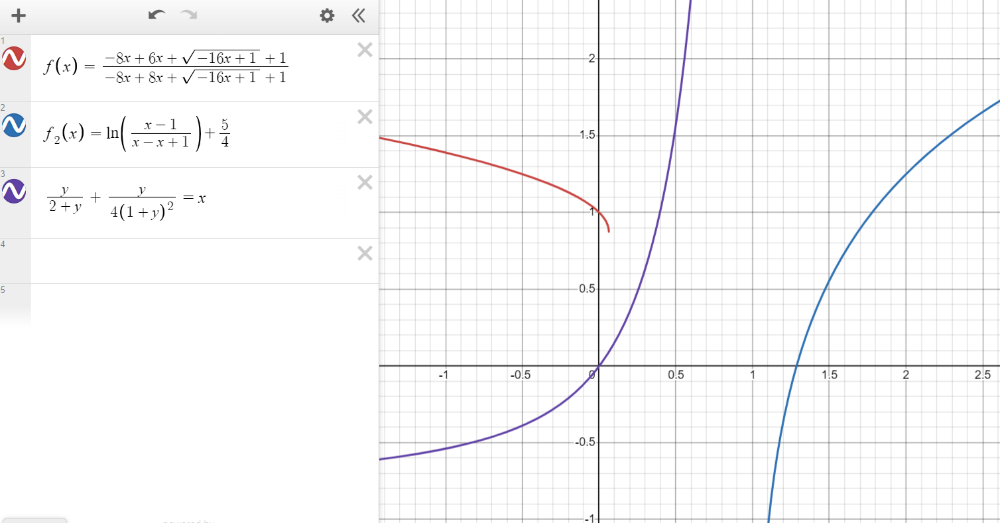
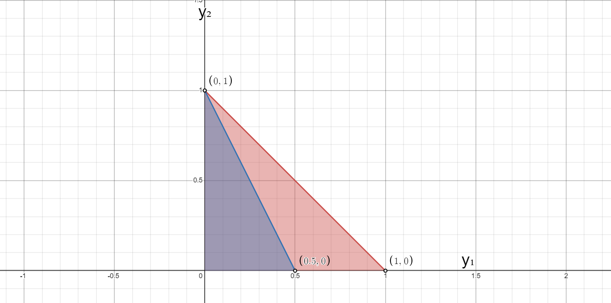
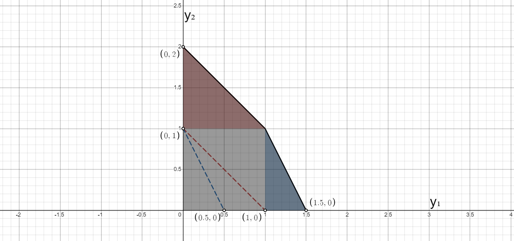
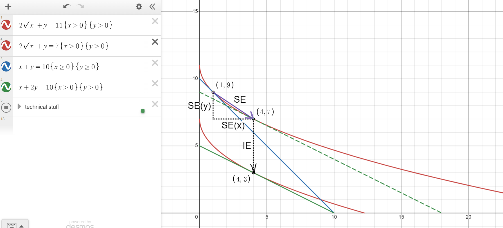

# Третье домашнее задание

> Note that I have rendered a fancy pdf specially for y'all so if you're here, you could check the other file out! It even has pictures >:)

## Третье домашнее задание

*Домашняя работа сдается строго в формате markdown (.md).*

### Первая задача (10 баллов)

Завод **Последний Гвоздь**, производит гвозди ($y$) из железа ($x$) по технологии, которую можно описать как $y = \sqrt{x}$. Известно, что цена гвоздя в два раза выше цены железа.

1. Запишите задачу фирмы. 

2. Выпишите условия первого порядка.

3. Посчитайте предложение гвоздей при таких ценах.

**Вместо** того, чтобы продавать гвозди на конкурентном рынке, их можно использовать в домашнем хозяйстве, извлекая при этом полезность размера 

$$ U(y,w) = 100 \ln (y) + w$$

которая измеряется в тех же единицах, что и прибыль, $w$ — агрегированное благо (деньги), цена нормирована к 1. Заметим, что гвозди можно докупать.

4. Если цена гвоздей равна $q = 2$, то сколько гвоздей будет тогда произведено и сколько куплено? Бюджет неограничен.

---

#### Subproblem 1

The firm wants to maximize its profit when the price for nails is $p$ and the price for iron is $q$. We know that $p=2q$, so we may maximize per this criteria:

$$py-qx\to\max_{x,y}$$

$$2qy-qx\to\max_{x,y}$$

#### Subproblem 2

First order conditions for

$$y = \sqrt{x}\implies x=y^2$$

$$-qy^2+2qy\to\max_{x,y}$$

We get a parabola in a convex optimization problem, and we know that its maximum would be at its vertex:

$$f'_y=2q-2qy=0\implies y=\frac{2q}{2q}=1$$

#### Subproblem 3

This implies that the supply of nails is an entirety of $1$ unit.

#### Subproblem 4

We need to account all the other means of obtaining nails in the utility function as $w$

$$ U(y,w) = 100 \ln (y) + w$$

Introduce three different types of nails:

* $y_{ms}$ would be nails which are manufactured and then sold on the market;
* $y_{mu}$ would be nails which are manufactured and then used in the household;
* $y_{bu}$ would be nails which are bought on the market and then used in the household.

We manufacture a total of $y_{ms}+y_{mu}$ nails, the expenses for the iron for them are $q\colon 2q=2\implies q=1$ and we spend $(y_{ms}+y_{mu})^2$ iron. 

Then, we may sell $y_{ms}$ nails for a price of $p=2$ and buy $y_{bu}$ nails for a price of $p=2$.

We use $y_{mu} + y_{bu}$ nails at home.

Thus, we may construct the final utility function of 

$$U(y_{ms}, y_{mu}, y_{bu}) = 100\ln(y_{mu}+y_{bu})-q(y_{ms}+y_{mu})^2+py_{ms}-py_{bu}$$

$$U(y_{ms}, y_{mu}, y_{bu}) = 100\ln(y_{mu}+y_{bu})-(y_{ms}+y_{mu})^2+2(y_{ms}-y_{bu})$$

Present the first order conditions:

$$\begin{cases}
    \frac{\partial U}{\partial y_{ms}}=0\\
    \frac{\partial U}{\partial y_{mu}}=0\\
    \frac{\partial U}{\partial y_{bu}}=0\\
\end{cases}\implies\begin{cases}
    - 2 y_{ms} - 2 y_{mu} + 2=0\\
    - 2 y_{ms} - 2 y_{mu} + \frac{100}{y_{mu}+y_{bu}}=0\\
    -2 + \frac{100}{y_{mu} + y_{bu}}=0\\
\end{cases}\implies$$

$$\begin{cases}
    y_{ms}+y_{mu}=1\\
    y_{mu} + y_{bu}=50\\
\end{cases}\implies\begin{cases}
    y_{mu}=1-y_{ms}\\
    y_{bu}=49+y_{ms}\\
\end{cases}$$

We get that it's optimal to manufacture a single unit of nails $(y_{mu}+y_{ms}=1)$, similarly as in the problem above, and that we would buy $49$ extra nails and also the number of nails that we have sold.

This implies that we would manufacture $1$ nail and buy $49+y_{ms}$ nails, where $49+y_{ms}\in[49, 50]$.

> Imho it's better to not do unnecessary actions, so I would just say that we manufacture $1$ nail and buy $49$ as in a real-world setting there are certainly more operational expenses.

### Вторая задача (20 баллов)

Индивидуальный предприниматель **Босой А.И.** шьет обувь ($y$, цена $q$) из резины ($x_1$ цена $p_1$) и кожи ($x_2$ цена $p_2$) по технологии
$y_1 = \ln(x_1) + \ln(x_2)$.

1. Найдите $TC_1(y_1)$.

2. Найдите максимальную прибыль $\Pi_1$. 

3. Посчитайте эластичности его спроса на резину, кожу, а также ценовую эластичность предложения обуви.

Индивидуальный предприниматель **Хромой И.А.** шьет обувь по технологии
$y_2 = \sqrt{x_1} + \sqrt{x_2}$.

4. Найдите $TC_2(y_2)$.

5. Найдите максимальную прибыль $\Pi_2$.

6. Посчитайте эластичности его спроса на резину, кожу а также эластичность предложения обуви.

Предприниматели создали кооператив **ooo Хромой и Босой** и управляют им эффективно.

7.  Известно, что в точке оптимума кооператива издержки предпринимателей равны. Сколько тогда производит второй предприниматель?

---

#### Subproblem 1

Expenses function is the goal function of the following minimization problem:

$$p_1x_1+p_2x_2\to\min_{x_1,x_2},\quad f(x_1,x_2)\geq y_1$$

The Lagrangian is 

$$\mathcal{L}(x_1,x_2)=p_1x_1+p_2x_2-\lambda(\ln(x_1)+\ln(x_2)-y_1)$$

$$\begin{cases}
    \mathcal{L}'_{x_1}=0\\
    \mathcal{L}'_{x_2}=0\\
    \ln(x_1)+\ln(x_2)-y_1=0
\end{cases}\implies\begin{cases}
    p_1-\frac{\lambda}{x_1}=0\\
    p_2-\frac{\lambda}{x_2}=0\\
    \ln(x_1)+\ln(x_2)-y_1=0
\end{cases}$$

$$\implies\begin{cases}
    p_1-\frac{\lambda}{x_1}=0\\
    p_2-\frac{\lambda}{x_2}=0\\
    x_1x_2-e^{y_1}=0
\end{cases}\implies\begin{cases}
    x_1=\frac{\lambda}{p_1}\\
    x_2=\frac{\lambda}{p_2}\\
    \frac{\lambda}{p_1}\frac{\lambda}{p_2}-e^{y_1}=0
\end{cases}$$

$$\implies\begin{cases}
    x_1=\frac{\sqrt{p_{1} p_{2} e^{y_{1}}}}{p_1}\\
    x_2=\frac{\sqrt{p_{1} p_{2} e^{y_{1}}}}{p_2}\\
    \lambda = \sqrt{p_{1} p_{2} e^{y_{1}}}
\end{cases}\implies$$

Thus we get the required function:

$$TC(y_1)=p_1\frac{\sqrt{p_{1} p_{2} e^{y_{1}}}}{p_1}+p_2\frac{\sqrt{p_{1} p_{2} e^{y_{1}}}}{p_2} = 2 \sqrt{p_{1} p_{2} e^{y_{1}}}$$

#### Subproblem 2

To find the profit, solve the following maximization problem:

$$\Pi_1(\vec{p},q, y_1)=qy_1-TC(\vec{p}, y_1)\to \max$$

$$\Pi_1(\vec{p},q, y_1)=qy_1-2 \sqrt{p_{1} p_{2} e^{y_{1}}}$$

To find the maximum, find when derivative is equal to $0$:

$$\frac{\partial}{\partial y_1}(qy-2 \sqrt{p_{1} p_{2} e^{y}}) = q - \sqrt{p_{1} p_{2} e^{y_1}}=0\implies y_{1} = \ln{\left(\frac{q^{2}}{p_{1} p_{2}}\right)}$$

Thus, the maximum profit would be

$$\Pi_1(\vec{p},q, y_1)=q\ln{\left(\frac{q^{2}}{p_{1} p_{2}}\right)}-2 \sqrt{p_{1} p_{2} e^{\ln{\left(\frac{q^{2}}{p_{1} p_{2}}\right)}}} = q \ln{\left(\frac{q^{2}}{p_{1} p_{2}}\right)} - 2q$$

#### Subproblem 3

Find the demand elasticity for rubber and leather:

$$\varepsilon^{x_1}_{p_1}=\frac{\partial}{\partial p_{1}}\frac{\sqrt{p_{1} p_{2} e^{y_{1}}}}{p_{1}}\frac{p_1}{x_1}=-\frac{\sqrt{p_{1} p_{2} e^{y_{1}}}}{2p_{1}^2}\frac{p_1}{\frac{\sqrt{p_{1} p_{2} e^{y_{1}}}}{p_1}} = - \frac{1}{2}$$

Since the case for $p_2, x_2$ is symmetric, $\varepsilon^{x_2}_{p_2}=-\frac{1}{2}$

Find the supply elasticity for footwear:

$$\varepsilon^{y_1}_{q}=\frac{\partial y_1}{\partial q}\frac{q}{y_1}=\frac{\partial}{\partial q}\ln{\left(\frac{q^{2}}{p_{1} p_{2}}\right)}\frac{q}{y_1}  = \frac{2}{q}\frac{q}{\ln{\left(\frac{q^{2}}{p_{1} p_{2}}\right)}} = \frac{2}{\ln{\left(\frac{q^{2}}{p_{1} p_{2}}\right)}}$$

#### Subproblem 4

Expenses function is the goal function of the following minimization problem:

$$p_1x_1+p_2x_2\to\min_{x_1,x_2},\quad f(x_1,x_2)\geq y_2$$

The Lagrangian is 

$$\mathcal{L}(x_1,x_2)=p_1x_1+p_2x_2-\lambda(\sqrt{x_1}+\sqrt{x_2}-y_2)$$

$$\begin{cases}
    \mathcal{L}'_{x_1}=0\\
    \mathcal{L}'_{x_2}=0\\
    \sqrt{x_1}+\sqrt{x_2}-y_2=0
\end{cases}\implies\begin{cases}
    p_1-\frac{\lambda}{2\sqrt{x_1}}=0\\
    p_2-\frac{\lambda}{2\sqrt{x_2}}=0\\
    \sqrt{x_1}+\sqrt{x_2}-y_2=0
\end{cases}$$

$$\implies\begin{cases}
    x_{1} = \frac{\lambda^{2}}{4 p_{1}^{2}}\\
    x_{2} = \frac{\lambda^{2}}{4 p_{2}^{2}}\\
    \frac{\lambda}{2 p_{1}}+\frac{\lambda}{2 p_{2}}=y_2
\end{cases}\implies\begin{cases}
    x_{1} = \frac{p_{2}^{2} y_{2}^{2}}{(p_{1} + p_{2})^{2}}\\
    x_{2} = \frac{p_{1}^{2} y_{2}^{2}}{(p_{1} + p_{2})^{2}}\\
    \lambda = \frac{2 p_{1} p_{2} y_{2}}{p_{1} + p_{2}}
\end{cases}\implies$$

Thus we get the required function:

$$TC(y_2)=p_1\frac{p_{2}^{2} y_{2}^{2}}{(p_{1} + p_{2})^{2}}+p_2\frac{p_{1}^{2} y_{2}^{2}}{(p_{1} + p_{2})^{2}} = \frac{p_{1} p_{2} y_{2}^{2}}{p_{1} + p_{2}}$$

#### Subproblem 5

To find the profit, solve the following maximization problem:

$$\Pi_2(\vec{p},q, y_2)=qy_2-TC(\vec{p}, y_1)\to \max$$

$$\Pi_2(\vec{p},q, y_2)=qy_2-\frac{p_{1} p_{2} y_{2}^{2}}{p_{1} + p_{2}}$$

To find the maximum, find when derivative is equal to $0$:

$$\frac{\partial}{\partial y_2}\left(qy_2-\frac{p_{1} p_{2} y_2^{2}}{p_{1} + p_{2}}\right) = q-\frac{2 p_{1} p_{2} y_2}{p_{1} + p_{2}} = 0 \implies y_{2} = \frac{q (p_{1} + p_{2})}{2 p_{1} p_{2}} $$

Thus, the maximum profit would be

$$\Pi_2(\vec{p},q, y_1)=q\frac{q (p_{1} + p_{2})}{2 p_{1} p_{2}}-\frac{p_{1} p_{2} \frac{q (p_{1} + p_{2})}{2 p_{1} p_{2}}^{2}}{p_{1} + p_{2}} = \frac{q^{2} (p_{1} + p_{2})}{4 p_{1} p_{2}}$$

#### Subproblem 6

Find the demand elasticity for rubber and leather:

$$\varepsilon^{x_1}_{p_1}=\frac{\partial}{\partial p}\frac{p_{2}^{2} y_{2}^{2}}{(p_{1} + p_{2})^{2}}\frac{p_1}{x_1} = - \frac{2 p_{2}^{2} y_{2}^{2}}{(p_{1} + p_{2})^{3}}\frac{p_1}{\frac{p_{2}^{2} y_{2}^{2}}{(p_{1} + p_{2})^{2}}} = - \frac{2 p_{1}}{p_{1} + p_{2}}$$

Since the case for $p_2, x_2$ is symmetric, $\varepsilon^{x_2}_{p_2}=- \frac{2 p_{2}}{p_{1} + p_{2}}$

Find the supply elasticity for footwear:

$$\varepsilon^{y_2}_{q}=\frac{\partial y_2}{\partial q}\frac{q}{y_2}=\frac{\partial}{\partial q}\frac{q (p_{1} + p_{2})}{2 p_{1} p_{2}}\frac{q}{y_2} = \frac{p_{1} + p_{2}}{2 p_{1} p_{2}} \frac{q}{\frac{q (p_{1} + p_{2})}{2 p_{1} p_{2}} } = 1$$

#### Subproblem 7

We are given this

$$2\sqrt{p_{1} p_{2} e^{y_{1}}}=\frac{p_{1} p_{2} y_{2}^{2}}{p_{1} + p_{2}}$$

and we need to figure out how much the second agent makes.

We know that in the optimum marginal expenses should be equal. Thus, find when two lambdas (which are precisely the shadow prices for the expenditures) are equal:

$$\sqrt{p_{1} p_{2} e^{y_{1}}}=\frac{2 p_{1} p_{2} y_{2}}{p_{1} + p_{2}}\implies y_{1} = \ln{\left(\frac{4 p_{1} p_{2} y_{2}^{2}}{(p_{1} + p_{2})^{2}}\right)}$$

Then,

$$2\sqrt{p_{1} p_{2} e^{\ln{\left(\frac{4 p_{1} p_{2} y_{2}^{2}}{(p_{1} + p_{2})^{2}}\right)}}}=\frac{p_{1} p_{2} y_{2}^{2}}{p_{1} + p_{2}}$$

$$4 \frac{p_{1} p_{2} y_{2}}{p_{1} + p_{2}}=\frac{p_{1} p_{2} y_{2}^{2}}{p_{1} + p_{2}}\implies y_2=4$$

### Третья задача (20 баллов)

Ферма эльфов производит лайки ($y_1$), мемы ($y_2$) и посты ($y_3$) которые продаются по ценам $q_1, q_2, q_3$ соответственно. Эльфы ($x$) нанимаются на конкурентном рынке по цене $p_{э}$. Технология эльфов описывается как $y_1^2 + y_2^2 + 2 y_3^2 = x$.

1. Найдите $TC_{э}(y_1,y_2,y_3)$.

2. Найдите эластичности спроса и предложения.

Ферма троллей производит лайки ($y_1$) мемы ($y_2$) и посты ($y_3$).  Тролли ($z$) нанимаются на конкурентном рынке по цене $p_{т}$. Технология троллей описывается как $ 2 y_1^2 + y_2^2 + y_3^2 = z$.

3. Найдите $TC_{т}(y_1,y_2,y_3)$.

4. Найдите эластичности спроса и предложения.

Предположим, что тролли и эльфы работают дружно (и эффективно) на одной ферме.

5. Найдите $TC_{т+ф}(y_1,y_2,y_3)$.

6. Для такой фермы, найдите эластичности спросов на эльфов, троллей, а также предложения лайков, мемов и постов.

---

#### Subproblem 1

We have a single manufacturing factor. Therefore, the expenditures function would obviously linearly depend on $x$ and be:

$$TC_e(y_1,y_2,y_3)=p_e(y_1^2+y_2^2+2y_3^2)$$

#### Subproblem 2

Profit function would be as follows:

$$\Pi_e(y_1,y_2,y_3, q_1, q_2, q_3, p_e)=q_1y_1+q_2y_2+q_3y_3-p_e(y_1^2+y_2^2+2y_3^2)$$

First order conditions:

$$\begin{cases}
    \mathcal{L}'_{y_1}=0\\
    \mathcal{L}'_{y_2}=0\\
    \mathcal{L}'_{y_3}=0\\
\end{cases}\implies\begin{cases}
    q_1-2p_ey_1=0\\
    q_2-2p_ey_2=0\\
    q_3-4p_ey_3=0\\
\end{cases}\implies\begin{cases}
    y_1=\frac{q_1}{2p_e}\\
    y_2=\frac{q_2}{2p_e}\\
    y_3=\frac{q_3}{4p_e}
\end{cases}$$

Thus the demand is 

$$x=\frac{q_1}{2p_e}^2+\frac{q_2}{2p_e}^2+2\frac{q_3}{4p_e}^2 = \frac{2 q_{1}^{2} + 2 q_{2}^{2} + q_{3}^{2}}{8 p_{e}^{2}}$$

Now all elasticities go brr:

$$\begin{align*}
    &\varepsilon^{y_1}_{q_1}=\frac{\partial y_1}{\partial q_1}\frac{q_1}{y_1}=\frac{1}{2p_e}\frac{q_1}{\frac{q_1}{2p_e}} = 1\\
    &\varepsilon^{y_2}_{q_2}=\frac{\partial y_2}{\partial q_2}\frac{q_2}{y_2}=\frac{1}{2p_e}\frac{q_2}{\frac{q_2}{2p_e}} = 1\\
    &\varepsilon^{y_3}_{q_3}=\frac{\partial y_3}{\partial q_3}\frac{q_3}{y_3}=\frac{1}{4p_e}\frac{q_3}{\frac{q_3}{4p_e}} = 1\\
    &\varepsilon^{x}_{p_e}=\frac{\partial x}{\partial p_e}\frac{p_e}{x}=\frac{- 2 q_{1}^{2} - 2 q_{2}^{2} - q_{3}^{2}}{4 p_e^{3}}\frac{p_e}{\frac{2 q_{1}^{2} + 2 q_{2}^{2} + q_{3}^{2}}{8 p_{e}^{2}}} = -2\\
\end{align*}$$

#### Subproblem 3

We have a single manufacturing factor. Therefore, the expenditures function would obviously linearly depend on $z$ and be:

$$TC_t(y_1,y_2,y_3)=p_t(2y_1^2+y_2^2+y_3^2)$$

#### Subproblem 4

Profit function would be as follows:

$$\Pi_e(y_1,y_2,y_3, q_1, q_2, q_3, p_e)=q_1y_1+q_2y_2+q_3y_3-p_t(y_1^2+y_2^2+2y_3^2)$$

First order conditions:

$$\begin{cases}
    \mathcal{L}'_{y_1}=0\\
    \mathcal{L}'_{y_2}=0\\
    \mathcal{L}'_{y_3}=0\\
\end{cases}\implies\begin{cases}
    q_1-4p_1y_1=0\\
    q_2-2p_1y_2=0\\
    q_3-2p_1y_3=0\\
\end{cases}\implies\begin{cases}
    y_1=\frac{q_1}{4p_t}\\
    y_2=\frac{q_2}{2p_t}\\
    y_3=\frac{q_3}{2p_t}
\end{cases}$$

Thus the demand is 

$$z=2\frac{q_1}{4p_t}^2+\frac{q_2}{2p_t}^2+\frac{q_3}{2p_t}^2 = \frac{q_{1}^{2} + 2 q_{2}^{2} + 2 q_{3}^{2}}{8 p_{t}^{2}}$$

Now all elasticities go brr:

$$\begin{align*}
    &\varepsilon^{y_1}_{q_1}=\frac{\partial y_1}{\partial q_1}\frac{q_1}{y_1}=\frac{1}{4p_t}\frac{q_1}{\frac{q_1}{4p_t}} = 1\\
    &\varepsilon^{y_2}_{q_2}=\frac{\partial y_2}{\partial q_2}\frac{q_2}{y_2}=\frac{1}{2p_t}\frac{q_2}{\frac{q_2}{2p_t}} = 1\\
    &\varepsilon^{y_3}_{q_3}=\frac{\partial y_3}{\partial q_3}\frac{q_3}{y_3}=\frac{1}{2p_t}\frac{q_3}{\frac{q_3}{2p_t}} = 1\\
    &\varepsilon^{z}_{p_t}=\frac{\partial z}{\partial p_t}\frac{p_t}{z}=\frac{- q_{1}^{2} - 2 q_{2}^{2} - 2q_{3}^{2}}{4 p_t^{3}}\frac{p_t}{\frac{q_{1}^{2} + 2 q_{2}^{2} + 2 q_{3}^{2}}{8 p_{t}^{2}}} = -2\\
\end{align*}$$

#### Subproblem 5

We know that at the point of optimum the marginal expenditures (shadow lambdas) are colinear and equal to each other. Thus, we may take the gradients of both limitations and equalize them per-coordinate given that $y_i=e_i+t_i$ where $e_i$ is the share of expenditures for elves and $t_i$ is the share of expenditures for trolls.

$$\nabla_{(e_1,e_2,e_3)}(p_e(e_1^2+e_2^2+2e_3^2))=\nabla_{(t_1,t_2,t_3)}(p_t(2t_1^2+t_2^2+t_3^2))$$

$$p_e\begin{pmatrix}
    2e_1 & 2e_2 & 4e_3
\end{pmatrix}=p_t\begin{pmatrix}
    4t_1 & 2t_2 & 2t_3
\end{pmatrix}$$

$$p_e\begin{pmatrix}
    2e_1 & 2e_2 & 4e_3
\end{pmatrix}=p_t\begin{pmatrix}
    4(y_1-e_1) & 2(y_2-e_2) & 2(y_3-e_3)
\end{pmatrix}$$

$$\begin{pmatrix}
    2e_1p_e & 2e_2p_e & 4e_3p_e
\end{pmatrix}=\begin{pmatrix}
    4(y_1-e_1)p_t & 2(y_2-e_2)p_t & 2(y_3-e_3)p_t
\end{pmatrix}$$

$$\begin{pmatrix}
    2e_1p_e-4(y_1-e_1)p_t & 2e_2p_e- 2(y_2-e_2)p_t & 4e_3p_e- 2(y_3-e_3)p_t
\end{pmatrix}=\begin{pmatrix}
    0 & 0 & 0
\end{pmatrix}$$

This implies 

$$\begin{pmatrix}
    e_1 & t_1\\
    e_2 & t_2\\
    e_3 & t_3\\
\end{pmatrix}=\begin{pmatrix}
    \frac{2p_ty_1}{p_e+2p_t} & \frac{p_ey_1}{p_e+2p_t}\\
    \frac{p_ty_2}{p_e+p_t} & \frac{p_ey_2}{p_e+p_t}\\
    \frac{p_ty_3}{2p_e+p_t} & \frac{2p_ey_3}{2p_e+p_t}\\
\end{pmatrix}$$

Combined expenditures functions would be

$$TC(y_1,y_2,y_3)=TC_e(e_1,e_2,e_3)+TC_t(t_1,t_2,t_3)$$

$$TC(y_1,y_2,y_3)=p_{e}\left(\frac{2p_{t}y_{1}}{p_{e}+2p_{t}}^2+\frac{p_{t}y_{2}}{p_{e}+p_{t}}^2+2\frac{p_{t}y_{3}}{2p_{e}+p_{t}}^2\right)+$$

$$+\ p_{t}\left(2\frac{p_{e}y_{1}}{p_{e}+2p_{t}}^2+\frac{p_{e}y_{2}}{p_{e}+p_{t}}^2+\frac{2p_{e}y_{3}}{2p_{e}+p_{t}}^2\right) =$$

$$=\frac{2p_{e}^{2} p_{t} + 4 p_{e} p_{t}^{2}}{(p_{e} + 2 p_{t})^{2}} y_{1}^{2}+\frac{p_{e}^{2} p_{t} + p_{e} p_{t}^{2} }{(p_{e} + p_{t})^{2}}y_{2}^{2}+\frac{4 p_{e}^{2} p_{t} + 2 p_{e} p_{t}^{2}}{(2 p_{e} + p_{t})^{2}}y_{3}^{2}=$$

$$=\frac{2 p_{e} p_{t} y_{1}^{2}}{p_{e} + 2 p_{t}}+\frac{p_{e} p_{t} y_{2}^{2}}{p_{e} + p_{t}}+\frac{2 p_{e} p_{t} y_{3}^{2}}{2 p_{e} + p_{t}}$$

#### Subproblem 6

To find the elasticities for the new function, we solve the following maximization problem:

$$\Pi(y_1,y_2,y_3)=q_1y_1+q_2y_2+q_3y_3-TC(y_1,y_2,y_3)\to\max$$

First order conditions are (they are also the supplies of $y_i$)

$$\begin{cases}
    y_1=\frac{q_1}{2\frac{2 p_{e} p_{t} }{p_{e} + 2 p_{t}}} = \frac{q_{1}}{4 p_{t}} + \frac{q_{1}}{2 p_{e}}\\
    y_2=\frac{q_2}{2\frac{p_{e} p_{t}}{p_{e} + p_{t}}} = \frac{q_{2} (p_{e} + p_{t})}{2 p_{e} p_{t}}\\
    y_3=\frac{q_3}{2\frac{2 p_{e} p_{t} }{2 p_{e} + p_{t}}} = \frac{q_{3}}{2 p_{t}} + \frac{q_{3}}{4 p_{e}}
\end{cases}$$

Now find all the demands $x,z$. For this, calculate the demands from above:

$$\begin{pmatrix}
    e_1 & t_1\\
    e_2 & t_2\\
    e_3 & t_3\\
\end{pmatrix}=\begin{pmatrix}
    \frac{2p_t(\frac{q_{1}}{4 p_{t}} + \frac{q_{1}}{2 p_{e}})}{p_e+2p_t} & \frac{p_e(\frac{q_{1}}{4 p_{t}} + \frac{q_{1}}{2 p_{e}})}{p_e+2p_t}\\
    \frac{p_t\frac{q_{2} (p_{e} + p_{t})}{2 p_{e} p_{t}}}{p_e+p_t} & \frac{p_e\frac{q_{2} (p_{e} + p_{t})}{2 p_{e} p_{t}}}{p_e+p_t}\\
    \frac{p_t(\frac{q_{3}}{2 p_{t}} + \frac{q_{3}}{4 p_{e}})}{2p_e+p_t} & \frac{2p_e(\frac{q_{3}}{2 p_{t}} + \frac{q_{3}}{4 p_{e}})}{2p_e+p_t}\\
\end{pmatrix}=\begin{pmatrix}
    \frac{q_{1}}{2 p_{e}} & \frac{q_{1}}{4 p_{t}}\\
    \frac{q_{2}}{2 p_{e}} & \frac{q_{2}}{2 p_{t}}\\
    \frac{q_{3}}{4 p_{e}} & \frac{q_{3}}{2 p_{t}}\\
\end{pmatrix}$$

Now, for the demands themselves:

$$x=e_1^2 + e_2^2 + 2 e_3^2$$

$$x=\frac{q_{1}}{2 p_{e}}^2 + \frac{q_{2}}{2 p_{e}}^2 + 2 \frac{q_{3}}{4 p_{e}}^2 = \frac{2 q_{1}^{2} + 2 q_{2}^{2} + q_{3}^{2}}{8 p_{e}^{2}}$$

$$z=2\frac{q_{1}}{4 p_{t}}^2 + \frac{q_{2}}{2 p_{t}}^2 + \frac{q_{3}}{2 p_{t}}^2 = \frac{q_{1}^{2} + 2 q_{2}^{2} + 2 q_{3}^{2}}{8 p_{t}^{2}}$$

we get that the demands are the same as above, which kinda tells us doing this was unnecessary but welp, at least we have checked that everything should be more or less correct.

Now all elasticities go brr:

$$\begin{align*}
    &\varepsilon^{y_1}_{q_1}=\frac{\partial y_1}{\partial q_1}\frac{q_1}{y_1}= \frac{p_{e} + 2 p_{t}}{4 p_{e} p_{t}}\frac{q_1}{\frac{q_{1}}{4 p_{t}} + \frac{q_{1}}{2 p_{e}}} = 1\\
    &\varepsilon^{y_2}_{q_2}= \frac{\partial y_2}{\partial q_2}\frac{q_2}{y_2}=\frac{(p_{e} + p_{t})}{2 p_{e} p_{t}}\frac{q_2}{\frac{q_{2} (p_{e} + p_{t})}{2 p_{e} p_{t}}} = 1\\
    &\varepsilon^{y_3}_{q_3}=\frac{\partial y_3}{\partial q_3}\frac{q_3}{y_3}=\frac{2 p_{e} + p_{t}}{4 p_{e} p_{t}}\frac{q_3}{\frac{q_{3}}{2 p_{t}} + \frac{q_{3}}{4 p_{e}}} = 1\\
    &\varepsilon^{x}_{p_t}=\frac{\partial x}{\partial p_e}\frac{p_e}{x} = \frac{- 2 q_{1}^{2} - 2 q_{2}^{2} - q_{3}^{2}}{4 p_{e}^{3}}\frac{p_{e}}{\frac{2 q_{1}^{2} + 2 q_{2}^{2} + q_{3}^{2}}{8 p_{e}^{2}}} = -2\\
    &\varepsilon^{z}_{p_t}=\frac{\partial z}{\partial p_t}\frac{p_t}{z}=\frac{- q_{1}^{2} - 2 q_{2}^{2} - 2 q_{3}^{2}}{4 p_{t}^{3}}\frac{p_t}{\frac{q_{1}^{2} + 2 q_{2}^{2} + 2 q_{3}^{2}}{8 p_{t}^{2}}} = -2
\end{align*}$$

### Четвертая задача (20 баллов)

Рассмотрим фирму с технологией

$$y = \sqrt{x_1} + \ln(x_2)$$

Цену товара $y$ нормируем к 1, а цены $x_1, x_2$ пусть равны $q_1, q_2$.

1. Посчитайте эластичности спросов на $x_1, x_2$

Предположим, что необходимо собрать (маленький) налог размера $Т$

2. Какой налог надо ввести на первый товар $q_1 \to q_1 + \tau_1$, чтобы налоговые сборы равнялись $Т$?

3. Какой налог надо ввести на второй товар $q_2 \to q_2 + \tau_2$, чтобы налоговые сборы равнялись $Т$?

4. Предложите альтернативный (дифференцированный) налог, чтобы налоговые сборы равнялись $Т$.

5. Какая из трех прибылей самая большая после введения налога, если цены до введения налогов были равны (1,1)?

---

#### Subproblem 1

To calculate elasticities, we need to solve the profit maximization problem where

$$-q_1x_1-q_2x_2+y,\quad F(x_1,x_2)\geq y$$

Lagrangian:

$$\mathcal{L}(x_1,x_2)=-q_1x_1-q_2x_2+y-\lambda(\sqrt{x_1}+\ln{x_2}-y)$$

First order conditions:

$$\begin{cases}
    \mathcal{L}'_{x_1}=0\\
    \mathcal{L}'_{x_1}=0\\
    \mathcal{L}'_{x_1}=0\\
    \sqrt{x_1}+\ln{x_2}-y=0
\end{cases}\implies\begin{cases}
    -q_1-\frac{\lambda}{2\sqrt{x_1}}=0\\
    -q_2-\frac{\lambda}{x_2}=0\\
    1+\lambda=0\\
    \sqrt{x_1}+\ln{x_2}-y=0
\end{cases}\implies\begin{cases}
    x_{1} = \frac{1}{4 q_{1}^{2}}\\
    x_{2} = \frac{1}{q_{2}}\\
    \lambda=-1\\
    y=\frac{1}{2 q_{1}}+\ln{\frac{1}{q_{2}}}
\end{cases}$$

Elasticities go brr:

$$\begin{align*}
    &\varepsilon^{x_1}_{q_1}=\frac{\partial x_1}{\partial q_1}\frac{q_1}{x_1}= - \frac{1}{2 q_{1}^{3}}\frac{q_1}{\frac{1}{4 q_{1}^{2}}} = -2\\
    &\varepsilon^{x_2}_{q_2}= \frac{\partial x_2}{\partial q_2}\frac{q_2}{x_2}=- \frac{1}{q_{2}^{2}}\frac{q_2}{\frac{1}{q_{2}}} = -1\\
\end{align*}$$

#### Subproblem 2

Try to introduce a tax for good $x_1$:

$$q_1\mapsto q_1+\tau$$

$$\Tau=\tau\frac{1}{4(q_{1}+\tau)^2}=0$$

$$\tau = \frac{- 8 \Tau q_{1} + \sqrt{- 16 \Tau q_{1} + 1} + 1}{8 \Tau}$$

#### Subproblem 3

Try to introduce a tax for good $x_2$:

$$q_2\mapsto q_2+\tau$$

$$\Tau=\tau\frac{1}{q_{2}+\tau}=0$$

$$\tau = \frac{\Tau q_{2}}{1-\Tau}$$

#### Subproblem 4

The ratio of tax rates is equal to the ratio of demand elasticities:

$$\frac{\varepsilon^{x_1}_{q_1}}{\varepsilon^{x_2}_{q_2}}=\frac{-2}{-1}=\frac{2}{1}=\frac{\frac{\tau_{1}}{q_{q}}}{\frac{\tau_{2}}{q_{2}}}$$

This implies 

$$\frac{\tau_{1}}{q_{1}}=2\frac{\tau_{2}}{q_{2}}\implies  \tau_{2} = \frac{q_{2} \tau_{1}}{2 q_{1}}$$

Now calculate the tax:

$$\Tau=\tau_{1}\frac{1}{4(q_{1}+\tau_{1})^2}+\tau_{2}\frac{1}{q_{2}+\tau_{2}}$$

$$\Tau=\tau_{1}\frac{1}{4(q_{1}+\tau_{1})^2}+\frac{q_{2} \tau_{1}}{2 q_{1}}\frac{1}{q_{2}+\frac{q_{2} \tau_{1}}{2 q_{1}}} = \frac{\tau_{1}}{4(q_{1}+\tau_{1})^2}+\frac{\tau_{1}}{2 q_{1} + \tau_{1}}$$

Thus, the tax that we would want to introduce would be a solution of the following system of equations:

$$\begin{cases}
\frac{\tau_{1}}{2 q_{1} + \tau_{1}} + \frac{\tau_{1}}{4 (q_{1} + \tau_{1})^{2}}=T\\
\tau_{2} = \frac{q_{2} \tau_{1}}{2 q_{1}}
\end{cases}$$

this tax can only be introduced if $T<1$. Otherwise, it's impossible to collect anything (wolfram was able to solve this, so here we are, it's absolutely ridiculous though):

$$\tau_1 = - \frac{\frac{(16 T q_{1} - 8 q_{1} - 1)^{2}}{(4 T - 4)^{2}} - \frac{3 \cdot (10 T q_{1}^{2} - 2 q_{1}^{2} - q_{1})}{2 T - 2}}{3 \sqrt[3]{\frac{27 T q_{1}^{3}}{T - 1} + \frac{\sqrt{- 4 (\frac{(16 T q_{1} - 8 q_{1} - 1)^{2}}{(4 T - 4)^{2}} - \frac{3 \cdot (10 T q_{1}^{2} - 2 q_{1}^{2} - q_{1})}{2 T - 2})^{3} + (\frac{54 T q_{1}^{3}}{T - 1} + \frac{2 (16 T q_{1} - 8 q_{1} - 1)^{3}}{(4 T - 4)^{3}} - \frac{9 \cdot (16 T q_{1} - 8 q_{1} - 1) (10 T q_{1}^{2} - 2 q_{1}^{2} - q_{1})}{(2 T - 2) (4 T - 4)})^{2}}}{2} + \frac{(16 T q_{1} - 8 q_{1} - 1)^{3}}{(4 T - 4)^{3}} - \frac{9 \cdot (16 T q_{1} - 8 q_{1} - 1) (10 T q_{1}^{2} - 2 q_{1}^{2} - q_{1})}{2 \cdot (2 T - 2) (4 T - 4)}}} -\\- \frac{\sqrt[3]{\frac{27 T q_{1}^{3}}{T - 1} + \frac{\sqrt{- 4 (\frac{(16 T q_{1} - 8 q_{1} - 1)^{2}}{(4 T - 4)^{2}} - \frac{3 \cdot (10 T q_{1}^{2} - 2 q_{1}^{2} - q_{1})}{2 T - 2})^{3} + (\frac{54 T q_{1}^{3}}{T - 1} + \frac{2 (16 T q_{1} - 8 q_{1} - 1)^{3}}{(4 T - 4)^{3}} - \frac{9 \cdot (16 T q_{1} - 8 q_{1} - 1) (10 T q_{1}^{2} - 2 q_{1}^{2} - q_{1})}{(2 T - 2) (4 T - 4)})^{2}}}{2} + \frac{(16 T q_{1} - 8 q_{1} - 1)^{3}}{(4 T - 4)^{3}} - \frac{9 \cdot (16 T q_{1} - 8 q_{1} - 1) (10 T q_{1}^{2} - 2 q_{1}^{2} - q_{1})}{2 \cdot (2 T - 2) (4 T - 4)}}}{3} - \frac{16 T q_{1} - 8 q_{1} - 1}{3 \cdot (4 T - 4)}$$

#### Subproblem 5

Compare the profits in each of the three cases:

$$F_1(x_1,x_2)=-(q_1+\tau_1)\frac{1}{4 (q_1+\tau_1)^{2}}-q_2\frac{1}{q_{2}}+\frac{1}{2 (q_1+\tau_1)}+\ln{\frac{1}{q_{2}}}=$$

$$=-(1+\tau_1)\frac{1}{4 (1+\tau_1)^{2}}-\frac{1}{1}+\frac{1}{2 (1+\tau_1)}+\ln{\frac{1}{1}} = -\frac{\tau_{1} + \frac{3}{4}}{\tau_{1} + 1}=$$

$$=-\frac{\frac{- 8 \Tau q_{1} + \sqrt{- 16 \Tau q_{1} + 1} + 1}{8 \Tau} + \frac{3}{4}}{\frac{- 8 \Tau q_{1} + \sqrt{- 16 \Tau q_{1} + 1} + 1}{8 \Tau} + 1} = \frac{- 8 q_{1} \Tau + 6 \Tau + \sqrt{- 16 q_{1} \Tau + 1} + 1}{- 8 q_{1} \Tau + 8 \Tau + \sqrt{- 16 q_{1} \Tau + 1} + 1}=$$

$$\frac{- 8 \Tau + 6 \Tau + \sqrt{- 16 \Tau + 1} + 1}{- 8 \Tau + 8 \Tau + \sqrt{- 16 \Tau + 1} + 1}$$

$$F_2(x_1,x_2)=-q_1\frac{1}{4 q_1^{2}}-(q_2+\tau_2)\frac{1}{-(q_2+\tau_2)}+\frac{1}{2 q_1}+\ln{\frac{1}{-(q_2+\tau_2)}}=$$

$$=-\frac{1}{4}-(1+\tau_2)\frac{1}{-(1+\tau_2)}+\frac{1}{2}+\ln{\frac{1}{-(1+\tau_2)}} = \ln{\left(- \frac{1}{\tau_{2} + 1}\right)} + \frac{5}{4}=$$

$$=\ln{\left(- \frac{1}{\frac{\Tau q_{2}}{1-\Tau} + 1}\right)} + \frac{5}{4} = \ln{\left(\Tau - 1\right)} + \frac{5}{4}$$

I'll present a graph that encompasses all choice cases:

this implies that the second tax is optimal for any sufficiently large $T>1$. The first tax is optimal if $T<\frac{1}{16}$. Comparing this to the  third tax, it only makes sense if we have $T<1$. Therefore, we take the third option in case $T\in[\frac{1}{16}, 1)$. There is no possibility to introduce a tax if the total sum should be $T=1$.

$$\tau=\begin{cases}
    \tau_1,\quad T<\frac{1}{16}\\
    \tau_2,\quad T>1\\
    \tau_3,\quad T\in[\frac{1}{16}, 1)\\
    \varnothing, \quad T=1
\end{cases}$$

### Пятая задача (15 баллов)

Первая фирма обладает технологией 

$$ F_1(y) = y_1 + y_2 \leqslant 1, y_1 \geqslant 0, y_2 \geqslant 0$$

Вторая фирма обладает технологией 

$$ F_2(y) = 2y_1 + y_2 \leqslant 1, y_1 \geqslant 0, y_2 \geqslant 0$$

1. Изобразите технологическое множество первой фирмы $Y_1$.

2. Изобразите технологическое множество второй фирмы $Y_2$.

3. Какая фирма более эффективная?

4. Постройте сумму $Y_1+Y_2$ по вершинам.

---

> Honestly, I think that this task is incorrect because the technological set should not have intersections with $R^{++}$, so I'll treat these just as sets of all possible achievable points

#### Subproblem 1+2

#### Subproblem 3

The first firm is more efficient because it requires less resources to manufacture one unit of a certain good. Furthermore, the area under its graph has a higher surface area. 

#### Subproblem 4

There we go:

### Шестая задача (15 баллов)

 Рассмотрите потребителя с функцией полезности $U(x,y) = 2\sqrt{x} + y$. Первоначальные цены товаров были равны 1, а доход 10. 

1. Найдите его первоначальный оптимальный набор.
2. Предположим, благо $y$ дорожает вдвое. Как изменится величина спроса потребителя на оба блага?
3.  Разложите изменение в величине спроса на первое и второе благо на эффекты замещения и дохода. Проиллюстрируйте ваш ответ графически, отметив направление и абсолютную величину эффектов дохода и замещения для спроса на первое благо.

---

#### Subproblem 1

Typical utility maximization problem goes brr:

$$U(x,y)=2\sqrt{x}+y \to \max, \quad B(x,y)=x+y\geq 10$$

Lagrangian:

$$\mathcal{L}(x,y|\lambda)=2\sqrt{x}+y-\lambda(x+y-10)$$

First order conditions:

$$\begin{cases}
    \mathcal{L}'_x=0\\
    \mathcal{L}'_y=0\\
    x+y-10=0\\
\end{cases}\implies\begin{cases}
    \frac{1}{\sqrt{x}}-\lambda=0\\
    1-\lambda=0\\
    x+y-10=0\\
\end{cases}\implies\begin{cases}
    x=1\\
    y=9\\
    \lambda=1\\
\end{cases}$$

This implies that the initial optimum selection of goods is $(1,9)$.

#### Subproblem 2

Doubling the price for $y$, we get

$$\begin{cases}
    \frac{1}{\sqrt{x}}-\lambda=0\\
    1-2\lambda=0\\
    x+2y-10=0\\
\end{cases}\implies\begin{cases}
    x = 4\\
    y=3\\
\end{cases}$$

Thus, the demand for $x$ quadruples and the demand for $y$ falls threefold.

#### Subproblem 3

Firstly calculate the Marshallian and Hicksian demands:

$$\begin{cases}
    \mathcal{L}'_x=0\\
    \mathcal{L}'_y=0\\
    x+y-10=0\\
\end{cases}\implies\begin{cases}
    \frac{1}{\sqrt{x}}-p\lambda=0\\
    1-q\lambda=0\\
    px+qy-W=0\\
\end{cases}\implies\begin{cases}
    m_x = \frac{q^{2}}{p^{2}}\\
    m_y = \frac{W}{q} - \frac{q}{p}\\
    \lambda=\frac{1}{q}\\
\end{cases}$$

This implies

$$h_x=m_x=\frac{q^2}{p^2},\quad 2\sqrt{\frac{q^2}{p^2}} + h_y = \overline{U} \implies h_y = \overline{U} - \frac{2q}{p}, $$

Calculate optimal utilities:

$$\overline{U_0}(1,9)=2\sqrt{1}+9=11$$

$$\overline{U_1}(4,3)=2\sqrt{4}+3 =7$$

We know all this for $p=1,q=1,q'=2$:

$$h_x(p, q',\overline{U_0})=4, \quad h_x(p, q, \overline{U_0})=1,\quad h_x(p, q',\overline{U_1})=4$$

$$h_y(p, q',\overline{U_0})=7, \quad h_y(p, q, \overline{U_0})=9,\quad h_y(p, q',\overline{U_1})=3$$

$$\Delta x_{SE}=h_x(p, q',\overline{U_0})-h_x(p, q, \overline{U_0})=4-1=3$$

$$\Delta x_{IE}=h_x(p, q',\overline{U_1})-h_x(p, q', \overline{U_0})=4-4=0$$

$$\Delta y_{SE}=h_y(p, q',\overline{U_0})-h_y(p, q, \overline{U_0})=7-9=-2$$

$$\Delta y_{IE}=h_x(p, q',\overline{U_1})-h_y(p, q', \overline{U_0})=3-7=-4$$

Visualization:

