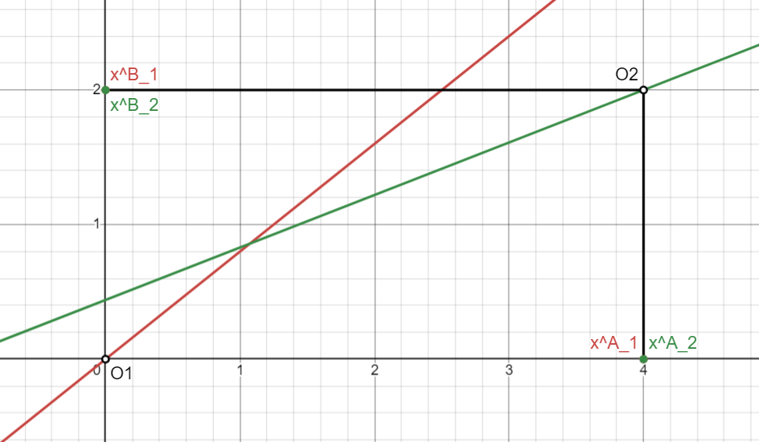
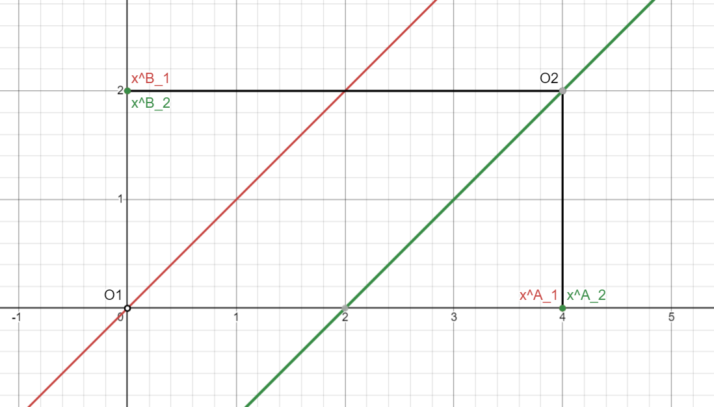
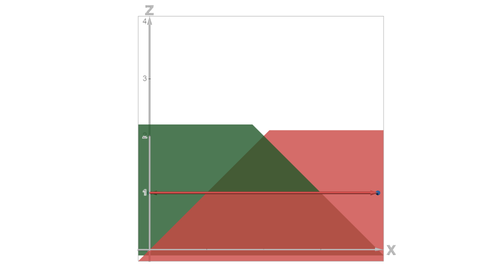
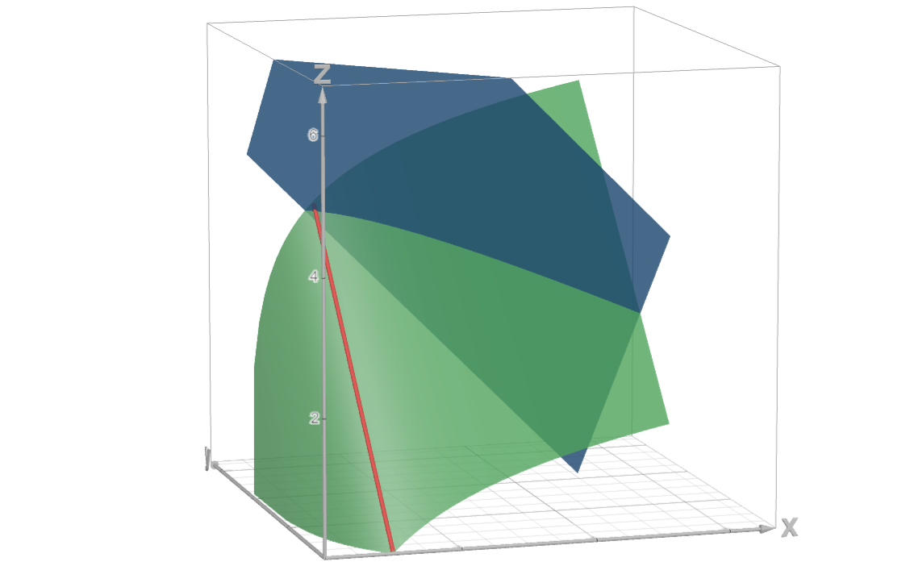
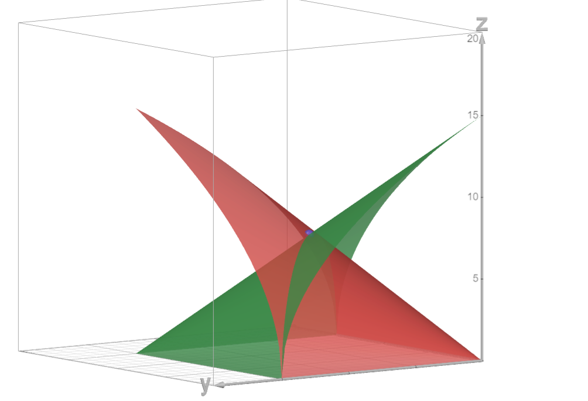

# Microeconomics, Homework 4

## Problem 1

### Subproblem A

If we would be to plot the optimums of the functions, we get two lines intersecting each of the axes origins. This is beacuse the optimums for minimum functions are plotted as their ratios.

For there to be a chance for a Warlas equilibrium to exist, the lines definiting the optimums should intersect (otherwise there it would impossible to reach an equilibrium), which only happens when the slope of one of the functions in relation to the diagonal of the Edgeworth box is higher and the other one is lower. 

Since the slope of the Edgeworth box's diagonal is defined by the ratio of the total reserves, we get a value of $\frac{\omega_B}{\omega_A}=\frac{2}{4}=\frac{1}{2}$.

This implies that an equilibrium exists only when one of the following cases is true:

$$\left[\begin{gathered}
    \begin{cases}
        \alpha_1\leq\frac{1}{2}\\
        \alpha_2\geq\frac{1}{2}
    \end{cases}\\
    \begin{cases}
        \alpha_1\geq\frac{1}{2}\\
        \alpha_2\leq\frac{1}{2}
    \end{cases}
\end{gathered}\right.$$

Otherwise, the equilibrium may fall out of the box.

### Subproblem B

When both $\alpha$ coefficients are equal to $1$, it's physically impossible to reach an equilibrium without collapsing some dimensions since the lines are parallel. To achieve that, we need to set one of the prices equal to zero to allow for infinite intake.

Allowing for an infinite intake of either good would leave us in a state where neither agent would want to give away anything. This is proven by the plots below where each of the graph's plots are maximal at the peaks.

Plotting the graphs in 3d further confirms that it's impossible to reach an equilibrium with non-zero prices since the gradient vectors along the optimum lines are collinear and would cancel out.

Thus, we get two infinite sets of Walras' equlibrium solutions:

$$\left[\begin{gathered}
    (\omega^A_1,\omega^B_1,\omega^A_2,\omega^B_2)=(\Omega_1,0,4-\Omega_1,2),\quad p_A=0\\(\omega^A_1,\omega^B_1,\omega^A_2,\omega^B_2)=(4,\Omega_2,0,2-\Omega_2),\quad p_B=0\\

\end{gathered}\right.$$

### Subproblem C

Geometrically finding the intersection of lines 

$$\begin{cases}
    y=\frac{1}{4}x\\
    -\left(y-2\right)=-\frac{3}{4}\left(x-4\right)
\end{cases}$$

we get the equilibrium at $\omega_1=(2,\frac{1}{2}), \omega_2=(2,\frac{3}{2})$ 

### Subproblem D

Per the given conditions in the economy of free competition and since the $\min$ function is locally non-satiable, we may conclude that all given optimums are Pareto-optimal.

Clearer explanation: 

* for subproblem B, the optimum is a set of points, each of which is has a separate utility value of the agents. Basically, there are no two points that would yield the same pair of utility values for both agents.
* for subproblem C, the optimum is a single point, and there is no way to shift it without making it all worse to at least one of the agents, so it is pareto-optimal.

## Problem 2

The maximum function implies each of the agents only cares about the cheaper good they can find and would only be interested in buying it. This means that the demand for the more expensive good would be $0$. 

To get two less interesting cases out of the way, this contradicts the Pareto-optimum criteria, for which the total demand for any good should be equal to the total reserves of the good. Thus, it's certainly impossible to reach a pareto-optimum in such an economy when prices are non-equal.

There is a total of $(24,24)$ goods in the economy.

All agents are seeking to maximize at least one of the good with equal preference.

First agent $(10, 2)$ has a budget of $12$, second agent $(6, 14)$ has a budget of $20$ and the third agent $(8, 8)$ has a budget of $16$. Each of them only wants a single good and would trade everything they have for it.

Each of the agents is only willing to go up, which is achievable by giving up one of the goods they decide not to prefer which would shift them towards the x or y axis parallel to the other one.

We realize that all the possible arrangements that the agents would be satisfied with are as follows for each of the three agents:

$$\begin{matrix}
    (12, 0), (20, 0), (16, 0) \\
    (12, 0), (20, 0), (0, 16)\\
    (12, 0), (0, 20), (16, 0)\\
    (12, 0), (0, 20), (0, 16)\\    
    (0, 12), (20, 0), (16, 0) \\
    (0, 12), (20, 0), (0, 16)\\
    (0, 12), (0, 20), (16, 0)\\
    (0, 12), (0, 20), (0, 16)\\
\end{matrix}$$

None of these exhaustive options (some of which wouldn't really be possible because the agents wouldn't want to temporary decrease their utility) allow for all the demands for the good to be equal to $(24,24)$, which is a required condition, which implies that **no Walras equilibria are possible** since all possible optimal states are described here and none of them add up to $(24,24)$.

## Problem 3

Strong and weak Pareto-boundaries overlap if preferences of each agent are strictly monotonous and continuous.

Obviously, a linear combination of two linear functions and a linear combination of a linear function and a logarithm maintains monotonousness and continuity within the given conditions.

We may further plot the functions and realise those conditions hold, thus the strong and weak boundaries would indeed overlap.

Now, given that 

$$\omega_1=(a_1,b_1), \quad\omega_2=(a_2,b_2)$$

a pareto optimum exists if 

$$\begin{cases}
    \frac{\frac{\partial U_1}{\partial x}}{\frac{\partial U_1}{\partial y}}=\frac{\frac{\partial U_2}{\partial x}}{\frac{\partial U_2}{\partial y}}\\
    x_1^A+x_2^A=\omega_A\\
    x_1^B+x_2^B=\omega_B\\
\end{cases}\implies\begin{cases}
    \frac{1}{x^A_1}=1\\
    x_1^A+x_2^A=a_1+a_2\\
    x_1^B+x_2^B=b_1+b_2\\
\end{cases}\implies\begin{cases}
    x_1^A=1\\
    x_1^B=t\\
    x_2^A=a_1+a_2-1\\
    x_2^B=b_1+b_2-t
\end{cases}$$

Thus the contract curve $$(1, t, a_1+a_2-1,b_1+b_2-t)$$would be something like this:

> which is actually funny because I remembered doing a really similar thing for some other task with an identical utility function.

> note that the function on the image above is cut off precisely for the needs of $a_i, b_i$.

However, we should be careful for when $a_1+a_2<1$, then the contract curve would be as follows:

$$(a_1+a_2, t, 0,b_1+b_2-t)$$

## Problem 4

Firstly, let's plot the functions (the first one was monotonously transformed to fit on the screen properly):

It's obvious that there is a point of satiation aka the global maximum. It's easy to calculate taking the derivatives of the parabolic function:

$$\begin{cases}
    \frac{\partial U}{\partial x}=80-8x_1^A\implies x_1^A=8\\
    \frac{\partial U}{\partial y}=48-2x_1^B\implies x_1^B=24
\end{cases}$$

Top-down view:

Firstly, to check whether the first theorem holds, we need to find the demands of the agents to check whether there is an equilibrium (although there certainly would be one, especially if the satiation point is included). Check analytically normalizing the prices to $p$:

$$80-8x_1^A=48p-x_1^Bp\implies x_1^B=\frac{4x_1^A-40}{p}+24$$

Now plug this into the restriction $px_1^A+x_1^B=pa_1+20$ to get:

$$px_1^A+\frac{4x_1^A-40}{p}+24=pa_1+20\implies\\
p^2x_1^A+4x_1^A-40=p^2a_1-4p\\
x_1^A=\frac{p^2a_1-4p+40}{p^2+4}$$

As for the second agent, we simply get symmetric cases since the Cobb-Douglas function has indentical exponent coefficients:

$$x_2^A=\frac{pa_2+b_2}{2p}$$
$$x_2^B=\frac{pa_2+b_2}{2}$$

Since we need to clear the market out, then **the required conditions** for the first theorem to hold would be:

$$\frac{p^2a_1-4p+40}{p^2+4}+\frac{pa_2+b_2}{2p}=a_1+a_2$$

and

$$\frac{4x_1^A-40}{p}+\frac{pa_2+b_2}{2}=b_2-4$$

---

As for the second theorem, everything like function concavity, differentiability, the existence of an inner Pareto-optimum is either obivious or is a direct implication of the reasoning above.

The only thing missing is the requirement for there to not be any satiation points, which is only possible when the global maximum from above is either on the border or not within the axes whatsoever.

This is only possible when 

$$\begin{cases}
    a_1+a_2\leq10\\
    20+b_2\leq24
\end{cases}\implies\begin{cases}
    a_1+a_2\leq10\\
    b_2\leq4
\end{cases}$$

which is when the second theorem holds.

## Problem 5

### Subproblem A

This case is impossible since there are not enough resources in the economy ($4+5=9$ is larger than given $6+2$ resources for good A). Thus, there would be no equilibria.

### Subproblem B

Checking whether the marginal replacement rate is the same, we get that the following should be true because both utility functions are very simple identical root functions:

$$\frac{x_1^B}{x_1^A}=\frac{x_2^B}{x_1^A}$$

This obviously doesn't hold because 

$$\frac{6}{2}\neq\frac{2}{2}$$

Thus there is also no equlibria in this case.

### Subproblem C

The number of required good and the marginal replacement rates are fine here. Thus, for the optimum to exist, we should take prices that would be inversely proportional to the good demands like $\frac{6}{3}=\frac{2}{1}=2$. As in, $p_A:p_B=1:2$.

Now calculate transferts for these prices:

$$T_1=p_A\bar x_1^A+p_B\bar x_1^B-p_A\omega_1^A-p_B\omega_1^B=2+2-6-2=-4$$

$$T_2=p_A\bar x_2^A+p_B\bar x_2^B-p_A\omega_2^A-p_B\omega_2^B=6+6-2-6=4$$

Thus, it's definitely possible, for example, for

$$p_A=1,\quad p_B=2,\quad T_1=-4,\quad T_2=4$$

## Problem 6

### Subproblem A

Let's try and prove this by counterexample. Assume that for some current state $(x_1,y_1,x_2,y_2)$ there exists some state, in which at least one of the agents would be better off without making it worse for the other agent.

Thus, assume we have a solution of the following problem:

$$U(x_1,y_1,x_2,y_2)=u_2(x_2,y_2)+\alpha u_1(x_1,y_2)\to\max$$

Thus also assume that there is no other set of $(x_1',y_1',x_2',y_2')$, for which $U(x_1',y_1',x_2',y_2')>U(x_1,y_1,x_2,y_2)$.

Let's try somehow find a Pareto-improvement by increasing the utility of the first agent. Thus, $(x_1,y_1)<(x_1',y_1')$. Then the respective coordinates for the second agent would be at least $u(x_2,y_2)\leq u(x_2',y_2')$, which would mean that $U(x_1,y_1,x_2,y_2)<U(x_1',y_1',x_2',y_2')$ since the second function would strictly larger and than the first one, which is actually a contradiciton since the set $(x_1, y_1, x_2, y_2)$ stops being the solution of the outlined problem above.

Attempts to Pareto-improve the state of the second agent leads to an identical, symmetric outcome.

This is effectively just a resummarized attempt of a proof from the lecture for a very similar problem because all the typical restrictions were in place.

### Subproblem B

Since both utility functions of the agents are identical, if $\alpha$ is larger than $1$, then it's optimal for the second agent to not leave anything for themselves and let the first agent get all the goods. 

$$
    (x_1,y_1,x_2,y_2)=(15,15,0,0)\quad\alpha\geq1$$

Example for $\alpha=1$:

As $\alpha$ approaches zero, the optimal case-scenario approaches just the meet-in-the-middle case since both utility functions are the same. Therefore:

$$\lim_{\alpha\to0}(x_1,y_1,x_2,y_2)=(7.5,7.5,7.5,7.5)$$

Illustrated below:

Varying the value of $\alpha$ in the range of $(0,1)$ gives us a pareto-optimum line that gives us a set of all possible optimum depending on $\alpha$. Collecting everything together:

$$(x_1,y_1,x_2,y_2)=(15,15,0,0)\quad\alpha\geq1\\
(x_1,y_1,x_2,y_2)=(7.5,7.5,7.5,7.5)\quad\alpha=0\\
(x_1,y_1,x_2,y_2)=(t,t,t,t),\quad t\in(7.5,10),0<\alpha<1$$