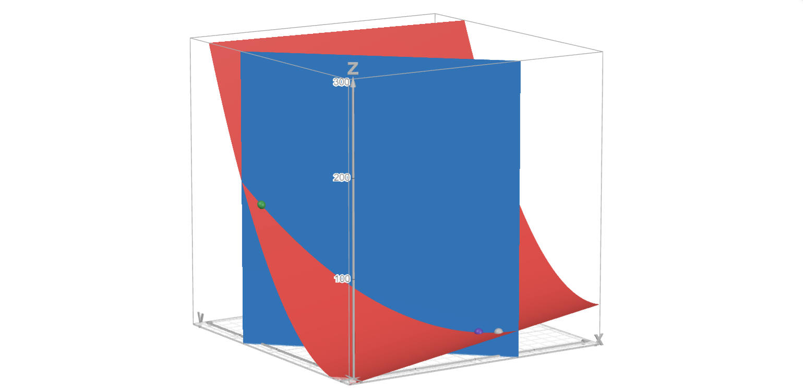
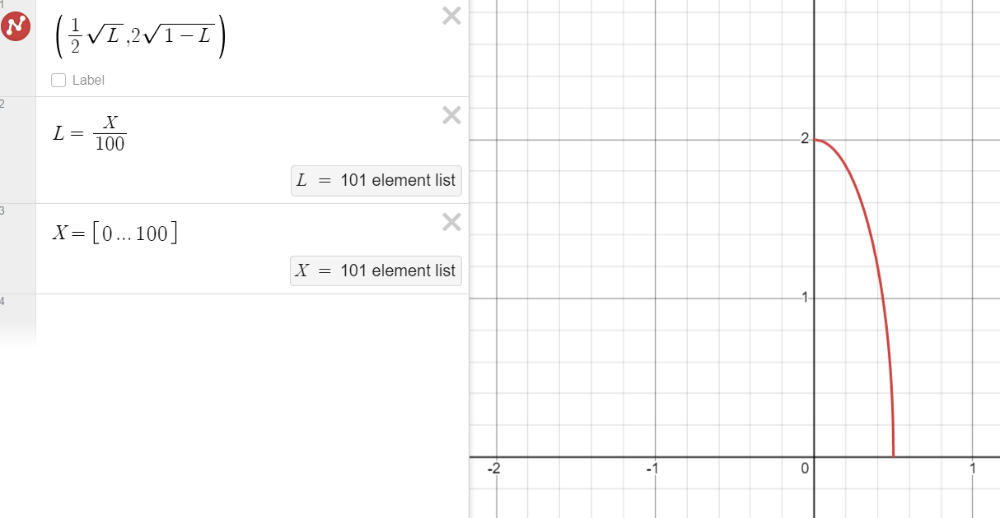

# Microeconomics, Homework 5

## Problem 1

The problem gives us the following:

$$U_1(C_1, R_1) = C_1R_1^2,\quad U_2(C_2,R_2)=C_2^2R_2, \quad y=2\sqrt{L}$$

and the following prices, which we normalize:

$$\begin{pmatrix}
    p_C\\
    p_R\\
    p_L
\end{pmatrix}\leadsto\begin{pmatrix}
    1\\
    p_R\\
    p_L
\end{pmatrix}$$

We need to first **maximize the firm's profit** and then **maximize consumers' utility.**

For this, solve the following profit maximization problem:

$$\pi(y)=y-p_LL\to \max, \quad y\leq2\sqrt{L}$$

Since the optimum would be at the point when the inequality holds, we express L and plug it back in:

$$y^2=4L\implies L=\frac{y^2}{4}$$

$$\pi(y)=y-p_L\frac{y^2}{4}$$

Maximizing this, we get

$$\pi(y)'_y=1-p_L\frac{y}{2}=0\implies y=\frac{2}{p_L}$$

and the maximum value itself would be 

$$\pi(y)=\frac{2}{p_L}-p_L\frac{4}{4p_L^2}=\frac{1}{p_L}$$

---

Now, maximize the consumers' utility given the limitation that the volume of the consumed good should be equal to the volume of the supplied good (we take into account only the fraction $\alpha$ of the firm):

$$U(C_1,R_1)=C_1R_1^2\to \max,\quad p_CC_1+p_RR_1=p_L\bar L+\alpha\frac{1}{p_L}$$

We know that MRS should be equal to the ratio of prices, so we get:

$$\frac{R^2_1}{2R_1C_1}=\frac{1}{p_R}\implies R_1=\frac{2C_1}{p_R}$$

Plug it back into the limitation:

$$C_1+2C_1=p_L\bar L+\alpha\frac{1}{p_L}\implies C_1=\frac{1}{3}\left(p_L\bar L+\alpha\frac{1}{p_L}\right)$$

---

Now do the same thing for the second consumer:

$$U(C_2,R_2)=C_2^2R_2\to \max,\quad p_CC_2+p_RR_2=p_L\bar L+(1-\alpha)\frac{1}{p_L}$$

We know that MRS should be equal to the ratio of prices, so we get:

$$\frac{R_2C_2}{C_2^2}=\frac{1}{p_R}\implies R_2=\frac{C_2}{2p_R}$$

Plug it back into the limitation:

$$C_2+\frac{C_2}{2}=p_L\bar L+(1-\alpha)\frac{1}{p_L}\implies C_2=\frac{2}{3}\left(p_L\bar L+(1-\alpha)\frac{1}{p_L}\right)$$

---

Now since we know the total demand should be equal to the total supply of the consumer good, we may plug the values from above like follows:

$$C_1+C_2=\frac{1}{p_L}\implies$$

$$\frac{1}{3}\left(p_L\bar L+\alpha\frac{1}{p_L}\right)+\frac{2}{3}\left(p_L\bar L+(1-\alpha)\frac{1}{p_L}\right)=\frac{1}{p_L}\implies$$

$$p_L^2\bar L+\alpha+2p_L^2\bar L+2-2\alpha=3$$

$$3p_L^2\bar L=\alpha+1\implies p_L=\sqrt{\frac{\alpha + 1}{3\bar L}}$$

---

As for the economic interpretation of the interdependence between variables $p_L$ and $\alpha, \bar L$, we may state the following:

* The higher the number of the shares  held by the first consumer, the higher the labour price would be. This is a direct relation.
* The first consumer is not as interested in producing the consumer good as the second one because the utility they get from it is considerably lower in comparison to the second consumer.
* The larger the labour supply is, the lower the labour price on the market would be ("why would I hire anyone else if I can do it by myself already?" in this case). This is an inverse relation.

## Problem 2

We are given the following:

$$U_A(c_A, l_A)=a\ln c_B+l_A$$

$$U_B(c_B, L_B)=a\ln c_B+l_B$$

$$l_i=1-L_i\in[0,1],\quad 0 < a < 1, \quad b > 0$$

Household A also owns a firm

$$Y=b\sqrt{L}$$

### Subproblem A

We know that for an inner Pareto optimum to exist we require the marginal rates of substitution for both consumers and firms to be equal.

$$MRS_A=MRS_B=MRTS$$

$$\frac{\frac{\partial U_A}{\partial l_A}}{\frac{\partial U_A}{\partial c_A}}=\frac{\frac{\partial U_B}{\partial l_B}}{\frac{\partial U_B}{\partial c_B}}=\frac{\partial Y}{\partial L}$$

$$\frac{1}{\frac{a}{c_A}}=\frac{1}{\frac{a}{c_B}}=\frac{b}{2\sqrt{L}}\implies c_A=c_B=c,\quad L=\frac{a^2b^2}{4c^2}$$

We also know that the demand should be equal to the supply:

$$c_1+c_2=Y\implies 2c=b\sqrt{\frac{a^2b^2}{4c^2}}\implies2c=\frac{ab^2}{2c}\implies c=\frac{b}{2}\sqrt{a}$$

Thus we can figure out that the total amount of labour on the market is 

$$L=\frac{a^2b^2}{4\frac{b^2}{4}a}=a$$

which implies that given some labour ($L_A$) that the first household holds, we have the following contract curve:

$$\begin{pmatrix}
    c_A\\
    L_A\\
    c_B\\
    L_B
\end{pmatrix}=\begin{pmatrix}
    \frac{b}{2}\sqrt{a}\\
    L_A\\
    \frac{b}{2}\sqrt{a}\\
    a-L_A
\end{pmatrix}$$

### Subproblem B

Prices vector:

$$\begin{pmatrix}
    p_c\\
    p_L
\end{pmatrix}=\begin{pmatrix}
    1\\
    w
\end{pmatrix}$$

First, let's find the profit that the first household gets. For this, solve the following maximization problem:

$$\pi(Y)=Y-wL\to\max,\quad Y=b\sqrt{L}$$

$$L=\frac{Y^2}{b^2}\implies\pi(Y)=Y-w\frac{Y^2}{b^2}$$

thus the optimum would be in this parabola's vertex:

$$Y=\frac{b^2}{2w}\implies \pi = \frac{b^2}{2w}-\frac{b^2}{4w}=\frac{b^2}{4w}$$

---

Now maximize the utility of the agents. 

$$U_A(c_A, l_A)=a\ln c_A+l_A, \quad c_A+wL_A=wL_A+\pi$$

$$U_A(c_B, l_B)=a\ln c_B+l_B, \quad c_B=wL_B$$

From the first subproblem we know that 

$$MRS=\frac{a}{c_i}$$

so we may equate this to the ratio of prices:

$$\frac{a}{c_i}=\frac{1}{w}\implies c_i=aw\implies$$

$$ c_A=c_B=aw=\frac{b}{2}\sqrt{a}\implies w=\frac{b}{2\sqrt{a}}$$

Now let's check whether the market is cleared per the limitation of the first agent:

$$c_A+wL_A=wL_A+\pi\implies \pi=c_A$$

$$\frac{b^2}{4w}=\frac{b}{2}\sqrt{a}\implies\frac{b}{2}\sqrt{a}=\frac{b}{2}\sqrt{a}$$

which implies it is cleared 

Respectively, for the second agent we have the following limitation:

$$c_B=wL_B\implies L_B=\frac{c_B}{w}=\frac{\frac{b}{2}\sqrt{a}}{\frac{b}{2\sqrt{a}}}=a$$

which implies that the second agent works all the time and the first agent doesn't work whatsoever. Therefore, it is **false** that the labour supply of each household is non-zero in the equilibrium.

Thus, the Walras' equilibrium is

$$\begin{pmatrix}
    c_A\\
    L_A\\
    c_B\\
    L_B
\end{pmatrix}=\begin{pmatrix}
    \frac{b}{2}\sqrt{a}\\
    0\\
    \frac{b}{2}\sqrt{a}\\
    a
\end{pmatrix}$$

### Subproblem C

Yes, the Walras equilibrum is Pareto-optimal per the first welfare theorem since the functions of all consumers are locally insatiable. 

## Problem 3

This distribution is obviously non-Pareto-optimal since

$$MRS \neq MRTS$$

Construct a Pareto improvement:

* Since MRTS is equal to $1$, we may exchange the production rates of any of the two goods equivocally.
* Let's try to increase the consumption of the first good by some unit value of $1$.
* Since MRS is equal to $3$, then we would need to drop the consumption of the second good by this unit value of $3$ while increasing the consumption of the first good. 
* However, it is sufficient to decrease the aforementioned consumption by one as not to affect the welfare of the producer. Therefore, there certainly exists a Pareto improvement where the producer wouldn't be affected whereas the consumer would only strictly benefit.

## Problem 4

We are given:

$$U(l,b)=2l+b,\quad b(L)=L^2$$

where $b(L)$ is the banana production function.

---

### Subproblem A

To try and find the inner Pareto optimum, equate MRS with MRTS and get:

$$MRS=MRTS=\frac{2}{1}=2L\implies L=1, b=1$$

Assuming that Robinzon can only be awake for $12$ hours, we have a restriction that 

$$l+L=12\implies l=11$$

Graphical illustration:

> * x-axis plots the leisure hours $l$
> * y-axis plots the working hours $L$
> * green and white dots plot the edge case optimums whereas the purple dot plots the inner Pareto optimum

It is obvious from the graph and the combined utility function

$$U(l,L)=2l+L^2$$

that the solutions would be edge-cases and that it is more optimal for Robinzon to work as much possible, just like us :)

Thus, Robinzon should work for $12$ hours.

$$\begin{pmatrix}
    l\\
    L
\end{pmatrix}=\begin{pmatrix}
    0\\
    12
\end{pmatrix}$$

### Subproblem B

Robinzon made a mistake of not checking his technological set for its convexity! In particular, the given production function has increasing returns to scale, which should rather be non-increasing.

This is precisely the reason why the maximum utility exists as an edge case and why it's impossible to find prices that would yield a Walras' equlibrium.

## Problem 5

We are given:

$$U_1(x_1^A,x_1^B)=x_1^Ax_1^B$$

$$U_2(x_2^A,x_2^B)=(x_2^A)^\beta(x_2^B)^\beta,\quad\beta>0$$

$$x^B=\sqrt{x^A}$$

$$(w^A_1,w^B_1)=(12,0),\quad (w^A_2,w^B_2)=(36,0)$$

$$(x^A_1,x^B_1)=(20,2.5),\quad(x^A_2,x^B_2)=(12, 1.5)$$

and from the seminar this could also be useful:

$$\pi(p^A,p^B)=\frac{(p^B)^2}{4p^A}$$

---

To check whether it's possible to find an equilibrium with transferts, check whether the criteria for the second welfare theorem holds. For this, check whether the good reserves for each of the agents are proportional:

$$\frac{20}{2.5}=\frac{12}{1.5}=8$$

which means it should be possible to arrive at an equilibrium with transferts somehow.

Normalizing the prices, we get

$$\begin{pmatrix}
    p^A\\
    p^B
\end{pmatrix}=\begin{pmatrix}
    1\\
    8
\end{pmatrix}$$

Now we may calculuate the total income:

$$\pi(p^A,p^B)=\frac{64}{4}=16$$

Thus the split between two people is 

$$\begin{pmatrix}
    \pi_1\\
    \pi_2\\
\end{pmatrix}=\begin{pmatrix}
    4\\
    12\\
\end{pmatrix}$$

As for the transferts themselves, calculate the expenses and the income and subtract the former from the latter:

$$T_1=p_A\bar x_1^A+p_B\bar x_1^B-p_A\omega_1^A-\pi_1=20+2.5\times8-12-4=40-16=24$$

$$T_2=p_A\bar x_2^A+p_B\bar x_2^B-p_A\omega_2^A-\pi_2=12+1.5\times8-36-12=24-48=-24$$

Thus we have solved this part of the task correctly, awesome.

---

An alternative way of redistribution would be to redistribute the initial reserves would be to split them as well as the shares of the firm differently.

We could find the ratio of the expenses that each of the agents has and split the shares of the firm similarly:

From above we know that expenses of the first agent is $40$ and of the second is $24$

Thus we split the firm like follows:

$$\frac{40}{24}=\frac{5}{3}$$

which implies that the first agent should get $\frac{5}{8}=62.5\%$ of the firm and the second agent should get $\frac{3}{8}=37.5\%$ of the firm.

As for the initial reserves, we should split the total $36+12=48$ of the reserves similarly:

$$\begin{pmatrix}
    w^A_1\\
    w^A_2
\end{pmatrix}=\begin{pmatrix}
    30\\
    18
\end{pmatrix}$$

## Problem 6

We are given:

$$y_B=\frac{1}{2}\sqrt{L_B},\quad y_E=2\sqrt{L_E}$$

$$U(x_B,x_E)=x_Bx_E-y_B$$

---

### Subproblem A

Re-write the given technological functions taking into account that $L_E=1-L_B$

$$y_B=\frac{1}{2}\sqrt{L_B},\quad y_E=2\sqrt{1-L_B}$$

The technological set would be simply the set of all such points:

$$(y_B,y_E)=\left(\frac{1}{2}\sqrt{L_B},2\sqrt{1-L_B}\right)$$

### Subproblem B

Given that $p_B=1$ and that for the market to get cleared we should consume the same amount of goods as we produce, we have $x_B=y_B,x_E=y_E$:

Thus our presumed budget limitation is redundant since 

$$x_B+p_Ex_E=y_B+p_Ey_E$$

holds true regardless.

Now maximize the profit given that $L_B=L,L_E=1-L,p_E=p$:

$$\pi(L)=\frac{1}{2}\sqrt{L}+2p\sqrt{1-L}\to\max$$

First order condition:

$$\frac{1}{4\sqrt{L}}-\frac{p}{\sqrt{1-L}}=0\implies L=\frac{1}{16p^2+1}$$

The share of the profit for the first good would be:

$$\frac{1}{2}\pi=\frac{1}{2}\sqrt{L}\implies \pi=\sqrt{L}$$

(we get this from the fact that half of our budget is spent on the first good per a Cobb-Douglaseque distribution)

Now we may try and figure out the price $p$ by plugging our values into the profit equation from above:

$$0=-\frac{1}{2}\sqrt{L}+2p\sqrt{1-L}$$

$$p=\frac{\frac{1}{2}\sqrt{L}}{2\sqrt{1-L}}\implies p^2=\frac{L}{16-16L}$$

$$p^2=\frac{\frac{1}{16p^2+1}}{16-16\frac{1}{16p^2+1}}\implies 16p^2=1\implies p=\frac{1}{4}$$

Therefore we have

$$L=\frac{1}{2}$$

$$x_B=\frac{1}{2}\sqrt{\frac{1}{2}}=\frac{1}{\sqrt{8}}$$

$$x_E=2\sqrt{1-\frac{1}{2}}=\frac{2}{\sqrt{2}}=\sqrt{2}$$

So the Walras' equilibrium is 

$$(p_B,p_E,x_B,x_E)=\left(1, \frac{1}{4}, \frac{1}{\sqrt{8}},\sqrt{2}\right)$$

### Subproblem C

To find the Pareto optimum, we should solve the following maximization problem taking into account the external factors:

$$x_Bx_E-y_B\to\max,\quad x_B=y_B=\frac{1}{2}\sqrt{L},\quad x_E=y_E=2\sqrt{1-L}$$

$$\sqrt{L}\sqrt{1-L}-\frac{1}{2}\sqrt{L}\to\max$$

I'm kinda running out of time sooo

Evidently, the optimal distribution **doesn't** actually correspond to the Walras' equilibrium **because when solving the previous subproblem we did not account for the negative impact of the externality.** In this case, we have actually accounted for the variable $y_B$ so it is only logical there would be such a mismatch.