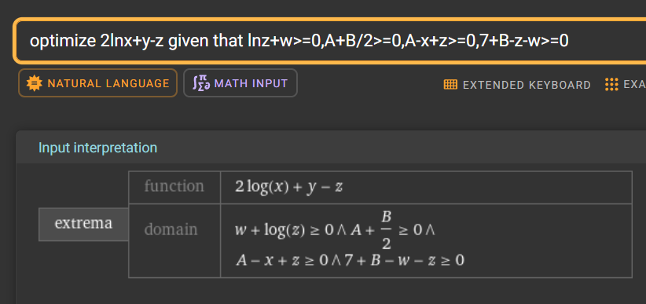
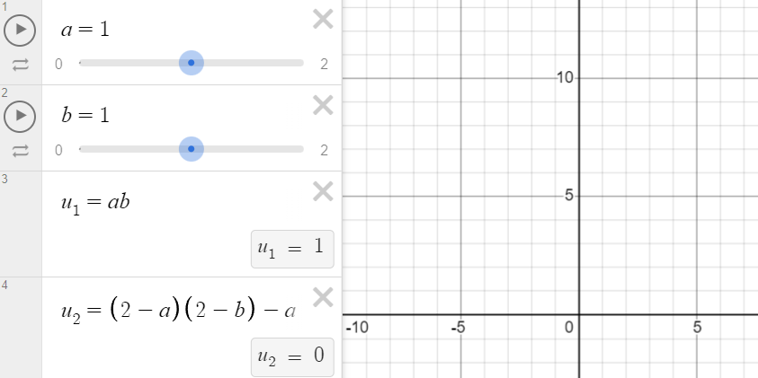
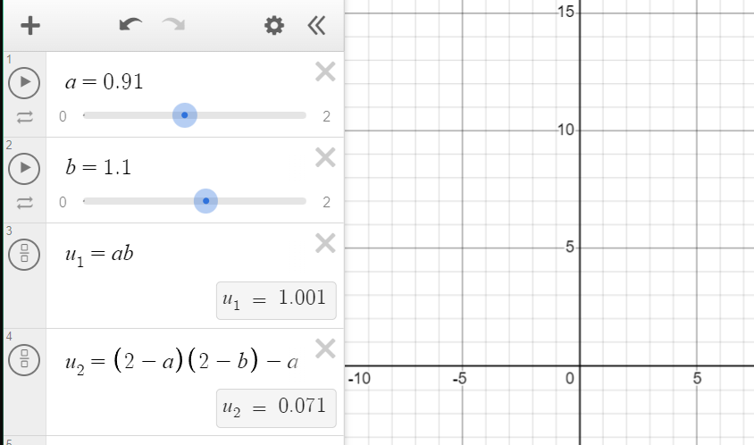
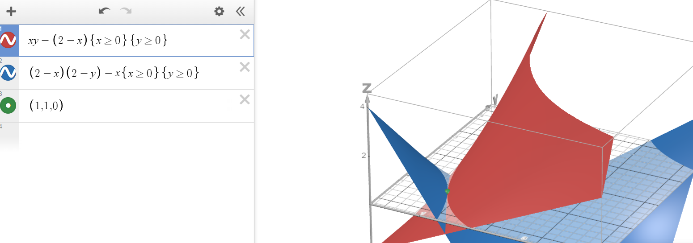

# Microeconomics, Homework #6

## Problem 1

$$u_1=2\ln x_1^A+x_1^B-x_2^A$$

$$u_2=\ln x_2^A+x_2^B$$

$$g(y^A, y^B)=y^A+\frac{y^B}{2}$$

$$(w_1^A,w_2^A,w_1^B,w_2^B)=(0,0,4,3)$$

### Subproblem A

The external effect that exists in this economy is as follows:

* The second agent likes consuming good A 
* The first agent dislikes whenever the second agent consumes good A

This creates a negative externality for the first agent.

Example:

* Say that the second agent ~~is my neighbour from above~~ really likes buying drills (for some reason, duh) and producing noise, thus getting positive utility out of this wonderful interaction
* Also say that the first agent also likes drills but values them too much to use, so they just collect them and leave them hanging on the wall or something
* This way both agents benefit from buying drills and only the second agent makes the first one uncomfortable by producing noise by utilizing them

### Subproblem B

Introduce the prices vector:

$$\begin{pmatrix}
    p^A\\
    p^B
\end{pmatrix}=\begin{pmatrix}
    1\\
    p
\end{pmatrix}$$

Solve the following maximization problems:

$$u_1=2\ln x_1^A+x_1^B-x_2^A\to\max,\quad x_1^A+px_1^B=4p$$

$$u_2=\ln x_2^A+x_2^B\to\max,\quad x_2^A+px_2^B=3p$$

$$\pi(y^A,y^B)=y^A+py^B\to\max,\quad g=y^A+\frac{y^B}{2}\geq0$$

and the original reserves being 

$$x_1^A+x_2^A=y^A,\quad x_1^B+x_2^B+y^B=w_1^B+w_2^B=7$$

The implicit product function tells that we may spend half a unit of good B to produce one unit of good A.

Since we know that the utilities would be maximal when MRS is equal to the ratio of prices, we may get:

$$\text{MRS}_1=\frac{1}{p}=\frac{\partial u_1/\partial x_1^A}{\partial u_2/\partial x_1^B}=\frac{2}{x_1^A}\implies x_1^A=2p$$

and now from the restriction we get

$$x_1^A+px_1^B=4p\implies 2p+2x_1^B=4p\implies x_1^B=2$$

Same for the second utility function:

$$\text{MRS}_2=\frac{1}{p}=\frac{\partial u_1/\partial x_1^A}{\partial u_2/\partial x_1^B}=\frac{1}{x_2^A}\implies x_2^A=p$$

and now from the restiction we get

$$x_2^A+px_2^B=3p\implies p+px_2^B=3p\implies x^B_2=2$$

Thus from the original reserves equations we may get

$$2p + p=y^A,\quad 2+2+y^B=7$$

$$y^A=3p,\quad y^B=3$$

which means that we consume $4$ units of good B and use $3$ units out of the total $7$ to produce twice less of good A, which implies that $y^A=\frac{3}{2}$. This allows us to get the price

$$\frac{3}{2}=3p\implies p =\frac{1}{2}$$

This value coincides well with the profit maximization problem as well (it is evident that $\pi$ would be equal to $0$):

$$\pi(y^A,y^B)=y^A+py^B\to\max,\quad g=y^A+\frac{y^B}{2}\geq0$$

which means we get our final vector

$$\begin{pmatrix}
    x_1^A\\
    x_1^B\\
    x_2^A\\
    x_2^B\\
    p^A\\
    p^B\\
    y^A\\
    y^B\\
\end{pmatrix}=\begin{pmatrix}
    1\\
    2\\
    1/2\\
    2\\
    1\\
    1/2\\
    3/2\\
    3\\
\end{pmatrix}$$

### Subproblem C

Let's ploink the optimization straight away and admire this monstrosity:

$$
u_1 = 2\ln{x_1^A} + x_1^B - x_2^A \to\max
$$

where $\bar u$ is some kinda original level of utility and given that 

$$
\begin{cases}
\ln{x_2^A} + x_2^B - \bar u \geq 0 \\
y^A + \frac{y^B}{2} \geq 0 \\
y^A - x_1^A - x_2^A \geq0\\
7 + y^B - x_1^B + x_2^B\geq0
\end{cases}
$$

Since I am running out time once again, plugging this into wolfram yields

the following answer:

> which I'm not very sure of but alas I don't have enough time for this

$$(x_1^A,x_2^A,x_1^B,x_2^B,y^A,y^B)=\left(1, \frac{1}{3}, x, \frac{8}{3} - x,\frac{4}{3},-\frac{8}{3}\right)$$

which once again does not correspond to the previous result because we didn't take the externality into account

### Subproblem D

We could establish two externalities in this case. The first one being an externality $e_1$ for the first agent that would give them some kinda price the first agent would get for putting up with the noise, which they have the right to. 

Alternatively, we could establish an externality $e_2$ for the second agent that would account for the lost pleasure from drilling holes. 

Therefore, if any of the agents get more from the externality price that had been paid, the externality itself ceases to exist since we either cancel it out or simply more utility that we might have expected otherwise. Accounting for these new profits in the utility functions could fix the aforementioned problem. 

## Problem 2

$$u_1=x_1^Ax_1^B-\alpha x_2^A,\quad u_2=x_2^Ax_2^B-x_1^A$$

$$(w_1^A,w_1^B,w_2^A,w_2^B)=(1,1,1,1)$$
 
### Subproblem A

Given that $\alpha=0$, we may find the Cobb-Douglas-esque demands given that the externalities for each of the agents could be treated as constants regardless:

$$\begin{cases}  
x^A_i = \dfrac{p^A + p^B }{2p^A}\\[2mm] 
x^B_i = \dfrac{p^A + p^B}{2p^B}  
\end{cases}$$
 
Given that 
 
$$x^A_1 + x^A_2 = w_1^A + w_2^A, \quad x^B_1 + x^B_2 = w_1^B + w_2^B$$
 
and the general symmetry of this task and the fact that we have treated the externalities as constants, we get that 

$$ p^A = p^B,\quad
x^A_1 = x^A_2 = x^B_1 = x^B_2=1
$$

Let's try to slightly nudge the utilities of two of the agents and try to make it better:

Better case scenario is easily found, therefore this case is not Pareto optimal

### Subproblem B

Now let's solve this problem actually taking into account the externalities.
 
$u_i = x^A_i x^B_i - \alpha(2-x^A_i), \quad \text{where if} \ i=2, \alpha=1$ 

We know that a Pareto optimal is only possible if MRS of two consumers is equal, thus we need: 
 
$$\text{MRS}_1 = 1 + \dfrac{x^B_1 + \alpha}{x^A_1} = 1 + \dfrac{x^B_2 + 1}{x^A_2} = \text{MRS}_2$$

which is only possible when $\alpha_{1,2}=1$.

> **TL;DR:** externalities cancel out, rending the agents' initial conditions Pareto optimal.

Effectively, we have achieved pure symmetry in out utility functions, which allows to fully ignore the existence of the constant externalities that affect our consumers equally for same volumes consumed. The pareto optimum can be easily visualized on the picture below, where either consumer can drag the green dot any other way without making it worse for themselves. This pareto-optimum remains at $(1,1,1,1)$. Furthermore, since the MRS are the same, they are collinearly directed and thus do not shift this optimum anywhere.

## Problem 3 

### Subproblem A

Some funny formulas for the gardener (e. g. their profit):
$$ \pi_a = p_a y_a - c_a(y_a, y_h) $$

First order conditions go brrr:
$$ \frac{\partial \pi_a}{\partial y_a} = p_a - \frac{\partial}{\partial y_a} c_a(y_a, y_h) = 0 $$
and we get
$$ p_a = \frac{\partial}{\partial y_a}  c_a(y_a, y_h)$$

---

Same stuff for the beekeeper:
$$ \pi_h = p_h y_h - c_h(y_a, y_h) $$

First order conditions go brr once again:

$$ \frac{\partial \pi_h}{\partial y_h} = p_h - \frac{\partial }{\partial y_h}c_h(y_a, y_h) = 0 $$

and we get

$$p_h = \frac{\partial }{\partial y_h}c_h(y_a, y_h) $$

If we combine those profits, we would get:

$$ \Sigma \pi = \pi_a + \pi_h = p_a y_a - c_a(y_a, y_h) + p_h y_h - c_h(y_a, y_h) $$

Thus, the inner irregulated equilibrium is achieved when

$$\begin{cases}
p_a = \dfrac{\partial}{\partial y_a}  c_a(y_a, y_h)\\\\ p_h = \dfrac{\partial }{\partial y_h}c_h(y_a, y_h)
\end{cases}$$

The optimum would be achieved at the extremum, e. g. when the partial derivatives are both equal to $0$.
$$ \begin{cases}\dfrac{\partial \Sigma\pi}{\partial y_a} = p_a - \dfrac{\partial }{\partial y_a}c_a(y_a, y_h) - \dfrac{\partial }{\partial y_a}c_h(y_a, y_h) = 0\\\\
\dfrac{\partial\Sigma\pi}{\partial y_h} = p_h - \dfrac{\partial }{\partial y_h}c_a(y_a, y_h) - \dfrac{\partial }{\partial y_h}c_h(y_a, y_h) = 0 \end{cases}$$

Uh-oh, we get that the optimal case does not actually match with the equilibrium existence conditions because, once again, as multiple times above, the external factors have not been taken into account whatsoever, yada-yada-yada. So yeah, it's obviously not accounted for in the equilibrium.

### Subproblem B

Let's try and construct a local Pareto improvement somehow. We know that the higher the production rates of each agent are, the lower are the expenses of the other respective agent, which is proven by these two conditions:

$$\frac{\partial }{\partial y_h}c_a(y_a,y_h)<0,\quad\frac{\partial }{\partial y_a}c_h(y_a,y_h)<0$$

Therefore, we need to increase the production rates of $y_a$ and $y_h$. If the do that, the total profit definitely increases since we are now selling more goods and furthermore, since we are now selling more goods, somehow each of the agents is now having less expenses (which is kinda obvious because apples and bees benefit each other quite nicely), which definitely only contributes to an existence of a Pareto improvement.

### Subproblem C

Let's introduce Pigouvian taxes. We know that the gardener would have to pay

$$ \tau_a = - \frac{\partial }{\partial y_a} c_h(y_a, y_h)$$

and the beekeeper:

$$ \tau_h = - \frac{\partial }{\partial y_h} c_a(y_a, y_h)$$

We need Pigouvian taxes to internalize externalities. In this case, instead of taxes, we would need Pigouvian subsidies (which are effectively just negative taxes). These subsidies would incentivize both the gardener and beekeeper to increase production to the socially-optimal level, which is depicted by the minus signs we have above.

---

Honestly idk why did I do this but I shall leave this here anyway:

Now maximize everything:

$$ \pi_a = p_a y_a - c_a(y_a, y_h) - \tau_a y_a \to \max$$

First order conditions go brrr:

$$\frac{\partial \pi_a}{\partial y_a} = p_a - \frac{\partial }{\partial y_a}c_a(y_a, y_h) - \tau_a = 0 \implies$$

$$ p_a = \frac{\partial }{\partial y_a} c_a(y_a, y_h)- \frac{\partial }{\partial y_a}c_h(y_a, y_h) $$

---

Same goes for the beekeeper now:

Maximize everything:

$$\pi_h = p_h y_h - c_h(y_a, y_h) - \tau_h y_h \to\max$$

First order conditions go brrr:

$$\frac{\partial \pi_h}{\partial y_h} = p_h - \frac{\partial }{\partial y_h} c_h(y_a, y_h)- \tau_h = 0 \implies$$

$$p_h = \frac{\partial }{\partial y_h}c_h(y_a, y_h) - \frac{\partial }{\partial y_h}c_a(y_a, y_h) $$

