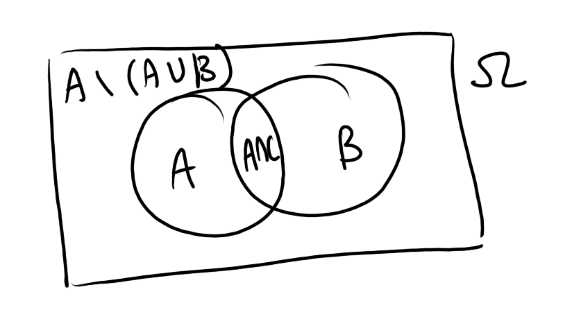

# Theory of probability, Homework 1

> Sinelnikov Artyom Vitalyevich, BEDA-231

## Problem 1

---

We simply subtract each of the three distinct sectors from $\Omega$.

$$A\cap B=\Omega\setminus(A\setminus B)\setminus(B\setminus A)\setminus(\Omega\setminus A \setminus B)$$

## Problem 2

The answer to this would be simply the intersection of the union of all sets as $n\to\infty$ (I don't see the necessity to strictly prove this anywhere in the task, so I'll leave it like this because imho it's a pretty wide-known definition):

$$\lim_{n\to\infty}\sup A_n=\bigcap^\infty_{n=1}\bigcup^\infty_{i=n}A_i$$

## Problem 3 

Similarly to above, but we reverse the order of operations and get the union of all the intersections:

$$\lim_{n\to\infty}\inf A_n=\bigcup^\infty_{n=1}\bigcap^\infty_{i=n}A_i$$

## Problem 4

All the requires axioms are the following:

1. $\Omega\in\mathcal{F}$
2. $A\in\mathcal{F}\implies A^c\in\mathcal{F}$
3. $A_1\ldots,A_n\ldots\in\mathcal{F}\implies\displaystyle\bigcup^\infty_{i=1}A_i\in\mathcal{F}$

Therefore, we need to add:

1. $\Omega$
2. Complement to 1, $\varnothing$
3. Complement to $\{a\}$, $\{b, c, d\}$
4. Complement to $\{a, d\}$, $\{b, c\}$
5. Union $\{a, b, c\}$
6. Complement to 5 $\{d\}$

Thus we get 

$$\{\varnothing, \Omega, \{a\},\{d\},\{a, d\},\{b, c\}, \{a, b, c\},\{b, c, d\}\}$$

## Problem 5

We shall work in $(\Omega,\mathcal{F},\mathbb{P})$

Using the inclsion-exclsuion formula, we have

$$P(A\cup B)=P(A)+P(B)-P(A\cap B)=1-P(A\cap B)$$

Using de Morgan's law:

$$P(A^c\cup B^c)=1-P(A\cap B)$$

These two expressions are equal, thus we have shown that the given conditions hold.

## Problem 6

Trying to fit $P(A)$ and $P(B)$ into a maximum sum of $1$, we get the maximum intersection of $P(A)+P(B)-1=0.1$, whereas we have $0.05$.

Thus, it's not possible.

If this is not strict enough, then

$$1=P(\Omega)\geq P(A\cup B)=P(A)+P(B)-P(A\cap B)$$

Given $P(A\cap B)=0.05$, we get

$$1\geq0.5+0.6-0.05\implies 1\geq1.05\implies$$

that this is impossible.

## Problem 7

### Subproblem A

If none of the events happened, then we may subtract the probability of the union of all events $A_i$ happening from the probability of $1$ and use the inclusion-exclusion formula:

$$\begin{align*}1&-P(A_1\cup A_2\cup A_3)\\&=1-P(A_1)-P(A_2)-P(A_3)+P(A_1\cap A_2)\\&+P(A_2\cap A_3)+P(A_1\cap A_3)-P(A_1\cap A_2\cap A_3)\\&=1-\left(\frac{1}{3}+\frac{1}{3}+\frac{1}{3}-\frac{1}{9}-\frac{1}{9}-\frac{1}{9}+0\right)\\&=1-\left(1-\frac{1}{3}\right)=\frac{1}{3}\end{align*}$$

## Subproblem B

If exactly one event happened, then we need to subtract the probabilities of two other event pairs happening at once from the corresponding probability (all events can't happen at once so I'll just omit this further):

$$\begin{align*}&P(A_1)-P(A_1\cap A_2)-P(A_1\cap A_3)\,+\\
&P(A_2)-P(A_1\cap A_2)-P(A_2\cap A_3)\,+\\
&P(A_3)-P(A_1\cap A_3)-P(A_2\cap A_3)=\\
&3\left(\frac{1}{3}-\frac{1}{9}-\frac{1}{9}\right)=\frac{1}{3}\end{align*}$$

Since all pairs of events are independent, we simply add up all their probabilities:

$$P(A_1\cap A_2)+P(A_2\cap A_3)+P(A_1\cap A_3)=\frac{1}{3}$$

## Problem 8

### Subproblem A

$$P(A)\leq P(B)+P(A\triangle B)$$

Since symmetric difference is the union of each set differences + given additivity property, then

$$P(A)\leq P(B)+P(A\setminus B)+P(B\setminus A)$$

$$P(A)\leq P(B\setminus A)+\underbrace{P(A\cap B)+P(A\setminus B)}_{P(A)}+P(B\setminus A)$$

$$P(A)\leq P(B\setminus A)+P(A)+P(B\setminus A)$$

$$0\leq P(B\setminus A)+P(B\setminus A)$$

which is always true for probabilities.

### Subproblem B

$$|P(A)-P(B)|\leq P(A\triangle B)$$

$$|P(A)-P(A\cap B)-P(B\setminus A)|\leq P(A\cup B)-P(A\cap B)$$

We may remove the module and solve up to symmetry:

$$P(A)-P(B\setminus A)\leq P(A\cup B)$$

$$P(A\setminus B) +P(A\cap B)-P(B\setminus A)\leq P(A\setminus B)+P(B\setminus A)+P(A\cap B)$$

$$-P(B\setminus A)\leq P(B\setminus A)$$

$$0\leq 2P(B\setminus A)$$

which is always true for probabilities as well.

## Problem 9

Given the normalization constraint, we can't exceed $1$ for the probability of the intersection of all sets occurring.

Let's prove that it's impossible for it to be lower than $1$.

Since $\forall \tau\in\mathcal{F}, P(\tau)>0\colon \tau\subseteq A_i$, then for the probability of the interseciton to be lower than $1$ for some outcome, we would have to have some $P(\tau)>0$ such that $\tau\not\subseteq A_i$, however since all the events $A_i$ always occur, then those outcomes are impossible. Thus we have arrived at a contradiction and this statement holds true.

## Problem 10

Pairs of events are independent if and only if 

$$P(A_i\cap A_j)=P(A_i)P(A_j)$$

Thus we need to prove that (using inclusion-exclusion formula)

$$\begin{align*}P(A_i^c\cap A_j^c)&=1-P(A_i\cap A_j)
\\&=1-P(A_i)-P(A_j)+P(A_i\cap A_j)\\&=1-P(A_i)-P(A_j)+P(A_i)P(A_j)
\\&=1-P(A_i)-P(A_j)+(1-P(A_i^c))(1-P(A_j^c))
\\&=1-P(A_i)-P(A_j)+1-P(A_j^c)-P(A_i^c)+P(A_i^c)P(A_j^c)
\\&=\underbrace{2-2P(A_k\cap A_{k}^c)\bigm|_{k\in{i,j}}}_{0}+P(A_i^c)P(A_j^c)
\\&=P(A_i^c)P(A_j^c)
\end{align*}$$

Now we need to prove the same for all three events together (I skipped most transformations because they were too long and straightforward — effectively, all the double products cancel out into ones and they, in turn, also eventually cancel out through the magic of indicator functions):

$$\begin{align*}P(A_1^c\cap A_2^c\cap A_3^c)=1-P(A_1\cap A_2\cap A_3)&=\underbrace{1-P(A_1)+P(A_2)-P(A_1\cap A_2)}_{P(A_1^c)P(A_2^c)}+P(A_3)\\&-P(A_2\cap A_3)-P(A_1\cap A_3)+P(A_1\cap A_2\cap A_3)\\
&=P(A_1^c)P(A_2^c)+1-P(A_3^c)-(1-P(A_2^c))(1-P(A_3^c))\\
&-(1-P(A_1^c))(1-P(A_3^c))\\
&+(1-P(A_1^c))(1-P(A_2^c))(1-P(A_3^c))\\
&=P(A_1^c)P(A_2^c)P(A_3^c)
\end{align*}$$

## Problem 11

From the calculus course we know that decimal points on an interval can be treated as infinite integer sequences.

Therefore, since all outcomes are equally probable given this uniform distribution, this task transforms into figuring out "what is the probability that in an infinite integer sequence there is no certain number?"

The probability of $1$ not being chosen on any given iteration is $\frac{9}{10}$ where $10$ is the total number of digits.

As we increase the total number of digits, we multiply these probabilities, thus the probability of any certain number never being chosen is 

$$\left(\frac{9}{10}\right)^n$$

however since the decimals are infinite, we need to take the limit of this expression

$$P(\text{digit x is not chosen)}=\lim_{n\to\infty}\left(\frac{9}{10}\right)^n=0$$

which would be our final answer.

## Problem 12

Define random value $X$ as the count of bad weather events that lead to the halt of the manufactory. 

We use $\text{Pois}(2)$ for the distribution.

Thus 

$$P(\{X=k\})=e^{-2}\frac{2^k}{k!}$$

and we also know that 

$$\mathbb{E}X=2$$

We have the loss premium at 

$$\mathcal{L}(x)=\begin{cases}
0, & x\in\{0, 1, 2\}\\
10000 * (x - 2), & x\in[3, +\infty)
\end{cases}$$

Therefore let's calculate what the series of loss premiums converges to (we begin from $3$ because for the first two iterations the expected premium is $0$):

$$\begin{align*}\mathbb{E}\mathcal{L}&=\sum^\infty_{x=3}\mathcal{L}(x)P(\mathcal{L}(x))
\\&=\sum^\infty_{x=3}10000(x-2)e^{-2}\frac{2^x}{x!}
\\&=80000e^{-2}\sum^\infty_{x=3}\frac{2^{x-3}}{(x-3)!}\times\frac{1}{x(x-1)}
\\&=80000e^{-2}\frac{1}{2}e^{-2}=40000e^{-4}\approx 732.626
\end{align*}$$

which sorta checks out so I think it's right (apologies didn't have more time to expand on the task as much as I've liked but we solved sth similar at micro).